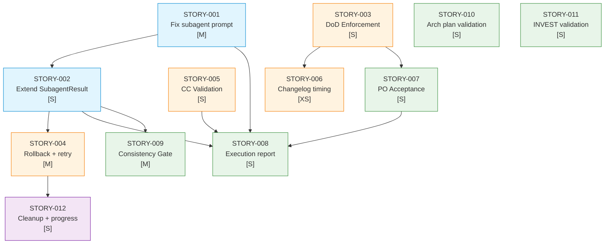

# Implementation Map — EPIC-0019: Quality Gates e Prevencao Total a Falhas

## 1. Dependency Matrix

| Story ID | Titulo | Camada | Sizing | Blocked By | Blocks | Status |
|---|---|---|---|---|---|---|
| STORY-0019-001 | Fix subagent prompt para invocar x-dev-lifecycle completo | FOUNDATION | M | -- | 002, 008 | Pendente |
| STORY-0019-002 | Estender SubagentResult e validacao | FOUNDATION | S | 001 | 004, 008, 009 | Pendente |
| STORY-0019-003 | DoD Enforcement Gate | CORE | S | -- | 006, 007 | Pendente |
| STORY-0019-004 | Rollback strategy e retry | CORE | M | 002 | 012 | Pendente |
| STORY-0019-005 | Conventional Commits validation | CORE | S | -- | 008 | Pendente |
| STORY-0019-006 | Changelog timing fix | CORE | XS | 003 | -- | Pendente |
| STORY-0019-007 | PO Acceptance Gate | INTEGRATION | S | 003 | 008 | Pendente |
| STORY-0019-008 | Execution report novas secoes | INTEGRATION | S | 001, 002, 005, 007 | -- | Pendente |
| STORY-0019-009 | Cross-Story Consistency Gate | INTEGRATION | M | 002 | -- | Pendente |
| STORY-0019-010 | Architecture plan quality validation | INTEGRATION | S | -- | -- | Pendente |
| STORY-0019-011 | Story decomposition INVEST validation | INTEGRATION | S | -- | -- | Pendente |
| STORY-0019-012 | Cleanup placeholders e progress reporting | COMPOSITION | S | 004 | -- | Pendente |

## 2. Execution Phases

```
Phase 0 (FOUNDATION — parallel batch):
  ┌─ STORY-0019-001 [M] ─── Fix subagent prompt
  │
  └─ STORY-0019-003 [S] ─── DoD Enforcement Gate     ──┐
                                                         │  (parallel: no overlap)
     STORY-0019-005 [S] ─── CC Validation             ──┤
     STORY-0019-010 [S] ─── Arch plan validation      ──┤
     STORY-0019-011 [S] ─── INVEST validation          ──┘

Phase 1 (CORE — sequential dependencies):
     STORY-0019-002 [S] ─── Extend SubagentResult      (depends: 001)
     STORY-0019-006 [XS] ── Changelog timing            (depends: 003)
     STORY-0019-007 [S] ─── PO Acceptance Gate          (depends: 003)

Phase 2 (INTEGRATION — mixed):
  ┌─ STORY-0019-004 [M] ─── Rollback + retry           (depends: 002)
  │
  └─ STORY-0019-009 [M] ─── Consistency Gate            (depends: 002)

Phase 3 (COMPOSITION — final):
     STORY-0019-008 [S] ─── Execution report            (depends: 001, 002, 005, 007)
     STORY-0019-012 [S] ─── Cleanup placeholders        (depends: 004)
```

## 3. Critical Path

```
STORY-0019-001 → STORY-0019-002 → STORY-0019-004 → STORY-0019-012
     M                 S                 M                 S
```

Duracao estimada do critical path: M + S + M + S

Critical path alternativo (para report):
```
STORY-0019-001 → STORY-0019-002 → STORY-0019-008
     M                 S                 S
```

## 4. Mermaid Dependency Graph



## 5. Sizing Summary

| Sizing | Count | Stories |
|---|---|---|
| XS | 1 | 006 |
| S | 8 | 002, 003, 005, 007, 008, 010, 011, 012 |
| M | 3 | 001, 004, 009 |

**Parallel execution analysis:**
- Phase 0: 5 stories em paralelo (001 + 003 + 005 + 010 + 011)
- Phase 1: 3 stories (002 sequencial apos 001; 006, 007 sequenciais apos 003)
- Phase 2: 2 stories em paralelo (004 + 009)
- Phase 3: 2 stories (008 + 012, possivelmente paralelas se 008 nao depende de 004)

Total: 12 stories, ~4 fases de execucao

## 6. Risk Matrix

| Risk | Probabilidade | Impacto | Mitigacao | Story |
|---|---|---|---|---|
| Subagent nao consegue invocar /x-dev-lifecycle como skill | Media | Alto | Fallback: listar 9 fases explicitamente no prompt | 001 |
| DoD enforcement bloqueia stories validas | Baixa | Medio | Classificacao cuidadosa mandatorio vs advisory | 003 |
| Rollback em worktree mode falha | Baixa | Alto | Preservar worktree para diagnostico manual | 004 |
| CC validation regex falso positivo | Media | Baixo | Threshold de 3+ violacoes antes de FAIL | 005 |
| Cross-story consistency com falsos positivos | Media | Medio | Status WARN para maioria, FAIL apenas para conflitos de interface | 009 |

## 7. Observacoes Estrategicas

1. **Stories 010 e 011 sao independentes** — podem ser executadas em qualquer fase sem bloqueios
2. **Story 001 e o gargalo critico** — todas as mudancas no epic orchestrator dependem dela
3. **Story 008 (report) tem mais dependencias** — deve ser a ultima da camada INTEGRATION
4. **Todas as mudancas sao em Markdown** (skill definitions) — nao ha compilacao ou testes unitarios tradicionais
5. **O gerador Java sera atualizado em epic separado** — este epic foca nos skills gerados
6. **Backward compatibility e mandatoria** — flags novas (--reason) devem ter graceful degradation
