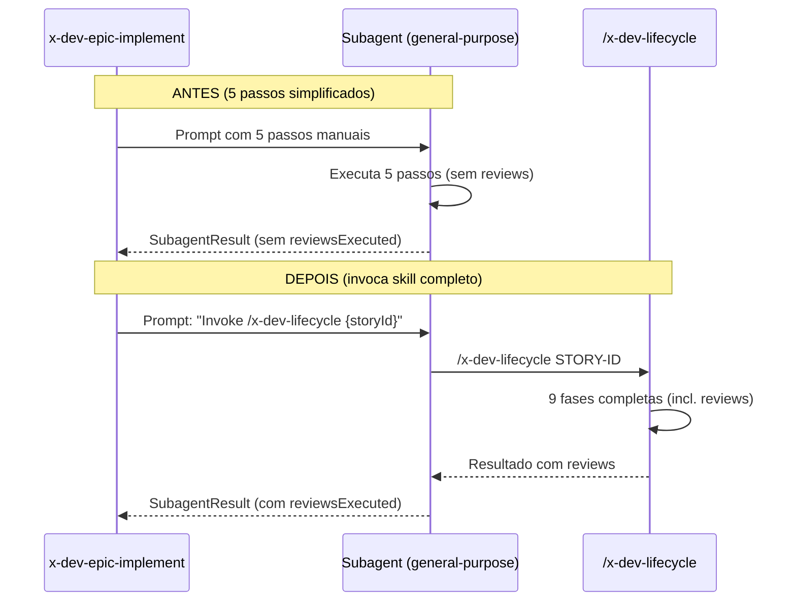

# Historia: Fix subagent prompt para invocar x-dev-lifecycle completo

**ID:** STORY-0019-001
**Chave Jira:** --

## 1. Dependencias

| Blocked By | Blocks |
| :--- | :--- |
| -- | [STORY-0019-002](./story-0019-002.md), [STORY-0019-008](./story-0019-008.md) |

## 2. Regras Transversais Aplicaveis

| ID | Titulo |
| :--- | :--- |
| RULE-001 | Todo SubagentResult com status SUCCESS DEVE ter reviewsExecuted.specialist == true e reviewsExecuted.techLead == true |
| RULE-006 | Alteracoes sao nos skills gerados (.claude/skills/) |
| RULE-007 | Nenhuma funcionalidade existente pode quebrar |

## 3. Descricao

Como **tech lead**, eu quero que o epic orchestrator instrua os subagents a executar o workflow completo de 9 fases do x-dev-lifecycle, para que reviews de especialistas e do tech lead nunca sejam ignorados.

### Contexto

O prompt do subagent em `x-dev-epic-implement/SKILL.md` (Sections 1.4 e 1.4a) lista apenas 5 passos simplificados:
1. Read the story file for requirements
2. Create implementation plan
3. Implement following TDD
4. Run tests and verify coverage
5. Commit changes with Conventional Commits

Isso omite Phase 4 (Specialist Review via /x-review), Phase 7 (Tech Lead Review via /x-review-pr) e Phase 8 (Final Verification + DoD). O subagent e general-purpose com clean context (RULE-001) e segue literalmente estes 5 passos.

### 3.1 Substituir Prompt Template (Section 1.4)

Substituir o bloco do prompt template (linhas ~394-412) para instruir explicitamente o subagent a invocar o skill `/x-dev-lifecycle`. O novo prompt DEVE:
- Instruir `Invoke /x-dev-lifecycle skill with argument {storyId}` em vez de listar passos manuais
- Listar explicitamente as 9 fases como referencia
- Declarar que Phase 8 e o unico ponto de parada legitimo
- Declarar que o subagent tem acesso ao Skill tool

### 3.2 Aplicar Mesma Mudanca na Section 1.4a

A Section 1.4a (Parallel Worktree Dispatch) referencia "same prompt template as Section 1.4". Garantir que a mesma correcao se aplique.

### 3.3 Converter --skip-review para Requerer Justificativa

Converter a flag `--skip-review` (linha ~43) para `--skip-review --reason "justificativa"`:
- Se `--skip-review` for passado sem `--reason`, emitir WARNING no log
- A justificativa deve ser registrada no checkpoint (execution-state.json)
- A justificativa deve aparecer no execution report

## 3.5 Entrega de Valor

- **Valor Principal:** Garantia de que 100% das stories passam por code review antes de serem marcadas como concluidas
- **Metrica de Sucesso:** Zero stories com status SUCCESS sem reviews executados
- **Impacto no Negocio:** Reducao de bugs em producao por garantia de review obrigatorio em todo ciclo

## 4. Definicoes de Qualidade Locais

### DoR Local

- [ ] Skill file `x-dev-epic-implement/SKILL.md` lido e analisado
- [ ] Sections 1.4 e 1.4a identificadas com prompt template atual
- [ ] Flag --skip-review mapeada com comportamento atual

### DoD Local

- [ ] Prompt template substituido em Section 1.4
- [ ] Prompt template substituido em Section 1.4a
- [ ] Flag --skip-review convertida para requerer --reason
- [ ] Backward compatible: --skip-review sem --reason emite WARNING mas nao quebra
- [ ] Test plan gerado via `/x-test-plan` antes do inicio da implementacao
- [ ] Todo @GK-N da secao 7 mapeado para >= 1 AT-N na secao 8
- [ ] Cenarios Gherkin ordenados por TPP (degenerate -> happy -> error -> boundary -> edge)
- [ ] Todo AT-N com status GREEN antes de marcar DoD como concluido
- [ ] Commits seguem padrao test-first (teste precede ou acompanha implementacao no git log)

### Global DoD

- **Cobertura:** >= 95% Line, >= 90% Branch
- **TDD Compliance:** Commits test-first, refactoring explicito
- **Backward Compatibility:** Skills existentes continuam funcionais sem flags novas
- **Double-Loop TDD:** Acceptance tests derivados dos cenarios Gherkin (outer loop), unit tests guiados por TPP (inner loop)
- **Rastreabilidade:** Todo @GK-N mapeia para >= 1 AT-N, todo AT-N referencia um @GK-N valido

## 5. Contratos de Dados

> Nenhum endpoint declarado nesta story. Alteracoes sao em skill definitions (Markdown).

## 6. Diagramas

### 6.1 Fluxo de Dispatch do Subagent (Antes vs Depois)



## 7. Criterios de Aceite (Gherkin)

```gherkin
@GK-1
Cenario: Subagent sem story ID
  DADO um epic com stories pendentes
  QUANDO o orchestrator tenta despachar um subagent sem story ID
  ENTAO o subagent retorna status FAILED
  E o summary contem "story ID is required"

@GK-2
Cenario: Subagent executa workflow completo com reviews
  DADO um epic com story STORY-0019-001 pendente
  QUANDO o orchestrator despacha o subagent com o novo prompt template
  ENTAO o subagent invoca /x-dev-lifecycle com argumento STORY-0019-001
  E o x-dev-lifecycle executa todas as 9 fases incluindo Phase 4 e Phase 7
  E o SubagentResult contem reviewsExecuted.specialist == true
  E o SubagentResult contem reviewsExecuted.techLead == true

@GK-3
Cenario: --skip-review sem --reason emite WARNING
  DADO o flag --skip-review ativo sem --reason
  QUANDO o orchestrator despacha o subagent
  ENTAO o log contem "WARNING: --skip-review used without --reason"
  E o subagent executa sem reviews
  E o SubagentResult contem reviewsExecuted.specialist == false

@GK-4
Cenario: --skip-review com --reason registra justificativa
  DADO o flag --skip-review ativo com --reason "hotfix critico"
  QUANDO o orchestrator despacha o subagent
  ENTAO o checkpoint registra skipReviewReason == "hotfix critico"
  E o execution report mostra a justificativa

@GK-5
Cenario: Parallel worktree dispatch usa mesmo prompt corrigido
  DADO um epic com 3 stories paralelas na mesma fase
  QUANDO o orchestrator despacha via worktree (Section 1.4a)
  ENTAO cada subagent recebe o prompt com instrucao de invocar /x-dev-lifecycle
  E nenhum subagent recebe o prompt simplificado de 5 passos
```

## 8. Sub-tarefas

### Ciclos TDD

> Sub-tarefas TDD serao populadas apos geracao do test plan via `/x-test-plan`.

### Tarefas nao-TDD

- [ ] [Doc] Atualizar Section 1.4 com novo prompt template
- [ ] [Doc] Atualizar Section 1.4a com referencia ao novo prompt
- [ ] [Doc] Converter flag --skip-review para requerer --reason
