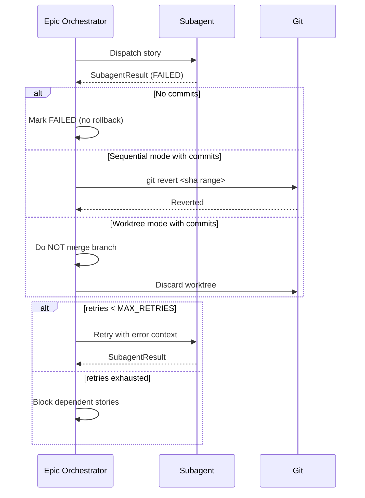

# Historia: Rollback strategy e retry com contexto de erro

**ID:** STORY-0019-004
**Chave Jira:** --

## 1. Dependencias

| Blocked By | Blocks |
| :--- | :--- |
| [STORY-0019-002](./story-0019-002.md) | [STORY-0019-012](./story-0019-012.md) |

## 2. Regras Transversais Aplicaveis

| ID | Titulo |
| :--- | :--- |
| RULE-005 | Stories com falha parcial DEVEM ter rollback automatico e retry com contexto |
| RULE-007 | Nenhuma funcionalidade existente pode quebrar |

## 3. Descricao

Como **sre engineer**, eu quero que stories com falha parcial tenham rollback automatico e retry com contexto de erro, para que o epic nao fique em estado inconsistente.

### Contexto

A Section 1.5 do x-dev-epic-implement tem um placeholder `[Placeholder: retry with error context — story-0005-0007]` (linha ~613) que nunca foi implementado. Stories FAILED podem ter commits parciais sem mecanismo de rollback.

### 3.1 Section 1.5b: Failure Handling and Rollback

Implementar nova secao apos Section 1.5 (Result Validation):

**Step 1 — Capture Failure Context:**
- Registrar: storyId, failureSummary, lastCommitSha, failedPhase

**Step 2 — Rollback Decision Table:**

| Condicao | Acao |
|---|---|
| Sem commits no branch da story | Nenhum rollback; marcar FAILED |
| Commits existem, sequential mode | `git revert --no-edit <sha1>..<shaN>` |
| Commits existem, parallel/worktree mode | NAO mergear branch; descartar worktree |
| Story parcialmente mergeada ao epic branch | `git revert --no-edit <merge-sha>` |

**Step 3 — Retry (retries < MAX_RETRIES=2):**
- Incrementar retry counter
- Adicionar contexto de erro ao prompt do retry subagent
- Re-despachar via Section 1.4

**Step 4 — Block Propagation (retries esgotados):**
- Para cada story dependente: set status BLOCKED, set blockedBy: [failedStoryId]

### 3.2 Substituir Placeholder

Substituir `[Placeholder: retry with error context — story-0005-0007]` (linha ~613) pela implementacao acima.

## 3.5 Entrega de Valor

- **Valor Principal:** Epic nao fica em estado inconsistente apos falhas parciais
- **Metrica de Sucesso:** Zero commits orfaos no epic branch apos falha de story
- **Impacto no Negocio:** Capacidade de retomar execucao de epics sem intervencao manual para cleanup

## 4. Definicoes de Qualidade Locais

### DoR Local

- [ ] STORY-0019-002 concluida (SubagentResult estendido)
- [ ] Section 1.5 e placeholder identificados
- [ ] Comportamento atual de falha documentado

### DoD Local

- [ ] Section 1.5b implementada com rollback decision table
- [ ] Retry com contexto de erro implementado (MAX_RETRIES=2)
- [ ] Block propagation implementada
- [ ] Placeholder substituido
- [ ] Test plan gerado via `/x-test-plan` antes do inicio da implementacao
- [ ] Todo @GK-N da secao 7 mapeado para >= 1 AT-N na secao 8
- [ ] Cenarios Gherkin ordenados por TPP
- [ ] Todo AT-N com status GREEN antes de marcar DoD como concluido
- [ ] Commits seguem padrao test-first

### Global DoD

- **Cobertura:** >= 95% Line, >= 90% Branch
- **TDD Compliance:** Commits test-first, refactoring explicito
- **Double-Loop TDD:** Acceptance tests (outer loop), unit tests com TPP (inner loop)
- **Rastreabilidade:** Todo @GK-N mapeia para >= 1 AT-N

## 5. Contratos de Dados

> Nenhum endpoint declarado nesta story.

## 6. Diagramas

### 6.1 Fluxo de Rollback e Retry



## 7. Criterios de Aceite (Gherkin)

```gherkin
@GK-1
Cenario: Story falha sem commits
  DADO uma story em sequential mode que falhou sem produzir commits
  QUANDO o orchestrator processa a falha
  ENTAO nenhum git revert e executado
  E o status e FAILED
  E o retry counter e incrementado

@GK-2
Cenario: Story falha com commits em sequential mode
  DADO uma story em sequential mode com 3 commits no epic branch
  QUANDO o orchestrator processa a falha
  ENTAO git revert e executado para os 3 commits
  E o epic branch esta limpo (sem commits da story)
  E o status e FAILED

@GK-3
Cenario: Story falha em worktree mode
  DADO uma story em worktree mode com commits no worktree branch
  QUANDO o orchestrator processa a falha
  ENTAO o branch da story NAO e mergeado ao epic branch
  E o worktree e preservado para diagnostico
  E o status e FAILED

@GK-4
Cenario: Retry com contexto de erro
  DADO uma story FAILED com retries == 0 e MAX_RETRIES == 2
  QUANDO o orchestrator tenta retry
  ENTAO o retry counter e incrementado para 1
  E o prompt do subagent contem failureSummary e failedPhase do erro anterior
  E o subagent e re-despachado

@GK-5
Cenario: Block propagation apos retries esgotados
  DADO uma story FAILED com retries == 2 (MAX_RETRIES == 2)
  E story-B depende da story falha
  QUANDO o orchestrator verifica retries
  ENTAO story-B e marcada como BLOCKED
  E story-B.blockedBy contem o ID da story falha

@GK-6
Cenario: Story parcialmente mergeada ao epic branch
  DADO uma story cujo merge ao epic branch foi parcial (conflito durante merge)
  QUANDO o orchestrator processa a falha
  ENTAO git revert e executado para o merge parcial
  E o epic branch esta limpo
```

## 8. Sub-tarefas

### Ciclos TDD

> Sub-tarefas TDD serao populadas apos geracao do test plan via `/x-test-plan`.

### Tarefas nao-TDD

- [ ] [Doc] Implementar Section 1.5b com rollback decision table
- [ ] [Doc] Implementar retry com contexto de erro
- [ ] [Doc] Implementar block propagation
- [ ] [Doc] Substituir placeholder na linha ~613
