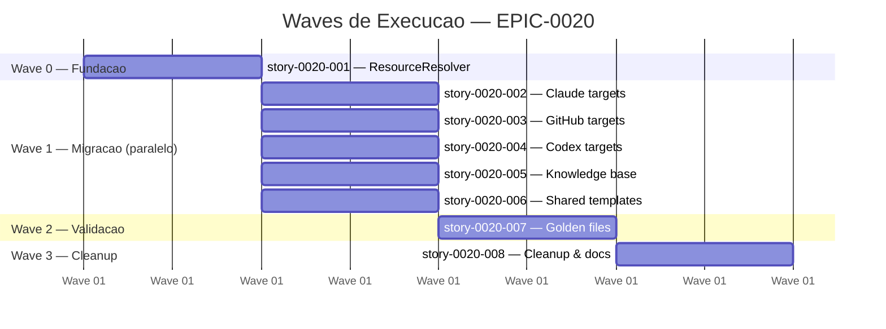
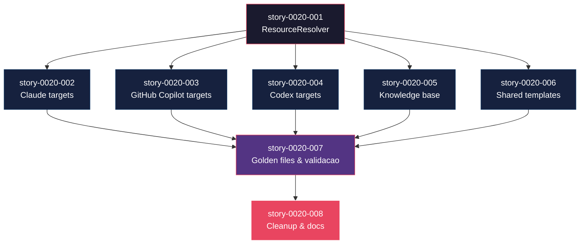

# Mapa de Implementacao — EPIC-0020 (Reestruturacao do diretorio de recursos para organizacao target-first)

**Autor:** Claude (AI Assistant)
**Data:** 2026-04-04
**Gerado a partir das dependencias BlockedBy/Blocks de cada historia do EPIC-0020.**

---

## 1. Dependency Matrix

| ID | Titulo | Blocked By | Blocks | Wave | Test Plan Status |
| :--- | :--- | :--- | :--- | :--- | :--- |
| story-0020-001 | Evolucao do ResourceResolver com resolveResourceDir | -- | story-0020-002, story-0020-003, story-0020-004, story-0020-005, story-0020-006 | 0 | Pending |
| story-0020-002 | Migracao de recursos Claude para targets/claude/ | story-0020-001 | story-0020-007 | 1 | Pending |
| story-0020-003 | Migracao de recursos GitHub Copilot para targets/github-copilot/ | story-0020-001 | story-0020-007 | 1 | Pending |
| story-0020-004 | Migracao de recursos Codex para targets/codex/ | story-0020-001 | story-0020-007 | 1 | Pending |
| story-0020-005 | Migracao da base de conhecimento para knowledge/ | story-0020-001 | story-0020-007 | 1 | Pending |
| story-0020-006 | Migracao de templates cross-cutting para shared/ | story-0020-001 | story-0020-007 | 1 | Pending |
| story-0020-007 | Regeneracao de golden files e validacao completa | story-0020-002, story-0020-003, story-0020-004, story-0020-005, story-0020-006 | story-0020-008 | 2 | Pending |
| story-0020-008 | Cleanup do ResourceResolver legado e documentacao | story-0020-007 | -- | 3 | N/A |

---

## 2. Wave Diagram



---

## 3. Fases de Implementacao

> As historias sao agrupadas em fases (waves). Dentro de cada fase, as historias podem ser implementadas **em paralelo**. Uma fase so pode iniciar quando todas as dependencias das fases anteriores estiverem concluidas.

```
+========================================================================+
|          FASE 0 -- Fundacao (sequencial)                               |
|                                                                        |
|  +---------------------------+                                         |
|  | story-0020-001            |                                         |
|  | ResourceResolver          |                                         |
|  | resolveResourceDir        |                                         |
|  +-------------+-------------+                                         |
+================|===================================================+
                 |
                 v
+========================================================================+
|          FASE 1 -- Migracao de Recursos (paralelo, 5 stories)          |
|                                                                        |
|  +-----------+  +-----------+  +-----------+  +---------+  +---------+ |
|  | 0020-002  |  | 0020-003  |  | 0020-004  |  | 0020-005|  | 0020-006| |
|  | Claude    |  | GitHub    |  | Codex     |  | Know-   |  | Shared  | |
|  | targets   |  | Copilot   |  | targets   |  | ledge   |  | templ.  | |
|  +-----+-----+  +-----+-----+  +-----+-----+  +----+----+  +----+----+|
+========|=============|=============|=============|===========|=========+
         |             |             |             |           |
         +------+------+------+------+------+------+-----+-----+
                |                                        |
                v                                        v
+========================================================================+
|          FASE 2 -- Validacao (sequencial)                              |
|                                                                        |
|  +---------------------------+                                         |
|  | story-0020-007            |                                         |
|  | Golden files &            |                                         |
|  | validacao completa        |                                         |
|  +-------------+-------------+                                         |
+================|===================================================+
                 |
                 v
+========================================================================+
|          FASE 3 -- Cleanup (sequencial)                                |
|                                                                        |
|  +---------------------------+                                         |
|  | story-0020-008            |                                         |
|  | Cleanup & documentacao    |                                         |
|  +---------------------------+                                         |
+========================================================================+
```

---

## 4. Caminho Critico

> O caminho critico (a sequencia mais longa de dependencias) determina o tempo minimo de implementacao do projeto.

```
story-0020-001 --> story-0020-002 --> story-0020-007 --> story-0020-008
   Wave 0            Wave 1             Wave 2             Wave 3
```

**4 fases no caminho critico, 4 historias na cadeia mais longa.**

O gargalo principal e a Fase 1: embora as 5 stories possam executar em paralelo, a Wave 2 (validacao) so pode iniciar quando TODAS as 5 estiverem concluidas. Qualquer atraso em uma unica story da Fase 1 atrasa toda a validacao. A story-0020-005 (knowledge, 9 diretorios, 8+ assemblers) e a mais complexa da Fase 1 e portanto o maior risco de atraso.

---

## 5. Grafo de Dependencias (Mermaid)



---

## 6. Resumo por Fase

| Fase | Historias | Camada | Paralelismo | Pre-requisito |
| :--- | :--- | :--- | :--- | :--- |
| 0 | story-0020-001 | Infraestrutura (ResourceResolver) | 1 sequencial | -- |
| 1 | story-0020-002, story-0020-003, story-0020-004, story-0020-005, story-0020-006 | Migracao de recursos | 5 paralelas | Fase 0 concluida |
| 2 | story-0020-007 | Validacao e QA | 1 sequencial | Fase 1 concluida |
| 3 | story-0020-008 | Cleanup e documentacao | 1 sequencial | Fase 2 concluida |

**Total: 8 historias em 4 fases.**

> A Fase 1 oferece maximo paralelismo (5 stories independentes). Pode ser distribuida entre multiplos desenvolvedores ou subagents.

---

## 7. Detalhamento por Fase

### Fase 0 — Fundacao

| Story | Escopo Principal | Artefatos Chave |
| :--- | :--- | :--- |
| story-0020-001 | Novo metodo `resolveResourceDir` | `ResourceResolver.java`, `ResourceResolverTest.java` |

**Entregas da Fase 0:**

- Metodo `resolveResourceDir(String relativePath)` disponivel
- Testes unitarios cobrindo paths de 1, 2 e 3 niveis
- Metodo legado inalterado (backward compatibility)

### Fase 1 — Migracao de Recursos

| Story | Escopo Principal | Artefatos Chave |
| :--- | :--- | :--- |
| story-0020-002 | Mover 5 dirs Claude | `RulesAssembler`, `SkillsAssembler`, `AgentsAssembler`, `HooksAssembler`, `SettingsAssembler` + writers |
| story-0020-003 | Mover 6 dirs GitHub | `GithubAgentsAssembler`, `GithubSkillsAssembler`, `GithubHooksAssembler`, `GithubInstructionsAssembler`, `GithubPromptsAssembler`, `PrIssueTemplateAssembler` |
| story-0020-004 | Mover 1 dir Codex | `CodexConfigAssembler`, `CodexAgentsMdAssembler`, `CodexOverrideAssembler`, `CodexRequirementsAssembler` |
| story-0020-005 | Mover 9 dirs knowledge | `CoreRulesWriter`, `LanguageKpWriter`, `FrameworkKpWriter`, `RulesConditionals`, `RulesInfraConditionals`, `PatternsAssembler`, `ProtocolsAssembler` |
| story-0020-006 | Mover 4 dirs shared | `CicdAssembler` (+ 6 sub-assemblers), doc assemblers (12+), `ConfigLoader` |

**Entregas da Fase 1:**

- Todos os 25 diretorios de recursos migrados para nova estrutura
- 30+ assemblers atualizados com novos paths
- Build verde individual por story

### Fase 2 — Validacao

| Story | Escopo Principal | Artefatos Chave |
| :--- | :--- | :--- |
| story-0020-007 | Regenerar golden files, validar todos os perfis | Golden files (13 perfis), relatorio de cobertura |

**Entregas da Fase 2:**

- Golden files byte-for-byte identicos
- Suite completa (1,384+ testes) passando
- Cobertura >= 95% line, >= 90% branch

### Fase 3 — Cleanup

| Story | Escopo Principal | Artefatos Chave |
| :--- | :--- | :--- |
| story-0020-008 | Remover dead code, atualizar docs | `ResourceResolver.java`, `CLAUDE.md`, `README.md`, `resource-config.json` |

**Entregas da Fase 3:**

- Zero referencias a paths antigos no codebase
- Documentacao atualizada com nova estrutura
- Dead code removido

---

## 8. Observacoes Estrategicas

### Gargalo Principal

A **story-0020-005** (knowledge, 9 diretorios, 8+ assemblers/writers) e a mais complexa da Fase 1. Ela afeta assemblers que tem acoplamento dual-purpose (RulesAssembler resolve tanto rules quanto knowledge). Investir tempo extra na coordenacao entre story-0020-002 e story-0020-005 e critico — ambas modificam paths no `CoreRulesWriter`.

### Historias Folha (sem dependentes)

- **story-0020-008** (Cleanup & docs) — nao bloqueia nenhuma outra story. Pode ser executada com menor prioridade ou por um desenvolvedor junior. Absorve atrasos sem impacto no caminho critico.

### Otimizacao de Tempo

- **Maximo paralelismo:** 5 stories na Fase 1 — ideal para distribuicao entre 5 subagents ou desenvolvedores
- **Quick wins:** story-0020-004 (Codex, apenas 1 diretorio e 4 assemblers) e a mais rapida da Fase 1
- **Alocacao ideal:** 1 dev senior na story-0020-002+005 (acoplamento), 1 dev mid em story-0020-003, 1 dev junior em story-0020-004+006

### Dependencias Cruzadas

Ponto de convergencia principal: **story-0020-007** recebe todas as 5 stories da Fase 1. Se executada incrementalmente (validando perfis a medida que stories concluem), pode identificar problemas mais cedo. Porem, a validacao formal so e possivel apos todas as migracoes.

**Acoplamento story-0020-002 x story-0020-005:** Ambas modificam o `CoreRulesWriter`. Se executadas em paralelo por diferentes desenvolvedores, requer merge cuidadoso. Recomendacao: executar story-0020-002 primeiro, depois story-0020-005, mesmo que estejam na mesma wave.

### Marco de Validacao Arquitetural

A **story-0020-002** (Claude targets) serve como checkpoint arquitetural. Ela e o primeiro assembler complexo a migrar e valida:
- O metodo `resolveResourceDir` funciona em cenario real
- A estrategia de dual-path do `RulesAssembler` funciona
- Os testes de golden file continuam passando apos migracao

Se esta story funcionar sem problemas, as demais seguem o mesmo padrao com menor risco.

---

## Execution Order

1. **Wave 0** (sequencial): story-0020-001
2. **Wave 1** (paralelo, com ressalva): story-0020-002, story-0020-003, story-0020-004, story-0020-005, story-0020-006
   > Recomendacao: executar story-0020-002 antes de story-0020-005 (acoplamento no CoreRulesWriter)
3. **Wave 2** (sequencial): story-0020-007
4. **Wave 3** (sequencial): story-0020-008
