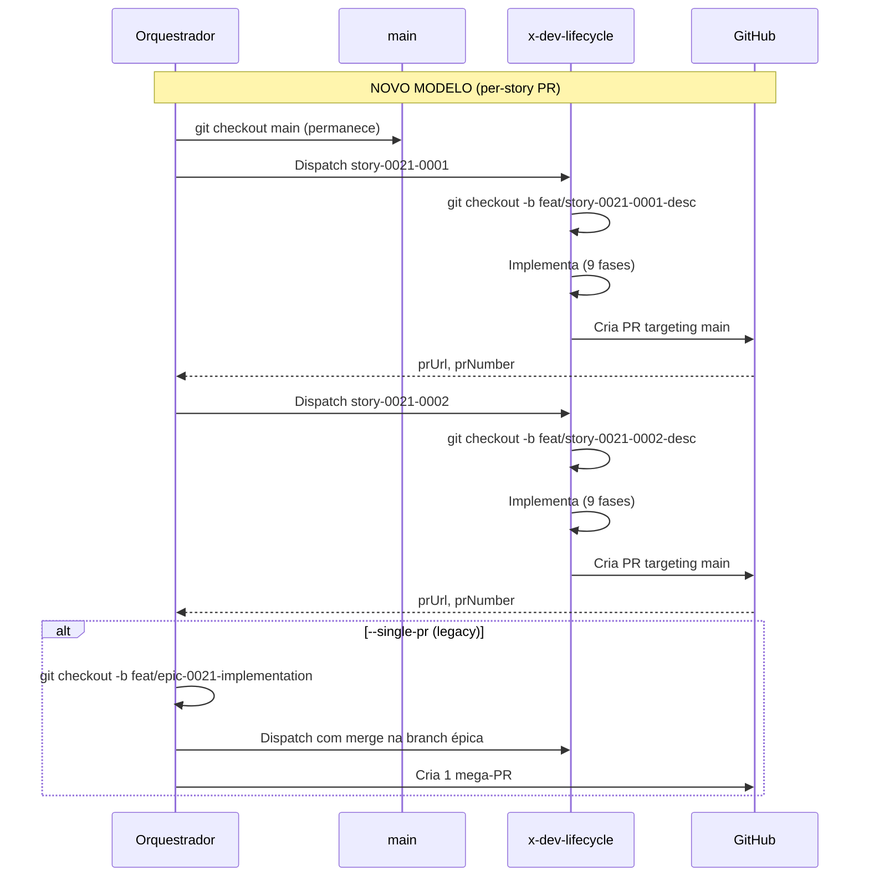

# História: Eliminar branch épica e adotar branching por story

**ID:** story-0021-0001
**Chave Jira:** —
**Status:** Pendente

## 1. Dependências

| Blocked By | Blocks |
| :--- | :--- |
| — | story-0021-0003, story-0021-0005, story-0021-0006, story-0021-0009 |

## 2. Regras Transversais Aplicáveis

| ID | Título |
| :--- | :--- |
| RULE-001 | Isolamento de Contexto de Subagents |
| RULE-002 | Persistência Atômica de Checkpoint |
| RULE-009 | Backward Compatibility |

## 3. Descrição

Como **engenheiro de plataforma**, eu quero que o orquestrador de épicos não crie mais uma branch épica intermediária, garantindo que cada story crie sua própria branch diretamente via `x-dev-lifecycle` e que o branching seja completamente delegado.

Atualmente, o `x-dev-epic-implement` cria a branch `feat/epic-{epicId}-full-implementation` (Phase 0, Step 7) e usa essa branch como destino de merge para todas as worktrees de stories (Sections 1.4a, 1.4b). Isso é o fundamento do modelo de mega-PR. Ao eliminar essa branch, cada story passa a operar de forma independente com sua própria branch targeting `main`.

A eliminação da branch épica torna obsoleta a seção de Rebase-Before-Merge (1.4b) e os status de checkpoint REBASING, REBASE_SUCCESS e REBASE_FAILED, que devem ser removidos. A Section 1.4c (Conflict Resolution Subagent) não é removida, mas substituída por um placeholder — será reimplementada pela story-0021-0009 com um subagent adaptado para o modelo per-story PR (auto-rebase + resolução automática de conflitos).

### 3.1 Remoção da criação da branch épica

- Phase 0, Step 7: remover instrução `git checkout -b feat/epic-{epicId}-implementation`
- O orquestrador permanece na `main` e delega branching ao `x-dev-lifecycle`
- Adicionar nota: "Branching delegado ao x-dev-lifecycle — cada story cria `feat/{storyId}-description`"

### 3.2 Remoção do Branch Management (Section 1.2)

- Remover Steps 1-3 de Section 1.2 (checkout main, create epic branch, handle existing)
- Substituir por: "O orquestrador não cria branch. Cada story cria sua própria branch via `x-dev-lifecycle` Phase 0. O orquestrador permanece na `main` e monitora os PRs."

### 3.3 Remoção do Rebase-Before-Merge (Section 1.4b)

- Remover Section 1.4b completamente (~80 linhas)
- Remover toda a lógica de merge de worktree branches na branch épica
- Remover referências a `alreadyMergedStories`, `alreadyMergedCommits`

### 3.4 Substituição do Conflict Resolution Subagent (Section 1.4c)

- Remover o conteúdo atual da Section 1.4c (lógica de resolução de conflitos em merge/rebase para branch épica)
- Substituir por placeholder referenciando story-0021-0009: `[Placeholder: Conflict Resolution Subagent adaptado para per-story PR — story-0021-0009]`
- A Section 1.4c será reimplementada pela story-0021-0009 com um subagent de resolução adaptado para o modelo per-story PR (auto-rebase + resolução automática)
- O placeholder preserva o numbering de seções para que stories downstream saibam onde inserir

### 3.5 Remoção dos status de rebase do checkpoint

- Remover status REBASING, REBASE_SUCCESS, REBASE_FAILED do schema `execution-state.json`
- Remover da tabela de status possíveis no Section 1.1
- Remover transições de status envolvendo rebase no Resume Workflow (Step 1)

### 3.6 Atualização do branch naming em worktrees (Section 1.4a)

- Mudar branch naming de `feat/epic-{epicId}-{storyId}` para branch padrão de story: `feat/{storyId}-short-description`
- O `x-dev-lifecycle` já usa esse padrão — alinhar o orquestrador

### 3.7 Remoção do Branch Recovery no Resume (Step 3)

- Remover Step 3 do Resume Workflow (checkout da branch épica)
- O orquestrador não precisa recuperar branch — cada story tem sua própria branch gerida pelo lifecycle

### 3.8 Flag --single-pr para backward compatibility (RULE-009)

- Adicionar flag `--single-pr` na tabela de flags opcionais
- Quando `--single-pr` é set: preservar todo o fluxo antigo (branch épica, rebase-before-merge, mega-PR)
- Quando `--single-pr` NÃO é set (default): usar o novo modelo per-story PR
- Implementar como guard condicional no início de Phase 0: `if (singlePr) { /* legacy flow */ }`

## 3.5 Entrega de Valor

- **Valor Principal:** PRs de story ficam independentes com branches próprias, eliminando a branch épica intermediária que causava conflitos de merge e impossibilitava revisão individual
- **Métrica de Sucesso:** Worktrees de stories criam branches `feat/{storyId}-*` targeting `main` sem passar por branch épica intermediária
- **Impacto no Negócio:** Revisores podem analisar cada PR de forma isolada, melhorando a qualidade de revisão e reduzindo o tempo de feedback

## 4. Definições de Qualidade Locais

### DoR Local (Definition of Ready)

- [ ] Seções 1.2, 1.4a, 1.4b, 1.4c, 1.4e do SKILL.md original lidas e compreendidas
- [ ] Schema atual do execution-state.json documentado
- [ ] Resume Workflow Steps 1-4 compreendidos

### DoD Local (Definition of Done)

- [ ] Branch épica `feat/epic-{epicId}-full-implementation` não é mais criada (exceto com `--single-pr`)
- [ ] Section 1.4b removida completamente
- [ ] Section 1.4c substituída por placeholder referenciando story-0021-0009
- [ ] Status REBASING, REBASE_SUCCESS, REBASE_FAILED removidos do schema
- [ ] Resume Workflow Step 3 (Branch Recovery) removido
- [ ] Flag `--single-pr` documentada na tabela de flags
- [ ] Worktree branch naming atualizado para `feat/{storyId}-description`
- [ ] Pelo menos 1 teste automatizado (validação de consistência do SKILL.md)
- [ ] Smoke test passando (leitura completa sem referências órfãs)

### Global Definition of Done (DoD)

- **Cobertura:** N/A — mudanças são em SKILL.md (markdown)
- **Testes Automatizados:** Validação de consistência interna do SKILL.md
- **Relatório de Cobertura:** N/A
- **Documentação:** SKILL.md é a documentação
- **Persistência:** Schema execution-state.json atualizado
- **Performance:** N/A

## 5. Contratos de Dados (Data Contract)

### 5.1 execution-state.json — Campos Removidos

| Campo | Tipo | Ação | Justificativa |
| :--- | :--- | :--- | :--- |
| `branch` | `String` | Remover valor padrão `feat/epic-{epicId}-full-implementation` | Branch épica eliminada |

### 5.2 execution-state.json — Status Removidos

| Status Removido | Substituição | Justificativa |
| :--- | :--- | :--- |
| `REBASING` | N/A (removido) | Não há mais rebase de worktrees na branch épica |
| `REBASE_SUCCESS` | N/A (removido) | Não há mais rebase |
| `REBASE_FAILED` | N/A (removido) | Não há mais rebase |

### 5.3 CLI Flags — Adição

| Flag | Tipo | Default | Descrição |
| :--- | :--- | :--- | :--- |
| `--single-pr` | boolean | `false` | Quando set, preserva o fluxo legacy de branch épica + mega-PR |

## 6. Diagramas

### 6.1 Fluxo de branching — Antes vs Depois



## 7. Critérios de Aceite (Gherkin)

```gherkin
Cenario: Orquestrador sem argumentos não cria branch épica
  DADO que o orquestrador é invocado com epic ID "0042"
  E a flag --single-pr NÃO está set
  QUANDO Phase 0 é executada
  ENTÃO nenhuma branch "feat/epic-0042-implementation" é criada
  E o orquestrador permanece na branch "main"

Cenario: Worktree de story usa branch padrão do lifecycle
  DADO que o orquestrador é invocado com epic ID "0042"
  E a flag --single-pr NÃO está set
  QUANDO uma story "story-0042-0003" é despachada via worktree
  ENTÃO a branch criada segue o padrão "feat/story-0042-0003-*"
  E NÃO segue o padrão antigo "feat/epic-0042-story-0042-0003"

Cenario: Section 1.4b removida e 1.4c substituída por placeholder
  DADO que as mudanças desta story foram aplicadas
  QUANDO o SKILL.md é lido
  ENTÃO não existe seção "1.4b" ou "Rebase-Before-Merge"
  E a seção "1.4c" contém placeholder "[Placeholder: Conflict Resolution Subagent adaptado para per-story PR — story-0021-0009]"
  E NÃO contém a lógica antiga de resolução de conflitos em merge/rebase para branch épica

Cenario: Status de rebase removidos do schema
  DADO que as mudanças desta story foram aplicadas
  QUANDO o schema do execution-state.json é lido no SKILL.md
  ENTÃO os status "REBASING", "REBASE_SUCCESS" e "REBASE_FAILED" não aparecem
  E a tabela de status contém apenas: PENDING, IN_PROGRESS, SUCCESS, FAILED, BLOCKED, PARTIAL

Cenario: Flag --single-pr preserva comportamento legacy
  DADO que o orquestrador é invocado com epic ID "0042" e flag --single-pr
  QUANDO Phase 0 é executada
  ENTÃO a branch "feat/epic-0042-full-implementation" é criada
  E o fluxo de rebase-before-merge é utilizado
  E um único PR é criado ao final

Cenario: Resume workflow sem branch recovery
  DADO que o orquestrador é invocado com --resume
  E a flag --single-pr NÃO está set
  QUANDO o Resume Workflow é executado
  ENTÃO Step 3 (Branch Recovery) NÃO é executado
  E o orquestrador permanece na "main"
```

## 8. Sub-tarefas

- [ ] [Dev] Remover criação de branch épica em Phase 0, Step 7
- [ ] [Dev] Reescrever Section 1.2 (Branch Management) para modelo per-story
- [ ] [Dev] Remover Section 1.4b (Rebase-Before-Merge) completamente
- [ ] [Dev] Substituir conteúdo de Section 1.4c por placeholder referenciando story-0021-0009
- [ ] [Dev] Remover status REBASING, REBASE_SUCCESS, REBASE_FAILED do schema
- [ ] [Dev] Atualizar branch naming em Section 1.4a para padrão story
- [ ] [Dev] Remover Step 3 (Branch Recovery) do Resume Workflow
- [ ] [Dev] Adicionar flag --single-pr com guard condicional
- [ ] [Test] Smoke/E2E: Validar que SKILL.md não contém referências órfãs a branch épica (exceto no guard --single-pr)
- [ ] [Doc] Atualizar argument-hint no frontmatter com --single-pr
