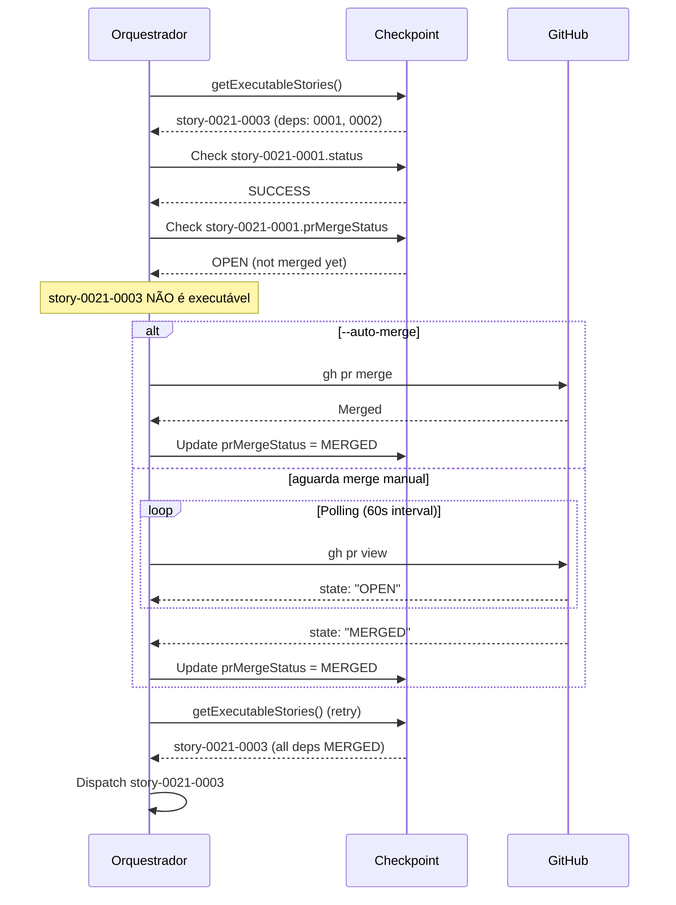

# História: Enforcement de dependências via PR merge status

**ID:** story-0021-0003
**Chave Jira:** —
**Status:** Pendente

## 1. Dependências

| Blocked By | Blocks |
| :--- | :--- |
| story-0021-0001, story-0021-0002 | story-0021-0006, story-0021-0007 |

## 2. Regras Transversais Aplicáveis

| ID | Título |
| :--- | :--- |
| RULE-002 | Persistência Atômica de Checkpoint |
| RULE-003 | Ordem de Dependências via PR Merge |
| RULE-004 | Auto-merge Opcional |
| RULE-007 | Prioridade por Caminho Crítico |

## 3. Descrição

Como **engenheiro de plataforma**, eu quero que o orquestrador verifique se o PR de cada dependência foi efetivamente merged na `main` antes de despachar stories dependentes, garantindo que o código integrado está disponível para stories subsequentes.

No modelo antigo, `getExecutableStories()` verificava apenas o status `SUCCESS` no checkpoint para determinar se uma story podia ser executada. Com per-story PRs, o status `SUCCESS` indica apenas que o lifecycle completou — o PR pode ainda estar aguardando review ou merge. Uma story dependente precisa do código da dependência na `main`, não apenas do lifecycle concluído.

### 3.1 Modificação de `getExecutableStories()` (Section 1.3)

- Além de verificar `status == SUCCESS` no checkpoint, verificar `prMergeStatus == "MERGED"`
- Se `status == SUCCESS` mas `prMergeStatus != "MERGED"`: story fica em estado "aguardando merge"
- Usar `gh pr view {prNumber} --json state` para verificar o estado do PR
- Story só é executável quando TODAS as dependências têm `prMergeStatus == "MERGED"`

### 3.2 Mecanismo de polling/wait

- Quando existem stories com dependências SUCCESS mas PRs não-merged, o orquestrador entra em wait
- Polling interval: configurável, default 60 segundos
- Timeout: configurável, default 24 horas (para cenários de review manual)
- Log a cada poll: `"Waiting for PR #{prNumber} (story-{id}) to be merged... (N seconds elapsed)"`
- Se timeout expirar: marcar stories bloqueadas como `BLOCKED` com motivo "PR merge timeout"

### 3.3 Flag --auto-merge (RULE-004)

- Nova flag `--auto-merge` (boolean, default: false)
- Quando set: após o lifecycle retornar SUCCESS com reviews aprovadas, executar `gh pr merge {prNumber} --merge`
- Ordem de merge segue `sortByCriticalPath()` (RULE-007)
- Se merge falhar (conflito, checks failing): log warning, não marcar como FAILED — aguardar resolução manual
- Quando não set: orquestrador aguarda merge manual com polling

### 3.4 Atualização do schema execution-state.json (Section 1.1)

- Adicionar campos per-story: `prUrl` (String), `prNumber` (Integer), `prMergeStatus` (String)
- `prMergeStatus` valores possíveis: `"PENDING"`, `"OPEN"`, `"MERGED"`, `"CLOSED"`
- Atualizar `StoryEntry` interface no SKILL.md

## 3.5 Entrega de Valor

- **Valor Principal:** Garantia de integridade do código: stories dependentes só iniciam quando o código da dependência está efetivamente na `main`, prevenindo builds quebrados e inconsistências
- **Métrica de Sucesso:** Zero stories despachadas com dependências cujos PRs não estão merged. Verificável via checkpoint (`prMergeStatus == "MERGED"` para todas as dependências)
- **Impacto no Negócio:** Eliminação de falhas causadas por código ausente (dependência não merged), reduzindo retrabalho e tempo de investigação

## 4. Definições de Qualidade Locais

### DoR Local (Definition of Ready)

- [ ] story-0021-0001 concluída (branch épica eliminada)
- [ ] story-0021-0002 concluída (SubagentResult com prUrl/prNumber)
- [ ] Algoritmo `getExecutableStories()` compreendido (Section 1.3)

### DoD Local (Definition of Done)

- [ ] `getExecutableStories()` verifica `prMergeStatus == "MERGED"` para todas as dependências
- [ ] Mecanismo de polling implementado com interval e timeout configuráveis
- [ ] Flag `--auto-merge` documentada e funcional
- [ ] Schema execution-state.json atualizado com `prUrl`, `prNumber`, `prMergeStatus`
- [ ] Pelo menos 1 teste automatizado validando o fluxo de dependency enforcement
- [ ] Smoke test passando

### Global Definition of Done (DoD)

- **Cobertura:** N/A
- **Testes Automatizados:** Validação de consistência do SKILL.md
- **Documentação:** SKILL.md auto-consistente
- **Persistência:** Schema execution-state.json documentado
- **Performance:** N/A

## 5. Contratos de Dados (Data Contract)

### 5.1 execution-state.json — Campos Adicionados (por story)

| Campo | Tipo | M/O | Validações | Exemplo |
| :--- | :--- | :--- | :--- | :--- |
| `prUrl` | `String` | O | URL válida quando PR criado | `https://github.com/org/repo/pull/42` |
| `prNumber` | `Integer` | O | Inteiro positivo quando PR criado | `42` |
| `prMergeStatus` | `String` | O | Enum: PENDING, OPEN, MERGED, CLOSED | `MERGED` |

### 5.2 CLI Flags — Adição

| Flag | Tipo | Default | Descrição |
| :--- | :--- | :--- | :--- |
| `--auto-merge` | boolean | `false` | Merge automático de PRs após reviews aprovarem |

### 5.3 getExecutableStories() — Pseudocódigo Atualizado

```
function getExecutableStories(parsedMap, executionState):
  for each story in parsedMap.stories:
    if story.status != PENDING: continue
    for each dep in story.dependencies:
      depState = executionState.stories[dep]
      if depState.status != SUCCESS: skip story
      if depState.prMergeStatus != "MERGED": skip story  // NEW CHECK
    add story to executableList
  return sortByCriticalPath(executableList)
```

## 6. Diagramas

### 6.1 Fluxo de dependency enforcement



## 7. Critérios de Aceite (Gherkin)

```gherkin
Cenario: Story sem dependências é sempre executável
  DADO que story-0021-0001 não tem dependências
  QUANDO getExecutableStories() é chamada
  ENTÃO story-0021-0001 aparece na lista de executáveis
  E nenhuma verificação de PR merge é feita

Cenario: Story com dependência SUCCESS mas PR não merged NÃO é executável
  DADO que story-0021-0003 depende de story-0021-0001
  E story-0021-0001 tem status SUCCESS
  E story-0021-0001 tem prMergeStatus "OPEN"
  QUANDO getExecutableStories() é chamada
  ENTÃO story-0021-0003 NÃO aparece na lista de executáveis

Cenario: Story com dependência SUCCESS e PR merged É executável
  DADO que story-0021-0003 depende de story-0021-0001 e story-0021-0002
  E ambas têm status SUCCESS
  E ambas têm prMergeStatus "MERGED"
  QUANDO getExecutableStories() é chamada
  ENTÃO story-0021-0003 aparece na lista de executáveis

Cenario: Auto-merge executa gh pr merge após review aprovada
  DADO que o orquestrador foi invocado com --auto-merge
  E story-0021-0001 completou com SUCCESS e PR #41
  QUANDO o orquestrador tenta avançar
  ENTÃO executa "gh pr merge 41 --merge"
  E atualiza prMergeStatus para "MERGED" no checkpoint

Cenario: Polling aguarda merge manual quando --auto-merge não está set
  DADO que o orquestrador foi invocado SEM --auto-merge
  E story-0021-0001 completou com SUCCESS e PR #41 (status OPEN)
  QUANDO o orquestrador tenta avançar
  ENTÃO entra em loop de polling com interval de 60 segundos
  E loga "Waiting for PR #41 (story-0021-0001) to be merged..."

Cenario: Timeout de merge bloqueia stories dependentes
  DADO que o polling está ativo para PR #41
  E o timeout de 24 horas expirou
  QUANDO o orquestrador verifica o estado
  ENTÃO stories dependentes de story-0021-0001 são marcadas como BLOCKED
  E o motivo é "PR merge timeout"
```

## 8. Sub-tarefas

- [ ] [Dev] Modificar `getExecutableStories()` para verificar `prMergeStatus`
- [ ] [Dev] Implementar mecanismo de polling/wait com interval e timeout configuráveis
- [ ] [Dev] Adicionar flag `--auto-merge` com lógica de merge via `gh pr merge`
- [ ] [Dev] Atualizar schema execution-state.json com campos `prUrl`, `prNumber`, `prMergeStatus`
- [ ] [Dev] Implementar atualização de `prMergeStatus` via `gh pr view`
- [ ] [Test] Smoke/E2E: Validar consistência do fluxo de dependency check no SKILL.md
- [ ] [Doc] Documentar flag --auto-merge na tabela de flags e no argument-hint
