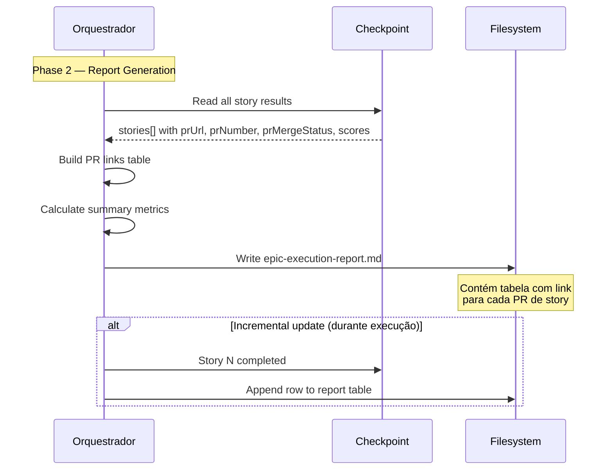

# História: Substituir Phase 2 consolidada por tracking incremental

**ID:** story-0021-0004
**Chave Jira:** —
**Status:** Pendente

## 1. Dependências

| Blocked By | Blocks |
| :--- | :--- |
| story-0021-0002 | story-0021-0008 |

## 2. Regras Transversais Aplicáveis

| ID | Título |
| :--- | :--- |
| RULE-008 | Rastreabilidade Epic-PR |
| RULE-010 | Report Incremental |

## 3. Descrição

Como **engenheiro de plataforma**, eu quero que o Phase 2 (Consolidation) gere um relatório de progresso com links individuais para cada PR de story em vez de criar um único mega-PR, garantindo rastreabilidade completa e acompanhamento granular do épico.

Atualmente, Phase 2 executa: Wave 1 (tech lead review do diff completo do épico — Section 2.1) e Wave 2 (criação de 1 PR para todo o épico — Section 2.3). Com per-story PRs, a tech lead review já acontece por story (via lifecycle Phase 7) e o PR já foi criado por story (via lifecycle Phase 6). Phase 2 passa a ser apenas a geração do relatório final consolidando informações de todos os PRs.

### 3.1 Remoção de Section 2.1 (Tech Lead Review)

- Remover Section 2.1 completamente — tech lead review agora é per-story via lifecycle Phase 7
- A review do diff total do épico não faz mais sentido pois cada story tem seu próprio PR revisado

### 3.2 Remoção de Section 2.3 (PR Creation)

- Remover Section 2.3 completamente — PRs são criados per-story via lifecycle Phase 6
- Remover toda a lógica de criação de mega-PR (title format, body template, partial completion handling)

### 3.3 Reescrita de Phase 2 como "Epic Progress Report"

- Phase 2 passa a ser "Phase 2 — Epic Progress Report Generation"
- Único passo: gerar `epic-execution-report.md` com tabela de PRs por story
- Template usa `{{PR_LINKS_TABLE}}` em vez de `{{PR_LINK}}`

### 3.4 Atualização incremental do relatório (RULE-010)

- O relatório é atualizado incrementalmente conforme cada story completa (não apenas ao final)
- Após cada story: adicionar linha na tabela de PRs com story ID, PR URL, status, score
- Ao final: gerar versão final com sumário de métricas

### 3.5 Atualização do template de execution report

- `{{PR_LINK}}` → `{{PR_LINKS_TABLE}}`
- Tabela: `| Story | PR | Status | Tech Lead Score | Merged At |`

## 3.5 Entrega de Valor

- **Valor Principal:** Relatório de progresso com links individuais por PR, permitindo acompanhamento granular do épico e navegação direta a cada PR de story
- **Métrica de Sucesso:** Relatório `epic-execution-report.md` contém tabela com N linhas (uma por story) com link clicável para cada PR
- **Impacto no Negócio:** Gestores e revisores podem acompanhar o progresso do épico story-by-story, identificando gargalos e status de review rapidamente

## 4. Definições de Qualidade Locais

### DoR Local (Definition of Ready)

- [ ] story-0021-0002 concluída (SubagentResult com prUrl/prNumber)
- [ ] Sections 2.1, 2.2, 2.3 do SKILL.md original lidas
- [ ] Template `_TEMPLATE-EPIC-EXECUTION-REPORT.md` lido

### DoD Local (Definition of Done)

- [ ] Section 2.1 (Tech Lead Review) removida
- [ ] Section 2.3 (PR Creation) removida
- [ ] Phase 2 reescrita como "Epic Progress Report Generation"
- [ ] Template atualizado com `{{PR_LINKS_TABLE}}`
- [ ] Relatório atualizado incrementalmente após cada story
- [ ] Pelo menos 1 teste automatizado validando estrutura do relatório
- [ ] Smoke test passando

### Global Definition of Done (DoD)

- **Cobertura:** N/A
- **Testes Automatizados:** Validação de consistência do SKILL.md
- **Documentação:** SKILL.md auto-consistente
- **Persistência:** Template de relatório atualizado
- **Performance:** N/A

## 5. Contratos de Dados (Data Contract)

### 5.1 PR Links Table (template)

| Campo | Tipo | Sempre presente | Descrição |
| :--- | :--- | :--- | :--- |
| `Story` | `String` | Sim | ID da story (e.g., `story-0042-0003`) |
| `PR` | `String` | Sim | Link para o PR (ou "—" se não criado) |
| `Status` | `String` | Sim | `MERGED`, `OPEN`, `CLOSED`, `FAILED` |
| `Tech Lead Score` | `String` | Sim | Score da review (e.g., `42/45`) ou "—" |
| `Merged At` | `String` | Não | Timestamp do merge (ISO-8601) ou "—" |

### 5.2 Phase 2 — Estrutura Simplificada

```markdown
## Phase 2 — Epic Progress Report Generation

### 2.1 Generate Progress Report

After all stories reach terminal state (SUCCESS, FAILED, or BLOCKED):

1. Read checkpoint to collect all story results
2. Build PR links table from prUrl, prNumber, prMergeStatus per story
3. Generate epic-execution-report.md using template
4. Replace {{PR_LINKS_TABLE}} with the per-story PR table
5. Include summary metrics: completed/failed/blocked counts, overall completion %
```

## 6. Diagramas

### 6.1 Fluxo de report generation



## 7. Critérios de Aceite (Gherkin)

```gherkin
Cenario: Phase 2 não cria mega-PR
  DADO que todas as stories do épico completaram
  QUANDO Phase 2 é executada
  ENTÃO nenhum PR novo é criado pelo orquestrador
  E o comando "gh pr create" NÃO é executado na Phase 2

Cenario: Relatório contém tabela com links de PRs
  DADO que 3 stories completaram com PRs #41, #42, #43
  QUANDO o relatório é gerado
  ENTÃO o arquivo epic-execution-report.md contém uma tabela com 3 linhas
  E cada linha contém o link do PR correspondente

Cenario: Relatório atualizado incrementalmente após cada story
  DADO que story-0042-0001 completou com PR #41
  E story-0042-0002 ainda está IN_PROGRESS
  QUANDO o relatório é atualizado
  ENTÃO a tabela contém 1 linha com PR #41
  E 1 linha com story-0042-0002 status "IN_PROGRESS"

Cenario: Section 2.1 (Tech Lead Review) não existe
  DADO que as mudanças desta story foram aplicadas
  QUANDO o SKILL.md é lido
  ENTÃO não existe seção "2.1" com "Tech Lead Review" do épico completo
  E a review tech lead é referenciada apenas no x-dev-lifecycle Phase 7

Cenario: Template usa PR_LINKS_TABLE em vez de PR_LINK
  DADO que o template de execution report é lido
  QUANDO o placeholder é verificado
  ENTÃO contém "{{PR_LINKS_TABLE}}" ou equivalente
  E NÃO contém "{{PR_LINK}}" como placeholder único
```

## 8. Sub-tarefas

- [ ] [Dev] Remover Section 2.1 (Tech Lead Review consolidada)
- [ ] [Dev] Remover Section 2.3 (PR Creation — mega-PR)
- [ ] [Dev] Reescrever Phase 2 como "Epic Progress Report Generation"
- [ ] [Dev] Implementar atualização incremental do relatório
- [ ] [Dev] Atualizar template com {{PR_LINKS_TABLE}}
- [ ] [Test] Smoke/E2E: Validar que SKILL.md não contém referências a criação de mega-PR
- [ ] [Doc] Atualizar template _TEMPLATE-EPIC-EXECUTION-REPORT.md
