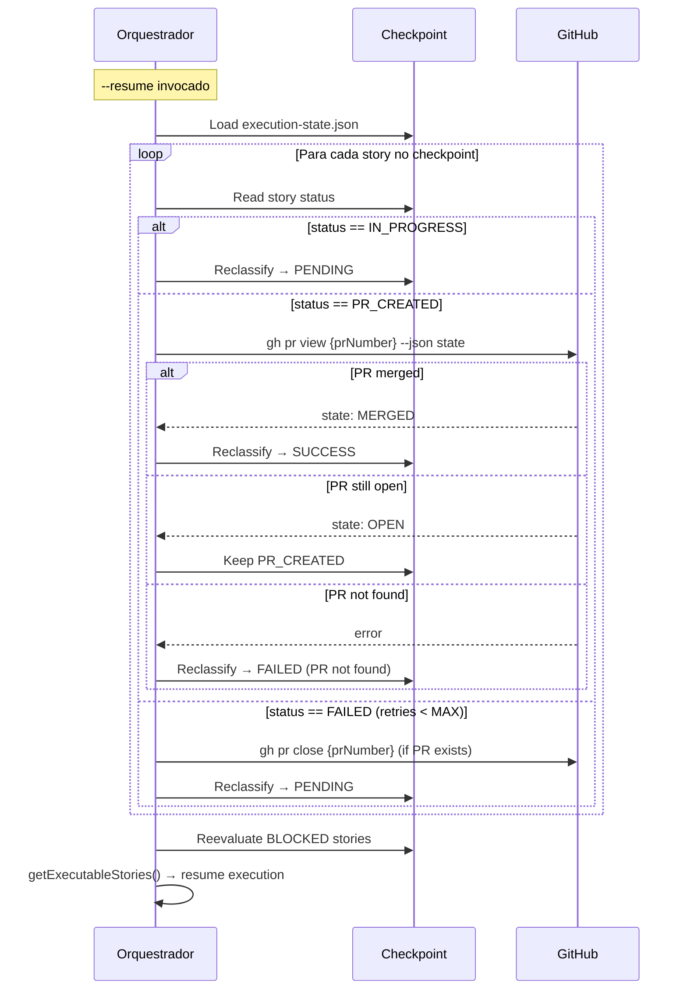

# História: Resume workflow para modelo per-story PR

**ID:** story-0021-0007
**Chave Jira:** —
**Status:** Concluída

## 1. Dependências

| Blocked By | Blocks |
| :--- | :--- |
| story-0021-0003 | story-0021-0008 |

## 2. Regras Transversais Aplicáveis

| ID | Título |
| :--- | :--- |
| RULE-002 | Persistência Atômica de Checkpoint |
| RULE-003 | Ordem de Dependências via PR Merge |

## 3. Descrição

Como **engenheiro de plataforma**, eu quero que o Resume Workflow funcione corretamente com o modelo de per-story PR, garantindo que interrupções são recuperáveis sem perda de progresso.

O Resume Workflow atual (Steps 1-4) lida com estados de checkpoint como SUCCESS, FAILED, IN_PROGRESS, BLOCKED, e os status de rebase (REBASING, REBASE_SUCCESS, REBASE_FAILED). Com a eliminação dos status de rebase (story-0021-0001) e a introdução de estados de PR (story-0021-0003), o resume precisa ser atualizado para lidar com novos estados: PR criado mas não merged, PR em review, PR merged.

### 3.1 Novos status de PR no checkpoint

- `PR_CREATED`: lifecycle completou, PR criado, aguardando review
- `PR_PENDING_REVIEW`: PR está aberto, review em andamento
- `PR_MERGED`: PR foi merged na main

### 3.2 Atualização do Step 1 (Reclassify Story Statuses)

Adicionar transições para os novos status:

| Current Status | New Status | Condition |
|----------------|------------|-----------|
| PR_CREATED | PR_CREATED | Verificar se PR ainda está aberto via `gh pr view` |
| PR_PENDING_REVIEW | PR_PENDING_REVIEW | Verificar se PR ainda está aberto |
| PR_MERGED | SUCCESS | PR foi merged — story está completa |
| SUCCESS (sem prMergeStatus) | PR_CREATED | Legacy: story SUCCESS mas sem info de PR — verificar via `gh pr list` |

### 3.3 Remoção do Step 3 (Branch Recovery)

- Step 3 (checkout da branch épica) já foi removido em story-0021-0001
- Confirmar que o resume NÃO tenta recuperar branch épica
- O orquestrador permanece na `main` durante resume

### 3.4 Failure handling — fechar PR se story falha

- Quando uma story falha e tem PR aberto: `gh pr close {prNumber} --comment "Story failed: {reason}"`
- Quando uma story é retried: o lifecycle cria novo PR (o antigo foi fechado)
- Adicionar esta lógica ao failure handling (Section 1.5b)

### 3.5 Verificação de PR status via GitHub CLI

- Ao reclassificar, consultar GitHub para estado real do PR: `gh pr view {prNumber} --json state,mergedAt`
- Se PR não existe (deletado/força-fechado): marcar story como FAILED com motivo "PR not found"
- Se PR está merged: atualizar para PR_MERGED → SUCCESS

## 3.5 Entrega de Valor

- **Valor Principal:** Retomada robusta após interrupções — o orquestrador recupera estado preciso de cada story incluindo status do PR, sem perder progresso
- **Métrica de Sucesso:** Após --resume, todas as stories com PR merged são corretamente identificadas como SUCCESS, e stories com PR aberto retomam do estado correto
- **Impacto no Negócio:** Zero retrabalho por interrupções — o orquestrador retoma exatamente de onde parou, economizando tempo e recursos computacionais

## 4. Definições de Qualidade Locais

### DoR Local (Definition of Ready)

- [ ] story-0021-0003 concluída (dependency enforcement via PR merge)
- [ ] Resume Workflow Steps 1-4 do SKILL.md atual lidos e compreendidos
- [ ] Schema execution-state.json atualizado com campos de PR

### DoD Local (Definition of Done)

- [ ] Novos status PR_CREATED, PR_PENDING_REVIEW, PR_MERGED adicionados ao schema
- [ ] Step 1 atualizado com transições para novos status
- [ ] Failure handling fecha PR quando story falha
- [ ] Verificação de PR status via `gh pr view` durante resume
- [ ] Pelo menos 1 teste automatizado validando fluxo de resume
- [ ] Smoke test passando

### Global Definition of Done (DoD)

- **Cobertura:** N/A
- **Testes Automatizados:** Validação de consistência do SKILL.md
- **Documentação:** SKILL.md auto-consistente
- **Persistência:** Schema execution-state.json atualizado
- **Performance:** N/A

## 5. Contratos de Dados (Data Contract)

### 5.1 execution-state.json — Novos Status

| Status | Descrição | Transição De | Transição Para |
| :--- | :--- | :--- | :--- |
| `PR_CREATED` | PR criado, aguardando review | SUCCESS (após lifecycle) | PR_PENDING_REVIEW, PR_MERGED, FAILED |
| `PR_PENDING_REVIEW` | PR em review | PR_CREATED | PR_MERGED, FAILED |
| `PR_MERGED` | PR merged na main | PR_PENDING_REVIEW, PR_CREATED | SUCCESS |

### 5.2 Resume Reclassification Table (atualizada)

| Current Status | New Status | Condition |
| :--- | :--- | :--- |
| IN_PROGRESS | PENDING | Sempre (trabalho interrompido) |
| SUCCESS | SUCCESS | Preservado |
| PR_CREATED | PR_CREATED ou PR_MERGED | Verificar via `gh pr view` |
| PR_PENDING_REVIEW | PR_PENDING_REVIEW ou PR_MERGED | Verificar via `gh pr view` |
| PR_MERGED | SUCCESS | PR merged = story completa |
| FAILED (retries < MAX) | PENDING | Retry candidate |
| FAILED (retries >= MAX) | FAILED | Retry budget exausto |
| PARTIAL | PENDING | Tratar como interrompido |
| BLOCKED | BLOCKED | Deferir para reavaliação |
| PENDING | PENDING | Sem mudança |

### 5.3 Failure Handling — PR Closure

```
When story status transitions to FAILED:
  if story.prNumber exists and story.prMergeStatus != "MERGED":
    run: gh pr close {prNumber} --comment "Story failed: {summary}"
    update: story.prMergeStatus = "CLOSED"
```

## 6. Diagramas

### 6.1 Fluxo de resume com PR states



## 7. Critérios de Aceite (Gherkin)

```gherkin
Cenario: Resume sem stories com PR — comportamento padrão
  DADO que o checkpoint contém 2 stories: 1 SUCCESS e 1 PENDING
  E nenhuma tem campos de PR
  QUANDO --resume é executado
  ENTÃO a reclassificação mantém SUCCESS e PENDING
  E nenhuma consulta ao GitHub é feita

Cenario: Resume com story PR_CREATED e PR merged
  DADO que story-0042-0001 tem status PR_CREATED e prNumber 41
  QUANDO --resume é executado
  E "gh pr view 41 --json state" retorna "MERGED"
  ENTÃO story-0042-0001 é reclassificada para SUCCESS
  E prMergeStatus é atualizado para "MERGED"

Cenario: Resume com story PR_CREATED e PR ainda aberto
  DADO que story-0042-0001 tem status PR_CREATED e prNumber 41
  QUANDO --resume é executado
  E "gh pr view 41 --json state" retorna "OPEN"
  ENTÃO story-0042-0001 permanece como PR_CREATED
  E o orquestrador entra em polling para aguardar merge

Cenario: Failure handling fecha PR de story que falhou
  DADO que story-0042-0003 falhou após criar PR #43
  QUANDO o failure handling é executado
  ENTÃO executa "gh pr close 43 --comment 'Story failed: ...'"
  E prMergeStatus é atualizado para "CLOSED"

Cenario: Resume com PR não encontrado marca story como FAILED
  DADO que story-0042-0002 tem status PR_CREATED e prNumber 42
  QUANDO --resume é executado
  E "gh pr view 42" retorna erro (PR não existe)
  ENTÃO story-0042-0002 é reclassificada para FAILED
  E o motivo inclui "PR not found"

Cenario: Story retry após failure cria novo PR
  DADO que story-0042-0003 falhou e seu PR #43 foi fechado
  E retries < MAX_RETRIES
  QUANDO --resume reclassifica story-0042-0003 para PENDING
  E a story é redespachada
  ENTÃO o lifecycle cria um novo PR (número diferente de #43)
```

## 8. Sub-tarefas

- [ ] [Dev] Adicionar status PR_CREATED, PR_PENDING_REVIEW, PR_MERGED ao schema
- [ ] [Dev] Atualizar Step 1 do Resume com transições para novos status
- [ ] [Dev] Implementar verificação de PR status via `gh pr view` durante resume
- [ ] [Dev] Implementar PR closure no failure handling (Section 1.5b)
- [ ] [Dev] Garantir que retry cria novo PR (PR antigo fechado)
- [ ] [Test] Smoke/E2E: Validar consistência das transições de status no SKILL.md
- [ ] [Doc] Documentar diagrama de estados completo com novos status
