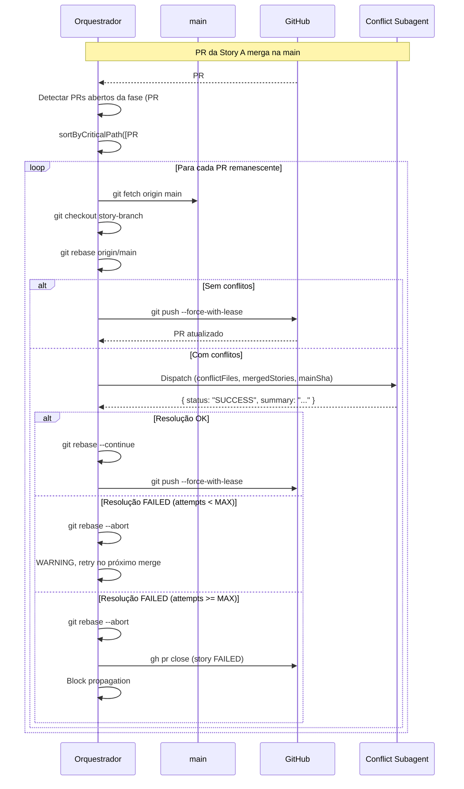

# História: Auto-rebase e resolução automática de conflitos em PRs paralelos

**ID:** story-0021-0009
**Chave Jira:** —
**Status:** Pendente

## 1. Dependências

| Blocked By | Blocks |
| :--- | :--- |
| story-0021-0001, story-0021-0003 | story-0021-0008 |

## 2. Regras Transversais Aplicáveis

| ID | Título |
| :--- | :--- |
| RULE-001 | Isolamento de Contexto de Subagents |
| RULE-002 | Persistência Atômica de Checkpoint |
| RULE-007 | Prioridade por Caminho Crítico |
| RULE-011 | Auto-Rebase de PRs Paralelos |
| RULE-012 | Resolução Automática de Conflitos em PRs |

## 3. Descrição

Como **engenheiro de plataforma**, eu quero que, após cada PR de story ser merged em uma fase, os PRs remanescentes da mesma fase sejam automaticamente rebasados sobre a `main` atualizada e que conflitos sejam resolvidos por um subagent de IA com contexto completo, garantindo que stories paralelas não fiquem com branches desatualizadas e que conflitos sejam tratados automaticamente sem intervenção manual.

No modelo antigo (branch épica), a Section 1.4b (Rebase-Before-Merge) rebasava cada story branch na branch épica atualizada, e a Section 1.4c (Conflict Resolution Subagent) resolvia conflitos automaticamente. Com a eliminação da branch épica (story-0021-0001), esse mecanismo foi removido. Esta story reimplementa essa capacidade adaptada para o modelo per-story PR: quando um PR merga na `main`, os PRs restantes da fase são rebasados na `main` atualizada, e conflitos são resolvidos pelo subagent.

### 3.1 Auto-rebase trigger (Section 1.4e — nova)

Após cada PR merge na `main` dentro de uma fase:

1. Detectar PRs abertos remanescentes da mesma fase via checkpoint (`prMergeStatus != "MERGED"`)
2. Ordenar por prioridade de caminho crítico (RULE-007): `sortByCriticalPath()`
3. Para cada PR remanescente:
   a. `git fetch origin main && git checkout {story-branch}`
   b. `git rebase origin/main`
   c. Se rebase sem conflitos: `git push --force-with-lease origin {story-branch}` → PR atualiza automaticamente
   d. Se rebase com conflitos: despachar Conflict Resolution Subagent (Section 1.4c adaptada)
   e. Atualizar checkpoint: `rebaseStatus`, `lastRebaseSha`, `rebaseAttempts`
4. Skip auto-rebase quando `--sequential` está set (stories executam uma por vez, não há PRs paralelos)
5. Skip auto-rebase quando não há PRs remanescentes na fase

### 3.2 Conflict Resolution Subagent adaptado (Section 1.4c — reimplementação)

Quando o auto-rebase detecta conflitos, um subagent de resolução é despachado com contexto:

**Prompt template do subagent:**
- `conflictType`: "rebase" (sempre rebase no modelo per-story PR)
- `conflictFiles`: lista de arquivos com conflito
- `storyBranch`: branch da story sendo rebasada
- `mergedStories`: IDs das stories já merged nesta fase (com PRs)
- `mergedPRs`: URLs e números dos PRs já merged
- `mainShaBeforePhase`: SHA da `main` no início da fase (de story-0021-0006)
- Context isolation (RULE-001): passar apenas branch names, conflict file list, e metadados — nunca source code inline

**Responsabilidades do subagent:**
1. Analisar diff de ambos os branches para cada arquivo com conflito
2. Considerar as stories já merged — suas mudanças são intencionais
3. Resolver cada hunk conflitante respeitando a intenção de ambos os branches
4. `git add <resolved files>` (NÃO committar — rebase faz o commit)
5. Retornar JSON: `{ status: "SUCCESS" | "FAILED", summary: "..." }`

**Fluxo pós-resolução:**
- Se SUCCESS: `git rebase --continue && git push --force-with-lease origin {story-branch}`
- Se FAILED e `rebaseAttempts < MAX_REBASE_RETRIES` (3): `git rebase --abort`, registrar WARNING, tentar novamente no próximo merge event
- Se FAILED e `rebaseAttempts >= MAX_REBASE_RETRIES`: `git rebase --abort`, marcar story FAILED, fechar PR (`gh pr close {prNumber} --comment "Rebase conflict resolution failed after {MAX_REBASE_RETRIES} attempts"`), trigger block propagation para dependentes

### 3.3 Constantes e configuração

- `MAX_REBASE_RETRIES`: 3 (padrão) — tentativas máximas de resolução de conflitos por story
- Rebase order: `sortByCriticalPath()` (RULE-007) — stories no caminho crítico rebasam primeiro
- Push strategy: `--force-with-lease` (nunca `--force`) — protege contra pushes concorrentes

### 3.4 Integração com checkpoint (RULE-002)

O checkpoint é atualizado atomicamente a cada transição de estado do rebase:
- Antes do rebase: `rebaseStatus = "REBASING"`
- Rebase sem conflito: `rebaseStatus = "REBASE_SUCCESS"` → push → limpar status
- Rebase com conflito + resolução OK: `rebaseStatus = "REBASE_SUCCESS"` → push → limpar status
- Rebase com conflito + resolução FAILED: `rebaseStatus = "REBASE_FAILED"` → incrementar `rebaseAttempts`
- Após push bem-sucedido: `lastRebaseSha = {SHA da main usada no rebase}`

**Nota:** Os status REBASING/REBASE_SUCCESS/REBASE_FAILED removidos do schema principal pela story-0021-0001 são reintroduzidos APENAS como sub-campo `rebaseStatus` dentro de cada story entry, não como status principal da story. O status principal da story permanece: PENDING, IN_PROGRESS, SUCCESS, FAILED, BLOCKED, PARTIAL, PR_CREATED, PR_PENDING_REVIEW, PR_MERGED.

## 3.5 Entrega de Valor

- **Valor Principal:** Resolução automática de conflitos entre PRs paralelos — mantém o nível de automação do modelo anterior (branch épica) com a flexibilidade do modelo per-story PR
- **Métrica de Sucesso:** Conflitos de rebase resolvidos automaticamente sem intervenção manual, com taxa de resolução ≥ 80% dos conflitos textuais
- **Impacto no Negócio:** Engenheiros não precisam monitorar PRs para conflitos — o orquestrador resolve automaticamente, permitindo execução paralela sem risco de branches desatualizadas

## 4. Definições de Qualidade Locais

### DoR Local (Definition of Ready)

- [ ] story-0021-0001 concluída (branch épica eliminada, Section 1.4c com placeholder)
- [ ] story-0021-0003 concluída (dependency enforcement via PR merge status)
- [ ] Section 1.4c placeholder existe no SKILL.md
- [ ] Schema do execution-state.json com campos prUrl, prNumber, prMergeStatus disponíveis

### DoD Local (Definition of Done)

- [ ] Section 1.4c reimplementada com subagent de resolução adaptado para per-story PR
- [ ] Section 1.4e (nova) implementada com auto-rebase trigger
- [ ] Campos `rebaseStatus`, `lastRebaseSha`, `rebaseAttempts` documentados no schema
- [ ] `MAX_REBASE_RETRIES = 3` configurável
- [ ] Auto-rebase skip quando `--sequential` está set
- [ ] Push usa `--force-with-lease` (nunca `--force`)
- [ ] Failure handling fecha PR e dispara block propagation
- [ ] Checkpoint atualizado atomicamente a cada transição de rebase (RULE-002)
- [ ] Pelo menos 1 teste automatizado validando o fluxo de auto-rebase
- [ ] Smoke test passando

### Global Definition of Done (DoD)

- **Cobertura:** N/A — mudanças são em SKILL.md (markdown)
- **Testes Automatizados:** Validação de consistência interna do SKILL.md
- **Documentação:** SKILL.md é a documentação
- **Persistência:** Schema execution-state.json atualizado com campos de rebase
- **Performance:** N/A

## 5. Contratos de Dados (Data Contract)

### 5.1 execution-state.json — Campos Adicionados (por story entry)

| Campo | Tipo | M/O | Validação | Exemplo |
| :--- | :--- | :--- | :--- | :--- |
| `rebaseStatus` | `String` (Enum) | O | Enum: PENDING, REBASING, REBASE_SUCCESS, REBASE_FAILED | `"REBASE_SUCCESS"` |
| `lastRebaseSha` | `String` | O | SHA-1 hex, 40 caracteres | `"a1b2c3d4e5f6..."` |
| `rebaseAttempts` | `Integer` | O | >= 0, <= MAX_REBASE_RETRIES | `2` |

### 5.2 Conflict Resolution Subagent — Request (prompt context)

| Campo | Tipo | M/O | Descrição |
| :--- | :--- | :--- | :--- |
| `conflictType` | `String` | M | Sempre "rebase" no modelo per-story PR |
| `conflictFiles` | `String[]` | M | Lista de arquivos com conflito |
| `storyBranch` | `String` | M | Branch da story sendo rebasada |
| `mergedStories` | `String[]` | M | IDs das stories já merged nesta fase |
| `mergedPRs` | `Object[]` | M | `[{ prNumber: Int, prUrl: String }]` |
| `mainShaBeforePhase` | `String` | M | SHA da main no início da fase |

### 5.3 Conflict Resolution Subagent — Response

| Campo | Tipo | M/O | Descrição |
| :--- | :--- | :--- | :--- |
| `status` | `String` (Enum) | M | "SUCCESS" ou "FAILED" |
| `summary` | `String` | M | Descrição das resoluções aplicadas |

### 5.4 Constantes

| Constante | Tipo | Valor Default | Descrição |
| :--- | :--- | :--- | :--- |
| `MAX_REBASE_RETRIES` | `Integer` | `3` | Máximo de tentativas de resolução por story |

## 6. Diagramas

### 6.1 Fluxo de auto-rebase após PR merge



## 7. Critérios de Aceite (Gherkin)

```gherkin
Cenario: Fase com story única — auto-rebase não dispara
  DADO que a fase 0 contém apenas story-0042-0001
  E o PR da story-0042-0001 é merged na main
  QUANDO o orquestrador verifica PRs remanescentes
  ENTÃO nenhum auto-rebase é disparado
  E o fluxo segue para a próxima fase normalmente

Cenario: Todos os PRs já merged — auto-rebase não dispara
  DADO que a fase 0 contém story-0042-0001 e story-0042-0002
  E ambos os PRs já estão merged
  QUANDO o orquestrador verifica PRs remanescentes
  ENTÃO nenhum auto-rebase é disparado

Cenario: --sequential ativo — auto-rebase não dispara
  DADO que a flag --sequential está set
  E o PR da story-0042-0001 é merged
  QUANDO o orquestrador verifica PRs remanescentes
  ENTÃO auto-rebase é skipped
  E uma nota é logada: "Auto-rebase skipped (--sequential mode)"

Cenario: Primeiro PR merga — rebase dos PRs restantes sem conflito
  DADO que a fase 0 contém story-0042-0001, story-0042-0002 e story-0042-0003
  E o PR #41 (story-0042-0001) é merged na main
  E as branches de story-0042-0002 e story-0042-0003 não têm conflitos com main
  QUANDO o auto-rebase é disparado
  ENTÃO story-0042-0002 é rebasada: git rebase origin/main
  E story-0042-0003 é rebasada: git rebase origin/main
  E ambas as branches são pushed com --force-with-lease
  E os PRs #42 e #43 são atualizados automaticamente no GitHub
  E o checkpoint registra lastRebaseSha para ambas as stories

Cenario: Rebase com conflito — subagent resolve e push com force-with-lease
  DADO que o PR #41 (story-0042-0001) é merged na main
  E a branch de story-0042-0002 tem conflito com main no arquivo UserService.java
  QUANDO o auto-rebase detecta conflito
  ENTÃO o subagent de resolução é despachado com contexto:
    | mergedStories       | ["story-0042-0001"]                |
    | mergedPRs           | [{ prNumber: 41, prUrl: "..." }]   |
    | conflictFiles       | ["UserService.java"]               |
    | mainShaBeforePhase  | SHA capturado no início da fase    |
  E o subagent retorna { status: "SUCCESS", summary: "..." }
  E git rebase --continue é executado
  E git push --force-with-lease é executado
  E o checkpoint registra rebaseStatus = "REBASE_SUCCESS"

Cenario: Múltiplos PRs mergam sequencialmente — rebase cascateado funciona
  DADO que a fase contém 3 stories com PRs: #41, #42, #43
  E PR #41 merga → auto-rebase de #42 e #43 (sem conflito)
  E PR #42 merga → auto-rebase de #43 (sem conflito)
  QUANDO todos os rebases completam
  ENTÃO PR #43 foi rebasado 2 vezes (sobre main após #41, depois sobre main após #42)
  E lastRebaseSha de story-0042-0003 reflete o SHA mais recente da main

Cenario: Resolução falha após MAX_RETRIES — story FAILED e PR fechado
  DADO que story-0042-0002 tem conflito persistente com main
  E o subagent falha na resolução 3 vezes (MAX_REBASE_RETRIES)
  QUANDO a terceira tentativa de resolução retorna { status: "FAILED" }
  ENTÃO git rebase --abort é executado
  E a story é marcada como FAILED com summary "Rebase conflict resolution failed after 3 attempts"
  E o PR é fechado via gh pr close {prNumber} --comment "..."
  E block propagation é disparado para stories dependentes

Cenario: PR não encontrado durante rebase — WARNING e skip
  DADO que o PR #42 da story-0042-0002 não é encontrado no GitHub
  QUANDO o auto-rebase tenta processar story-0042-0002
  ENTÃO um WARNING é logado: "PR #42 not found for story-0042-0002, skipping rebase"
  E a story NÃO é marcada como FAILED
  E o auto-rebase continua para as próximas stories

Cenario: git push --force-with-lease falha — retry com novo rebase
  DADO que story-0042-0002 foi rebasada com sucesso
  E o push --force-with-lease falha (branch atualizada por outro processo)
  QUANDO o push falha
  ENTÃO o orquestrador executa novo git fetch + git rebase
  E tenta push --force-with-lease novamente
  E rebaseAttempts é incrementado

Cenario: Exatamente MAX_REBASE_RETRIES tentativas — última resolve
  DADO que story-0042-0002 falhou resolução nas 2 primeiras tentativas
  E rebaseAttempts = 2 (abaixo de MAX_REBASE_RETRIES = 3)
  QUANDO o subagent resolve com sucesso na terceira tentativa
  ENTÃO git rebase --continue é executado
  E git push --force-with-lease é executado
  E a story NÃO é marcada como FAILED
  E rebaseAttempts permanece em 3

Cenario: Conflito em arquivo de config (pom.xml) — resolução automática
  DADO que story-0042-0002 e story-0042-0001 editam pom.xml (dependências diferentes)
  E o PR #41 (story-0042-0001) é merged
  E o rebase de story-0042-0002 detecta conflito em pom.xml
  QUANDO o subagent de resolução é despachado
  ENTÃO o subagent resolve o conflito mantendo ambas as dependências
  E retorna { status: "SUCCESS", summary: "Merged both dependency additions in pom.xml" }

Cenario: Todas as stories restantes com conflito — resolução em lote
  DADO que a fase tem 4 stories e PR #41 mergou
  E as 3 stories restantes (#42, #43, #44) todas têm conflitos
  QUANDO o auto-rebase processa cada story
  ENTÃO cada story recebe seu próprio subagent de resolução
  E a ordem segue sortByCriticalPath()
  E cada resolução recebe mergedStories atualizado (incluindo stories resolvidas antes)

Cenario: Subagent recebe contexto completo com mergedStories e mainShaBeforePhase
  DADO que PR #41 e PR #42 da mesma fase já foram merged
  E o auto-rebase de story-0042-0003 detecta conflito
  QUANDO o subagent é despachado
  ENTÃO mergedStories contém ["story-0042-0001", "story-0042-0002"]
  E mergedPRs contém [{ prNumber: 41, prUrl: "..." }, { prNumber: 42, prUrl: "..." }]
  E mainShaBeforePhase contém o SHA capturado no início da fase
  E conflictFiles lista todos os arquivos com conflito
```

## 8. Sub-tarefas

- [ ] [Dev] Implementar Section 1.4e (Auto-rebase after merge trigger) no SKILL.md
- [ ] [Dev] Reimplementar Section 1.4c (Conflict Resolution Subagent) adaptada para per-story PR
- [ ] [Dev] Definir prompt template do subagent com campos de contexto (mergedStories, mergedPRs, conflictFiles, mainShaBeforePhase)
- [ ] [Dev] Implementar lógica de retry com MAX_REBASE_RETRIES = 3
- [ ] [Dev] Implementar failure handling: fechar PR e block propagation
- [ ] [Dev] Adicionar campos rebaseStatus, lastRebaseSha, rebaseAttempts ao schema execution-state.json
- [ ] [Dev] Implementar skip de auto-rebase quando --sequential está set
- [ ] [Dev] Implementar ordenação por caminho crítico (sortByCriticalPath) para rebase order
- [ ] [Test] Smoke/E2E: Validar que auto-rebase dispara após PR merge e resolve conflitos
- [ ] [Test] Smoke/E2E: Validar failure handling (PR fechado, block propagation)
- [ ] [Doc] Documentar constantes (MAX_REBASE_RETRIES) e configuração no SKILL.md
