# Mapa de Implementação — Epic-0022: Application Security Program

**Gerado a partir das dependências BlockedBy/Blocks de cada história do epic-0022.**

---

## 1. Matriz de Dependências

| Story | Título | Chave Jira | Blocked By | Blocks | Status |
| :--- | :--- | :--- | :--- | :--- | :--- |
| story-0022-0001 | Security Config Model Extension | — | — | story-0022-0003, story-0022-0005, story-0022-0006, story-0022-0007, story-0022-0008, story-0022-0009, story-0022-0014 | Pendente |
| story-0022-0002 | Security Report Infrastructure (SARIF + Scoring) | — | — | story-0022-0005, story-0022-0006, story-0022-0007, story-0022-0008, story-0022-0009, story-0022-0010, story-0022-0011, story-0022-0012, story-0022-0013, story-0022-0014, story-0022-0015, story-0022-0020 | Pendente |
| story-0022-0003 | Security Skill Template + CI Integration | — | story-0022-0001 | story-0022-0005, story-0022-0006, story-0022-0007, story-0022-0008, story-0022-0009, story-0022-0010 | Pendente |
| story-0022-0004 | OWASP ASVS Reference Knowledge Pack | — | — | story-0022-0010, story-0022-0012, story-0022-0013, story-0022-0021, story-0022-0024 | Pendente |
| story-0022-0005 | SAST Scanner (x-sast-scan) | — | story-0022-0001, story-0022-0002, story-0022-0003 | story-0022-0011, story-0022-0018, story-0022-0019, story-0022-0020, story-0022-0023 | Pendente |
| story-0022-0006 | Secret Scanner (x-secret-scan) | — | story-0022-0001, story-0022-0002, story-0022-0003 | story-0022-0018, story-0022-0019, story-0022-0020, story-0022-0023 | Pendente |
| story-0022-0007 | Container Security Scanner (x-container-scan) | — | story-0022-0001, story-0022-0002, story-0022-0003 | story-0022-0018, story-0022-0019, story-0022-0020 | Pendente |
| story-0022-0008 | Infrastructure Security Scanner (x-infra-scan) | — | story-0022-0001, story-0022-0002, story-0022-0003 | story-0022-0018, story-0022-0019, story-0022-0020 | Pendente |
| story-0022-0009 | DAST Scanner (x-dast-scan) | — | story-0022-0001, story-0022-0002, story-0022-0003 | story-0022-0018, story-0022-0019, story-0022-0020 | Pendente |
| story-0022-0010 | OWASP Top 10 Verification (x-owasp-scan) | — | story-0022-0002, story-0022-0003, story-0022-0004 | story-0022-0019, story-0022-0020 | Pendente |
| story-0022-0011 | SonarQube Quality Gate (x-sonar-gate) | — | story-0022-0002, story-0022-0005 | story-0022-0019, story-0022-0020 | Pendente |
| story-0022-0012 | Application Hardening Eval (x-hardening-eval) | — | story-0022-0002, story-0022-0004 | story-0022-0018, story-0022-0019 | Pendente |
| story-0022-0013 | Runtime Protection Eval (x-runtime-protection) | — | story-0022-0002, story-0022-0004 | story-0022-0018, story-0022-0019 | Pendente |
| story-0022-0014 | Enhanced Supply Chain (x-supply-chain-audit) | — | story-0022-0001, story-0022-0002 | story-0022-0019 | Pendente |
| story-0022-0015 | Pentest Engineer Agent | — | story-0022-0002 | story-0022-0018, story-0022-0026 | Pendente |
| story-0022-0016 | AppSec Engineer Agent | — | — | story-0022-0018, story-0022-0019, story-0022-0021 | Pendente |
| story-0022-0017 | DevSecOps Engineer Agent | — | — | story-0022-0019 | Pendente |
| story-0022-0018 | Pentest Orchestrator (x-pentest) | — | story-0022-0005, story-0022-0006, story-0022-0007, story-0022-0008, story-0022-0009, story-0022-0012, story-0022-0013, story-0022-0015, story-0022-0016 | story-0022-0022 | Pendente |
| story-0022-0019 | Security Posture Dashboard (x-security-dashboard) | — | story-0022-0005, story-0022-0006, story-0022-0007, story-0022-0008, story-0022-0009, story-0022-0010, story-0022-0011, story-0022-0012, story-0022-0013, story-0022-0014, story-0022-0016, story-0022-0017 | story-0022-0022 | Pendente |
| story-0022-0020 | Security CI Pipeline Generator (x-security-pipeline) | — | story-0022-0005, story-0022-0006, story-0022-0007, story-0022-0008, story-0022-0009, story-0022-0010, story-0022-0011 | story-0022-0022 | Pendente |
| story-0022-0021 | Compliance Auditor Agent | — | story-0022-0004, story-0022-0016 | story-0022-0022 | Pendente |
| story-0022-0022 | Security Review Integration Enhancement | — | story-0022-0018, story-0022-0019, story-0022-0020, story-0022-0021 | story-0022-0028 | Pendente |
| story-0022-0023 | Security Baseline Rule Enhancement | — | story-0022-0005, story-0022-0006 | story-0022-0028 | Pendente |
| story-0022-0024 | Security KP — Application Security Reference | — | story-0022-0004 | story-0022-0028 | Pendente |
| story-0022-0025 | Security KP — Cryptography Reference | — | — | story-0022-0028 | Pendente |
| story-0022-0026 | Security KP — Pentest Readiness Reference | — | story-0022-0015 | story-0022-0028 | Pendente |
| story-0022-0027 | Security Anti-Patterns Rule (per language) | — | — | story-0022-0028 | Pendente |
| story-0022-0028 | Integration Verification + Smoke Test | — | story-0022-0022, story-0022-0023, story-0022-0024, story-0022-0025, story-0022-0026, story-0022-0027 | — | Pendente |

> **Nota:** story-0022-0012 e story-0022-0013 (hardening e runtime protection) dependem do ASVS KP (story-0022-0004) mas NÃO dependem do config model (story-0022-0001) pois são skills core, não condicionais. story-0022-0010 (OWASP scan) depende do ASVS KP mas não do config model pois também é core.

---

## 2. Fases de Implementação

```
╔══════════════════════════════════════════════════════════════════════════════════════╗
║                         FASE 0 — Foundation + Agents Independentes (paralelo)       ║
║                                                                                      ║
║  ┌──────────┐  ┌──────────┐  ┌──────────┐  ┌──────────┐  ┌──────────┐  ┌──────────┐ ║
║  │  0001    │  │  0002    │  │  0004    │  │  0016    │  │  0017    │  │  0025    │ ║
║  │ Config   │  │ SARIF+   │  │ ASVS KP  │  │ AppSec   │  │ DevSec   │  │ Crypto   │ ║
║  │ Model    │  │ Scoring  │  │          │  │ Agent    │  │ Agent    │  │ Ref      │ ║
║  └────┬─────┘  └────┬─────┘  └────┬─────┘  └──────────┘  └──────────┘  └──────────┘ ║
║       │              │              │                                      ┌──────────┐ ║
║       │              │              │                                      │  0027    │ ║
║       │              │              │                                      │ AntiPat  │ ║
║       │              │              │                                      └──────────┘ ║
╚═══════╪══════════════╪══════════════╪════════════════════════════════════════════════╝
        │              │              │
        ▼              ▼              ▼
╔══════════════════════════════════════════════════════════════════════════════════════╗
║                         FASE 1 — Templates + Agents Dependentes (paralelo)          ║
║                                                                                      ║
║  ┌──────────┐  ┌──────────┐  ┌──────────┐  ┌──────────┐  ┌──────────┐               ║
║  │  0003    │  │  0014    │  │  0015    │  │  0012    │  │  0013    │               ║
║  │ Skill    │  │ Supply   │  │ Pentest  │  │ Harden   │  │ Runtime  │               ║
║  │ Template │  │ Chain    │  │ Agent    │  │ Eval     │  │ Protect  │               ║
║  │ (←0001)  │  │(←01,02)  │  │ (←0002)  │  │(←02,04)  │  │(←02,04)  │               ║
║  └────┬─────┘  └──────────┘  └──────────┘  └──────────┘  └──────────┘               ║
╚═══════╪═════════════════════════════════════════════════════════════════════════════╝
        │
        ▼
╔══════════════════════════════════════════════════════════════════════════════════════╗
║                         FASE 2 — Core Scanning Skills (paralelo)                     ║
║                                                                                      ║
║  ┌──────────┐  ┌──────────┐  ┌──────────┐  ┌──────────┐  ┌──────────┐  ┌──────────┐ ║
║  │  0005    │  │  0006    │  │  0007    │  │  0008    │  │  0009    │  │  0010    │ ║
║  │ SAST     │  │ Secret   │  │ Container│  │ Infra    │  │ DAST     │  │ OWASP    │ ║
║  │ Scanner  │  │ Scanner  │  │ Scanner  │  │ Scanner  │  │ Scanner  │  │ Top 10   │ ║
║  └────┬─────┘  └────┬─────┘  └────┬─────┘  └────┬─────┘  └────┬─────┘  └────┬─────┘ ║
╚═══════╪══════════════╪══════════════╪══════════════╪══════════════╪══════════════╪════╝
        │              │              │              │              │              │
        ▼              ▼              ▼              ▼              ▼              ▼
╔══════════════════════════════════════════════════════════════════════════════════════╗
║                         FASE 3 — Extensions (paralelo)                               ║
║                                                                                      ║
║  ┌──────────┐  ┌──────────┐  ┌──────────┐  ┌──────────┐                             ║
║  │  0011    │  │  0021    │  │  0023    │  │  0024    │                             ║
║  │ Sonar    │  │ Compli-  │  │ Baseline │  │ AppSec   │                             ║
║  │ Gate     │  │ ance Aud │  │ Enhance  │  │ Ref      │                             ║
║  │(←02,05)  │  │(←04,16)  │  │(←05,06)  │  │(←0004)  │                             ║
║  └──────────┘  └──────────┘  └──────────┘  └──────────┘                             ║
║  ┌──────────┐                                                                        ║
║  │  0026    │                                                                        ║
║  │ Pentest  │                                                                        ║
║  │ Ready Ref│                                                                        ║
║  │(←0015)   │                                                                        ║
║  └──────────┘                                                                        ║
╚══════════════════════════════════════════════════════════════════════════════════════╝
        │
        ▼
╔══════════════════════════════════════════════════════════════════════════════════════╗
║                         FASE 4 — Compositions (paralelo)                             ║
║                                                                                      ║
║  ┌──────────┐  ┌──────────┐  ┌──────────┐                                           ║
║  │  0018    │  │  0019    │  │  0020    │                                           ║
║  │ Pentest  │  │ Security │  │ Security │                                           ║
║  │ Orchestr │  │ Dashbrd  │  │ Pipeline │                                           ║
║  └──────────┘  └──────────┘  └──────────┘                                           ║
╚══════════════════════════════════════════════════════════════════════════════════════╝
        │
        ▼
╔══════════════════════════════════════════════════════════════════════════════════════╗
║                         FASE 5 — Cross-Cutting Integration                           ║
║                                                                                      ║
║  ┌──────────────────────────────────────────────────────────────┐                    ║
║  │  0022 — Security Review Integration Enhancement              │                    ║
║  │  (← 0018, 0019, 0020, 0021)                                 │                    ║
║  └──────────────────────────────┬───────────────────────────────┘                    ║
╚═════════════════════════════════╪════════════════════════════════════════════════════╝
                                  │
                                  ▼
╔══════════════════════════════════════════════════════════════════════════════════════╗
║                         FASE 6 — Terminal                                            ║
║                                                                                      ║
║  ┌──────────────────────────────────────────────────────────────┐                    ║
║  │  0028 — Integration Verification + Smoke Test                │                    ║
║  │  (← 0022, 0023, 0024, 0025, 0026, 0027)                     │                    ║
║  └──────────────────────────────────────────────────────────────┘                    ║
╚══════════════════════════════════════════════════════════════════════════════════════╝
```

---

## 3. Caminho Crítico

```
0001 ──→ 0003 ──→ 0005 ──→ 0018 ──→ 0022 ──→ 0028
Config    Template  SAST     Pentest   Review    Integration
Model     Pattern   Scanner  Orchestr  Enhance   Verification
Fase 0    Fase 1    Fase 2   Fase 4    Fase 5    Fase 6
```

**6 fases no caminho crítico, 6 histórias na cadeia mais longa (0001 → 0003 → 0005 → 0018 → 0022 → 0028).**

Qualquer atraso em 0001 (Config Model) propaga para TODAS as skills de scanning. Atrasos em 0005 (SAST Scanner) impactam o Pentest Orchestrator e, via este, a Review Integration e a verificação final. O SAST Scanner é o primeiro scanner a ser implementado e estabelece o padrão arquitetural para os demais.

---

## 4. Grafo de Dependências (Mermaid)

```mermaid
graph TD
    S0001["story-0022-0001<br/>Security Config Model"]
    S0002["story-0022-0002<br/>SARIF + Scoring"]
    S0003["story-0022-0003<br/>Skill Template"]
    S0004["story-0022-0004<br/>OWASP ASVS KP"]
    S0005["story-0022-0005<br/>SAST Scanner"]
    S0006["story-0022-0006<br/>Secret Scanner"]
    S0007["story-0022-0007<br/>Container Scanner"]
    S0008["story-0022-0008<br/>Infra Scanner"]
    S0009["story-0022-0009<br/>DAST Scanner"]
    S0010["story-0022-0010<br/>OWASP Top 10"]
    S0011["story-0022-0011<br/>SonarQube Gate"]
    S0012["story-0022-0012<br/>Hardening Eval"]
    S0013["story-0022-0013<br/>Runtime Protection"]
    S0014["story-0022-0014<br/>Supply Chain"]
    S0015["story-0022-0015<br/>Pentest Agent"]
    S0016["story-0022-0016<br/>AppSec Agent"]
    S0017["story-0022-0017<br/>DevSecOps Agent"]
    S0018["story-0022-0018<br/>Pentest Orchestrator"]
    S0019["story-0022-0019<br/>Security Dashboard"]
    S0020["story-0022-0020<br/>Security Pipeline"]
    S0021["story-0022-0021<br/>Compliance Auditor"]
    S0022["story-0022-0022<br/>Review Enhancement"]
    S0023["story-0022-0023<br/>Baseline Enhancement"]
    S0024["story-0022-0024<br/>AppSec Reference"]
    S0025["story-0022-0025<br/>Crypto Reference"]
    S0026["story-0022-0026<br/>Pentest Readiness"]
    S0027["story-0022-0027<br/>Security Anti-Patterns"]
    S0028["story-0022-0028<br/>Integration Verification"]

    %% Fase 0 → Fase 1
    S0001 --> S0003
    S0001 --> S0014
    S0002 --> S0014
    S0002 --> S0015
    S0002 --> S0012
    S0002 --> S0013

    %% Fase 0/1 → Fase 2 (Core Scanners)
    S0001 --> S0005
    S0001 --> S0006
    S0001 --> S0007
    S0001 --> S0008
    S0001 --> S0009
    S0002 --> S0005
    S0002 --> S0006
    S0002 --> S0007
    S0002 --> S0008
    S0002 --> S0009
    S0002 --> S0010
    S0003 --> S0005
    S0003 --> S0006
    S0003 --> S0007
    S0003 --> S0008
    S0003 --> S0009
    S0003 --> S0010
    S0004 --> S0010
    S0004 --> S0012
    S0004 --> S0013
    S0004 --> S0021
    S0004 --> S0024

    %% Fase 2 → Fase 3 (Extensions)
    S0005 --> S0011
    S0005 --> S0023
    S0006 --> S0023
    S0002 --> S0011

    %% Fase 2 → Fase 4 (Compositions)
    S0005 --> S0018
    S0006 --> S0018
    S0007 --> S0018
    S0008 --> S0018
    S0009 --> S0018
    S0012 --> S0018
    S0013 --> S0018
    S0015 --> S0018
    S0016 --> S0018
    S0005 --> S0019
    S0006 --> S0019
    S0007 --> S0019
    S0008 --> S0019
    S0009 --> S0019
    S0010 --> S0019
    S0011 --> S0019
    S0012 --> S0019
    S0013 --> S0019
    S0014 --> S0019
    S0016 --> S0019
    S0017 --> S0019
    S0005 --> S0020
    S0006 --> S0020
    S0007 --> S0020
    S0008 --> S0020
    S0009 --> S0020
    S0010 --> S0020
    S0011 --> S0020
    S0002 --> S0020
    S0016 --> S0021
    S0015 --> S0026

    %% Fase 4 → Fase 5
    S0018 --> S0022
    S0019 --> S0022
    S0020 --> S0022
    S0021 --> S0022

    %% Fase 5 → Fase 6
    S0022 --> S0028
    S0023 --> S0028
    S0024 --> S0028
    S0025 --> S0028
    S0026 --> S0028
    S0027 --> S0028

    %% Estilos por fase
    classDef fase0 fill:#1a1a2e,stroke:#e94560,color:#fff
    classDef fase1 fill:#16213e,stroke:#0f3460,color:#fff
    classDef fase2 fill:#533483,stroke:#e94560,color:#fff
    classDef fase3 fill:#0d7377,stroke:#14ffec,color:#fff
    classDef fase4 fill:#e94560,stroke:#fff,color:#fff
    classDef fase5 fill:#2d3436,stroke:#fdcb6e,color:#fff
    classDef fase6 fill:#6c5ce7,stroke:#a29bfe,color:#fff

    class S0001,S0002,S0004,S0016,S0017,S0025,S0027 fase0
    class S0003,S0014,S0015,S0012,S0013 fase1
    class S0005,S0006,S0007,S0008,S0009,S0010 fase2
    class S0011,S0021,S0023,S0024,S0026 fase3
    class S0018,S0019,S0020 fase4
    class S0022 fase5
    class S0028 fase6
```



---

## 5. Resumo por Fase

| Fase | Histórias | Camada | Paralelismo | Pré-requisito |
| :--- | :--- | :--- | :--- | :--- |
| 0 | 0001, 0002, 0004, 0016, 0017, 0025, 0027 | Foundation + Agents independentes + KP refs | 7 paralelas | — |
| 1 | 0003, 0012, 0013, 0014, 0015 | Templates + Extensions parciais + Agents | 5 paralelas | Fase 0 parcial (deps específicas) |
| 2 | 0005, 0006, 0007, 0008, 0009, 0010 | Core Domain — Scanning Skills | 6 paralelas | Fases 0+1 (0001, 0002, 0003 + 0004) |
| 3 | 0011, 0021, 0023, 0024, 0026 | Extensions + KP refs | 5 paralelas | Fase 2 parcial (deps específicas) |
| 4 | 0018, 0019, 0020 | Compositions — Orquestradores | 3 paralelas | Fases 2+3 |
| 5 | 0022 | Cross-Cutting — Review Integration | 1 | Fase 4 + 0021 |
| 6 | 0028 | Terminal — Integration Verification | 1 | Fase 5 + todas as refs (0023-0027) |

**Total: 28 histórias em 7 fases.**

> **Nota:** As fases 0 e 1 têm dependências parciais — nem todas as stories da fase 1 dependem de todas as da fase 0. Por exemplo, story-0022-0012 (Hardening) depende apenas de 0002 e 0004, não de 0001. O diagrama acima agrupa por wave de execução viável.

---

## 6. Detalhamento por Fase

### Fase 0 — Foundation + Agents Independentes

| Story | Escopo Principal | Artefatos Chave |
| :--- | :--- | :--- |
| story-0022-0001 | Extensão do SecurityConfig com scanning flags | `SecurityConfig.java`, `ScanningConfig.java`, `QualityGateConfig.java`, `SkillsSelection.java` |
| story-0022-0002 | Templates SARIF e scoring | `security/references/sarif-template.md`, `security/references/security-scoring.md` |
| story-0022-0004 | Knowledge pack OWASP ASVS | `knowledge-packs/owasp-asvs/SKILL.md`, `owasp-asvs/references/asvs-verification-items.md` |
| story-0022-0016 | AppSec Engineer agent | `agents/conditional/appsec-engineer.md` |
| story-0022-0017 | DevSecOps Engineer agent | `agents/conditional/devsecops-engineer.md` |
| story-0022-0025 | Cryptography reference | `security/references/cryptography.md` |
| story-0022-0027 | Security anti-patterns rule | `rules/conditional/12-security-anti-patterns.md` (per language) |

**Entregas da Fase 0:**
- Model estendido habilitando geração condicional de todas as skills de scanning
- Templates de output (SARIF + scoring) padronizados
- Base ASVS para verificações OWASP
- 2 agents de segurança (AppSec, DevSecOps) prontos
- Reference de criptografia completa
- Anti-patterns de segurança por linguagem

### Fase 1 — Templates + Extensions Parciais + Agents

| Story | Escopo Principal | Artefatos Chave |
| :--- | :--- | :--- |
| story-0022-0003 | Template base para skills executáveis | `security/references/security-skill-template.md` |
| story-0022-0012 | Hardening evaluation skill | `skills/core/x-hardening-eval/SKILL.md` |
| story-0022-0013 | Runtime protection evaluation skill | `skills/core/x-runtime-protection/SKILL.md` |
| story-0022-0014 | Enhanced supply chain skill | `skills/core/x-supply-chain-audit/SKILL.md` |
| story-0022-0015 | Pentest Engineer agent | `agents/conditional/pentest-engineer.md` |

**Entregas da Fase 1:**
- Padrão de skill executável documentado (tool-selection, CI integration, error handling)
- Skills de avaliação (hardening + runtime protection) prontas
- Supply chain audit estendido pronto
- Agent de pentest ofensivo pronto

### Fase 2 — Core Scanning Skills

| Story | Escopo Principal | Artefatos Chave |
| :--- | :--- | :--- |
| story-0022-0005 | SAST scanner | `skills/conditional/x-sast-scan/SKILL.md` |
| story-0022-0006 | Secret scanner | `skills/conditional/x-secret-scan/SKILL.md` |
| story-0022-0007 | Container scanner | `skills/conditional/x-container-scan/SKILL.md` |
| story-0022-0008 | Infrastructure scanner | `skills/conditional/x-infra-scan/SKILL.md` |
| story-0022-0009 | DAST scanner | `skills/conditional/x-dast-scan/SKILL.md` |
| story-0022-0010 | OWASP Top 10 verification | `skills/core/x-owasp-scan/SKILL.md` |

**Entregas da Fase 2:**
- 6 skills de scanning executáveis (SAST, secrets, containers, infra, DAST, OWASP)
- Máximo paralelismo: 6 stories independentes
- Padrão arquitetural validado pelo SAST scanner (primeiro a implementar)

### Fase 3 — Extensions + KP References

| Story | Escopo Principal | Artefatos Chave |
| :--- | :--- | :--- |
| story-0022-0011 | SonarQube quality gate | `skills/conditional/x-sonar-gate/SKILL.md` |
| story-0022-0021 | Compliance Auditor agent | `agents/conditional/compliance-auditor.md` |
| story-0022-0023 | Baseline rule enhancement | `rules/06-security-baseline.md` (atualização condicional) |
| story-0022-0024 | Application security reference | `security/references/application-security.md` |
| story-0022-0026 | Pentest readiness reference | `security/references/pentest-readiness.md` |

**Entregas da Fase 3:**
- Quality gate SonarQube integrado
- Agent de compliance pronto
- Baseline rule enriquecido com automated verification
- 2 KP references ausentes preenchidos

### Fase 4 — Compositions (Orquestradores)

| Story | Escopo Principal | Artefatos Chave |
| :--- | :--- | :--- |
| story-0022-0018 | Pentest orchestrator multi-fase | `skills/core/x-pentest/SKILL.md` |
| story-0022-0019 | Security posture dashboard | `skills/core/x-security-dashboard/SKILL.md` |
| story-0022-0020 | Security CI pipeline generator | `skills/core/x-security-pipeline/SKILL.md` |

**Entregas da Fase 4:**
- Pentest multi-ambiente (local/dev/homolog/prod) operacional
- Dashboard de postura de segurança consolidado
- Pipeline CI/CD de segurança gerado automaticamente

### Fase 5 — Cross-Cutting Integration

| Story | Escopo Principal | Artefatos Chave |
| :--- | :--- | :--- |
| story-0022-0022 | Security review enhancement | Atualização do template `x-review` (security dimension 15 items) |

**Entregas da Fase 5:**
- Review de segurança enriquecido com 15 items e referência a scan results

### Fase 6 — Terminal

| Story | Escopo Principal | Artefatos Chave |
| :--- | :--- | :--- |
| story-0022-0028 | Integration verification + smoke test | Golden files atualizados, smoke test all-flags |

**Entregas da Fase 6:**
- Verificação completa de wiring (SkillsSelection, AgentsSelection, KP references)
- Smoke test com all-security-flags validated
- Backward compatibility confirmada

---

## 7. Observações Estratégicas

### Gargalo Principal

**story-0022-0001 (Security Config Model Extension)** bloqueia diretamente 7 stories (0003, 0005-0009, 0014) e indiretamente toda a cadeia de scanning e composição. É o story com maior fan-out do DAG. Investir em implementação sólida e extensível nesta story evita retrabalho em cascata.

**story-0022-0002 (SARIF + Scoring)** é o segundo maior gargalo, bloqueando 12 stories. A combinação 0001+0002 desbloqueia toda a Fase 2 (scanning) e Fase 1 parcial.

### Histórias Folha (sem dependentes)

- **story-0022-0028** — Terminal, depende de tudo mas não bloqueia nada. Pode absorver atrasos.
- **story-0022-0025** (Crypto Reference) — Sem dependências nem dependentes intermediários. Pode ser implementada a qualquer momento.
- **story-0022-0027** (Security Anti-Patterns) — Sem dependências. Completamente independente do resto.

### Otimização de Tempo

- **Fase 0 máximo paralelismo: 7 stories.** Equipe pode dividir: 2 devs em model/assembler (0001), 1 em SARIF/scoring (0002), 1 em ASVS KP (0004), 1 em agents (0016+0017), 1 em crypto ref (0025), 1 em anti-patterns (0027).
- **Fase 2 máximo paralelismo: 6 stories.** Todas as 6 skills de scanning são independentes. 6 devs trabalhando em paralelo.
- **Stories 0016, 0017, 0025, 0027 podem começar imediatamente** (zero dependências) e terminar antes da Fase 2.

### Dependências Cruzadas

**story-0022-0019 (Security Dashboard)** é o ponto de convergência máximo: depende de 12 stories (0005-0014, 0016, 0017). Qualquer atraso em qualquer scanner impacta o dashboard. Estratégia de mitigação: implementar dashboard incrementalmente (cada fonte de dados adicionada conforme disponível).

**story-0022-0022 (Review Enhancement)** é o segundo ponto de convergência: depende dos 3 orquestradores (0018, 0019, 0020) + compliance auditor (0021). Todos devem estar prontos antes.

### Marco de Validação Arquitetural

**story-0022-0005 (SAST Scanner)** serve como checkpoint de validação. É o primeiro scanner implementado e estabelece:
- Padrão de tool-selection table
- Padrão de output SARIF + Markdown
- Padrão de scoring normalizado
- Padrão de CI Integration snippets
- Padrão de error handling (tool not found)
- Padrão de conditional generation via SkillsSelection

Se o SAST Scanner funciona corretamente, os 5 scanners restantes (0006-0010) seguem o mesmo padrão com adaptações mínimas. Se não funciona, o problema é detectado cedo e corrigido antes de multiplicar por 5.
