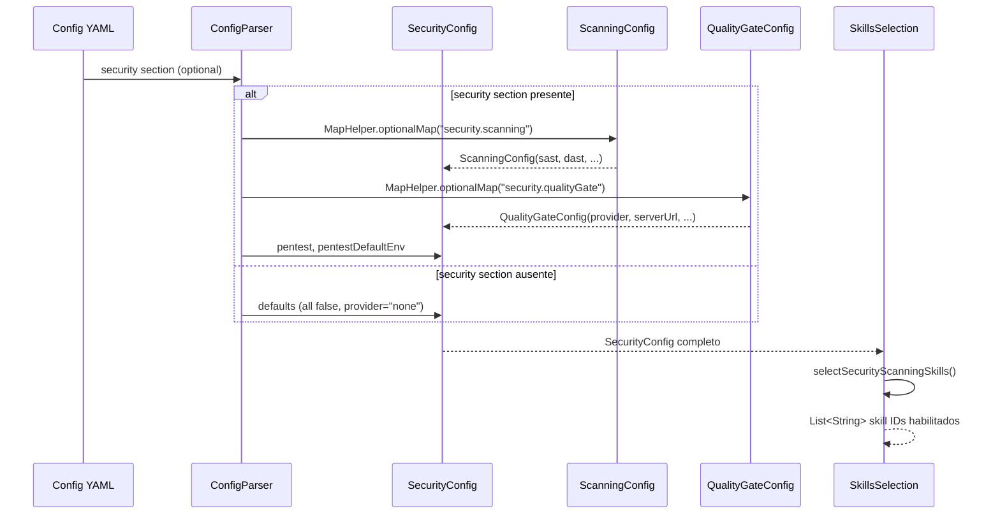

# Historia: Security Config Model Extension

**ID:** story-0022-0001
**Chave Jira:** ---
**Status:** Pendente

## 1. Dependencias

| Blocked By | Blocks |
| :--- | :--- |
| --- | story-0022-0003, story-0022-0005, story-0022-0006, story-0022-0007, story-0022-0008, story-0022-0009, story-0022-0014 |

## 2. Regras Transversais Aplicaveis

| ID | Titulo |
| :--- | :--- |
| RULE-010 | Geração Condicional por Feature Flag |
| RULE-014 | Extensibilidade de Config Model |
| RULE-015 | Backward Compatibility de YAML |

## 3. Descricao

Como **engenheiro de plataforma**, eu quero estender o SecurityConfig.java com sub-records para scanning, quality gate e pentest, garantindo que a geração condicional de skills de segurança seja habilitada por configuração YAML.

Atualmente o SecurityConfig.java possui apenas campos básicos de segurança. Esta story adiciona três sub-records: ScanningConfig (com booleans para sast, dast, secretScan, containerScan, infraScan), QualityGateConfig (provider, serverUrl, qualityGate) e campos de pentest (pentest boolean, pentestDefaultEnv string). Todos os novos campos são opcionais com defaults seguros (false/none), garantindo backward compatibility total via MapHelper.optionalMap().

A extensão do SkillsSelection com selectSecurityScanningSkills() permite que o pipeline de geração consulte quais skills de scanning devem ser incluídas no output, baseado nos flags habilitados no config YAML. Este método retorna uma lista filtrada de skill IDs correspondentes aos flags ativos.

### 3.1 Sub-record ScanningConfig

- Record imutável com 5 booleans: sast, dast, secretScan, containerScan, infraScan
- Todos defaults para false quando ausentes no YAML
- Parser via MapHelper.optionalMap("security.scanning", ...)

### 3.2 Sub-record QualityGateConfig

- Record imutável com 3 campos: provider (String, default "none"), serverUrl (String, optional), qualityGate (String, default "default")
- Parser via MapHelper.optionalMap("security.qualityGate", ...)

### 3.3 Campos de Pentest

- pentest (boolean, default false)
- pentestDefaultEnv (String, default "local")
- Adicionados diretamente ao SecurityConfig record

### 3.4 SkillsSelection.selectSecurityScanningSkills()

- Método que consulta ScanningConfig e retorna List<String> com skill IDs habilitados
- Mapping: sast -> "x-sast-scan", dast -> "x-dast-scan", secretScan -> "x-secret-scan", containerScan -> "x-container-scan", infraScan -> "x-infra-scan"
- pentest -> "x-pentest" (consultado separadamente)
- qualityGate.provider != "none" -> "x-sonar-gate" (ou skill correspondente)

## 3.5 Entrega de Valor

- **Valor Principal:** Habilita geração condicional de todas as skills de scanning, desbloqueando 20+ stories do programa de segurança
- **Metrica de Sucesso:** Config YAML com qualquer combinação de flags de scanning gera corretamente as skills correspondentes
- **Impacto no Negocio:** Projetos podem adotar incrementalmente capacidades de segurança sem all-or-nothing

## 4. Definicoes de Qualidade Locais

### DoR Local

- [ ] SecurityConfig.java atual lido e compreendido
- [ ] SkillsSelection.java atual lido e compreendido
- [ ] MapHelper.optionalMap() API documentada
- [ ] Formato YAML de config templates analisado

### DoD Local

- [ ] ScanningConfig record criado com 5 booleans e defaults false
- [ ] QualityGateConfig record criado com 3 campos e defaults seguros
- [ ] Campos pentest e pentestDefaultEnv adicionados ao SecurityConfig
- [ ] selectSecurityScanningSkills() implementado e retorna lista correta
- [ ] Config YAML vazio (sem seção security) não quebra parsing
- [ ] Testes unitários cobrindo todos os cenários de combinação de flags
- [ ] Golden files atualizados para todos os 8 profiles

### Global DoD

- **Cobertura:** >= 95% Line, >= 90% Branch
- **Testes Automatizados:** Unitarios + integracao golden file parity
- **Relatorio de Cobertura:** JaCoCo
- **Documentacao:** SKILL.md documentado
- **Persistencia:** N/A
- **Performance:** Geracao < 10s

## 5. Contratos de Dados

### 5.1 Config YAML -- Novos Campos

| Campo | Tipo | M/O | Validacoes | Exemplo |
| :--- | :--- | :--- | :--- | :--- |
| security.scanning.sast | boolean | O | default: false | `true` |
| security.scanning.dast | boolean | O | default: false | `true` |
| security.scanning.secretScan | boolean | O | default: false | `true` |
| security.scanning.containerScan | boolean | O | default: false | `true` |
| security.scanning.infraScan | boolean | O | default: false | `false` |
| security.qualityGate.provider | String | O | default: "none"; enum: none, sonarqube, sonarcloud | `"sonarqube"` |
| security.qualityGate.serverUrl | String | O | URL valida quando provider != "none" | `"https://sonar.example.com"` |
| security.qualityGate.qualityGate | String | O | default: "default" | `"Sonar way"` |
| security.pentest | boolean | O | default: false | `true` |
| security.pentestDefaultEnv | String | O | default: "local"; enum: local, dev, homolog | `"local"` |

### 5.2 ScanningConfig Record

| Campo | Tipo | M/O | Validacoes | Exemplo |
| :--- | :--- | :--- | :--- | :--- |
| sast | boolean | O | default: false | `false` |
| dast | boolean | O | default: false | `false` |
| secretScan | boolean | O | default: false | `true` |
| containerScan | boolean | O | default: false | `true` |
| infraScan | boolean | O | default: false | `false` |

### 5.3 QualityGateConfig Record

| Campo | Tipo | M/O | Validacoes | Exemplo |
| :--- | :--- | :--- | :--- | :--- |
| provider | String | O | default: "none" | `"sonarqube"` |
| serverUrl | String | O | URL valida ou vazio | `"https://sonar.example.com"` |
| qualityGate | String | O | default: "default" | `"Sonar way"` |

## 6. Diagramas

### 6.1 Fluxo de parsing do Config YAML



## 7. Criterios de Aceite (Gherkin)

```gherkin
Cenario: Config YAML vazio mantem backward compatibility
  DADO que o arquivo de configuracao YAML nao possui secao "security"
  QUANDO o ConfigParser processa o arquivo
  ENTAO SecurityConfig e criado com todos os defaults
  E ScanningConfig tem todos os booleans false
  E QualityGateConfig tem provider "none"
  E pentest e false

Cenario: Flag SAST habilitado gera skill x-sast-scan
  DADO que o config YAML possui security.scanning.sast = true
  E todos os outros flags de scanning sao false
  QUANDO selectSecurityScanningSkills() e invocado
  ENTAO a lista retornada contem exatamente "x-sast-scan"
  E a lista nao contem "x-dast-scan", "x-secret-scan", "x-container-scan", "x-infra-scan"

Cenario: Todos os flags de scanning habilitados geram todas as skills
  DADO que o config YAML possui todos os 5 flags de scanning = true
  E pentest = true
  E qualityGate.provider = "sonarqube"
  QUANDO selectSecurityScanningSkills() e invocado
  ENTAO a lista retornada contem "x-sast-scan", "x-dast-scan", "x-secret-scan", "x-container-scan", "x-infra-scan"
  E a lista tambem contem "x-pentest"
  E a lista tambem contem "x-sonar-gate"

Cenario: Flag pentest habilitado gera skill x-pentest
  DADO que o config YAML possui security.pentest = true
  E pentestDefaultEnv = "local"
  QUANDO selectSecurityScanningSkills() e invocado
  ENTAO a lista retornada contem "x-pentest"
  E o pentestDefaultEnv e "local"

Cenario: QualityGate com provider sonarqube gera skill x-sonar-gate
  DADO que o config YAML possui security.qualityGate.provider = "sonarqube"
  E security.qualityGate.serverUrl = "https://sonar.example.com"
  E security.qualityGate.qualityGate = "Sonar way"
  QUANDO selectSecurityScanningSkills() e invocado
  ENTAO a lista retornada contem "x-sonar-gate"
  E QualityGateConfig.serverUrl e "https://sonar.example.com"
  E QualityGateConfig.qualityGate e "Sonar way"
```

## 8. Sub-tarefas

- [ ] [Dev] Criar sub-record ScanningConfig com 5 booleans e defaults false
- [ ] [Dev] Criar sub-record QualityGateConfig com 3 campos e defaults seguros
- [ ] [Dev] Adicionar campos pentest e pentestDefaultEnv ao SecurityConfig
- [ ] [Dev] Implementar parsing via MapHelper.optionalMap() para novos sub-records
- [ ] [Dev] Implementar selectSecurityScanningSkills() no SkillsSelection
- [ ] [Dev] Garantir backward compatibility com configs existentes sem secao security
- [ ] [Test] Testes unitarios para cada combinacao de flags (all false, all true, mixed)
- [ ] [Test] Testes unitarios para QualityGateConfig com diferentes providers
- [ ] [Test] Smoke/E2E: Config YAML sem secao security processa sem erros em todos os 8 profiles
- [ ] [Test] Golden file parity para profiles com security habilitado
- [ ] [Doc] Documentar novos campos no config YAML template
