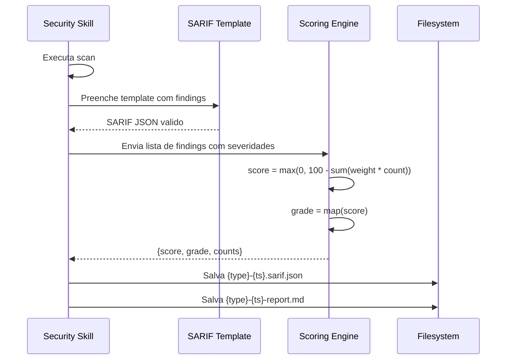

# Historia: Security Report Infrastructure (SARIF + Scoring)

**ID:** story-0022-0002
**Chave Jira:** ---
**Status:** Pendente

## 1. Dependencias

| Blocked By | Blocks |
| :--- | :--- |
| --- | story-0022-0005, story-0022-0006, story-0022-0007, story-0022-0008, story-0022-0009, story-0022-0010, story-0022-0011, story-0022-0012, story-0022-0013, story-0022-0014, story-0022-0015, story-0022-0020 |

## 2. Regras Transversais Aplicaveis

| ID | Titulo |
| :--- | :--- |
| RULE-003 | Formato de Output Padronizado |
| RULE-005 | Qualidade de Relatorio |
| RULE-001 | Isolamento de Contexto de Subagents |

## 3. Descricao

Como **engenheiro de seguranca**, eu quero ter templates SARIF e um modelo de scoring padronizado, garantindo que todas as skills de seguranca produzam output consistente e integravel com CI/CD.

O formato SARIF (Static Analysis Results Interchange Format) versao 2.1.0 e o padrao da industria para resultados de analise estatica, suportado nativamente por GitHub Advanced Security, Azure DevOps, e diversas ferramentas de CI. Esta story cria o template de referencia que todas as skills de scanning usarao para produzir seus resultados.

O modelo de scoring define uma escala de 0-100 com grades A-F, permitindo que equipes acompanhem a postura de seguranca ao longo do tempo. O score e calculado com base na severidade e quantidade de findings, com pesos configuráveis por severidade (CRITICAL=10, HIGH=5, MEDIUM=2, LOW=1, INFO=0).

### 3.1 Template SARIF 2.1.0

- Arquivo: security/references/sarif-template.md
- Schema SARIF 2.1.0 com campos obrigatórios: $schema, version, runs[].tool, runs[].results
- Cada result: ruleId, level (error/warning/note/none), message, locations, properties
- Properties customizadas: owasp-category, cvss-score, cwe-id, fix-recommendation

### 3.2 Security Scoring Model

- Arquivo: security/references/security-scoring.md
- Formula: score = max(0, 100 - sum(severity_weight * count))
- Grades: A (90-100), B (80-89), C (70-79), D (60-69), F (0-59)
- Score nunca negativo (floor em 0)
- Zero findings = score 100 (grade A)

### 3.3 Convencao de Output

- Diretorio: results/security/
- Naming pattern: {scan-type}-{timestamp}.sarif.json e {scan-type}-{timestamp}-report.md
- Markdown report com summary table, findings detail, score, grade, trend (se historico disponivel)

## 3.5 Entrega de Valor

- **Valor Principal:** Formato padronizado de output para todas as skills de seguranca, permitindo integracao CI e trend tracking
- **Metrica de Sucesso:** Todas as skills de scanning geram SARIF valido e score consistente
- **Impacto no Negocio:** Equipes conseguem integrar resultados de seguranca no pipeline CI/CD sem configuracao adicional

## 4. Definicoes de Qualidade Locais

### DoR Local

- [ ] SARIF 2.1.0 specification lida e compreendida
- [ ] Formato de output das skills existentes analisado
- [ ] Convencoes de naming de arquivos do projeto documentadas

### DoD Local

- [ ] Template SARIF 2.1.0 criado com todos os campos obrigatorios
- [ ] Security scoring model documentado com formula e grades
- [ ] Convencao de output results/security/ documentada
- [ ] Exemplos de SARIF preenchido para cada severidade
- [ ] Testes de validacao do template SARIF
- [ ] Testes de calculo de scoring para cenarios edge

### Global DoD

- **Cobertura:** >= 95% Line, >= 90% Branch
- **Testes Automatizados:** Unitarios + integracao golden file parity
- **Relatorio de Cobertura:** JaCoCo
- **Documentacao:** SKILL.md documentado
- **Persistencia:** N/A
- **Performance:** Geracao < 10s

## 5. Contratos de Dados

### 5.1 SARIF Result Entry

| Campo | Tipo | M/O | Validacoes | Exemplo |
| :--- | :--- | :--- | :--- | :--- |
| ruleId | String | M | Non-empty, pattern: SCAN-NNN | `"SAST-001"` |
| level | String | M | enum: error, warning, note, none | `"error"` |
| message.text | String | M | Non-empty, descricao da finding | `"SQL Injection detected"` |
| locations[].physicalLocation.artifactLocation.uri | String | M | Relative path | `"src/main/java/App.java"` |
| locations[].physicalLocation.region.startLine | int | M | > 0 | `42` |
| properties.owasp-category | String | O | Pattern: A01-A10 | `"A03"` |
| properties.cvss-score | float | O | 0.0-10.0 | `7.5` |
| properties.cwe-id | String | O | Pattern: CWE-NNN | `"CWE-89"` |
| properties.fix-recommendation | String | O | Non-empty | `"Use parameterized queries"` |

### 5.2 Security Score

| Campo | Tipo | M/O | Validacoes | Exemplo |
| :--- | :--- | :--- | :--- | :--- |
| score | int | M | 0-100 | `85` |
| grade | String | M | enum: A, B, C, D, F | `"B"` |
| totalFindings | int | M | >= 0 | `12` |
| criticalCount | int | M | >= 0 | `0` |
| highCount | int | M | >= 0 | `2` |
| mediumCount | int | M | >= 0 | `5` |
| lowCount | int | M | >= 0 | `5` |
| infoCount | int | M | >= 0 | `0` |

### 5.3 Severity Weights

| Severidade | Peso | SARIF Level |
| :--- | :--- | :--- |
| CRITICAL | 10 | error |
| HIGH | 5 | error |
| MEDIUM | 2 | warning |
| LOW | 1 | note |
| INFO | 0 | none |

## 6. Diagramas

### 6.1 Fluxo de geracao de report



## 7. Criterios de Aceite (Gherkin)

```gherkin
Cenario: Template SARIF gera JSON valido contra schema 2.1.0
  DADO que o template SARIF foi preenchido com uma finding de exemplo
  QUANDO o JSON resultante e validado contra o schema SARIF 2.1.0
  ENTAO a validacao passa sem erros
  E o campo "$schema" aponta para o schema SARIF 2.1.0 oficial

Cenario: Scoring calcula corretamente com findings mistas
  DADO que existem 1 finding CRITICAL, 2 HIGH e 3 MEDIUM
  QUANDO o scoring engine calcula o score
  ENTAO o score e max(0, 100 - (1*10 + 2*5 + 3*2)) = 74
  E a grade e "C"

Cenario: Score nunca fica negativo
  DADO que existem 20 findings CRITICAL
  QUANDO o scoring engine calcula o score
  ENTAO o score e 0 (nao negativo)
  E a grade e "F"

Cenario: Zero findings resulta em score maximo
  DADO que nao existem findings de nenhuma severidade
  QUANDO o scoring engine calcula o score
  ENTAO o score e 100
  E a grade e "A"
  E totalFindings e 0
```

## 8. Sub-tarefas

- [ ] [Dev] Criar security/references/sarif-template.md com template SARIF 2.1.0
- [ ] [Dev] Criar security/references/security-scoring.md com formula e grades
- [ ] [Dev] Documentar convencao de output results/security/ com naming pattern
- [ ] [Dev] Criar exemplos de SARIF preenchido para cada nivel de severidade
- [ ] [Test] Teste unitario de validacao do template SARIF contra schema 2.1.0
- [ ] [Test] Testes unitarios do scoring engine: mixed, all-critical, zero findings, boundary (score=0)
- [ ] [Test] Smoke/E2E: Gerar report completo (SARIF + Markdown) a partir de findings mockadas e validar output
- [ ] [Doc] Documentar formato de output e integracao CI no SKILL.md
