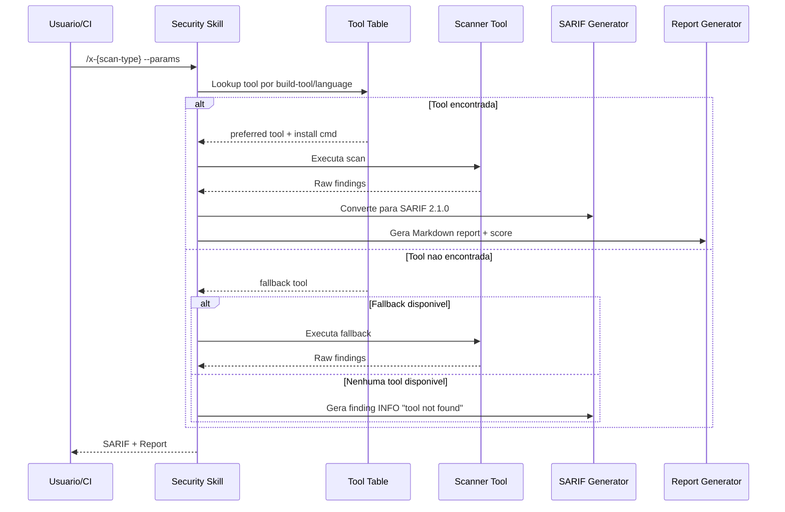

# Historia: Security Skill Template + CI Integration Pattern

**ID:** story-0022-0003
**Chave Jira:** ---
**Status:** Pendente

## 1. Dependencias

| Blocked By | Blocks |
| :--- | :--- |
| story-0022-0001 | story-0022-0005, story-0022-0006, story-0022-0007, story-0022-0008, story-0022-0009, story-0022-0010 |

## 2. Regras Transversais Aplicaveis

| ID | Titulo |
| :--- | :--- |
| RULE-002 | Estrutura Padrao de SKILL.md |
| RULE-009 | Backward Compatibility |
| RULE-015 | Backward Compatibility de YAML |

## 3. Descricao

Como **engenheiro de plataforma**, eu quero ter um template padrao para skills de seguranca executaveis e snippets de CI, garantindo que todas as 13+ skills de scanning sigam a mesma estrutura e possam ser integradas em pipelines sem configuracao manual.

A proliferacao de skills de seguranca (SAST, DAST, secret scan, container scan, infra scan, dependency audit, OWASP verification, pentest, etc.) cria risco de divergencia de formato e convencoes. Este template define a estrutura canonica que cada skill DEVE seguir, incluindo: header padrao, tool-selection table, parametros CLI, output format, error handling, e CI snippets para os 3 provedores suportados.

O template tambem define a convencao de tool-selection table, onde cada skill lista as ferramentas preferidas e fallback por build tool/linguagem, permitindo que o usuario saiba exatamente qual ferramenta sera usada em seu contexto.

### 3.1 Estrutura padrao do SKILL.md para skills de seguranca

- Header: name, description, version, category: security
- Section "Tool Selection": tabela build-tool -> preferred-tool / fallback-tool
- Section "Parameters": tabela com --param, tipo, default, descricao
- Section "Output Format": referencia ao SARIF template e scoring model
- Section "Error Handling": convencoes para tool-not-found, scan-timeout, partial-results
- Section "CI Integration": snippets para GH Actions, GitLab CI, Azure DevOps

### 3.2 Tool-selection table format

- Colunas: Build Tool | Language | Preferred Tool | Fallback Tool | Install Command
- Cada skill preenche esta tabela com suas ferramentas especificas
- Fallback DEVE ser Semgrep ou ferramenta universal quando possivel

### 3.3 CI Snippets

- GitHub Actions: workflow step com setup, scan, upload SARIF
- GitLab CI: stage com script, artifacts, reports
- Azure DevOps: task com inputs, publish results
- Todos os snippets usam variaveis de ambiente para configuracao

### 3.4 Error Handling Conventions

- Tool not found: gera finding INFO com mensagem de instalacao
- Scan timeout: gera report parcial com warning
- Tool crash: captura stderr, gera finding ERROR com contexto
- Zero findings: sucesso com score 100

## 3.5 Entrega de Valor

- **Valor Principal:** Template base que garante consistencia entre 13+ skills de seguranca, reduzindo divergencia de formato
- **Metrica de Sucesso:** Todas as skills de scanning seguem 100% do template sem desvios nao documentados
- **Impacto no Negocio:** Onboarding de novas skills de seguranca leva minutos em vez de horas, com formato pre-definido

## 4. Definicoes de Qualidade Locais

### DoR Local

- [ ] Formato atual de SKILL.md analisado e documentado
- [ ] CI patterns para GH Actions, GitLab CI, Azure DevOps pesquisados
- [ ] SARIF template (story-0022-0002) disponivel ou em paralelo

### DoD Local

- [ ] Template security-skill-template.md criado com todas as secoes obrigatorias
- [ ] Tool-selection table format definido e documentado
- [ ] CI snippets para 3 provedores (GH Actions, GitLab CI, Azure DevOps) criados
- [ ] Error handling conventions documentadas com exemplos
- [ ] Template validado: todas as secoes obrigatorias presentes
- [ ] Pelo menos 1 skill de exemplo gerada a partir do template para validacao

### Global DoD

- **Cobertura:** >= 95% Line, >= 90% Branch
- **Testes Automatizados:** Unitarios + integracao golden file parity
- **Relatorio de Cobertura:** JaCoCo
- **Documentacao:** SKILL.md documentado
- **Persistencia:** N/A
- **Performance:** Geracao < 10s

## 5. Contratos de Dados

### 5.1 Tool Selection Table

| Campo | Tipo | M/O | Validacoes | Exemplo |
| :--- | :--- | :--- | :--- | :--- |
| buildTool | String | M | Non-empty | `"maven"` |
| language | String | M | Non-empty | `"java"` |
| preferredTool | String | M | Non-empty, nome da ferramenta | `"SpotBugs + FindSecBugs"` |
| fallbackTool | String | M | Non-empty | `"Semgrep"` |
| installCommand | String | M | Comando valido de instalacao | `"mvn dependency:resolve"` |

### 5.2 CI Snippet Structure

| Campo | Tipo | M/O | Validacoes | Exemplo |
| :--- | :--- | :--- | :--- | :--- |
| provider | String | M | enum: github-actions, gitlab-ci, azure-devops | `"github-actions"` |
| yamlSnippet | String | M | YAML valido para o provider | `"- uses: actions/checkout@v4"` |
| requiredSecrets | List<String> | O | Nomes de secrets necessarios | `["SONAR_TOKEN"]` |
| artifacts | List<String> | O | Paths de artefatos gerados | `["results/security/*.sarif.json"]` |

### 5.3 Error Handling Convention

| Cenario | Severidade | Acao | Output |
| :--- | :--- | :--- | :--- |
| Tool not found | INFO | Gera finding com install instructions | SARIF com 1 finding INFO |
| Scan timeout | WARNING | Report parcial + warning | SARIF parcial + warning no report |
| Tool crash | ERROR | Captura stderr, gera finding | SARIF com 1 finding ERROR |
| Zero findings | SUCCESS | Score 100, grade A | SARIF vazio + report clean |

## 6. Diagramas

### 6.1 Fluxo de execucao de uma security skill



## 7. Criterios de Aceite (Gherkin)

```gherkin
Cenario: Template possui todas as secoes obrigatorias
  DADO que o template security-skill-template.md foi criado
  QUANDO as secoes sao verificadas
  ENTAO existem as secoes "Tool Selection", "Parameters", "Output Format", "Error Handling", "CI Integration"
  E cada secao possui descricao e exemplo

Cenario: Tool-selection table tem formato valido
  DADO que uma skill de seguranca usa o template
  QUANDO a tool-selection table e preenchida
  ENTAO a tabela contem colunas "Build Tool", "Language", "Preferred Tool", "Fallback Tool", "Install Command"
  E cada linha tem todos os campos preenchidos

Cenario: CI snippet para GitHub Actions gera YAML valido
  DADO que o snippet de GitHub Actions foi preenchido com variaveis de exemplo
  QUANDO o YAML resultante e validado
  ENTAO o YAML e sintaticamente valido
  E contem steps de checkout, setup, scan, e upload SARIF

Cenario: Error handling para tool-not-found gera finding INFO
  DADO que a ferramenta preferida nao esta instalada
  E a ferramenta fallback tambem nao esta disponivel
  QUANDO a skill e executada
  ENTAO o output contem 1 finding com level "none" (INFO)
  E a mensagem contem instrucoes de instalacao
  E o score e 100 (nenhuma vulnerabilidade real encontrada)
```

## 8. Sub-tarefas

- [ ] [Dev] Criar security/references/security-skill-template.md com estrutura padrao
- [ ] [Dev] Definir formato da tool-selection table com colunas e convencoes
- [ ] [Dev] Criar CI snippets para GitHub Actions
- [ ] [Dev] Criar CI snippets para GitLab CI
- [ ] [Dev] Criar CI snippets para Azure DevOps
- [ ] [Dev] Documentar error handling conventions com exemplos
- [ ] [Test] Validar que template possui todas as secoes obrigatorias
- [ ] [Test] Validar que CI snippet GH Actions gera YAML sintaticamente valido
- [ ] [Test] Smoke/E2E: Gerar uma skill de exemplo a partir do template e verificar completude
- [ ] [Doc] Documentar uso do template no SKILL.md de referencia
