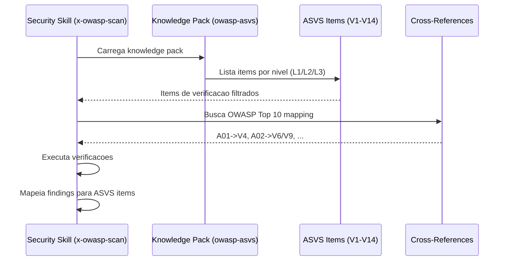

# Historia: OWASP ASVS Reference Knowledge Pack

**ID:** story-0022-0004
**Chave Jira:** ---
**Status:** Pendente

## 1. Dependencias

| Blocked By | Blocks |
| :--- | :--- |
| --- | story-0022-0010, story-0022-0012, story-0022-0013, story-0022-0024, story-0022-0021 |

## 2. Regras Transversais Aplicaveis

| ID | Titulo |
| :--- | :--- |
| RULE-013 | Referencia a Standards Externos |
| RULE-007 | Rastreabilidade de Compliance |

## 3. Descricao

Como **engenheiro de seguranca**, eu quero ter um knowledge pack completo com o OWASP ASVS (Application Security Verification Standard) e cross-references para outros frameworks, garantindo que verificacoes de seguranca sejam rastreáveis a standards reconhecidos pela industria.

O OWASP ASVS define 14 capitulos de verificacao (V1-V14) com tres niveis de profundidade (L1: oportunistico, L2: padrao, L3: avancado). Este knowledge pack serve como base de referencia para skills como x-owasp-scan, x-pentest, e x-compliance-check, permitindo que cada verificacao aponte para o item ASVS especifico que valida.

As cross-reference tables mapeiam entre frameworks: OWASP Top 10 (A01-A10) para capitulos ASVS, CIS Controls para ASVS, NIST CSF (5 funcoes: Identify, Protect, Detect, Respond, Recover) para ASVS, e SANS Top 25 para ASVS. Esses mapeamentos permitem que equipes com diferentes frameworks de compliance usem o mesmo conjunto de verificacoes.

### 3.1 ASVS L1/L2/L3 Overview

- Descricao de cada nivel com criterios de aplicabilidade
- L1: minimo para qualquer aplicacao (CWEs mais criticos)
- L2: padrao para a maioria das aplicacoes (maioria das CWEs)
- L3: para aplicacoes criticas (defesa em profundidade)

### 3.2 Cross-Reference Tables

- OWASP Top 10 -> ASVS: A01 -> V4 (Access Control), A02 -> V6/V9, A03 -> V5, etc.
- CIS Controls -> ASVS: mapeamento dos 18 controls relevantes
- NIST CSF -> ASVS: 5 funcoes (ID, PR, DE, RS, RC) -> capitulos ASVS
- SANS Top 25 -> ASVS: mapeamento dos 25 CWEs mais perigosos

### 3.3 Capitulos ASVS (V1-V14)

- V1: Architecture, Design and Threat Modeling
- V2: Authentication
- V3: Session Management
- V4: Access Control
- V5: Validation, Sanitization and Encoding
- V6: Stored Cryptography
- V7: Error Handling and Logging
- V8: Data Protection
- V9: Communication
- V10: Malicious Code
- V11: Business Logic
- V12: Files and Resources
- V13: API and Web Service
- V14: Configuration

### 3.4 Verification Items

- Cada capitulo contem items de verificacao com ID (V{chapter}.{section}.{item})
- Cada item tem: descricao, nivel ASVS (L1/L2/L3), CWE associado
- Items sao a unidade atomica de verificacao usada pelas skills

## 3.5 Entrega de Valor

- **Valor Principal:** Base de verificacao OWASP ASVS L1/L2/L3 com cross-refs, habilitando scans padronizados e rastreabilidade de compliance
- **Metrica de Sucesso:** 100% dos 14 capitulos ASVS cobertos com items de verificacao e cross-references
- **Impacto no Negocio:** Equipes podem demonstrar compliance com OWASP, NIST, CIS usando um unico conjunto de verificacoes

## 4. Definicoes de Qualidade Locais

### DoR Local

- [ ] OWASP ASVS 4.0.3 specification lida
- [ ] OWASP Top 10 2021 mapeamento compreendido
- [ ] NIST CSF funcoes documentadas
- [ ] CIS Controls v8 lista disponivel

### DoD Local

- [ ] Knowledge pack owasp-asvs/SKILL.md criado com overview L1/L2/L3
- [ ] Cross-reference table OWASP Top 10 -> ASVS completa
- [ ] Cross-reference table CIS Controls -> ASVS completa
- [ ] Cross-reference table NIST CSF -> ASVS completa
- [ ] Cross-reference table SANS Top 25 -> ASVS completa
- [ ] Todos os 14 capitulos (V1-V14) com items de verificacao
- [ ] Cada item tem ID, descricao, nivel ASVS, CWE associado
- [ ] Testes de validacao das cross-references

### Global DoD

- **Cobertura:** >= 95% Line, >= 90% Branch
- **Testes Automatizados:** Unitarios + integracao golden file parity
- **Relatorio de Cobertura:** JaCoCo
- **Documentacao:** SKILL.md documentado
- **Persistencia:** N/A
- **Performance:** Geracao < 10s

## 5. Contratos de Dados

### 5.1 ASVS Verification Item

| Campo | Tipo | M/O | Validacoes | Exemplo |
| :--- | :--- | :--- | :--- | :--- |
| id | String | M | Pattern: V{1-14}.{1-99}.{1-99} | `"V4.1.1"` |
| description | String | M | Non-empty | `"Verify that the application enforces access control rules..."` |
| level | String | M | enum: L1, L2, L3 | `"L1"` |
| cwe | String | O | Pattern: CWE-{NNN} | `"CWE-285"` |
| chapter | String | M | V1-V14 | `"V4"` |
| chapterName | String | M | Non-empty | `"Access Control"` |

### 5.2 Cross-Reference Entry

| Campo | Tipo | M/O | Validacoes | Exemplo |
| :--- | :--- | :--- | :--- | :--- |
| sourceFramework | String | M | enum: owasp-top10, cis, nist-csf, sans-top25 | `"owasp-top10"` |
| sourceId | String | M | Non-empty | `"A01"` |
| sourceName | String | M | Non-empty | `"Broken Access Control"` |
| targetAsvsChapters | List<String> | M | Non-empty, V1-V14 | `["V4"]` |
| notes | String | O | Contexto adicional | `"Primary mapping"` |

### 5.3 OWASP Top 10 -> ASVS Mapping

| OWASP Top 10 | ASVS Chapter(s) | Descricao |
| :--- | :--- | :--- |
| A01: Broken Access Control | V4 | Access Control |
| A02: Cryptographic Failures | V6, V9 | Stored Cryptography, Communication |
| A03: Injection | V5 | Validation, Sanitization and Encoding |
| A04: Insecure Design | V1 | Architecture, Design and Threat Modeling |
| A05: Security Misconfiguration | V14 | Configuration |
| A06: Vulnerable Components | N/A (delegado a x-dependency-audit) | Componentes vulneraveis |
| A07: Auth Failures | V2, V3 | Authentication, Session Management |
| A08: Software/Data Integrity | V10 | Malicious Code |
| A09: Logging Failures | V7 | Error Handling and Logging |
| A10: SSRF | V5, V13 | Validation, API and Web Service |

## 6. Diagramas

### 6.1 Estrutura do Knowledge Pack



## 7. Criterios de Aceite (Gherkin)

```gherkin
Cenario: Capitulo V4 nao possui items de verificacao
  DADO que o knowledge pack owasp-asvs esta vazio
  QUANDO o capitulo V4 (Access Control) e consultado
  ENTAO o resultado e uma lista vazia
  E nenhum erro e gerado

Cenario: A01 Broken Access Control mapeia para V4
  DADO que a cross-reference table OWASP Top 10 -> ASVS esta carregada
  QUANDO A01 (Broken Access Control) e consultado
  ENTAO o resultado contem V4 (Access Control)
  E o mapeamento possui descricao e notes

Cenario: Todos os 14 capitulos ASVS estao presentes
  DADO que o knowledge pack owasp-asvs foi gerado
  QUANDO todos os capitulos sao listados
  ENTAO existem exatamente 14 capitulos (V1 a V14)
  E cada capitulo possui nome, descricao e pelo menos 1 item de verificacao

Cenario: Cada item de verificacao possui nivel ASVS
  DADO que o capitulo V2 (Authentication) esta carregado
  QUANDO os items de verificacao sao listados
  ENTAO cada item possui um nivel ASVS (L1, L2 ou L3)
  E items L1 sao subconjunto de items L2
  E items L2 sao subconjunto de items L3

Cenario: NIST CSF 5 funcoes mapeadas para ASVS
  DADO que a cross-reference table NIST CSF -> ASVS esta carregada
  QUANDO todas as funcoes sao listadas
  ENTAO existem exatamente 5 funcoes: Identify, Protect, Detect, Respond, Recover
  E cada funcao mapeia para pelo menos 1 capitulo ASVS
```

## 8. Sub-tarefas

- [ ] [Dev] Criar knowledge-packs/owasp-asvs/SKILL.md com overview L1/L2/L3
- [ ] [Dev] Criar cross-reference table OWASP Top 10 -> ASVS (A01-A10)
- [ ] [Dev] Criar cross-reference table CIS Controls -> ASVS
- [ ] [Dev] Criar cross-reference table NIST CSF -> ASVS (5 funcoes)
- [ ] [Dev] Criar cross-reference table SANS Top 25 -> ASVS
- [ ] [Dev] Documentar verification items para V1-V14 com ID, descricao, nivel, CWE
- [ ] [Test] Validar que todos os 14 capitulos (V1-V14) estao presentes
- [ ] [Test] Validar que cross-references sao bidirecionais e consistentes
- [ ] [Test] Smoke/E2E: Carregar knowledge pack e verificar que uma skill consegue resolver OWASP -> ASVS
- [ ] [Doc] Documentar uso do knowledge pack por skills de seguranca
