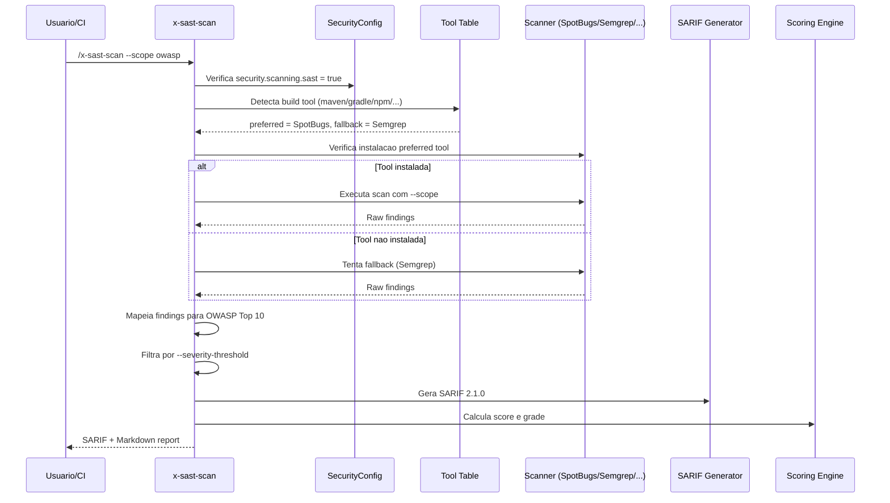

# Historia: SAST Scanner (x-sast-scan)

**ID:** story-0022-0005
**Chave Jira:** ---
**Status:** Pendente

## 1. Dependencias

| Blocked By | Blocks |
| :--- | :--- |
| story-0022-0001, story-0022-0002, story-0022-0003 | story-0022-0011, story-0022-0018, story-0022-0019, story-0022-0020, story-0022-0023 |

## 2. Regras Transversais Aplicaveis

| ID | Titulo |
| :--- | :--- |
| RULE-001 | Isolamento de Contexto de Subagents |
| RULE-002 | Estrutura Padrao de SKILL.md |
| RULE-003 | Formato de Output Padronizado |
| RULE-005 | Qualidade de Relatorio |
| RULE-007 | Rastreabilidade de Compliance |
| RULE-008 | Severidade de Findings |
| RULE-009 | Backward Compatibility |
| RULE-010 | Geracao Condicional por Feature Flag |

## 3. Descricao

Como **engenheiro de seguranca**, eu quero uma skill de Static Application Security Testing (SAST) que detecte vulnerabilidades no codigo-fonte automaticamente, garantindo que problemas de seguranca sejam identificados antes do deploy.

SAST analisa o codigo-fonte sem executa-lo, identificando padroes de vulnerabilidade como SQL injection, XSS, path traversal, insecure deserialization, e outros. A skill seleciona automaticamente a ferramenta adequada baseada no build tool e linguagem do projeto, com fallback para Semgrep (ferramenta universal que suporta 30+ linguagens).

A skill suporta tres escopos de scan: "all" (analise completa), "owasp" (focado nos OWASP Top 10), e "custom-rules" (regras personalizadas do projeto). Findings sao mapeados para categorias OWASP Top 10 e outputados em formato SARIF + Markdown com scoring.

### 3.1 Tool Selection por Build Tool/Linguagem

- maven -> SpotBugs + FindSecBugs (preferido) / Semgrep (fallback)
- gradle -> SpotBugs + FindSecBugs (preferido) / Semgrep (fallback)
- npm -> ESLint security plugin (preferido) / Semgrep (fallback)
- pip -> Bandit (preferido) / Semgrep (fallback)
- go -> gosec (preferido) / Semgrep (fallback)
- cargo -> cargo-audit (preferido) / Semgrep (fallback)

### 3.2 Parametros CLI

- `--scope`: all | owasp | custom-rules (default: all)
- `--fix`: auto | suggest | report-only (default: report-only)
- `--severity-threshold`: CRITICAL | HIGH | MEDIUM | LOW | INFO (default: LOW)
- `--exclude`: lista de paths/patterns a excluir do scan

### 3.3 Mapping OWASP Top 10

- Cada finding deve ser mapeado para a categoria OWASP correspondente (A01-A10)
- Findings sem mapeamento OWASP recebem categoria "UNCLASSIFIED"
- O report agrupa findings por categoria OWASP para facilitar priorizacao

### 3.4 Output Format

- SARIF 2.1.0 JSON (conforme template story-0022-0002)
- Markdown report com summary, findings agrupados por severidade e OWASP, score e grade
- Ambos salvos em results/security/ com naming pattern definido

## 3.5 Entrega de Valor

- **Valor Principal:** Deteccao automatica de vulnerabilidades no codigo-fonte antes do deploy
- **Metrica de Sucesso:** Identificacao de pelo menos 80% das vulnerabilidades conhecidas (OWASP Top 10) em projetos de teste
- **Impacto no Negocio:** Reducao de vulnerabilidades em producao e custo de remediacao (shift-left security)

## 4. Definicoes de Qualidade Locais

### DoR Local

- [ ] Security Skill Template (story-0022-0003) disponivel
- [ ] SARIF template (story-0022-0002) disponivel
- [ ] SecurityConfig.scanning.sast flag implementado (story-0022-0001)
- [ ] Tool selection para pelo menos 3 linguagens documentada

### DoD Local

- [ ] SKILL.md criado seguindo security-skill-template
- [ ] Tool selection table completa para 6 build tools
- [ ] Parametros CLI documentados com defaults e validacoes
- [ ] Output SARIF valido contra schema 2.1.0
- [ ] Findings mapeados para OWASP Top 10
- [ ] Scoring calculado conforme security-scoring.md
- [ ] Error handling para tool-not-found implementado
- [ ] Testes para cada linguagem/build-tool

### Global DoD

- **Cobertura:** >= 95% Line, >= 90% Branch
- **Testes Automatizados:** Unitarios + integracao golden file parity
- **Relatorio de Cobertura:** JaCoCo
- **Documentacao:** SKILL.md documentado
- **Persistencia:** N/A
- **Performance:** Geracao < 10s

## 5. Contratos de Dados

### 5.1 Tool Selection Table

| Build Tool | Language | Preferred Tool | Fallback Tool | Install Command |
| :--- | :--- | :--- | :--- | :--- |
| maven | java | SpotBugs + FindSecBugs | Semgrep | `mvn com.github.spotbugs:spotbugs-maven-plugin:check` |
| gradle | java/kotlin | SpotBugs + FindSecBugs | Semgrep | `gradle spotbugsMain` |
| npm | javascript/typescript | ESLint security plugin | Semgrep | `npx eslint --plugin security` |
| pip | python | Bandit | Semgrep | `pip install bandit && bandit -r .` |
| go | go | gosec | Semgrep | `go install github.com/securego/gosec/v2/cmd/gosec@latest` |
| cargo | rust | cargo-audit | Semgrep | `cargo install cargo-audit && cargo audit` |

### 5.2 Parametros CLI

| Parametro | Tipo | M/O | Default | Validacoes | Exemplo |
| :--- | :--- | :--- | :--- | :--- | :--- |
| --scope | String | O | all | enum: all, owasp, custom-rules | `--scope owasp` |
| --fix | String | O | report-only | enum: auto, suggest, report-only | `--fix suggest` |
| --severity-threshold | String | O | LOW | enum: CRITICAL, HIGH, MEDIUM, LOW, INFO | `--severity-threshold HIGH` |
| --exclude | List<String> | O | [] | glob patterns validos | `--exclude "test/**,docs/**"` |

### 5.3 SAST Finding

| Campo | Tipo | M/O | Validacoes | Exemplo |
| :--- | :--- | :--- | :--- | :--- |
| ruleId | String | M | Pattern: SAST-NNN | `"SAST-001"` |
| severity | String | M | enum: CRITICAL, HIGH, MEDIUM, LOW, INFO | `"HIGH"` |
| owaspCategory | String | O | Pattern: A01-A10 or UNCLASSIFIED | `"A03"` |
| cweId | String | O | Pattern: CWE-NNN | `"CWE-89"` |
| file | String | M | Relative path | `"src/main/java/App.java"` |
| line | int | M | > 0 | `42` |
| message | String | M | Non-empty | `"Potential SQL injection"` |
| fixRecommendation | String | O | Non-empty | `"Use parameterized queries"` |

## 6. Diagramas

### 6.1 Fluxo de execucao do SAST Scanner



## 7. Criterios de Aceite (Gherkin)

```gherkin
Cenario: Nenhuma ferramenta SAST disponivel gera finding INFO
  DADO que o projeto usa build tool "maven"
  E nem SpotBugs nem Semgrep estao instalados
  QUANDO /x-sast-scan e executado
  ENTAO o output contem 1 finding com severidade INFO
  E a mensagem contem instrucoes de instalacao para SpotBugs
  E o score e 100

Cenario: Java Maven executa SpotBugs como ferramenta preferida
  DADO que o projeto usa build tool "maven" com linguagem "java"
  E SpotBugs + FindSecBugs estao instalados
  QUANDO /x-sast-scan --scope all e executado
  ENTAO SpotBugs e a ferramenta utilizada (nao Semgrep)
  E o output SARIF contem tool.driver.name = "SpotBugs"
  E findings sao mapeados para categorias OWASP

Cenario: Fallback para Semgrep quando ferramenta preferida ausente
  DADO que o projeto usa build tool "npm" com linguagem "typescript"
  E ESLint security plugin NAO esta instalado
  MAS Semgrep esta instalado
  QUANDO /x-sast-scan e executado
  ENTAO Semgrep e a ferramenta utilizada como fallback
  E o output SARIF contem tool.driver.name = "Semgrep"

Cenario: Severity threshold filtra findings abaixo do limiar
  DADO que o scan encontrou 2 findings CRITICAL, 3 HIGH, 5 MEDIUM e 10 LOW
  E o parametro --severity-threshold = HIGH
  QUANDO o report e gerado
  ENTAO apenas findings CRITICAL e HIGH aparecem no report (5 findings)
  E findings MEDIUM e LOW sao excluidos
  E o score e calculado apenas com findings acima do threshold
```

## 8. Sub-tarefas

- [ ] [Dev] Criar SKILL.md para x-sast-scan seguindo security-skill-template
- [ ] [Dev] Implementar tool selection table para 6 build tools
- [ ] [Dev] Implementar deteccao automatica de build tool/linguagem
- [ ] [Dev] Implementar fallback logic (preferred -> fallback -> INFO finding)
- [ ] [Dev] Implementar mapping de findings para OWASP Top 10
- [ ] [Dev] Implementar filtro por severity-threshold
- [ ] [Dev] Gerar output SARIF 2.1.0 + Markdown report com score
- [ ] [Test] Teste unitario: Java Maven seleciona SpotBugs
- [ ] [Test] Teste unitario: fallback para Semgrep quando preferred ausente
- [ ] [Test] Teste unitario: severity threshold filtra corretamente
- [ ] [Test] Teste unitario: tool-not-found gera finding INFO
- [ ] [Test] Smoke/E2E: Executar scan em projeto Java de exemplo e validar SARIF output
- [ ] [Doc] Documentar parametros CLI e exemplos de uso no SKILL.md
