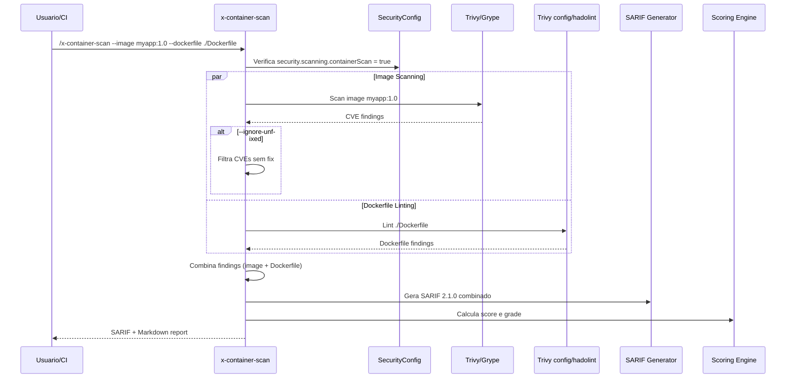

# Historia: Container Security Scanner (x-container-scan)

**ID:** story-0022-0007
**Chave Jira:** ---
**Status:** Pendente

## 1. Dependencias

| Blocked By | Blocks |
| :--- | :--- |
| story-0022-0001, story-0022-0002, story-0022-0003 | story-0022-0018, story-0022-0019, story-0022-0020 |

## 2. Regras Transversais Aplicaveis

| ID | Titulo |
| :--- | :--- |
| RULE-001 | Isolamento de Contexto de Subagents |
| RULE-002 | Estrutura Padrao de SKILL.md |
| RULE-003 | Formato de Output Padronizado |
| RULE-005 | Qualidade de Relatorio |
| RULE-007 | Rastreabilidade de Compliance |
| RULE-009 | Backward Compatibility |
| RULE-010 | Geracao Condicional por Feature Flag |

## 3. Descricao

Como **engenheiro de DevSecOps**, eu quero uma skill de scanning de seguranca de containers Docker, garantindo que imagens em uso nao contenham CVEs conhecidas e que Dockerfiles sigam best practices de seguranca.

Container security scanning opera em duas dimensoes: (1) analise de vulnerabilidades em imagens Docker (CVEs em pacotes do OS e dependencias da aplicacao), e (2) analise estatica do Dockerfile para detectar violacoes de best practices (execucao como root, secrets em layers, uso de :latest tag, etc.).

A skill usa Trivy (preferido) ou Grype como scanner de vulnerabilidades de imagem, e Trivy config mode ou hadolint para linting de Dockerfile. O parametro --ignore-unfixed permite focar apenas em vulnerabilidades que possuem fix disponivel, util para reduzir ruido em reports.

### 3.1 Image Vulnerability Scanning

- Tool: Trivy (preferido) / Grype (fallback)
- Analisa pacotes do OS (apt, apk, yum) e dependencias da aplicacao
- Classifica por severidade: CRITICAL, HIGH, MEDIUM, LOW
- Inclui CVE ID, pacote afetado, versao instalada, versao fixa
- Parametro --ignore-unfixed exclui CVEs sem fix disponivel

### 3.2 Dockerfile Linting

- Tool: Trivy config mode (preferido) / hadolint (fallback)
- Checks obrigatorios:
  - Root user: container nao deve rodar como root (HIGH)
  - Secrets in layers: ADD/COPY de arquivos de secrets (CRITICAL)
  - :latest tag: uso de tag :latest em FROM (MEDIUM)
  - Multi-stage: Dockerfiles sem multi-stage para builds (LOW)
  - Unnecessary packages: instalacao de pacotes desnecessarios (LOW)
  - Permissions: arquivos com permissoes excessivas (MEDIUM)
  - Missing healthcheck: HEALTHCHECK ausente (MEDIUM)

### 3.3 Parametros CLI

- `--image`: name:tag da imagem a escanear
- `--dockerfile`: path do Dockerfile a analisar
- `--severity-threshold`: CRITICAL | HIGH | MEDIUM | LOW (default: LOW)
- `--ignore-unfixed`: boolean, exclui CVEs sem fix disponivel (default: false)

### 3.4 Output Format

- SARIF 2.1.0 JSON com findings de image scan e Dockerfile lint combinados
- Markdown report com summary, CVE table, Dockerfile findings, score e grade
- Score >= 90 para Dockerfile que segue todas as best practices

## 3.5 Entrega de Valor

- **Valor Principal:** Deteccao de CVEs em imagens Docker e violacoes de Dockerfile best practices
- **Metrica de Sucesso:** Identificacao de 100% dos CVEs CRITICAL/HIGH em imagens escaneadas
- **Impacto no Negocio:** Prevencao de deploy de containers vulneraveis em producao

## 4. Definicoes de Qualidade Locais

### DoR Local

- [ ] Security Skill Template (story-0022-0003) disponivel
- [ ] SARIF template (story-0022-0002) disponivel
- [ ] SecurityConfig.scanning.containerScan flag implementado (story-0022-0001)
- [ ] Dockerfile best practices documentadas

### DoD Local

- [ ] SKILL.md criado seguindo security-skill-template
- [ ] Image scanning via Trivy/Grype implementado
- [ ] Dockerfile linting via Trivy config/hadolint implementado
- [ ] 7 Dockerfile checks implementados (root, secrets, latest, multi-stage, packages, permissions, healthcheck)
- [ ] Parametro --ignore-unfixed funcional
- [ ] Output SARIF valido + Markdown report com score
- [ ] Score >= 90 para Dockerfile compliant (todas as best practices seguidas)
- [ ] Testes para image scan e Dockerfile lint

### Global DoD

- **Cobertura:** >= 95% Line, >= 90% Branch
- **Testes Automatizados:** Unitarios + integracao golden file parity
- **Relatorio de Cobertura:** JaCoCo
- **Documentacao:** SKILL.md documentado
- **Persistencia:** N/A
- **Performance:** Geracao < 10s

## 5. Contratos de Dados

### 5.1 Parametros CLI

| Parametro | Tipo | M/O | Default | Validacoes | Exemplo |
| :--- | :--- | :--- | :--- | :--- | :--- |
| --image | String | O* | (none) | name:tag format | `--image myapp:1.2.3` |
| --dockerfile | String | O* | ./Dockerfile | Path valido | `--dockerfile docker/Dockerfile` |
| --severity-threshold | String | O | LOW | enum: CRITICAL, HIGH, MEDIUM, LOW | `--severity-threshold HIGH` |
| --ignore-unfixed | boolean | O | false | true/false | `--ignore-unfixed` |

*Pelo menos --image ou --dockerfile deve ser fornecido.

### 5.2 Image CVE Finding

| Campo | Tipo | M/O | Validacoes | Exemplo |
| :--- | :--- | :--- | :--- | :--- |
| ruleId | String | M | Pattern: CVE-YYYY-NNNNN | `"CVE-2024-21626"` |
| severity | String | M | enum: CRITICAL, HIGH, MEDIUM, LOW | `"CRITICAL"` |
| packageName | String | M | Non-empty | `"runc"` |
| installedVersion | String | M | Non-empty | `"1.1.9"` |
| fixedVersion | String | O | Versao com fix (ou vazio se unfixed) | `"1.1.12"` |
| message | String | M | Descricao da CVE | `"Container breakout via runc"` |

### 5.3 Dockerfile Finding

| Campo | Tipo | M/O | Validacoes | Exemplo |
| :--- | :--- | :--- | :--- | :--- |
| ruleId | String | M | Pattern: DOCKER-NNN | `"DOCKER-001"` |
| severity | String | M | enum: CRITICAL, HIGH, MEDIUM, LOW | `"HIGH"` |
| check | String | M | Nome do check | `"root-user"` |
| line | int | M | > 0 | `1` |
| message | String | M | Non-empty | `"Container runs as root user"` |
| fixRecommendation | String | M | Non-empty | `"Add USER directive with non-root user"` |

### 5.4 Dockerfile Checks

| Check | Severidade | Descricao | Fix |
| :--- | :--- | :--- | :--- |
| root-user | HIGH | Container roda como root | Adicionar USER non-root |
| secrets-in-layers | CRITICAL | Secrets copiados para layers | Usar multi-stage + .dockerignore |
| latest-tag | MEDIUM | Uso de :latest em FROM | Especificar tag exata |
| no-multi-stage | LOW | Build sem multi-stage | Usar multi-stage build |
| unnecessary-packages | LOW | Pacotes desnecessarios | Remover --no-install-recommends |
| excessive-permissions | MEDIUM | chmod 777 ou similar | Usar permissoes restritas |
| missing-healthcheck | MEDIUM | HEALTHCHECK ausente | Adicionar HEALTHCHECK |

## 6. Diagramas

### 6.1 Fluxo de execucao do Container Scanner



## 7. Criterios de Aceite (Gherkin)

```gherkin
Cenario: Nenhuma ferramenta de container scan disponivel
  DADO que Trivy nao esta instalado
  E Grype nao esta instalado
  E hadolint nao esta instalado
  QUANDO /x-container-scan --image myapp:1.0 e executado
  ENTAO o output contem 1 finding com severidade INFO
  E a mensagem contem instrucoes de instalacao para Trivy
  E o score e 100

Cenario: Image com CVE critica detectada
  DADO que a imagem "vulnerable-app:1.0" contem pacote runc versao 1.1.9
  E CVE-2024-21626 (CRITICAL) existe para runc < 1.1.12
  E Trivy esta instalado
  QUANDO /x-container-scan --image vulnerable-app:1.0 e executado
  ENTAO o output contem 1 finding CRITICAL com CVE-2024-21626
  E o campo fixedVersion e "1.1.12"
  E o score e inferior a 100

Cenario: Dockerfile com root user gera finding HIGH
  DADO que o Dockerfile NAO contem diretiva USER
  E Trivy config mode esta instalado
  QUANDO /x-container-scan --dockerfile ./Dockerfile e executado
  ENTAO o output contem 1 finding com check "root-user" e severidade HIGH
  E fixRecommendation contem "USER"

Cenario: Dockerfile compliant resulta em score >= 90
  DADO que o Dockerfile usa multi-stage build
  E contem USER non-root
  E usa tag exata (nao :latest)
  E contem HEALTHCHECK
  E nao copia secrets para layers
  QUANDO /x-container-scan --dockerfile ./Dockerfile e executado
  ENTAO o score e >= 90
  E a grade e "A"

Cenario: --ignore-unfixed exclui CVEs sem fix disponivel
  DADO que a imagem contem 3 CVEs: 1 com fix e 2 sem fix
  E o parametro --ignore-unfixed e passado
  QUANDO /x-container-scan --image myapp:1.0 --ignore-unfixed e executado
  ENTAO apenas 1 finding aparece no report (a CVE com fix)
  E as 2 CVEs sem fix sao excluidas
```

## 8. Sub-tarefas

- [ ] [Dev] Criar SKILL.md para x-container-scan seguindo security-skill-template
- [ ] [Dev] Implementar image vulnerability scanning via Trivy/Grype
- [ ] [Dev] Implementar Dockerfile linting via Trivy config/hadolint
- [ ] [Dev] Implementar 7 Dockerfile checks (root, secrets, latest, multi-stage, packages, permissions, healthcheck)
- [ ] [Dev] Implementar parametro --ignore-unfixed para filtrar CVEs sem fix
- [ ] [Dev] Combinar findings de image scan + Dockerfile lint em output unico
- [ ] [Dev] Gerar output SARIF 2.1.0 + Markdown report com score
- [ ] [Test] Teste unitario: image CVE CRITICAL detectada
- [ ] [Test] Teste unitario: Dockerfile root-user finding HIGH
- [ ] [Test] Teste unitario: --ignore-unfixed filtra corretamente
- [ ] [Test] Teste unitario: Dockerfile compliant score >= 90
- [ ] [Test] Smoke/E2E: Escanear imagem Docker publica e Dockerfile de exemplo, validar report
- [ ] [Doc] Documentar Dockerfile checks e exemplos de remediacao no SKILL.md
