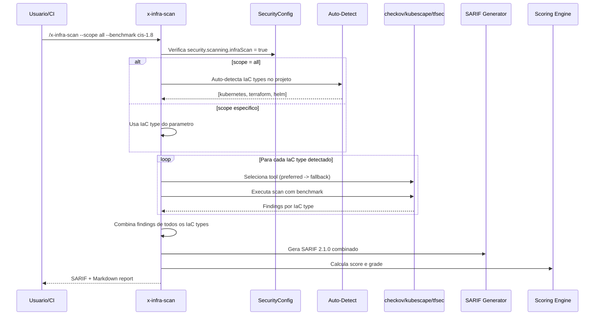

# Historia: Infrastructure Security Scanner (x-infra-scan)

**ID:** story-0022-0008
**Chave Jira:** ---
**Status:** Pendente

## 1. Dependencias

| Blocked By | Blocks |
| :--- | :--- |
| story-0022-0001, story-0022-0002, story-0022-0003 | story-0022-0018, story-0022-0019, story-0022-0020 |

## 2. Regras Transversais Aplicaveis

| ID | Titulo |
| :--- | :--- |
| RULE-001 | Isolamento de Contexto de Subagents |
| RULE-002 | Estrutura Padrao de SKILL.md |
| RULE-003 | Formato de Output Padronizado |
| RULE-005 | Qualidade de Relatorio |
| RULE-007 | Rastreabilidade de Compliance |
| RULE-009 | Backward Compatibility |
| RULE-010 | Geracao Condicional por Feature Flag |

## 3. Descricao

Como **engenheiro de DevSecOps**, eu quero uma skill de scanning de seguranca de Infrastructure as Code (IaC), garantindo que manifestos Kubernetes, modulos Terraform e charts Helm sigam CIS benchmarks e best practices de seguranca.

Infrastructure misconfiguration e uma das principais causas de brechas de seguranca em cloud. Esta skill analisa IaC files para detectar problemas como security contexts ausentes, network policies faltando, RBAC excessivamente permissivo, secrets em plaintext, resource limits ausentes, e violacoes de Pod Security Standards.

A skill suporta multiplos tipos de IaC (Kubernetes, Terraform, Helm, Docker Compose) com auto-deteccao baseada na estrutura de arquivos do projeto. Ferramentas: kube-bench + checkov (preferido) ou kubescape para Kubernetes, checkov ou tfsec para Terraform, checkov ou kubescape para Helm.

### 3.1 Tool Selection por IaC Type

- Kubernetes manifests: kube-bench + checkov (preferido) / kubescape (fallback)
- Terraform: checkov (preferido) / tfsec (fallback)
- Helm charts: checkov (preferido) / kubescape (fallback)
- Docker Compose: checkov (unica opcao)

### 3.2 Parametros CLI

- `--scope`: k8s | terraform | helm | compose | all (default: all, auto-detect)
- `--benchmark`: cis-1.8 | cis-1.7 | custom (default: cis-1.8)
- `--framework`: nome do framework especifico do checkov (optional)

### 3.3 Checks por IaC Type

**Kubernetes:**
- Security contexts (runAsNonRoot, readOnlyRootFilesystem, allowPrivilegeEscalation)
- Network policies (ingress/egress definidos)
- RBAC (ClusterRole com wildcards, ServiceAccount default)
- Secrets (plaintext em manifests)
- Resource limits (CPU/memory requests e limits)
- Pod Security Standards (Restricted, Baseline, Privileged)

**Terraform:**
- Security groups abertos (0.0.0.0/0 em ingress)
- Encryption at rest desabilitada
- Public access habilitado em recursos
- Logging/monitoring desabilitado
- IAM policies excessivamente permissivas

**Helm:**
- Mesmos checks de Kubernetes aplicados aos templates renderizados
- Values.yaml com defaults inseguros

### 3.4 Auto-deteccao de IaC Type

- Kubernetes: arquivos com apiVersion e kind
- Terraform: arquivos .tf
- Helm: Chart.yaml presente
- Docker Compose: docker-compose.yml ou compose.yml

## 3.5 Entrega de Valor

- **Valor Principal:** Deteccao de misconfiguration em Kubernetes, Terraform e Helm contra CIS benchmarks
- **Metrica de Sucesso:** Cobertura de 100% dos CIS benchmark checks para Kubernetes 1.8
- **Impacto no Negocio:** Prevencao de deploy de infraestrutura insegura, compliance com CIS frameworks

## 4. Definicoes de Qualidade Locais

### DoR Local

- [ ] Security Skill Template (story-0022-0003) disponivel
- [ ] SARIF template (story-0022-0002) disponivel
- [ ] SecurityConfig.scanning.infraScan flag implementado (story-0022-0001)
- [ ] CIS Kubernetes Benchmark 1.8 disponivel para referencia

### DoD Local

- [ ] SKILL.md criado seguindo security-skill-template
- [ ] Tool selection table completa para 4 IaC types
- [ ] Auto-deteccao de IaC type implementada
- [ ] Checks de Kubernetes (security context, network policy, RBAC, secrets, limits, PSS) implementados
- [ ] Checks de Terraform (SG, encryption, public access, logging, IAM) implementados
- [ ] Checks de Helm (K8s checks + values defaults) implementados
- [ ] Output SARIF valido + Markdown report com score
- [ ] Manifests compliant resultam em score >= 90

### Global DoD

- **Cobertura:** >= 95% Line, >= 90% Branch
- **Testes Automatizados:** Unitarios + integracao golden file parity
- **Relatorio de Cobertura:** JaCoCo
- **Documentacao:** SKILL.md documentado
- **Persistencia:** N/A
- **Performance:** Geracao < 10s

## 5. Contratos de Dados

### 5.1 Parametros CLI

| Parametro | Tipo | M/O | Default | Validacoes | Exemplo |
| :--- | :--- | :--- | :--- | :--- | :--- |
| --scope | String | O | all | enum: k8s, terraform, helm, compose, all | `--scope k8s` |
| --benchmark | String | O | cis-1.8 | enum: cis-1.8, cis-1.7, custom | `--benchmark cis-1.8` |
| --framework | String | O | (auto) | Nome de framework checkov valido | `--framework kubernetes` |

### 5.2 IaC Finding

| Campo | Tipo | M/O | Validacoes | Exemplo |
| :--- | :--- | :--- | :--- | :--- |
| ruleId | String | M | Pattern: INFRA-NNN ou CIS-X.Y.Z | `"INFRA-001"` |
| severity | String | M | enum: CRITICAL, HIGH, MEDIUM, LOW | `"HIGH"` |
| iacType | String | M | enum: kubernetes, terraform, helm, compose | `"kubernetes"` |
| check | String | M | Nome do check | `"missing-security-context"` |
| file | String | M | Relative path | `"k8s/deployment.yaml"` |
| resource | String | O | Nome do recurso IaC | `"Deployment/myapp"` |
| line | int | O | > 0 | `15` |
| message | String | M | Non-empty | `"Container has no security context"` |
| benchmark | String | O | CIS benchmark reference | `"CIS-5.2.6"` |
| fixRecommendation | String | M | Non-empty | `"Add securityContext with runAsNonRoot: true"` |

### 5.3 Tool Selection Table

| IaC Type | Preferred Tool | Fallback Tool | Install Command |
| :--- | :--- | :--- | :--- |
| Kubernetes | kube-bench + checkov | kubescape | `pip install checkov` |
| Terraform | checkov | tfsec | `pip install checkov` |
| Helm | checkov | kubescape | `pip install checkov` |
| Docker Compose | checkov | (none) | `pip install checkov` |

### 5.4 Auto-Detection Rules

| IaC Type | Detection Criteria |
| :--- | :--- |
| Kubernetes | Arquivos YAML com fields `apiVersion` e `kind` |
| Terraform | Arquivos com extensao `.tf` |
| Helm | Diretorio contendo `Chart.yaml` |
| Docker Compose | Arquivo `docker-compose.yml` ou `compose.yml` |

## 6. Diagramas

### 6.1 Fluxo de execucao do Infrastructure Scanner



## 7. Criterios de Aceite (Gherkin)

```gherkin
Cenario: Nenhum arquivo IaC encontrado no projeto
  DADO que o projeto nao contem arquivos Kubernetes, Terraform, Helm ou Compose
  QUANDO /x-infra-scan --scope all e executado
  ENTAO o output contem 1 finding com severidade INFO
  E a mensagem indica "No IaC files detected"
  E o score e 100

Cenario: Kubernetes manifest sem security context gera finding HIGH
  DADO que o arquivo k8s/deployment.yaml contem um Deployment
  E o container NAO possui securityContext definido
  E checkov esta instalado
  QUANDO /x-infra-scan --scope k8s e executado
  ENTAO o output contem 1 finding com check "missing-security-context" e severidade HIGH
  E fixRecommendation contem "securityContext"
  E o benchmark reference e um CIS check valido

Cenario: Terraform security group aberto gera finding CRITICAL
  DADO que o arquivo main.tf contem um aws_security_group
  E a regra de ingress permite 0.0.0.0/0 na porta 22
  E checkov esta instalado
  QUANDO /x-infra-scan --scope terraform e executado
  ENTAO o output contem 1 finding com severidade CRITICAL
  E o check e "open-security-group"
  E a mensagem menciona "0.0.0.0/0"

Cenario: Auto-deteccao identifica tipos de IaC no projeto
  DADO que o projeto contem k8s/deployment.yaml e infra/main.tf
  MAS nao contem Chart.yaml nem docker-compose.yml
  QUANDO /x-infra-scan --scope all e executado
  ENTAO apenas Kubernetes e Terraform sao escaneados
  E Helm e Docker Compose nao sao escaneados

Cenario: Manifests compliant resultam em score >= 90
  DADO que todos os Kubernetes manifests possuem security context completo
  E network policies estao definidas
  E RBAC nao usa wildcards
  E resource limits estao definidos
  QUANDO /x-infra-scan --scope k8s e executado
  ENTAO o score e >= 90
  E a grade e "A"
```

## 8. Sub-tarefas

- [ ] [Dev] Criar SKILL.md para x-infra-scan seguindo security-skill-template
- [ ] [Dev] Implementar auto-deteccao de IaC types (K8s, Terraform, Helm, Compose)
- [ ] [Dev] Implementar tool selection table para 4 IaC types
- [ ] [Dev] Implementar checks Kubernetes (security context, network policy, RBAC, secrets, limits, PSS)
- [ ] [Dev] Implementar checks Terraform (SG, encryption, public access, logging, IAM)
- [ ] [Dev] Implementar checks Helm (K8s checks aplicados a templates)
- [ ] [Dev] Implementar benchmark CIS 1.8 mapping
- [ ] [Dev] Gerar output SARIF 2.1.0 + Markdown report com score
- [ ] [Test] Teste unitario: K8s sem security context HIGH
- [ ] [Test] Teste unitario: Terraform open SG CRITICAL
- [ ] [Test] Teste unitario: auto-detect identifica tipos corretos
- [ ] [Test] Teste unitario: manifests compliant score >= 90
- [ ] [Test] Smoke/E2E: Escanear diretorio com K8s + Terraform de exemplo, validar report combinado
- [ ] [Doc] Documentar checks por IaC type e CIS benchmark mapping no SKILL.md
