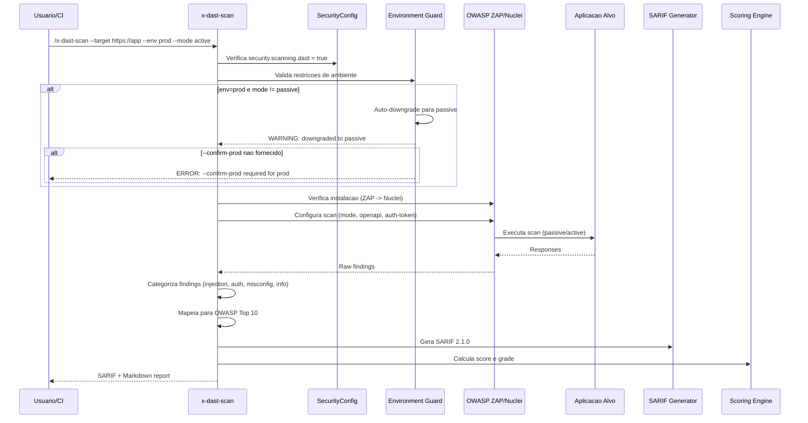

# Historia: DAST Scanner (x-dast-scan)

**ID:** story-0022-0009
**Chave Jira:** ---
**Status:** Pendente

## 1. Dependencias

| Blocked By | Blocks |
| :--- | :--- |
| story-0022-0001, story-0022-0002, story-0022-0003 | story-0022-0018, story-0022-0019, story-0022-0020 |

## 2. Regras Transversais Aplicaveis

| ID | Titulo |
| :--- | :--- |
| RULE-001 | Isolamento de Contexto de Subagents |
| RULE-002 | Estrutura Padrao de SKILL.md |
| RULE-003 | Formato de Output Padronizado |
| RULE-004 | Restricoes de Ambiente |
| RULE-005 | Qualidade de Relatorio |
| RULE-007 | Rastreabilidade de Compliance |
| RULE-008 | Severidade de Findings |
| RULE-009 | Backward Compatibility |
| RULE-010 | Geracao Condicional por Feature Flag |

## 3. Descricao

Como **engenheiro de seguranca**, eu quero uma skill de Dynamic Application Security Testing (DAST) que teste a aplicacao em execucao, garantindo que vulnerabilidades como XSS, injection e misconfiguration sejam detectadas em runtime.

DAST complementa SAST ao testar a aplicacao de fora para dentro, simulando ataques reais contra a aplicacao em execucao. Diferente de SAST que analisa codigo-fonte, DAST encontra vulnerabilidades que so se manifestam em runtime (headers de seguranca ausentes, cookies inseguros, CORS misconfiguration, etc.).

A skill implementa restricoes de ambiente rigorosas conforme RULE-004: em local/dev todos os modos sao permitidos, em homolog somente scans nao-destrutivos, e em producao apenas modo passivo com confirmacao explicita via --confirm-prod. Isso previne incidentes causados por scans ativos em ambientes de producao.

### 3.1 Tool Selection

- Preferred: OWASP ZAP (scanner DAST mais completo, open-source)
- Fallback: Nuclei (rapido, template-based, bom para checks especificos)

### 3.2 Parametros CLI

- `--target`: URL alvo do scan (obrigatorio)
- `--env`: local | dev | homolog | prod (default: local)
- `--mode`: passive | active | full (default: passive)
- `--confirm-prod`: boolean, confirmacao explicita para scan em producao
- `--openapi`: path para OpenAPI spec (amplia cobertura do scan)
- `--auth-token`: token de autenticacao para endpoints protegidos

### 3.3 Restricoes de Ambiente (RULE-004)

| Ambiente | Passive | Active | Full | Requisito |
| :--- | :--- | :--- | :--- | :--- |
| local | Sim | Sim | Sim | Nenhum |
| dev | Sim | Sim | Sim | Nenhum |
| homolog | Sim | Sim (nao destrutivo) | Nao | Exclui testes destrutivos |
| prod | Sim | Nao | Nao | Requer --confirm-prod |

- Se --env=prod e modo != passive: auto-downgrade para passive com WARNING
- Se --env=prod e --confirm-prod nao fornecido: scan bloqueado com erro

### 3.4 Modos de Scan

- **Passive**: intercepta responses e analisa (headers, cookies, info disclosure). Nao envia payloads
- **Active**: envia payloads de teste (injection, XSS, path traversal). Pode alterar dados
- **Full**: passive + active + fuzzing avancado. Maximo de cobertura, maior risco

### 3.5 Categorias de Findings

- Injection: SQL, NoSQL, LDAP, OS command injection
- Authentication: weak auth, session fixation, credential exposure
- Misconfiguration: missing headers, CORS, TLS issues, verbose errors
- Information Disclosure: stack traces, internal paths, version info

## 3.5 Entrega de Valor

- **Valor Principal:** Teste da aplicacao em execucao para XSS, injection e misconfiguration, unica validacao de seguranca em runtime
- **Metrica de Sucesso:** Deteccao de 100% dos OWASP Top 10 testáveis via DAST (A01, A03, A05, A07)
- **Impacto no Negocio:** Cobertura de seguranca runtime que SAST nao consegue atingir, complementando shift-left com shift-right

## 4. Definicoes de Qualidade Locais

### DoR Local

- [ ] Security Skill Template (story-0022-0003) disponivel
- [ ] SARIF template (story-0022-0002) disponivel
- [ ] SecurityConfig.scanning.dast flag implementado (story-0022-0001)
- [ ] RULE-004 (restricoes de ambiente) compreendida
- [ ] OWASP ZAP e Nuclei documentados

### DoD Local

- [ ] SKILL.md criado seguindo security-skill-template
- [ ] Tool selection: OWASP ZAP (preferred) e Nuclei (fallback) documentados
- [ ] Restricoes de ambiente implementadas conforme RULE-004
- [ ] Auto-downgrade para passive em prod implementado
- [ ] Bloqueio de scan em prod sem --confirm-prod implementado
- [ ] 3 modos de scan (passive, active, full) documentados
- [ ] Suporte a OpenAPI spec para ampliar cobertura
- [ ] Output SARIF valido + Markdown report com score
- [ ] Testes para restricoes de ambiente

### Global DoD

- **Cobertura:** >= 95% Line, >= 90% Branch
- **Testes Automatizados:** Unitarios + integracao golden file parity
- **Relatorio de Cobertura:** JaCoCo
- **Documentacao:** SKILL.md documentado
- **Persistencia:** N/A
- **Performance:** Geracao < 10s

## 5. Contratos de Dados

### 5.1 Parametros CLI

| Parametro | Tipo | M/O | Default | Validacoes | Exemplo |
| :--- | :--- | :--- | :--- | :--- | :--- |
| --target | String | M | (none) | URL valida (http/https) | `--target https://app.local:8080` |
| --env | String | O | local | enum: local, dev, homolog, prod | `--env homolog` |
| --mode | String | O | passive | enum: passive, active, full | `--mode active` |
| --confirm-prod | boolean | O | false | Obrigatorio quando --env=prod | `--confirm-prod` |
| --openapi | String | O | (none) | Path valido para OpenAPI spec | `--openapi docs/openapi.yaml` |
| --auth-token | String | O | (none) | Non-empty | `--auth-token Bearer xyz...` |

### 5.2 DAST Finding

| Campo | Tipo | M/O | Validacoes | Exemplo |
| :--- | :--- | :--- | :--- | :--- |
| ruleId | String | M | Pattern: DAST-NNN | `"DAST-001"` |
| severity | String | M | enum: CRITICAL, HIGH, MEDIUM, LOW, INFO | `"HIGH"` |
| category | String | M | enum: injection, authentication, misconfiguration, info-disclosure | `"injection"` |
| url | String | M | URL testada | `"https://app.local/api/users"` |
| method | String | O | HTTP method | `"POST"` |
| parameter | String | O | Parametro vulneravel | `"username"` |
| evidence | String | M | Evidencia da vulnerabilidade (sanitized) | `"Response contains SQL error message"` |
| message | String | M | Non-empty | `"SQL Injection detected in username parameter"` |
| owaspCategory | String | O | Pattern: A01-A10 | `"A03"` |
| fixRecommendation | String | M | Non-empty | `"Use parameterized queries"` |

### 5.3 Environment Restrictions

| Ambiente | Modos Permitidos | Confirmacao | Auto-Downgrade |
| :--- | :--- | :--- | :--- |
| local | passive, active, full | Nenhuma | Nao |
| dev | passive, active, full | Nenhuma | Nao |
| homolog | passive, active (nao destrutivo) | Nenhuma | full -> active (nao destrutivo) |
| prod | passive | --confirm-prod obrigatorio | active/full -> passive + WARNING |

## 6. Diagramas

### 6.1 Fluxo de execucao do DAST Scanner



## 7. Criterios de Aceite (Gherkin)

```gherkin
Cenario: Sem target URL falha com erro
  DADO que o parametro --target NAO foi fornecido
  QUANDO /x-dast-scan e executado
  ENTAO o scan falha com erro
  E a mensagem indica "--target is required"
  E nenhum report e gerado

Cenario: Modo passivo detecta headers de seguranca ausentes
  DADO que a aplicacao em https://app.local:8080 esta rodando
  E a resposta NAO contem headers X-Content-Type-Options e Strict-Transport-Security
  E OWASP ZAP esta instalado
  QUANDO /x-dast-scan --target https://app.local:8080 --mode passive e executado
  ENTAO o output contem findings com categoria "misconfiguration"
  E pelo menos 1 finding menciona "missing security headers"
  E cada finding tem fixRecommendation

Cenario: Scan em prod bloqueado sem --confirm-prod
  DADO que --env=prod e fornecido
  E --confirm-prod NAO e fornecido
  QUANDO /x-dast-scan --target https://prod.app --env prod e executado
  ENTAO o scan e bloqueado com erro
  E a mensagem indica "--confirm-prod is required for production scans"
  E nenhum request e enviado para a aplicacao

Cenario: Scan em prod auto-downgrades para passive
  DADO que --env=prod e fornecido
  E --confirm-prod e fornecido
  E --mode=active e fornecido
  QUANDO /x-dast-scan --target https://prod.app --env prod --mode active --confirm-prod e executado
  ENTAO o modo e automaticamente downgraded para passive
  E um WARNING e emitido indicando o downgrade
  E apenas scan passivo e realizado (nenhum payload de ataque enviado)

Cenario: Modo ativo detecta XSS em endpoint
  DADO que a aplicacao em https://app.local:8080 tem endpoint /search vulneravel a XSS refletido
  E OWASP ZAP esta instalado
  E --env=local
  QUANDO /x-dast-scan --target https://app.local:8080 --mode active e executado
  ENTAO o output contem 1 finding com categoria "injection" e severidade HIGH
  E a mensagem menciona "Cross-Site Scripting (XSS)"
  E owaspCategory e "A03"
```

## 8. Sub-tarefas

- [ ] [Dev] Criar SKILL.md para x-dast-scan seguindo security-skill-template
- [ ] [Dev] Implementar tool selection (OWASP ZAP preferred, Nuclei fallback)
- [ ] [Dev] Implementar environment guard com restricoes conforme RULE-004
- [ ] [Dev] Implementar auto-downgrade para passive em prod
- [ ] [Dev] Implementar bloqueio de scan em prod sem --confirm-prod
- [ ] [Dev] Implementar 3 modos de scan (passive, active, full)
- [ ] [Dev] Implementar suporte a OpenAPI spec para ampliar cobertura
- [ ] [Dev] Implementar suporte a --auth-token para endpoints protegidos
- [ ] [Dev] Categorizar findings (injection, auth, misconfiguration, info-disclosure)
- [ ] [Dev] Gerar output SARIF 2.1.0 + Markdown report com score
- [ ] [Test] Teste unitario: --target ausente falha com erro
- [ ] [Test] Teste unitario: prod sem --confirm-prod bloqueado
- [ ] [Test] Teste unitario: prod com active auto-downgrades para passive
- [ ] [Test] Teste unitario: passive detecta missing headers
- [ ] [Test] Smoke/E2E: Executar scan passive contra aplicacao de teste e validar SARIF output
- [ ] [Doc] Documentar restricoes de ambiente e modos de scan no SKILL.md
