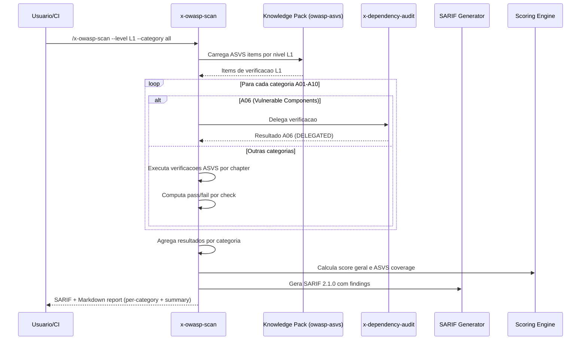

# Historia: OWASP Top 10 Verification (x-owasp-scan)

**ID:** story-0022-0010
**Chave Jira:** ---
**Status:** Pendente

## 1. Dependencias

| Blocked By | Blocks |
| :--- | :--- |
| story-0022-0002, story-0022-0003, story-0022-0004 | story-0022-0019, story-0022-0020 |

## 2. Regras Transversais Aplicaveis

| ID | Titulo |
| :--- | :--- |
| RULE-001 | Isolamento de Contexto de Subagents |
| RULE-003 | Formato de Output Padronizado |
| RULE-005 | Qualidade de Relatorio |
| RULE-007 | Rastreabilidade de Compliance |
| RULE-011 | Delegacao para Skills Especializadas |
| RULE-013 | Referencia a Standards Externos |

## 3. Descricao

Como **engenheiro de seguranca**, eu quero uma skill de verificacao automatizada do OWASP Top 10 mapeada para ASVS, garantindo que a aplicacao seja validada contra as 10 categorias de vulnerabilidades mais criticas com rastreabilidade para o standard ASVS.

O OWASP Top 10 e o framework de seguranca de aplicacoes mais reconhecido da industria, mas por si so nao define verificacoes especificas. Esta skill mapeia cada categoria do Top 10 (A01-A10) para os capitulos correspondentes do ASVS (V1-V14), permitindo verificacoes concretas e auditaveis com tres niveis de profundidade (L1, L2, L3).

A category A06 (Vulnerable and Outdated Components) e delegada para x-dependency-audit ao inves de implementar verificacoes proprias, seguindo RULE-011 (Delegacao para Skills Especializadas). O output inclui pass/fail por categoria, score geral, e percentual de cobertura ASVS.

### 3.1 Mapping OWASP Top 10 -> ASVS

| OWASP Top 10 | ASVS Chapter(s) | Verificacoes |
| :--- | :--- | :--- |
| A01: Broken Access Control | V4 | Access control enforcement, RBAC, path traversal |
| A02: Cryptographic Failures | V6, V9 | Encryption at rest, TLS configuration, key management |
| A03: Injection | V5 | Input validation, output encoding, parameterized queries |
| A04: Insecure Design | V1 | Threat modeling, secure architecture patterns |
| A05: Security Misconfiguration | V14 | Default configs, error handling, hardening |
| A06: Vulnerable Components | Delegado | x-dependency-audit (RULE-011) |
| A07: Auth Failures | V2, V3 | Authentication mechanisms, session management |
| A08: Software/Data Integrity | V10 | Code integrity, deserialization, CI/CD security |
| A09: Logging Failures | V7 | Logging completeness, monitoring, alerting |
| A10: SSRF | V5, V13 | URL validation, API security, server-side request handling |

### 3.2 Parametros CLI

- `--level`: L1 | L2 | L3 (default: L1)
- `--category`: A01 | A02 | ... | A10 | all (default: all)
- `--report-format`: markdown | sarif | both (default: both)

### 3.3 Niveis ASVS

- **L1**: Verificacoes minimas para qualquer aplicacao (oportunistico)
- **L2**: Padrao para a maioria das aplicacoes (defensivo)
- **L3**: Para aplicacoes criticas como saude, financas, infra (avancado)

### 3.4 Output

- Per-category: pass/fail com detalhes das verificacoes
- Score geral (0-100) baseado em categorias passadas vs total
- ASVS coverage percentage por nivel
- Delegacao transparente para x-dependency-audit em A06

## 3.5 Entrega de Valor

- **Valor Principal:** Verificacao padronizada OWASP Top 10 com ASVS levels, compliance automatica
- **Metrica de Sucesso:** 100% das 10 categorias OWASP verificadas com pelo menos L1
- **Impacto no Negocio:** Demonstracao de compliance OWASP auditavel, requisito para certificacoes de seguranca

## 4. Definicoes de Qualidade Locais

### DoR Local

- [ ] Knowledge pack owasp-asvs (story-0022-0004) disponivel
- [ ] SARIF template (story-0022-0002) disponivel
- [ ] Security Skill Template (story-0022-0003) disponivel
- [ ] Mapping OWASP Top 10 -> ASVS documentado e validado

### DoD Local

- [ ] SKILL.md criado seguindo security-skill-template
- [ ] Mapping completo A01-A10 -> ASVS chapters implementado
- [ ] A06 delega para x-dependency-audit (RULE-011)
- [ ] 3 niveis ASVS (L1, L2, L3) implementados com verificacoes crescentes
- [ ] Output per-category pass/fail com detalhes
- [ ] Score geral e ASVS coverage percentage calculados
- [ ] SARIF output valido + Markdown report
- [ ] Testes para cada categoria e nivel

### Global DoD

- **Cobertura:** >= 95% Line, >= 90% Branch
- **Testes Automatizados:** Unitarios + integracao golden file parity
- **Relatorio de Cobertura:** JaCoCo
- **Documentacao:** SKILL.md documentado
- **Persistencia:** N/A
- **Performance:** Geracao < 10s

## 5. Contratos de Dados

### 5.1 Parametros CLI

| Parametro | Tipo | M/O | Default | Validacoes | Exemplo |
| :--- | :--- | :--- | :--- | :--- | :--- |
| --level | String | O | L1 | enum: L1, L2, L3 | `--level L2` |
| --category | String | O | all | enum: A01-A10, all | `--category A03` |
| --report-format | String | O | both | enum: markdown, sarif, both | `--report-format sarif` |

### 5.2 Category Result

| Campo | Tipo | M/O | Validacoes | Exemplo |
| :--- | :--- | :--- | :--- | :--- |
| category | String | M | Pattern: A01-A10 | `"A01"` |
| categoryName | String | M | Non-empty | `"Broken Access Control"` |
| asvsChapters | List<String> | M | V1-V14 | `["V4"]` |
| status | String | M | enum: PASS, FAIL, DELEGATED, SKIPPED | `"PASS"` |
| level | String | M | enum: L1, L2, L3 | `"L1"` |
| totalChecks | int | M | >= 0 | `15` |
| passedChecks | int | M | >= 0, <= totalChecks | `12` |
| failedChecks | int | M | >= 0, <= totalChecks | `3` |
| findings | List<Finding> | O | Findings das verificacoes falhas | `[...]` |
| delegatedTo | String | O | Skill name (quando status=DELEGATED) | `"x-dependency-audit"` |

### 5.3 OWASP Scan Summary

| Campo | Tipo | M/O | Validacoes | Exemplo |
| :--- | :--- | :--- | :--- | :--- |
| score | int | M | 0-100 | `85` |
| grade | String | M | enum: A, B, C, D, F | `"B"` |
| level | String | M | enum: L1, L2, L3 | `"L1"` |
| totalCategories | int | M | 10 | `10` |
| passedCategories | int | M | 0-10 | `8` |
| failedCategories | int | M | 0-10 | `1` |
| delegatedCategories | int | M | 0-10 | `1` |
| asvsCoveragePercent | float | M | 0.0-100.0 | `72.5` |

### 5.4 OWASP -> ASVS Mapping

| OWASP | ASVS | Descricao | Delegacao |
| :--- | :--- | :--- | :--- |
| A01 | V4 | Access Control | Nao |
| A02 | V6, V9 | Cryptography, Communication | Nao |
| A03 | V5 | Validation/Sanitization | Nao |
| A04 | V1 | Architecture/Design | Nao |
| A05 | V14 | Configuration | Nao |
| A06 | N/A | Vulnerable Components | x-dependency-audit |
| A07 | V2, V3 | Authentication, Session | Nao |
| A08 | V10 | Software Integrity | Nao |
| A09 | V7 | Logging/Monitoring | Nao |
| A10 | V5, V13 | SSRF, API Security | Nao |

## 6. Diagramas

### 6.1 Fluxo de execucao do OWASP Top 10 Verification



## 7. Criterios de Aceite (Gherkin)

```gherkin
Cenario: Aplicacao sem input validation falha A03
  DADO que a aplicacao NAO implementa validacao de input (V5)
  E o nivel --level=L1 e selecionado
  QUANDO /x-owasp-scan --level L1 --category A03 e executado
  ENTAO a categoria A03 tem status FAIL
  E os findings referenciam capitulo ASVS V5
  E cada finding tem descricao e fixRecommendation

Cenario: L1 verifica todas as categorias com checks basicos
  DADO que --level=L1 e selecionado
  E --category=all e selecionado
  QUANDO /x-owasp-scan e executado
  ENTAO todas as 10 categorias (A01-A10) sao verificadas
  E A06 tem status DELEGATED com delegatedTo = "x-dependency-audit"
  E as demais categorias tem status PASS ou FAIL
  E o score geral e calculado (0-100)
  E asvsCoveragePercent reflete cobertura L1

Cenario: A06 delega para x-dependency-audit
  DADO que --category=A06 ou --category=all e selecionado
  QUANDO a verificacao de A06 (Vulnerable and Outdated Components) e executada
  ENTAO a verificacao e delegada para x-dependency-audit
  E o resultado retornado tem status DELEGATED
  E delegatedTo = "x-dependency-audit"
  E o score de A06 reflete o resultado do x-dependency-audit

Cenario: L3 inclui verificacoes avancadas
  DADO que --level=L3 e selecionado
  E --category=A01 e selecionado
  QUANDO /x-owasp-scan e executado
  ENTAO totalChecks para A01 e maior que em L1
  E verificacoes L3-only estao incluidas (ex: anti-automation, fraud detection)
  E cada check indica o nivel ASVS (L1, L2 ou L3)
```

## 8. Sub-tarefas

- [ ] [Dev] Criar SKILL.md para x-owasp-scan seguindo security-skill-template
- [ ] [Dev] Implementar mapping A01-A10 -> ASVS chapters usando knowledge pack
- [ ] [Dev] Implementar delegacao de A06 para x-dependency-audit (RULE-011)
- [ ] [Dev] Implementar verificacoes ASVS para nivel L1 (todas as categorias)
- [ ] [Dev] Implementar verificacoes adicionais para niveis L2 e L3
- [ ] [Dev] Implementar calculo de score geral e ASVS coverage percentage
- [ ] [Dev] Gerar output per-category pass/fail + summary
- [ ] [Dev] Gerar output SARIF 2.1.0 + Markdown report
- [ ] [Test] Teste unitario: A03 FAIL quando sem input validation
- [ ] [Test] Teste unitario: A06 delegado para x-dependency-audit
- [ ] [Test] Teste unitario: L3 tem mais checks que L1
- [ ] [Test] Teste unitario: todas as 10 categorias verificadas com --category=all
- [ ] [Test] Smoke/E2E: Executar x-owasp-scan L1 contra projeto de exemplo e validar report completo
- [ ] [Doc] Documentar mapping OWASP -> ASVS e niveis no SKILL.md
