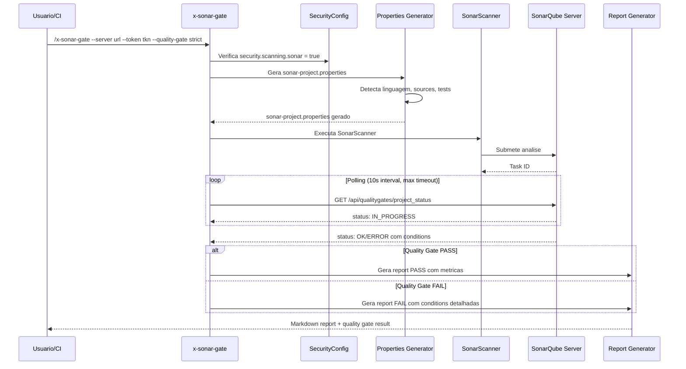

# Historia: SonarQube Quality Gate (x-sonar-gate)

**ID:** story-0022-0011
**Chave Jira:** ---
**Status:** Pendente

## 1. Dependencias

| Blocked By | Blocks |
| :--- | :--- |
| story-0022-0002, story-0022-0005 | story-0022-0019, story-0022-0020 |

## 2. Regras Transversais Aplicaveis

| ID | Titulo |
| :--- | :--- |
| RULE-005 | Qualidade de Relatorio |
| RULE-007 | Skill References Security KP |
| RULE-009 | CI Pipeline Integration |
| RULE-010 | Geracao Condicional por Feature Flag |

## 3. Descricao

Como **engenheiro de DevSecOps**, eu quero uma skill de integracao com SonarQube/SonarLint que gere configuracao, execute scans e valide quality gates de seguranca, garantindo que security hotspots sejam rastreados e quality gates enforced automaticamente no pipeline CI/CD.

O SonarQube e a plataforma de referencia para continuous code quality e security analysis. Esta skill gera o arquivo `sonar-project.properties` com configuracao otimizada para security hotspot tracking, executa o SonarScanner contra o servidor configurado, e faz polling do quality gate ate obter resultado definitivo (PASS/FAIL/ERROR).

A skill suporta dois modos de quality gate: "default" (quality gate configurado no servidor SonarQube) e "strict" (0 vulnerabilidades, 100% hotspots reviewed, security rating A). O modo strict e recomendado para pipelines de release e ambientes regulados. A configuracao gerada inclui exclusoes padrao (test files, generated code) e parametros de analise otimizados por linguagem.

### 3.1 Geracao de sonar-project.properties

- Detecta automaticamente linguagem, source directories, test directories e encoding do projeto
- Configura `sonar.security.hotspots.reviewed` como metrica trackeada
- Inclui exclusoes padrao: `**/test/**`, `**/generated/**`, `**/node_modules/**`
- Suporta multi-module projects (Maven, Gradle)

### 3.2 Parametros CLI

- `--server`: URL do SonarQube server (obrigatorio)
- `--token`: Token de autenticacao (obrigatorio)
- `--quality-gate`: default | strict (default: default)
- `--project-key`: Chave do projeto no SonarQube (default: detectada do pom.xml/build.gradle/package.json)
- `--branch`: Branch para analise (default: branch atual)
- `--timeout`: Timeout em segundos para polling do quality gate (default: 300)

### 3.3 Modo Strict

- 0 vulnerabilidades novas
- 100% de security hotspots reviewed
- Security rating A
- Duplicated lines < 3%
- Coverage threshold conforme Global DoD (>= 95% line)

### 3.4 Quality Gate Polling

- Apos submissao do scan, faz polling do endpoint `/api/qualitygates/project_status`
- Intervalo de polling: 10 segundos
- Timeout configuravel (default 300s)
- Retorna PASS, FAIL ou ERROR com detalhes das metricas que falharam

## 3.5 Entrega de Valor

- **Valor Principal:** Integracao com SonarQube para tracking de security hotspots e quality gate enforcement
- **Metrica de Sucesso:** Quality gate executado com sucesso em 100% dos scans, com report detalhado de metricas
- **Impacto no Negocio:** Enforcement automatico de padroes de seguranca no pipeline, bloqueando merges com vulnerabilidades

## 4. Definicoes de Qualidade Locais

### DoR Local

- [ ] SARIF template (story-0022-0002) disponivel
- [ ] SAST Scanner (story-0022-0005) implementado (referencia de findings)
- [ ] SecurityConfig.scanning.sonar flag implementado
- [ ] Documentacao de API do SonarQube revisada

### DoD Local

- [ ] SKILL.md criado seguindo security-skill-template
- [ ] Geracao de sonar-project.properties com deteccao automatica de linguagem
- [ ] Parametros CLI documentados com defaults e validacoes
- [ ] Modo default e strict implementados com validacoes distintas
- [ ] Polling de quality gate com timeout configuravel
- [ ] Output SARIF valido + Markdown report com metricas do quality gate
- [ ] CI Integration snippets para GitHub Actions, GitLab CI e Azure DevOps
- [ ] Error handling para server inacessivel, token invalido, timeout

### Global DoD

- **Cobertura:** >= 95% Line, >= 90% Branch
- **Testes Automatizados:** Unitarios + integracao golden file parity
- **Relatorio de Cobertura:** JaCoCo
- **Documentacao:** SKILL.md documentado
- **Persistencia:** N/A
- **Performance:** Geracao < 10s

## 5. Contratos de Dados

### 5.1 Parametros CLI

| Parametro | Tipo | M/O | Default | Validacoes | Exemplo |
| :--- | :--- | :--- | :--- | :--- | :--- |
| --server | String | M | — | URL valida, HTTP/HTTPS | `--server https://sonar.example.com` |
| --token | String | M | — | Non-empty, min 40 chars | `--token squ_abc123...` |
| --quality-gate | String | O | default | enum: default, strict | `--quality-gate strict` |
| --project-key | String | O | auto-detect | Pattern: [a-zA-Z0-9_:.-]+ | `--project-key my-project` |
| --branch | String | O | current branch | Non-empty | `--branch main` |
| --timeout | int | O | 300 | 30-3600 | `--timeout 600` |

### 5.2 sonar-project.properties (Gerado)

| Propriedade | Tipo | Condicao | Exemplo |
| :--- | :--- | :--- | :--- |
| sonar.projectKey | String | Sempre | `my-java-cli` |
| sonar.projectName | String | Sempre | `My Java CLI` |
| sonar.sources | String | Sempre | `src/main/java` |
| sonar.tests | String | Sempre | `src/test/java` |
| sonar.java.binaries | String | Java only | `target/classes` |
| sonar.sourceEncoding | String | Sempre | `UTF-8` |
| sonar.exclusions | String | Sempre | `**/test/**,**/generated/**` |
| sonar.security.hotspots.reviewed | String | Sempre | `true` |
| sonar.qualitygate.wait | String | Sempre | `true` |

### 5.3 Quality Gate Result

| Campo | Tipo | M/O | Validacoes | Exemplo |
| :--- | :--- | :--- | :--- | :--- |
| status | String | M | enum: PASS, FAIL, ERROR | `"PASS"` |
| qualityGateMode | String | M | enum: default, strict | `"strict"` |
| conditions | List<Condition> | M | Non-empty | `[...]` |
| projectKey | String | M | Non-empty | `"my-project"` |
| analysisId | String | M | Non-empty | `"AYx..."` |

### 5.4 Quality Gate Condition

| Campo | Tipo | M/O | Validacoes | Exemplo |
| :--- | :--- | :--- | :--- | :--- |
| metric | String | M | Non-empty | `"new_vulnerabilities"` |
| operator | String | M | enum: GT, LT, EQ | `"GT"` |
| value | String | M | Non-empty | `"0"` |
| status | String | M | enum: OK, ERROR | `"OK"` |
| actualValue | String | M | Non-empty | `"0"` |

## 6. Diagramas

### 6.1 Fluxo de execucao do SonarQube Quality Gate



## 7. Criterios de Aceite (Gherkin)

```gherkin
Cenario: Servidor SonarQube inacessivel retorna erro claro
  DADO que o parametro --server aponta para URL inacessivel
  E --token e valido
  QUANDO /x-sonar-gate e executado
  ENTAO o output contem erro "SonarQube server unreachable"
  E a mensagem inclui a URL tentada
  E nenhum arquivo sonar-project.properties e gerado

Cenario: Quality gate default PASS em projeto limpo
  DADO que o projeto Java Maven tem 0 vulnerabilidades
  E o SonarQube server esta acessivel com quality gate default
  QUANDO /x-sonar-gate --server url --token tkn --quality-gate default e executado
  ENTAO sonar-project.properties e gerado com sonar.sources = "src/main/java"
  E o SonarScanner e executado com sucesso
  E o quality gate retorna status PASS
  E o report Markdown contem todas as metricas com status OK

Cenario: Quality gate strict FAIL quando hotspots nao revisados
  DADO que o projeto tem 3 security hotspots nao revisados
  E --quality-gate=strict e selecionado
  QUANDO /x-sonar-gate e executado
  ENTAO o quality gate retorna status FAIL
  E a condition "security_hotspots_reviewed" tem status ERROR
  E o report lista os 3 hotspots pendentes de revisao
  E a recomendacao inclui link para revisao no SonarQube

Cenario: Timeout de polling retorna erro com ultimo status conhecido
  DADO que o SonarQube server esta processando a analise
  E --timeout=30 e configurado
  E a analise leva mais de 30 segundos
  QUANDO o polling atinge o timeout
  ENTAO o output contem erro "Quality gate polling timeout after 30s"
  E o ultimo status conhecido e reportado (IN_PROGRESS)
  E o analysisId e incluido para verificacao manual

Cenario: Geracao de properties para projeto multi-module Maven
  DADO que o projeto e Maven multi-module com 3 modulos
  QUANDO /x-sonar-gate --server url --token tkn e executado
  ENTAO sonar-project.properties inclui sonar.modules com os 3 modulos
  E cada modulo tem sonar.sources e sonar.tests configurados
  E sonar.java.binaries aponta para target/classes de cada modulo
```

## 8. Sub-tarefas

- [ ] [Dev] Criar SKILL.md para x-sonar-gate seguindo security-skill-template
- [ ] [Dev] Implementar geracao de sonar-project.properties com deteccao automatica
- [ ] [Dev] Implementar suporte a multi-module projects (Maven, Gradle)
- [ ] [Dev] Implementar execucao do SonarScanner com parametros configurados
- [ ] [Dev] Implementar polling de quality gate com timeout configuravel
- [ ] [Dev] Implementar modo strict com validacoes adicionais
- [ ] [Dev] Implementar CI Integration snippets (GitHub Actions, GitLab CI, Azure DevOps)
- [ ] [Dev] Gerar output Markdown report com metricas e status do quality gate
- [ ] [Test] Teste unitario: servidor inacessivel retorna erro claro
- [ ] [Test] Teste unitario: quality gate default PASS em projeto limpo
- [ ] [Test] Teste unitario: quality gate strict FAIL com hotspots nao revisados
- [ ] [Test] Teste unitario: timeout de polling retorna erro com status conhecido
- [ ] [Test] Teste unitario: geracao properties para multi-module Maven
- [ ] [Test] Smoke/E2E: Executar x-sonar-gate contra SonarQube local e validar quality gate result
- [ ] [Doc] Documentar parametros CLI, modos de quality gate e CI Integration no SKILL.md
