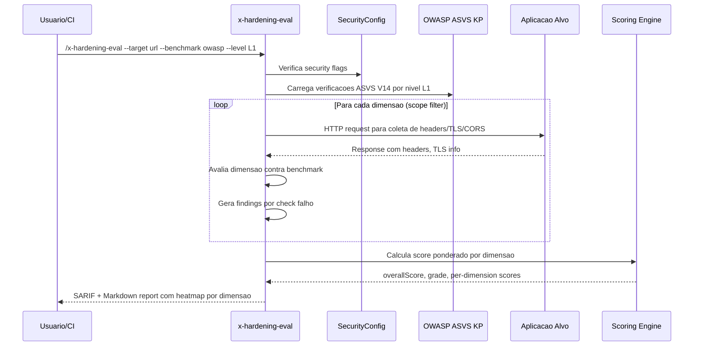

# Historia: Application Hardening Eval (x-hardening-eval)

**ID:** story-0022-0012
**Chave Jira:** ---
**Status:** Pendente

## 1. Dependencias

| Blocked By | Blocks |
| :--- | :--- |
| story-0022-0002, story-0022-0004 | story-0022-0018, story-0022-0019 |

## 2. Regras Transversais Aplicaveis

| ID | Titulo |
| :--- | :--- |
| RULE-001 | Isolamento de Contexto de Subagents |
| RULE-005 | Qualidade de Relatorio |
| RULE-007 | Skill References Security KP |
| RULE-013 | ASVS Level Mapping |
| RULE-015 | Template Engine Compatibility |

## 3. Descricao

Como **engenheiro de seguranca**, eu quero uma skill de avaliacao de hardening que analise a postura defensiva da aplicacao contra benchmarks reconhecidos (CIS, OWASP), garantindo que configuracoes de seguranca como headers HTTP, TLS, CORS, cookies e error handling estejam adequadas.

Application hardening e o processo de fortalecer uma aplicacao reduzindo sua superficie de ataque. Esta skill avalia 7 dimensoes de hardening com pesos ponderados: HTTP security headers (25%), TLS configuration (20%), CORS policy (15%), cookie security (15%), error handling (10%), input limits (10%) e information disclosure (5%). Cada dimensao produz findings individuais com recomendacoes de correcao.

A avaliacao pode ser executada contra uma URL alvo (aplicacao em execucao) ou contra configuracao estatica do projeto. Dois benchmarks sao suportados: CIS (Center for Internet Security) com foco em configuracao de infraestrutura, e OWASP com foco em seguranca de aplicacao. O score final e calculado com base nos pesos de cada dimensao.

### 3.1 Dimensoes de Avaliacao

| Dimensao | Peso | Verificacoes |
| :--- | :--- | :--- |
| HTTP Headers | 25% | HSTS, X-Frame-Options, X-Content-Type-Options, CSP, CORP, Permissions-Policy, Referrer-Policy |
| TLS | 20% | Versao minima 1.2, cipher suites, OCSP stapling, certificate chain |
| CORS | 15% | Origin whitelist, credentials handling, preflight cache, exposed headers |
| Cookies | 15% | Secure flag, HttpOnly flag, SameSite attribute, path scope, prefix |
| Error Handling | 10% | Stack trace suppression, error codes padronizados, fallback pages |
| Input Limits | 10% | Request body size, URL length, header size, upload limits, rate limits |
| Info Disclosure | 5% | Server header, X-Powered-By, version disclosure, directory listing |

### 3.2 Parametros CLI

- `--target`: URL da aplicacao alvo (obrigatorio para scan ativo)
- `--scope`: all | headers | tls | cors | cookies | errors | limits | disclosure (default: all)
- `--benchmark`: cis | owasp (default: owasp)
- `--level`: L1 | L2 | L3 (default: L1, mapeado para ASVS levels)

### 3.3 Benchmark Mapping

- **CIS**: Foco em configuracao de servidor e infraestrutura. Checks derivados do CIS Benchmark para web servers (Apache, Nginx, IIS).
- **OWASP**: Foco em seguranca de aplicacao. Checks derivados do OWASP ASVS V14 (Configuration) e OWASP Secure Headers Project.

### 3.4 Score Ponderado

O score final e calculado como media ponderada: `score = sum(dimensao_score * peso) / sum(pesos_aplicaveis)`. Dimensoes nao avaliadas (quando --scope filtra) sao excluidas do calculo.

## 3.5 Entrega de Valor

- **Valor Principal:** Avaliacao sistematica de postura defensiva contra CIS benchmarks
- **Metrica de Sucesso:** Cobertura de 100% das 7 dimensoes de hardening com verificacoes automatizadas
- **Impacto no Negocio:** Identificacao proativa de configuracoes inseguras antes de auditorias externas

## 4. Definicoes de Qualidade Locais

### DoR Local

- [ ] SARIF template (story-0022-0002) disponivel
- [ ] OWASP ASVS Knowledge Pack (story-0022-0004) disponivel
- [ ] CIS Benchmark para web servers documentado como referencia
- [ ] SecurityConfig flags para hardening definidos

### DoD Local

- [ ] SKILL.md criado seguindo security-skill-template
- [ ] 7 dimensoes de avaliacao implementadas com pesos ponderados
- [ ] Verificacoes por benchmark (CIS e OWASP) distintas
- [ ] ASVS level mapping (L1/L2/L3) implementado
- [ ] Score ponderado calculado corretamente
- [ ] Output SARIF valido + Markdown report com per-dimension scores
- [ ] Template placeholders ({{LANGUAGE}}, {{FRAMEWORK}}) funcionais
- [ ] Error handling para target inacessivel implementado

### Global DoD

- **Cobertura:** >= 95% Line, >= 90% Branch
- **Testes Automatizados:** Unitarios + integracao golden file parity
- **Relatorio de Cobertura:** JaCoCo
- **Documentacao:** SKILL.md documentado
- **Persistencia:** N/A
- **Performance:** Geracao < 10s

## 5. Contratos de Dados

### 5.1 Parametros CLI

| Parametro | Tipo | M/O | Default | Validacoes | Exemplo |
| :--- | :--- | :--- | :--- | :--- | :--- |
| --target | String | M | — | URL valida, HTTP/HTTPS | `--target https://app.example.com` |
| --scope | String | O | all | enum: all, headers, tls, cors, cookies, errors, limits, disclosure | `--scope headers` |
| --benchmark | String | O | owasp | enum: cis, owasp | `--benchmark cis` |
| --level | String | O | L1 | enum: L1, L2, L3 | `--level L2` |

### 5.2 Dimension Result

| Campo | Tipo | M/O | Validacoes | Exemplo |
| :--- | :--- | :--- | :--- | :--- |
| dimension | String | M | enum das 7 dimensoes | `"headers"` |
| weight | float | M | 0.0-1.0, soma = 1.0 | `0.25` |
| score | int | M | 0-100 | `85` |
| totalChecks | int | M | >= 1 | `7` |
| passedChecks | int | M | 0 <= x <= totalChecks | `6` |
| failedChecks | int | M | 0 <= x <= totalChecks | `1` |
| findings | List<Finding> | O | Findings das verificacoes falhas | `[...]` |
| benchmark | String | M | enum: cis, owasp | `"owasp"` |
| asvsLevel | String | M | enum: L1, L2, L3 | `"L1"` |

### 5.3 Hardening Summary

| Campo | Tipo | M/O | Validacoes | Exemplo |
| :--- | :--- | :--- | :--- | :--- |
| overallScore | int | M | 0-100 | `78` |
| grade | String | M | enum: A, B, C, D, F | `"B"` |
| benchmark | String | M | enum: cis, owasp | `"owasp"` |
| level | String | M | enum: L1, L2, L3 | `"L1"` |
| dimensions | List<DimensionResult> | M | 1-7 items | `[...]` |
| weakestDimension | String | M | enum das 7 dimensoes | `"tls"` |
| strongestDimension | String | M | enum das 7 dimensoes | `"headers"` |

### 5.4 HTTP Header Checks

| Header | Benchmark | Verificacao | Severidade |
| :--- | :--- | :--- | :--- |
| Strict-Transport-Security | CIS, OWASP | Presente, max-age >= 31536000, includeSubDomains | HIGH |
| X-Frame-Options | CIS, OWASP | DENY ou SAMEORIGIN | MEDIUM |
| X-Content-Type-Options | CIS, OWASP | nosniff | MEDIUM |
| Content-Security-Policy | OWASP | Presente, sem unsafe-inline/unsafe-eval | HIGH |
| Cross-Origin-Resource-Policy | OWASP | same-origin ou same-site | MEDIUM |
| Permissions-Policy | OWASP | Presente, restritivo | LOW |
| Referrer-Policy | OWASP | strict-origin-when-cross-origin ou no-referrer | LOW |

## 6. Diagramas

### 6.1 Fluxo de execucao do Hardening Eval



## 7. Criterios de Aceite (Gherkin)

```gherkin
Cenario: Target inacessivel retorna erro claro sem score
  DADO que o parametro --target aponta para URL inacessivel
  QUANDO /x-hardening-eval e executado
  ENTAO o output contem erro "Target unreachable"
  E a mensagem inclui a URL tentada
  E nenhum score e calculado

Cenario: Aplicacao com todos os headers configurados recebe score alto em headers
  DADO que a aplicacao alvo retorna HSTS, X-Frame-Options, X-Content-Type-Options, CSP, CORP, Permissions-Policy e Referrer-Policy
  E todos os headers tem valores conformes com OWASP
  QUANDO /x-hardening-eval --target url --scope headers --benchmark owasp e executado
  ENTAO a dimensao "headers" tem score 100
  E passedChecks = 7
  E failedChecks = 0
  E nenhum finding e gerado

Cenario: Ausencia de HSTS gera finding HIGH
  DADO que a aplicacao alvo NAO retorna header Strict-Transport-Security
  E os demais headers estao presentes
  QUANDO /x-hardening-eval --target url --scope headers e executado
  ENTAO a dimensao "headers" tem 1 finding com severidade HIGH
  E o finding contem ruleId referenciando HSTS
  E fixRecommendation contem "Strict-Transport-Security: max-age=31536000; includeSubDomains"

Cenario: Score ponderado reflete pesos das dimensoes
  DADO que a dimensao "headers" (peso 25%) tem score 100
  E a dimensao "tls" (peso 20%) tem score 50
  E as demais dimensoes tem score 80
  QUANDO o score geral e calculado
  ENTAO o overallScore reflete a media ponderada (nao simples)
  E weakestDimension = "tls"
  E strongestDimension = "headers"

Cenario: Benchmark CIS inclui checks diferentes de OWASP
  DADO que --benchmark=cis e selecionado
  QUANDO /x-hardening-eval --target url --benchmark cis e executado
  ENTAO os checks aplicados sao derivados do CIS Benchmark
  E checks exclusivos CIS (ex: server banner removal) estao presentes
  E o report indica benchmark = "cis"
```

## 8. Sub-tarefas

- [ ] [Dev] Criar SKILL.md para x-hardening-eval seguindo security-skill-template
- [ ] [Dev] Implementar avaliacao de HTTP security headers (7 headers)
- [ ] [Dev] Implementar avaliacao de TLS (versao, ciphers, OCSP)
- [ ] [Dev] Implementar avaliacao de CORS policy
- [ ] [Dev] Implementar avaliacao de cookie security (Secure, HttpOnly, SameSite)
- [ ] [Dev] Implementar avaliacao de error handling e input limits
- [ ] [Dev] Implementar avaliacao de information disclosure
- [ ] [Dev] Implementar calculo de score ponderado por dimensao
- [ ] [Dev] Implementar suporte a benchmarks CIS e OWASP
- [ ] [Dev] Implementar ASVS level mapping (L1/L2/L3)
- [ ] [Dev] Gerar output SARIF 2.1.0 + Markdown report com per-dimension scores
- [ ] [Test] Teste unitario: target inacessivel retorna erro claro
- [ ] [Test] Teste unitario: todos headers presentes geram score 100
- [ ] [Test] Teste unitario: ausencia de HSTS gera finding HIGH
- [ ] [Test] Teste unitario: score ponderado calcula corretamente
- [ ] [Test] Teste unitario: benchmark CIS difere de OWASP em checks
- [ ] [Test] Smoke/E2E: Executar x-hardening-eval contra aplicacao de exemplo e validar report completo
- [ ] [Doc] Documentar dimensoes, pesos, benchmarks e exemplos no SKILL.md
