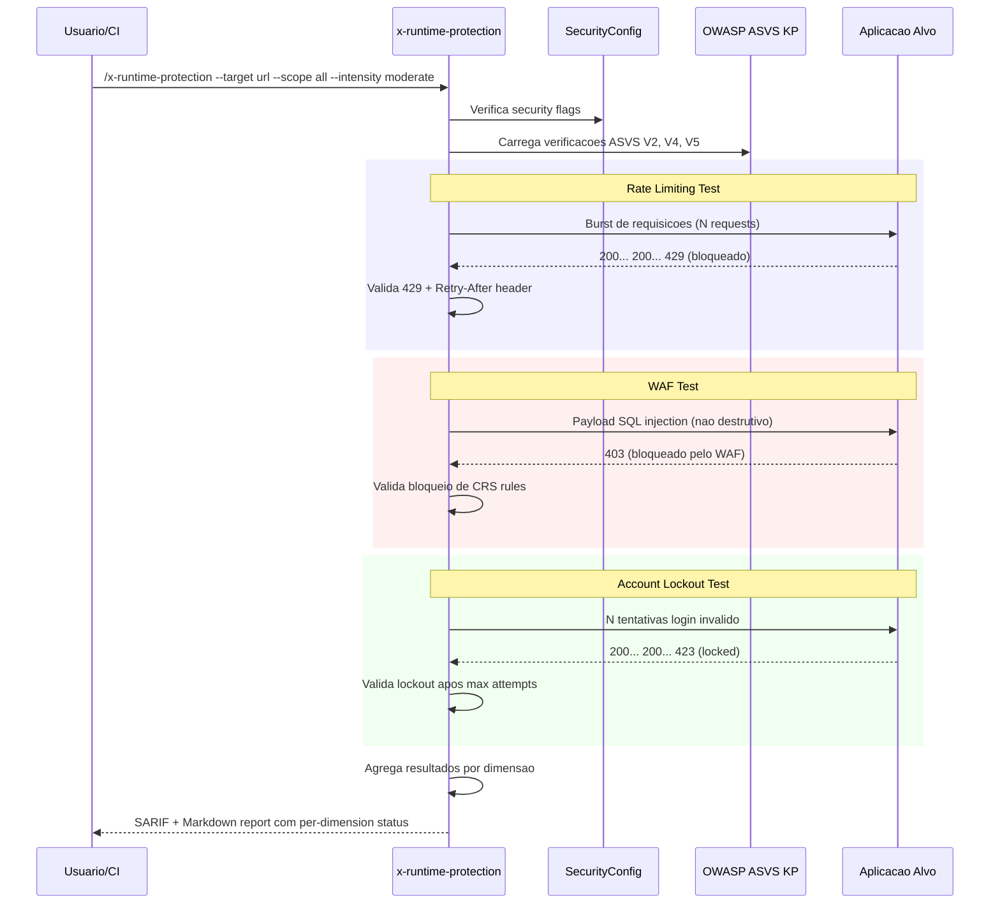

# Historia: Runtime Protection Eval (x-runtime-protection)

**ID:** story-0022-0013
**Chave Jira:** ---
**Status:** Pendente

## 1. Dependencias

| Blocked By | Blocks |
| :--- | :--- |
| story-0022-0002, story-0022-0004 | story-0022-0018, story-0022-0019 |

## 2. Regras Transversais Aplicaveis

| ID | Titulo |
| :--- | :--- |
| RULE-001 | Isolamento de Contexto de Subagents |
| RULE-005 | Qualidade de Relatorio |
| RULE-007 | Skill References Security KP |
| RULE-013 | ASVS Level Mapping |

## 3. Descricao

Como **engenheiro de seguranca**, eu quero uma skill de avaliacao de protecoes runtime que analise controles ativos da aplicacao em execucao, garantindo que mecanismos de defesa como rate limiting, WAF, bot protection e account lockout estejam operacionais e configurados adequadamente.

Protecoes runtime sao controles que atuam durante a execucao da aplicacao para mitigar ataques em tempo real. Diferente do hardening (configuracao estatica), runtime protection avalia controles dinamicos que respondem a comportamento malicioso. Esta skill testa rate limiting (global, per-endpoint, per-user), regras WAF (OWASP CRS - Core Rule Set), bot protection (CAPTCHA, fingerprinting), e account lockout (max attempts, lockout duration, progressive delay).

A avaliacao e feita enviando requisicoes controladas contra a aplicacao alvo e observando as respostas. Para rate limiting, envia-se burst de requisicoes e valida-se o status 429. Para WAF, envia-se payloads de teste (nao destrutivos) e valida-se o bloqueio. Para account lockout, simula-se tentativas de login falhas e valida-se o lockout.

### 3.1 Dimensoes de Avaliacao

| Dimensao | Verificacoes |
| :--- | :--- |
| Rate Limiting | Global rate limit, per-endpoint limits, per-user limits, burst handling, 429 response, Retry-After header |
| WAF Rules | OWASP CRS detection, SQL injection blocking, XSS blocking, path traversal blocking, custom rules |
| Bot Protection | CAPTCHA presence, fingerprinting detection, automated request blocking, challenge pages |
| Account Lockout | Max login attempts, lockout duration, progressive delay, lockout notification, reset mechanism |
| Brute Force | Password brute force protection, API key brute force, token enumeration, timing attack mitigation |
| CSP Enforcement | Content-Security-Policy enforcement, report-uri/report-to, violation reporting |
| Permissions Policy | Feature restrictions, geolocation, camera, microphone, payment API |

### 3.2 Parametros CLI

- `--scope`: all | rate-limit | waf | bot-protection | account-lockout | brute-force | csp | permissions (default: all)
- `--target`: URL da aplicacao alvo (obrigatorio)
- `--intensity`: passive | moderate | aggressive (default: moderate)
- `--login-endpoint`: Endpoint de login para testes de account lockout (opcional)

### 3.3 Intensidade de Teste

- **passive**: Apenas observa headers e configuracoes, sem enviar payloads de teste
- **moderate**: Envia payloads de teste nao-destrutivos (default)
- **aggressive**: Testa limites com volume maior (apenas em local/dev)

### 3.4 ASVS Mapping

- Rate Limiting -> ASVS V4.3 (Access Control)
- WAF -> ASVS V5.1 (Input Validation)
- Account Lockout -> ASVS V2.2 (Authentication)
- Brute Force -> ASVS V2.2, V11.1 (Business Logic)

## 3.5 Entrega de Valor

- **Valor Principal:** Avaliacao de controles ativos, reduzindo risco de DDoS e brute force
- **Metrica de Sucesso:** 100% das dimensoes avaliadas com findings acionaveis para controles ausentes
- **Impacto no Negocio:** Validacao de que protecoes runtime estao operacionais antes de expor a aplicacao

## 4. Definicoes de Qualidade Locais

### DoR Local

- [ ] SARIF template (story-0022-0002) disponivel
- [ ] OWASP ASVS Knowledge Pack (story-0022-0004) disponivel
- [ ] Ambiente de teste com rate limiting configuravel disponivel
- [ ] OWASP CRS documentado como referencia

### DoD Local

- [ ] SKILL.md criado seguindo security-skill-template
- [ ] 7 dimensoes de runtime protection implementadas
- [ ] 3 niveis de intensidade (passive, moderate, aggressive) implementados
- [ ] ASVS level mapping para verificacoes runtime
- [ ] Payloads de teste nao-destrutivos para WAF e injection
- [ ] Account lockout testing com login endpoint configuravel
- [ ] Output SARIF valido + Markdown report
- [ ] Error handling para target inacessivel e timeout
- [ ] Restricao de intensidade por ambiente (aggressive apenas local/dev)

### Global DoD

- **Cobertura:** >= 95% Line, >= 90% Branch
- **Testes Automatizados:** Unitarios + integracao golden file parity
- **Relatorio de Cobertura:** JaCoCo
- **Documentacao:** SKILL.md documentado
- **Persistencia:** N/A
- **Performance:** Geracao < 10s

## 5. Contratos de Dados

### 5.1 Parametros CLI

| Parametro | Tipo | M/O | Default | Validacoes | Exemplo |
| :--- | :--- | :--- | :--- | :--- | :--- |
| --scope | String | O | all | enum: all, rate-limit, waf, bot-protection, account-lockout, brute-force, csp, permissions | `--scope rate-limit` |
| --target | String | M | — | URL valida, HTTP/HTTPS | `--target https://app.example.com` |
| --intensity | String | O | moderate | enum: passive, moderate, aggressive | `--intensity passive` |
| --login-endpoint | String | O | — | Relative path | `--login-endpoint /api/auth/login` |

### 5.2 Runtime Protection Result

| Campo | Tipo | M/O | Validacoes | Exemplo |
| :--- | :--- | :--- | :--- | :--- |
| dimension | String | M | enum das 7 dimensoes | `"rate-limit"` |
| status | String | M | enum: PROTECTED, PARTIAL, UNPROTECTED, SKIPPED | `"PROTECTED"` |
| score | int | M | 0-100 | `90` |
| intensity | String | M | enum: passive, moderate, aggressive | `"moderate"` |
| totalChecks | int | M | >= 1 | `6` |
| passedChecks | int | M | 0 <= x <= totalChecks | `5` |
| findings | List<Finding> | O | Findings dos checks falhos | `[...]` |
| asvsRef | String | O | Pattern: V[0-9]+.[0-9]+ | `"V4.3"` |

### 5.3 Runtime Protection Summary

| Campo | Tipo | M/O | Validacoes | Exemplo |
| :--- | :--- | :--- | :--- | :--- |
| overallScore | int | M | 0-100 | `72` |
| grade | String | M | enum: A, B, C, D, F | `"C"` |
| protectedDimensions | int | M | 0-7 | `4` |
| partialDimensions | int | M | 0-7 | `2` |
| unprotectedDimensions | int | M | 0-7 | `1` |
| criticalGaps | List<String> | O | Dimensoes sem protecao | `["account-lockout"]` |

### 5.4 Rate Limit Test Result

| Campo | Tipo | M/O | Validacoes | Exemplo |
| :--- | :--- | :--- | :--- | :--- |
| endpoint | String | M | Non-empty | `"/api/users"` |
| requestsSent | int | M | > 0 | `100` |
| requestsBlocked | int | M | >= 0 | `50` |
| statusCode | int | M | HTTP status | `429` |
| retryAfterPresent | boolean | M | — | `true` |
| rateLimitHeaders | Map<String, String> | O | Standard rate limit headers | `{"X-RateLimit-Remaining": "0"}` |

## 6. Diagramas

### 6.1 Fluxo de execucao do Runtime Protection Eval



## 7. Criterios de Aceite (Gherkin)

```gherkin
Cenario: Target inacessivel retorna erro sem executar testes
  DADO que o parametro --target aponta para URL inacessivel
  QUANDO /x-runtime-protection e executado
  ENTAO o output contem erro "Target unreachable"
  E nenhum teste de protecao e executado
  E nenhum score e calculado

Cenario: Rate limiting detectado corretamente com status 429
  DADO que a aplicacao alvo tem rate limiting configurado para 50 req/min
  E --scope=rate-limit e selecionado
  E --intensity=moderate e selecionado
  QUANDO /x-runtime-protection e executado
  ENTAO a dimensao "rate-limit" tem status PROTECTED
  E requestsBlocked > 0
  E statusCode = 429
  E retryAfterPresent = true

Cenario: Ausencia de account lockout gera finding CRITICAL
  DADO que a aplicacao alvo NAO implementa account lockout
  E --login-endpoint=/api/auth/login e configurado
  E --scope=account-lockout e selecionado
  QUANDO /x-runtime-protection e executado
  ENTAO a dimensao "account-lockout" tem status UNPROTECTED
  E 1 finding com severidade CRITICAL e gerado
  E fixRecommendation inclui configuracao de max attempts e lockout duration
  E asvsRef = "V2.2"

Cenario: Intensidade aggressive bloqueada em ambiente producao
  DADO que --intensity=aggressive e selecionado
  E --env=prod e detectado (ou inferido)
  QUANDO /x-runtime-protection e executado
  ENTAO o output contem erro "Aggressive intensity not allowed in production"
  E a intensidade e rebaixada para passive automaticamente
  E o report indica intensidade efetiva = "passive"

Cenario: Modo passive apenas observa sem enviar payloads
  DADO que --intensity=passive e selecionado
  QUANDO /x-runtime-protection e executado
  ENTAO nenhum payload de teste e enviado ao target
  E apenas headers e configuracoes sao observados
  E dimensoes que requerem payloads (waf, account-lockout) tem status SKIPPED
  E o report indica motivo do skip "passive mode - no active testing"
```

## 8. Sub-tarefas

- [ ] [Dev] Criar SKILL.md para x-runtime-protection seguindo security-skill-template
- [ ] [Dev] Implementar avaliacao de rate limiting (global, per-endpoint, per-user)
- [ ] [Dev] Implementar avaliacao de WAF rules (OWASP CRS payloads nao destrutivos)
- [ ] [Dev] Implementar avaliacao de bot protection
- [ ] [Dev] Implementar avaliacao de account lockout com login endpoint configuravel
- [ ] [Dev] Implementar avaliacao de brute force protection
- [ ] [Dev] Implementar avaliacao de CSP enforcement e Permissions Policy
- [ ] [Dev] Implementar 3 niveis de intensidade com restricao por ambiente
- [ ] [Dev] Implementar ASVS level mapping para verificacoes runtime
- [ ] [Dev] Gerar output SARIF 2.1.0 + Markdown report
- [ ] [Test] Teste unitario: target inacessivel retorna erro claro
- [ ] [Test] Teste unitario: rate limiting detectado com 429
- [ ] [Test] Teste unitario: ausencia de account lockout gera CRITICAL
- [ ] [Test] Teste unitario: aggressive bloqueado em producao
- [ ] [Test] Teste unitario: passive mode nao envia payloads
- [ ] [Test] Smoke/E2E: Executar x-runtime-protection contra aplicacao com rate limiting e validar deteccao
- [ ] [Doc] Documentar dimensoes, intensidades e payloads de teste no SKILL.md
