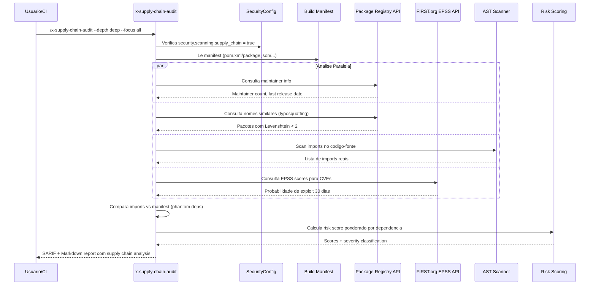

# Historia: Enhanced Supply Chain (x-supply-chain-audit)

**ID:** story-0022-0014
**Chave Jira:** ---
**Status:** Pendente

## 1. Dependencias

| Blocked By | Blocks |
| :--- | :--- |
| story-0022-0001, story-0022-0002 | story-0022-0019 |

## 2. Regras Transversais Aplicaveis

| ID | Titulo |
| :--- | :--- |
| RULE-001 | Isolamento de Contexto de Subagents |
| RULE-002 | Tool Abstraction Layer |
| RULE-005 | Qualidade de Relatorio |
| RULE-007 | Skill References Security KP |
| RULE-010 | Geracao Condicional por Feature Flag |
| RULE-014 | Backward Compatibility |

## 3. Descricao

Como **engenheiro de seguranca**, eu quero uma skill de analise profunda de supply chain que va alem do x-dependency-audit existente, garantindo que riscos avancados como maintainer risk, typosquatting, phantom dependencies e exploit prediction sejam identificados e priorizados.

O x-dependency-audit existente foca em CVEs conhecidas e licencas. Esta skill complementa (nao substitui) o x-dependency-audit com capacidades avancadas de supply chain analysis: identificacao de dependencias com single maintainer (bus factor = 1), deteccao de typosquatting via similaridade de nomes (Levenshtein distance), identificacao de phantom dependencies (usadas no codigo mas nao declaradas no manifest), analise de idade de dependencias (tempo desde ultimo release), scoring EPSS (Exploit Prediction Scoring System) para priorizacao de CVEs, e avaliacao de nivel SLSA (Supply-chain Levels for Software Artifacts).

O risk scoring combina multiplas dimensoes: CVE severity (40%), dependency depth (20%), maintainer risk (15%), license risk (15%) e popularity (10%). A skill extende, nao substitui, o x-dependency-audit conforme RULE-014.

### 3.1 Capacidades Avancadas

| Capacidade | Descricao | Metodo |
| :--- | :--- | :--- |
| Maintainer Risk | Dependencias com single maintainer | API registry (npm, Maven Central, PyPI) |
| Typosquatting | Nomes similares a pacotes populares | Levenshtein distance < 2 |
| Phantom Dependencies | Usadas no codigo mas nao declaradas | AST scan vs manifest diff |
| Dependency Age | Tempo desde ultimo release | Registry metadata |
| EPSS Scoring | Probabilidade de exploit em 30 dias | FIRST.org EPSS API |
| SLSA Assessment | Nivel de integridade do supply chain | Verificacao de provenance |

### 3.2 Parametros CLI

- `--depth`: shallow | deep (default: shallow)
- `--include-dev-deps`: flag para incluir dev dependencies (default: false)
- `--risk-threshold`: 0-100, findings abaixo do threshold sao excluidos (default: 0)
- `--focus`: all | maintainer | typosquatting | phantom | age | epss | slsa (default: all)

### 3.3 Risk Scoring Formula

`risk_score = (cve_severity * 0.40) + (depth_score * 0.20) + (maintainer_risk * 0.15) + (license_risk * 0.15) + (popularity_inverse * 0.10)`

- cve_severity: CVSS score normalizado 0-100
- depth_score: direct = 100, transitive depth 1 = 75, depth 2 = 50, depth 3+ = 25
- maintainer_risk: single = 100, 2-3 = 50, 4+ = 0
- license_risk: copyleft = 100, weak-copyleft = 50, permissive = 0, unknown = 75
- popularity_inverse: downloads < 1000/week = 100, < 10000 = 50, >= 10000 = 0

### 3.4 Relacao com x-dependency-audit

- x-dependency-audit: CVEs, licencas, versoes desatualizadas (permanece inalterado)
- x-supply-chain-audit: maintainer risk, typosquatting, phantom deps, EPSS, SLSA (novo)
- Ambas podem ser executadas independentemente
- x-security-dashboard agrega resultados de ambas

## 3.5 Entrega de Valor

- **Valor Principal:** Analise profunda de supply chain alem do x-dependency-audit
- **Metrica de Sucesso:** Identificacao de pelo menos 90% de single-maintainer dependencies e 95% de phantom dependencies
- **Impacto no Negocio:** Reducao de risco de supply chain attacks (typosquatting, dependency confusion) e priorizacao inteligente via EPSS

## 4. Definicoes de Qualidade Locais

### DoR Local

- [ ] SecurityConfig (story-0022-0001) com flag supply_chain implementado
- [ ] SARIF template (story-0022-0002) disponivel
- [ ] x-dependency-audit existente documentado (para evitar duplicacao)
- [ ] APIs de registry (npm, Maven Central, PyPI) documentadas

### DoD Local

- [ ] SKILL.md criado seguindo security-skill-template
- [ ] 6 capacidades avancadas implementadas
- [ ] Risk scoring formula com 5 dimensoes ponderadas
- [ ] Parametros CLI com depth shallow/deep e risk-threshold
- [ ] Deteccao de typosquatting via Levenshtein distance
- [ ] Deteccao de phantom dependencies via AST scan
- [ ] EPSS scoring integrado com FIRST.org API
- [ ] Output SARIF valido + Markdown report
- [ ] x-dependency-audit permanece inalterado (RULE-014)
- [ ] Testes para cada capacidade e build tool

### Global DoD

- **Cobertura:** >= 95% Line, >= 90% Branch
- **Testes Automatizados:** Unitarios + integracao golden file parity
- **Relatorio de Cobertura:** JaCoCo
- **Documentacao:** SKILL.md documentado
- **Persistencia:** N/A
- **Performance:** Geracao < 10s

## 5. Contratos de Dados

### 5.1 Parametros CLI

| Parametro | Tipo | M/O | Default | Validacoes | Exemplo |
| :--- | :--- | :--- | :--- | :--- | :--- |
| --depth | String | O | shallow | enum: shallow, deep | `--depth deep` |
| --include-dev-deps | boolean | O | false | — | `--include-dev-deps` |
| --risk-threshold | int | O | 0 | 0-100 | `--risk-threshold 50` |
| --focus | String | O | all | enum: all, maintainer, typosquatting, phantom, age, epss, slsa | `--focus maintainer` |

### 5.2 Supply Chain Finding

| Campo | Tipo | M/O | Validacoes | Exemplo |
| :--- | :--- | :--- | :--- | :--- |
| packageName | String | M | Non-empty | `"lodash"` |
| packageVersion | String | M | Semver valido | `"4.17.21"` |
| registry | String | M | enum: npm, maven, pypi, crates, go | `"npm"` |
| riskCategory | String | M | enum: maintainer, typosquatting, phantom, age, epss, slsa | `"maintainer"` |
| riskScore | int | M | 0-100 | `85` |
| severity | String | M | enum: CRITICAL, HIGH, MEDIUM, LOW, INFO | `"HIGH"` |
| detail | String | M | Non-empty | `"Single maintainer: user123"` |
| fixRecommendation | String | O | Non-empty | `"Evaluate alternative with more maintainers"` |

### 5.3 Supply Chain Summary

| Campo | Tipo | M/O | Validacoes | Exemplo |
| :--- | :--- | :--- | :--- | :--- |
| overallScore | int | M | 0-100 | `65` |
| grade | String | M | enum: A, B, C, D, F | `"C"` |
| totalDependencies | int | M | >= 0 | `142` |
| directDependencies | int | M | >= 0 | `23` |
| transitiveDependencies | int | M | >= 0 | `119` |
| singleMaintainerCount | int | M | >= 0 | `7` |
| typosquattingSuspects | int | M | >= 0 | `1` |
| phantomDependencies | int | M | >= 0 | `3` |
| staleDependencies | int | M | >= 0 | `12` |
| epssHighRisk | int | M | >= 0 | `2` |
| slsaLevel | String | O | enum: SLSA0, SLSA1, SLSA2, SLSA3 | `"SLSA1"` |

### 5.4 Risk Score Weights

| Dimensao | Peso | Range | Descricao |
| :--- | :--- | :--- | :--- |
| CVE Severity | 40% | 0-100 | CVSS score normalizado |
| Dependency Depth | 20% | 0-100 | direct=100, depth1=75, depth2=50, depth3+=25 |
| Maintainer Risk | 15% | 0-100 | single=100, 2-3=50, 4+=0 |
| License Risk | 15% | 0-100 | copyleft=100, weak=50, permissive=0, unknown=75 |
| Popularity | 10% | 0-100 | Inverse of downloads/week |

## 6. Diagramas

### 6.1 Fluxo de execucao do Supply Chain Audit



## 7. Criterios de Aceite (Gherkin)

```gherkin
Cenario: Projeto sem dependencias retorna score perfeito
  DADO que o projeto nao tem dependencias declaradas
  QUANDO /x-supply-chain-audit e executado
  ENTAO totalDependencies = 0
  E overallScore = 100
  E grade = "A"
  E nenhum finding e gerado

Cenario: Single maintainer dependency detectada com HIGH risk
  DADO que o projeto depende de "some-lib" versao "1.0.0"
  E "some-lib" tem apenas 1 maintainer no registry
  QUANDO /x-supply-chain-audit --focus maintainer e executado
  ENTAO 1 finding com riskCategory = "maintainer" e gerado
  E severity = "HIGH"
  E detail contem o nome do maintainer
  E fixRecommendation sugere avaliar alternativas

Cenario: Typosquatting detectado para nome similar a pacote popular
  DADO que o projeto depende de "1odash" (Levenshtein distance 1 de "lodash")
  QUANDO /x-supply-chain-audit --focus typosquatting e executado
  ENTAO 1 finding com riskCategory = "typosquatting" e gerado
  E severity = "CRITICAL"
  E detail contem o pacote similar detectado ("lodash")
  E fixRecommendation sugere verificar se o pacote correto esta sendo usado

Cenario: Phantom dependency detectada quando import nao declarado
  DADO que o codigo-fonte importa "com.google.gson.Gson"
  MAS o manifest (pom.xml) NAO declara dependencia de gson
  QUANDO /x-supply-chain-audit --focus phantom e executado
  ENTAO 1 finding com riskCategory = "phantom" e gerado
  E severity = "MEDIUM"
  E detail indica o import encontrado e o manifest verificado
  E fixRecommendation sugere declarar a dependencia explicitamente

Cenario: Risk threshold filtra findings abaixo do limiar
  DADO que o scan encontrou findings com risk scores: 90, 70, 40, 20
  E --risk-threshold=50 e configurado
  QUANDO o report e gerado
  ENTAO apenas findings com risk score >= 50 aparecem (2 findings)
  E findings com score 40 e 20 sao excluidos
```

## 8. Sub-tarefas

- [ ] [Dev] Criar SKILL.md para x-supply-chain-audit seguindo security-skill-template
- [ ] [Dev] Implementar deteccao de single maintainer via registry API
- [ ] [Dev] Implementar deteccao de typosquatting via Levenshtein distance
- [ ] [Dev] Implementar deteccao de phantom dependencies via AST scan vs manifest diff
- [ ] [Dev] Implementar analise de dependency age via registry metadata
- [ ] [Dev] Implementar integracao EPSS via FIRST.org API
- [ ] [Dev] Implementar avaliacao SLSA level
- [ ] [Dev] Implementar risk scoring formula com 5 dimensoes ponderadas
- [ ] [Dev] Implementar filtro por risk-threshold
- [ ] [Dev] Gerar output SARIF 2.1.0 + Markdown report
- [ ] [Test] Teste unitario: projeto sem dependencias retorna score perfeito
- [ ] [Test] Teste unitario: single maintainer detectado com HIGH
- [ ] [Test] Teste unitario: typosquatting detectado com CRITICAL
- [ ] [Test] Teste unitario: phantom dependency detectada com MEDIUM
- [ ] [Test] Teste unitario: risk threshold filtra corretamente
- [ ] [Test] Smoke/E2E: Executar x-supply-chain-audit contra projeto com dependencias conhecidas e validar report
- [ ] [Doc] Documentar capacidades, risk scoring e relacao com x-dependency-audit no SKILL.md
