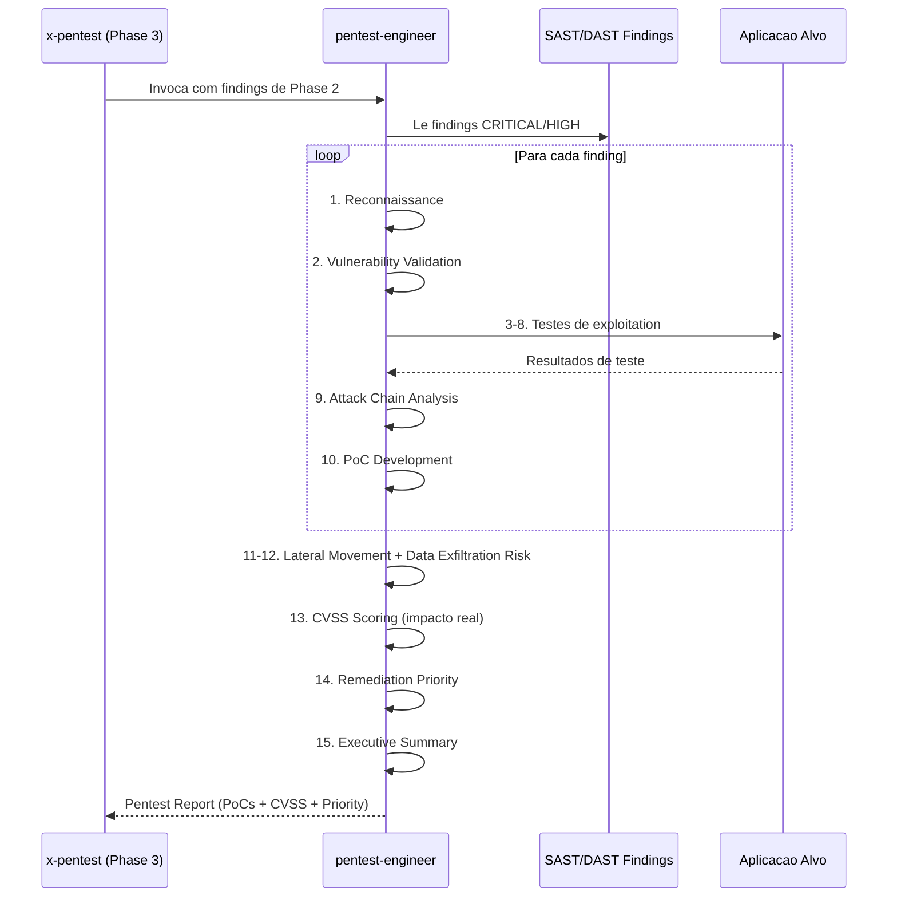

# Historia: Pentest Engineer Agent

**ID:** story-0022-0015
**Chave Jira:** ---
**Status:** Pendente

## 1. Dependencias

| Blocked By | Blocks |
| :--- | :--- |
| story-0022-0002 | story-0022-0018, story-0022-0026 |

## 2. Regras Transversais Aplicaveis

| ID | Titulo |
| :--- | :--- |
| RULE-006 | Persona Non-Interference |
| RULE-008 | Progressive Severity |
| RULE-012 | Agent Checklist Format |

## 3. Descricao

Como **Tech Lead de seguranca**, eu quero um agente especializado em seguranca ofensiva (pentest) que valide a exploitability real de vulnerabilidades encontradas, garantindo que a priorizacao de remediacao seja baseada em risco real e nao apenas em severidade teorica.

O pentest-engineer e uma persona ofensiva que complementa o security-engineer (defensivo) existente. Enquanto o security-engineer foca em code review e identificacao de vulnerabilidades potenciais, o pentest-engineer valida se essas vulnerabilidades sao realmente exploraveis, constroi attack chains, desenvolve PoCs (Proof of Concept) e atribui CVSS scores baseados em impacto real. O agente segue uma metodologia de 15 pontos cobrindo desde reconnaissance ate executive summary.

O escopo do pentest-engineer e estritamente ofensivo: exploitation, attack chains, PoC development. Ele NAO faz code review (escopo do security-engineer), NAO define processos SDLC (escopo do appsec-engineer), e NAO configura pipelines (escopo do devsecops-engineer), conforme RULE-006 (Persona Non-Interference). O agente e ativado quando `security.pentest: true` na configuracao do projeto.

### 3.1 Checklist de 15 Pontos

| # | Item | Descricao |
| :--- | :--- | :--- |
| 1 | Reconnaissance | Mapeamento de superficie de ataque, endpoints, tecnologias |
| 2 | Vulnerability Validation | Confirmar se findings de SAST/DAST sao realmente exploraveis |
| 3 | Auth Testing | Testar mecanismos de autenticacao (bypass, brute force, token) |
| 4 | Authz Testing | Testar controle de acesso (IDOR, privilege escalation, RBAC) |
| 5 | Injection Testing | Validar SQL, NoSQL, LDAP, OS command injection |
| 6 | XSS Validation | Testar stored, reflected, DOM-based XSS |
| 7 | Deserialization Testing | Testar insecure deserialization e gadget chains |
| 8 | SSRF Testing | Testar server-side request forgery e cloud metadata access |
| 9 | Attack Chain Analysis | Combinar vulnerabilidades individuais em cadeias de ataque |
| 10 | PoC Development | Criar proof-of-concept para vulnerabilidades confirmadas |
| 11 | Lateral Movement | Avaliar possibilidade de movimento lateral pos-exploitacao |
| 12 | Data Exfiltration Risk | Avaliar risco de exfiltracao de dados sensiveis |
| 13 | CVSS Scoring | Atribuir CVSS 4.0 baseado em impacto real (nao teorico) |
| 14 | Remediation Priority | Priorizar remediacao por risco real e effort |
| 15 | Executive Summary | Resumo executivo com risk rating e recomendacoes |

### 3.2 Escopo e Exclusoes (RULE-006)

- **Incluido:** Exploitation, attack chains, PoC development, CVSS scoring, remediation priority
- **Excluido:** Code review (security-engineer), SDLC processes (appsec-engineer), pipeline configuration (devsecops-engineer), compliance audit (compliance-auditor)

### 3.3 Ativacao Condicional

- Ativado quando `security.pentest: true` na configuracao do projeto
- Invocado pelo x-pentest orchestrator (story-0022-0018) na Phase 3
- Pode ser invocado diretamente por outros skills que precisem de validacao ofensiva

### 3.4 Output Format

- Markdown report seguindo formato do security-engineer existente
- Secoes: Executive Summary, Methodology, Findings (com PoC), Attack Chains, CVSS Scores, Remediation Priority
- Cada finding inclui: descricao, exploitability, impact, PoC steps, CVSS vector string

## 3.5 Entrega de Valor

- **Valor Principal:** Persona ofensiva que valida exploitability, priorizando remediacao por risco real
- **Metrica de Sucesso:** 100% dos findings CRITICAL/HIGH validados com PoC ou marcados como false positive
- **Impacto no Negocio:** Priorizacao de remediacao baseada em risco real, reduzindo falsos positivos e focando effort em vulnerabilidades exploraveis

## 4. Definicoes de Qualidade Locais

### DoR Local

- [ ] SARIF template (story-0022-0002) disponivel para input de findings
- [ ] security-engineer.md existente como referencia de formato de agente
- [ ] RULE-006 (Persona Non-Interference) documentado e compreendido
- [ ] Metodologia OWASP Testing Guide revisada

### DoD Local

- [ ] Agent file pentest-engineer.md criado no formato padrao
- [ ] 15-point checklist documentado com descricao detalhada de cada item
- [ ] Escopo e exclusoes (RULE-006) explicitamente declarados
- [ ] Condicao de ativacao (security.pentest: true) documentada
- [ ] Output format com PoC steps e CVSS vector string
- [ ] Sem sobreposicao com security-engineer, appsec-engineer, devsecops-engineer
- [ ] Recommended model definido

### Global DoD

- **Cobertura:** >= 95% Line, >= 90% Branch
- **Testes Automatizados:** Unitarios + integracao golden file parity
- **Relatorio de Cobertura:** JaCoCo
- **Documentacao:** SKILL.md documentado
- **Persistencia:** N/A
- **Performance:** Geracao < 10s

## 5. Contratos de Dados

N/A — artefato gerado e arquivo markdown (agent definition)

## 6. Diagramas

### 6.1 Fluxo de invocacao do Pentest Engineer



## 7. Criterios de Aceite (Gherkin)

```gherkin
Cenario: Agent file nao gerado quando security.pentest = false
  DADO que security.pentest = false na configuracao
  QUANDO o gerador processa a configuracao
  ENTAO o arquivo pentest-engineer.md NAO e gerado
  E nenhum erro e reportado

Cenario: Agent file gerado com 15-point checklist completo
  DADO que security.pentest = true na configuracao
  QUANDO o gerador processa a configuracao
  ENTAO o arquivo pentest-engineer.md e gerado
  E contem exatamente 15 items no checklist numerado
  E cada item tem descricao detalhada
  E o formato segue o padrao de security-engineer.md

Cenario: Escopo declarado sem sobreposicao com outros agentes
  DADO que o pentest-engineer.md foi gerado
  QUANDO a secao "Scope" e analisada
  ENTAO inclui: exploitation, attack chains, PoC development
  E exclui explicitamente: code review, SDLC, pipeline, compliance
  E nao ha sobreposicao com security-engineer, appsec-engineer, devsecops-engineer

Cenario: Output inclui CVSS vector string e PoC steps
  DADO que o pentest-engineer.md foi gerado
  QUANDO a secao "Output Format" e analisada
  ENTAO cada finding template inclui campo para CVSS 4.0 vector string
  E cada finding template inclui secao de PoC steps
  E cada finding template inclui remediation priority (1-N)

Cenario: Recommended model e persona definidos
  DADO que o pentest-engineer.md foi gerado
  QUANDO o conteudo e analisado
  ENTAO contem secao "Recommended Model"
  E contem secao "Persona" com descricao do papel ofensivo
  E contem secao "Role" com responsabilidades
  E contem secao "Conduct Rules" com limites eticos
```

## 8. Sub-tarefas

- [ ] [Dev] Criar pentest-engineer.md no formato padrao de agente
- [ ] [Dev] Documentar 15-point checklist com descricao detalhada
- [ ] [Dev] Definir escopo e exclusoes (RULE-006) na secao Scope
- [ ] [Dev] Definir output format com PoC steps e CVSS vector string
- [ ] [Dev] Definir condicao de ativacao (security.pentest: true)
- [ ] [Dev] Implementar geracao condicional no SkillsSelection/AgentSelection
- [ ] [Test] Teste unitario: agent nao gerado quando security.pentest = false
- [ ] [Test] Teste unitario: agent gerado com 15 items no checklist
- [ ] [Test] Teste unitario: escopo nao sobrepoe com outros agentes
- [ ] [Test] Teste unitario: output format inclui CVSS e PoC
- [ ] [Test] Smoke/E2E: Gerar ambiente com security.pentest=true e validar presenca do agent file
- [ ] [Doc] Documentar persona, checklist e exemplos de uso
