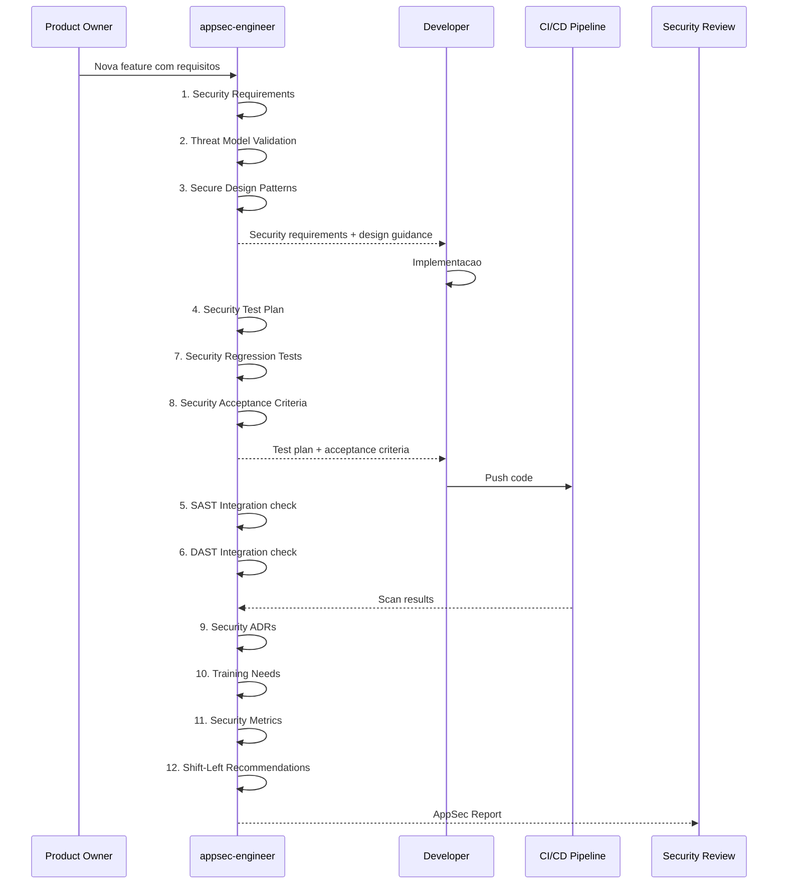

# Historia: AppSec Engineer Agent

**ID:** story-0022-0016
**Chave Jira:** ---
**Status:** Pendente

## 1. Dependencias

| Blocked By | Blocks |
| :--- | :--- |
| — | story-0022-0018, story-0022-0019, story-0022-0021 |

## 2. Regras Transversais Aplicaveis

| ID | Titulo |
| :--- | :--- |
| RULE-006 | Persona Non-Interference |
| RULE-012 | Agent Checklist Format |

## 3. Descricao

Como **Tech Lead de seguranca**, eu quero um agente especializado em Application Security (AppSec) para SDLC que integre seguranca em cada fase do ciclo de desenvolvimento, garantindo que security requirements, threat models, secure design patterns e security testing sejam parte nativa do processo de desenvolvimento.

O appsec-engineer e uma persona de seguranca focada no Software Development Lifecycle (SDLC). Enquanto o security-engineer faz code review e o pentest-engineer valida exploitation, o appsec-engineer garante que seguranca esteja integrada desde requirements ate deploy. O agente define security requirements para features, valida threat models, sugere secure design patterns, planeja security tests, integra SAST/DAST no pipeline, e rastreia metricas de seguranca (MTTR, vulnerability density).

O escopo do appsec-engineer e estritamente SDLC e arquitetura de seguranca: security requirements, threat model validation, secure design patterns, security test planning, SAST/DAST integration, security regression tests, security acceptance criteria, security documentation (ADRs), security training needs, security metrics, e shift-left recommendations. Ele NAO faz code review (security-engineer), NAO faz exploitation (pentest-engineer), e NAO configura pipelines de CI/CD (devsecops-engineer), conforme RULE-006. O agente e ativado quando `security.frameworks` e non-empty na configuracao.

### 3.1 Checklist de 12 Pontos

| # | Item | Descricao |
| :--- | :--- | :--- |
| 1 | Security Requirements | Definir requisitos de seguranca para cada feature/story |
| 2 | Threat Model Validation | Validar threat model existente ou sugerir criacao |
| 3 | Secure Design Patterns | Recomendar patterns seguros para arquitetura proposta |
| 4 | Security Test Plan | Planejar testes de seguranca (unitarios, integracao, E2E) |
| 5 | SAST Integration | Garantir integracao de SAST no desenvolvimento |
| 6 | DAST Integration | Garantir integracao de DAST em ambientes de teste |
| 7 | Security Regression Tests | Definir testes de regressao para vulnerabilidades corrigidas |
| 8 | Security Acceptance Criteria | Definir criterios de aceitacao de seguranca para stories |
| 9 | Security Documentation (ADRs) | Documentar decisoes de seguranca como ADRs |
| 10 | Security Training Needs | Identificar necessidades de treinamento do time |
| 11 | Security Metrics (MTTR, density) | Rastrear metricas de seguranca do projeto |
| 12 | Shift-Left Recommendations | Recomendar melhorias para antecipar seguranca no SDLC |

### 3.2 Escopo e Exclusoes (RULE-006)

- **Incluido:** SDLC security, architecture security, testing strategy, security requirements, threat model validation, ADRs, metrics
- **Excluido:** Code review (security-engineer), exploitation/PoC (pentest-engineer), pipeline/SLSA (devsecops-engineer), regulatory compliance (compliance-auditor)

### 3.3 Ativacao Condicional

- Ativado quando `security.frameworks` e non-empty (ex: ["owasp", "asvs"])
- Invocado pelo x-pentest orchestrator (story-0022-0018) para input de design review
- Referenciado pelo compliance-auditor (story-0022-0021) para SDLC evidence

### 3.4 Output Format

- Markdown report seguindo formato padrao de agentes
- Secoes: Security Requirements Review, Threat Model Status, Design Pattern Recommendations, Test Plan, SAST/DAST Status, Regression Tests, Acceptance Criteria, ADR Inventory, Training Gaps, Metrics Dashboard, Shift-Left Roadmap

## 3.5 Entrega de Valor

- **Valor Principal:** Persona de SDLC seguro que integra seguranca em cada fase do desenvolvimento
- **Metrica de Sucesso:** 100% das features com security requirements e acceptance criteria definidos
- **Impacto no Negocio:** Reducao de vulnerabilidades via shift-left, integrando seguranca no processo ao inves de verificar depois

## 4. Definicoes de Qualidade Locais

### DoR Local

- [ ] security-engineer.md existente como referencia de formato de agente
- [ ] RULE-006 (Persona Non-Interference) documentado e compreendido
- [ ] OWASP SAMM (Software Assurance Maturity Model) revisado como referencia
- [ ] Metricas de seguranca (MTTR, density) definidas

### DoD Local

- [ ] Agent file appsec-engineer.md criado no formato padrao
- [ ] 12-point checklist documentado com descricao detalhada
- [ ] Escopo e exclusoes (RULE-006) explicitamente declarados
- [ ] Condicao de ativacao (security.frameworks non-empty) documentada
- [ ] Output format com secoes de SDLC security
- [ ] Sem sobreposicao com security-engineer, pentest-engineer, devsecops-engineer
- [ ] Recommended model definido

### Global DoD

- **Cobertura:** >= 95% Line, >= 90% Branch
- **Testes Automatizados:** Unitarios + integracao golden file parity
- **Relatorio de Cobertura:** JaCoCo
- **Documentacao:** SKILL.md documentado
- **Persistencia:** N/A
- **Performance:** Geracao < 10s

## 5. Contratos de Dados

N/A — artefato gerado e arquivo markdown (agent definition)

## 6. Diagramas

### 6.1 Integracao do AppSec Engineer no SDLC



## 7. Criterios de Aceite (Gherkin)

```gherkin
Cenario: Agent file nao gerado quando security.frameworks vazio
  DADO que security.frameworks = [] na configuracao
  QUANDO o gerador processa a configuracao
  ENTAO o arquivo appsec-engineer.md NAO e gerado
  E nenhum erro e reportado

Cenario: Agent file gerado com 12-point checklist completo
  DADO que security.frameworks = ["owasp"] na configuracao
  QUANDO o gerador processa a configuracao
  ENTAO o arquivo appsec-engineer.md e gerado
  E contem exatamente 12 items no checklist numerado
  E cada item tem descricao detalhada
  E o formato segue o padrao de security-engineer.md

Cenario: Escopo SDLC declarado sem sobreposicao
  DADO que o appsec-engineer.md foi gerado
  QUANDO a secao "Scope" e analisada
  ENTAO inclui: SDLC, architecture, testing strategy
  E exclui explicitamente: code review, exploitation, pipeline, compliance
  E nao ha sobreposicao com security-engineer, pentest-engineer, devsecops-engineer, compliance-auditor

Cenario: Metricas de seguranca definidas no checklist
  DADO que o appsec-engineer.md foi gerado
  QUANDO o item 11 (Security Metrics) e analisado
  ENTAO inclui definicao de MTTR (Mean Time to Remediate)
  E inclui definicao de vulnerability density (vulns/KLOC)
  E inclui template de dashboard de metricas
  E inclui thresholds recomendados

Cenario: Shift-Left Recommendations tem exemplos acionaveis
  DADO que o appsec-engineer.md foi gerado
  QUANDO o item 12 (Shift-Left Recommendations) e analisado
  ENTAO inclui recomendacoes especificas por fase do SDLC
  E cada recomendacao tem prioridade (alta, media, baixa)
  E inclui exemplos concretos de implementacao
```

## 8. Sub-tarefas

- [ ] [Dev] Criar appsec-engineer.md no formato padrao de agente
- [ ] [Dev] Documentar 12-point checklist com descricao detalhada
- [ ] [Dev] Definir escopo e exclusoes (RULE-006) na secao Scope
- [ ] [Dev] Definir output format com secoes de SDLC security
- [ ] [Dev] Definir condicao de ativacao (security.frameworks non-empty)
- [ ] [Dev] Definir metricas de seguranca (MTTR, density, thresholds)
- [ ] [Dev] Implementar geracao condicional no AgentSelection
- [ ] [Test] Teste unitario: agent nao gerado quando security.frameworks vazio
- [ ] [Test] Teste unitario: agent gerado com 12 items no checklist
- [ ] [Test] Teste unitario: escopo nao sobrepoe com outros agentes
- [ ] [Test] Teste unitario: metricas de seguranca definidas
- [ ] [Test] Smoke/E2E: Gerar ambiente com security.frameworks=["owasp"] e validar presenca do agent file
- [ ] [Doc] Documentar persona, checklist e exemplos de uso
