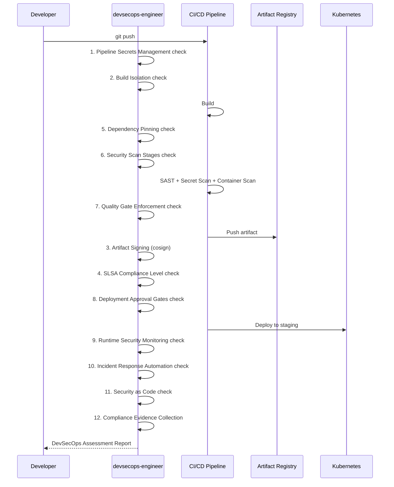

# Historia: DevSecOps Engineer Agent

**ID:** story-0022-0017
**Chave Jira:** ---
**Status:** Pendente

## 1. Dependencias

| Blocked By | Blocks |
| :--- | :--- |
| — | story-0022-0019 |

## 2. Regras Transversais Aplicaveis

| ID | Titulo |
| :--- | :--- |
| RULE-006 | Persona Non-Interference |
| RULE-012 | Agent Checklist Format |

## 3. Descricao

Como **Tech Lead de seguranca**, eu quero um agente especializado em DevSecOps que garanta a seguranca do pipeline de CI/CD, artifact signing e SLSA compliance, garantindo que o processo de build e deploy seja seguro desde o commit ate a producao.

O devsecops-engineer e uma persona focada na seguranca do pipeline de entrega de software. Enquanto o security-engineer faz code review, o pentest-engineer valida exploitation, e o appsec-engineer cuida do SDLC, o devsecops-engineer garante que o pipeline de CI/CD seja seguro: secrets management, build isolation, artifact signing (cosign/sigstore), SLSA compliance, dependency pinning, security scan stages, quality gate enforcement, deployment approval gates, runtime security monitoring, incident response automation, security as code, e compliance evidence collection.

O escopo do devsecops-engineer e estritamente pipeline, signing e SLSA. Ele NAO faz code review (security-engineer), NAO define processos SDLC (appsec-engineer), e NAO faz exploitation (pentest-engineer), conforme RULE-006. O agente e ativado quando `infrastructure.container != "none"` OU `infrastructure.orchestrator != "none"` na configuracao.

### 3.1 Checklist de 12 Pontos

| # | Item | Descricao |
| :--- | :--- | :--- |
| 1 | Pipeline Secrets Management | Verificar que secrets nao estao hardcoded, usar vault/sealed secrets |
| 2 | Build Isolation | Garantir que builds executam em ambientes isolados (containers efemeros) |
| 3 | Artifact Signing (cosign/sigstore) | Assinar artifacts com cosign, verificar signatures antes do deploy |
| 4 | SLSA Compliance Level | Avaliar e atingir nivel SLSA adequado (L1-L3) |
| 5 | Dependency Pinning | Garantir que todas as dependencias usam versoes fixas (hash pinning) |
| 6 | Security Scan Stages | Verificar que SAST, DAST, secret scan, container scan estao no pipeline |
| 7 | Quality Gate Enforcement | Garantir que quality gates bloqueiam merges com vulnerabilidades |
| 8 | Deployment Approval Gates | Verificar gates de aprovacao para ambientes criticos (staging, prod) |
| 9 | Runtime Security Monitoring | Verificar monitoramento de seguranca em runtime (falco, sysdig) |
| 10 | Incident Response Automation | Verificar automacao de incident response (alertas, rollback automatico) |
| 11 | Security as Code | Verificar que policies de seguranca sao definidas como codigo (OPA, Kyverno) |
| 12 | Compliance Evidence Collection | Coletar evidencias de compliance automaticamente do pipeline |

### 3.2 Escopo e Exclusoes (RULE-006)

- **Incluido:** Pipeline security, artifact signing, SLSA compliance, build isolation, deployment gates, runtime monitoring, security as code
- **Excluido:** Code review (security-engineer), SDLC processes (appsec-engineer), exploitation/PoC (pentest-engineer), regulatory compliance (compliance-auditor)

### 3.3 Ativacao Condicional

- Ativado quando `infrastructure.container != "none"` OU `infrastructure.orchestrator != "none"`
- Referenciado pelo x-security-dashboard (story-0022-0019) para pipeline security status
- Output alimenta x-security-pipeline (story-0022-0020) com recomendacoes de stages

### 3.4 Output Format

- Markdown report seguindo formato padrao de agentes
- Secoes: Pipeline Security Assessment, Secrets Management Status, Build Isolation Status, Artifact Signing Status, SLSA Level, Dependency Pinning Status, Security Scan Coverage, Quality Gates, Deployment Gates, Runtime Monitoring, Security as Code, Compliance Evidence

## 3.5 Entrega de Valor

- **Valor Principal:** Persona de pipeline security que garante SLSA compliance e artifact signing
- **Metrica de Sucesso:** Pipeline avaliado contra 12-point checklist com score de maturidade
- **Impacto no Negocio:** Supply chain security end-to-end, desde build isolation ate runtime monitoring

## 4. Definicoes de Qualidade Locais

### DoR Local

- [ ] security-engineer.md existente como referencia de formato de agente
- [ ] RULE-006 (Persona Non-Interference) documentado e compreendido
- [ ] SLSA framework (levels 1-3) documentado como referencia
- [ ] cosign/sigstore documentados como referencia

### DoD Local

- [ ] Agent file devsecops-engineer.md criado no formato padrao
- [ ] 12-point checklist documentado com descricao detalhada
- [ ] Escopo e exclusoes (RULE-006) explicitamente declarados
- [ ] Condicao de ativacao (container/orchestrator != "none") documentada
- [ ] Output format com secoes de pipeline security
- [ ] Sem sobreposicao com security-engineer, pentest-engineer, appsec-engineer
- [ ] SLSA levels (L1-L3) descritos com criterios por nivel
- [ ] Recommended model definido

### Global DoD

- **Cobertura:** >= 95% Line, >= 90% Branch
- **Testes Automatizados:** Unitarios + integracao golden file parity
- **Relatorio de Cobertura:** JaCoCo
- **Documentacao:** SKILL.md documentado
- **Persistencia:** N/A
- **Performance:** Geracao < 10s

## 5. Contratos de Dados

N/A — artefato gerado e arquivo markdown (agent definition)

## 6. Diagramas

### 6.1 Escopo do DevSecOps Engineer no Pipeline



## 7. Criterios de Aceite (Gherkin)

```gherkin
Cenario: Agent file nao gerado quando container e orchestrator sao "none"
  DADO que infrastructure.container = "none"
  E infrastructure.orchestrator = "none"
  QUANDO o gerador processa a configuracao
  ENTAO o arquivo devsecops-engineer.md NAO e gerado
  E nenhum erro e reportado

Cenario: Agent file gerado quando container != "none"
  DADO que infrastructure.container = "docker"
  E infrastructure.orchestrator = "none"
  QUANDO o gerador processa a configuracao
  ENTAO o arquivo devsecops-engineer.md e gerado
  E contem exatamente 12 items no checklist numerado
  E o formato segue o padrao de security-engineer.md

Cenario: Agent file gerado quando orchestrator != "none"
  DADO que infrastructure.container = "none"
  E infrastructure.orchestrator = "kubernetes"
  QUANDO o gerador processa a configuracao
  ENTAO o arquivo devsecops-engineer.md e gerado
  E contem items especificos de Kubernetes (runtime monitoring, security as code)

Cenario: Escopo pipeline declarado sem sobreposicao
  DADO que o devsecops-engineer.md foi gerado
  QUANDO a secao "Scope" e analisada
  ENTAO inclui: pipeline, signing, SLSA
  E exclui explicitamente: code review, SDLC, exploitation, compliance
  E nao ha sobreposicao com security-engineer, pentest-engineer, appsec-engineer, compliance-auditor

Cenario: SLSA levels documentados com criterios claros
  DADO que o devsecops-engineer.md foi gerado
  QUANDO o item 4 (SLSA Compliance Level) e analisado
  ENTAO inclui criterios para SLSA L1 (provenance basico)
  E inclui criterios para SLSA L2 (provenance assinado)
  E inclui criterios para SLSA L3 (build isolation + provenance nao-falsificavel)
  E cada nivel tem verificacoes especificas
```

## 8. Sub-tarefas

- [ ] [Dev] Criar devsecops-engineer.md no formato padrao de agente
- [ ] [Dev] Documentar 12-point checklist com descricao detalhada
- [ ] [Dev] Definir escopo e exclusoes (RULE-006) na secao Scope
- [ ] [Dev] Definir SLSA levels (L1-L3) com criterios de verificacao
- [ ] [Dev] Definir output format com secoes de pipeline security
- [ ] [Dev] Definir condicao de ativacao (container/orchestrator != "none")
- [ ] [Dev] Implementar geracao condicional no AgentSelection
- [ ] [Test] Teste unitario: agent nao gerado quando container e orchestrator = "none"
- [ ] [Test] Teste unitario: agent gerado quando container = "docker"
- [ ] [Test] Teste unitario: agent gerado quando orchestrator = "kubernetes"
- [ ] [Test] Teste unitario: escopo nao sobrepoe com outros agentes
- [ ] [Test] Smoke/E2E: Gerar ambiente com container=docker e validar presenca do agent file
- [ ] [Doc] Documentar persona, SLSA levels e exemplos de uso
