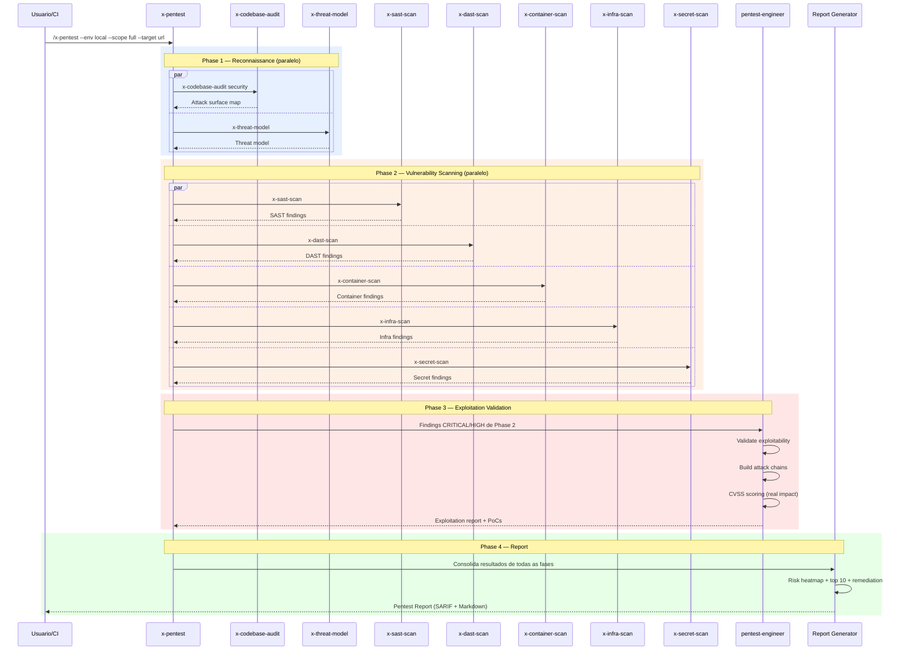
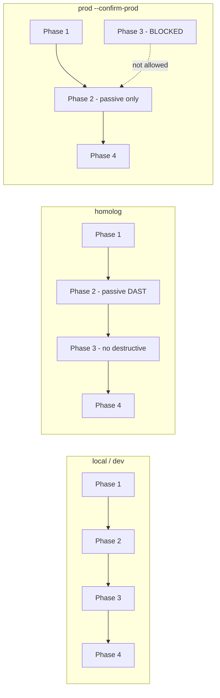

# Historia: Pentest Orchestrator (x-pentest)

**ID:** story-0022-0018
**Chave Jira:** ---
**Status:** Pendente

## 1. Dependencias

| Blocked By | Blocks |
| :--- | :--- |
| story-0022-0005, story-0022-0006, story-0022-0007, story-0022-0008, story-0022-0009, story-0022-0012, story-0022-0013, story-0022-0015, story-0022-0016 | story-0022-0022 |

## 2. Regras Transversais Aplicaveis

| ID | Titulo |
| :--- | :--- |
| RULE-001 | Skill Idempotency |
| RULE-004 | Environment Parameterization |
| RULE-005 | Qualidade de Relatorio |
| RULE-008 | Progressive Severity |
| RULE-011 | Skill Composability |

## 3. Descricao

Como **engenheiro de seguranca**, eu quero um framework de pentest multi-fase que orquestre todas as skills de scanning e o pentest-engineer agent em uma sequencia metodologica, garantindo que pentests sejam executados de forma completa, repetivel e com restricoes de ambiente adequadas.

O x-pentest e o orquestrador central de pentest que combina skills atomicas em 4 fases: Phase 1 (Reconnaissance) usa x-codebase-audit security + x-threat-model para mapeamento de superficie de ataque. Phase 2 (Vulnerability Scanning) executa x-sast-scan + x-dast-scan + x-container-scan + x-infra-scan + x-secret-scan em paralelo para identificacao de vulnerabilidades. Phase 3 (Exploitation Validation) invoca o pentest-engineer agent para validar exploitability dos findings CRITICAL/HIGH. Phase 4 (Report) consolida todos os resultados em um report executivo com score, risk heatmap e remediation priority.

Restricoes por ambiente sao criticas: local/dev permitem todas as 4 fases sem restricao. Homolog permite Phases 1-4 mas sem testes destrutivos (DAST passivo, rate limiting test desabilitado). Producao permite APENAS Phases 1-2 com DAST exclusivamente passivo, e requer flag explicita --confirm-prod para execucao.

### 3.1 Fases de Execucao

| Phase | Nome | Skills Invocadas | Paralelo |
| :--- | :--- | :--- | :--- |
| 1 | Reconnaissance | x-codebase-audit (security), x-threat-model | Sim |
| 2 | Vulnerability Scanning | x-sast-scan, x-dast-scan, x-container-scan, x-infra-scan, x-secret-scan | Sim |
| 3 | Exploitation Validation | pentest-engineer agent, appsec-engineer (design review) | Nao |
| 4 | Report | Consolidacao + scoring + heatmap | Nao |

### 3.2 Parametros CLI

- `--env`: local | dev | homolog | prod (default: local)
- `--phase`: 1 | 2 | 3 | 4 | all (default: all)
- `--scope`: full | quick (default: full)
- `--confirm-prod`: flag obrigatoria para execucao em producao
- `--target`: URL da aplicacao alvo (obrigatorio para Phases 2-3)

### 3.3 Restricoes por Ambiente

| Ambiente | Phase 1 | Phase 2 | Phase 3 | Phase 4 | Restricoes |
| :--- | :--- | :--- | :--- | :--- | :--- |
| local | Sim | Sim | Sim | Sim | Nenhuma |
| dev | Sim | Sim | Sim | Sim | Nenhuma |
| homolog | Sim | Sim (DAST passivo) | Sim (sem destrutivos) | Sim | No destructive tests |
| prod | Sim | Sim (DAST passivo only) | NAO | Sim | --confirm-prod required, passive only |

### 3.4 Quick vs Full Scope

- **quick**: Phase 1 (threat model only) + Phase 2 (SAST + secret scan only) + Phase 4. Sem Phase 3.
- **full**: Todas as 4 fases com todas as skills.

### 3.5 Report Consolidado

- Executive summary com overall risk rating
- Per-phase results com findings agregados
- Risk heatmap (severity x category)
- Top 10 critical findings com remediation priority
- Trend comparison (se resultado anterior disponivel)
- SARIF consolidado com findings de todas as skills

## 3.5 Entrega de Valor

- **Valor Principal:** Framework de pentest multi-fase com suporte a ambientes local/dev/homolog/prod
- **Metrica de Sucesso:** Execucao completa das 4 fases em ambiente local com consolidacao de resultados de 7+ skills
- **Impacto no Negocio:** Pentest automatizado e repetivel, reduzindo dependencia de pentests manuais e garantindo cobertura consistente

## 4. Definicoes de Qualidade Locais

### DoR Local

- [ ] SAST Scanner (story-0022-0005) implementado
- [ ] Secret Scanner (story-0022-0006) implementado
- [ ] Container Scanner (story-0022-0007) implementado
- [ ] Infra Scanner (story-0022-0008) implementado
- [ ] DAST Scanner (story-0022-0009) implementado
- [ ] Hardening Eval (story-0022-0012) implementado
- [ ] Runtime Protection (story-0022-0013) implementado
- [ ] Pentest Engineer Agent (story-0022-0015) implementado
- [ ] AppSec Engineer Agent (story-0022-0016) implementado

### DoD Local

- [ ] SKILL.md criado seguindo security-skill-template
- [ ] 4 fases implementadas com orquestracao sequencial/paralela
- [ ] Restricoes por ambiente (local/dev/homolog/prod) enforced
- [ ] --confirm-prod obrigatorio para producao
- [ ] Quick scope implementado como subset de full
- [ ] Report consolidado com risk heatmap e top 10 findings
- [ ] SARIF consolidado com findings de todas as skills
- [ ] Invocacao de skills via subagent (RULE-011, sem duplicacao de logica)
- [ ] Error handling para skill failures (partial results)

### Global DoD

- **Cobertura:** >= 95% Line, >= 90% Branch
- **Testes Automatizados:** Unitarios + integracao golden file parity
- **Relatorio de Cobertura:** JaCoCo
- **Documentacao:** SKILL.md documentado
- **Persistencia:** N/A
- **Performance:** Geracao < 10s

## 5. Contratos de Dados

### 5.1 Parametros CLI

| Parametro | Tipo | M/O | Default | Validacoes | Exemplo |
| :--- | :--- | :--- | :--- | :--- | :--- |
| --env | String | O | local | enum: local, dev, homolog, prod | `--env homolog` |
| --phase | String | O | all | enum: 1, 2, 3, 4, all | `--phase 2` |
| --scope | String | O | full | enum: full, quick | `--scope quick` |
| --confirm-prod | boolean | O | false | Required when --env=prod | `--confirm-prod` |
| --target | String | M* | — | URL valida (* obrigatorio para Phases 2-3) | `--target https://app.example.com` |

### 5.2 Phase Result

| Campo | Tipo | M/O | Validacoes | Exemplo |
| :--- | :--- | :--- | :--- | :--- |
| phase | int | M | 1-4 | `2` |
| phaseName | String | M | Non-empty | `"Vulnerability Scanning"` |
| status | String | M | enum: COMPLETED, PARTIAL, SKIPPED, FAILED | `"COMPLETED"` |
| skillsExecuted | List<String> | M | Non-empty | `["x-sast-scan", "x-dast-scan"]` |
| skillsFailed | List<String> | O | Skills que falharam | `["x-container-scan"]` |
| findingsCount | int | M | >= 0 | `23` |
| criticalCount | int | M | >= 0 | `2` |
| highCount | int | M | >= 0 | `5` |
| duration | String | M | ISO 8601 duration | `"PT5M30S"` |

### 5.3 Pentest Summary

| Campo | Tipo | M/O | Validacoes | Exemplo |
| :--- | :--- | :--- | :--- | :--- |
| overallScore | int | M | 0-100 | `62` |
| grade | String | M | enum: A, B, C, D, F | `"C"` |
| environment | String | M | enum: local, dev, homolog, prod | `"local"` |
| scope | String | M | enum: full, quick | `"full"` |
| phases | List<PhaseResult> | M | 1-4 items | `[...]` |
| totalFindings | int | M | >= 0 | `47` |
| exploitableFindings | int | M | >= 0 (Phase 3 result) | `8` |
| riskHeatmap | Map<String, Map<String, int>> | M | category x severity | `{"injection": {"CRITICAL": 2}}` |
| top10Findings | List<Finding> | M | Max 10 | `[...]` |
| remediationPriority | List<Finding> | M | Ordered by priority | `[...]` |

### 5.4 Environment Restrictions

| Ambiente | Restricao | Enforcement |
| :--- | :--- | :--- |
| local | Nenhuma | — |
| dev | Nenhuma | — |
| homolog | DAST passivo, sem testes destrutivos | x-dast-scan --mode=passive, x-runtime-protection --intensity=passive |
| prod | Phase 1+2 only, DAST passivo, --confirm-prod | Bloqueia Phase 3, erro sem --confirm-prod |

## 6. Diagramas

### 6.1 Fluxo de orquestracao multi-fase



### 6.2 Restricoes por ambiente



## 7. Criterios de Aceite (Gherkin)

```gherkin
Cenario: Producao sem --confirm-prod retorna erro
  DADO que --env=prod e selecionado
  E --confirm-prod NAO e fornecido
  QUANDO /x-pentest e executado
  ENTAO o output contem erro "Production environment requires --confirm-prod flag"
  E nenhuma fase e executada

Cenario: Execucao completa em ambiente local com todas as 4 fases
  DADO que --env=local e selecionado
  E --scope=full e selecionado
  E --target aponta para aplicacao acessivel
  QUANDO /x-pentest e executado
  ENTAO Phase 1 executa x-codebase-audit e x-threat-model em paralelo
  E Phase 2 executa 5 scanners em paralelo
  E Phase 3 invoca pentest-engineer com findings CRITICAL/HIGH
  E Phase 4 gera report consolidado
  E o report contem riskHeatmap e top10Findings

Cenario: Homolog restringe DAST a modo passivo
  DADO que --env=homolog e selecionado
  E --scope=full e selecionado
  QUANDO /x-pentest e executado
  ENTAO x-dast-scan e invocado com --mode=passive
  E x-runtime-protection e invocado com --intensity=passive
  E testes destrutivos NAO sao executados
  E o report indica restricoes aplicadas

Cenario: Producao bloqueia Phase 3 completamente
  DADO que --env=prod e selecionado
  E --confirm-prod e fornecido
  QUANDO /x-pentest e executado
  ENTAO Phase 1 e executada normalmente
  E Phase 2 e executada com DAST passivo only
  E Phase 3 tem status SKIPPED com motivo "Production environment"
  E Phase 4 gera report sem exploitation validation

Cenario: Quick scope executa subset de fases e skills
  DADO que --scope=quick e selecionado
  QUANDO /x-pentest e executado
  ENTAO Phase 1 executa apenas x-threat-model (sem x-codebase-audit)
  E Phase 2 executa apenas x-sast-scan e x-secret-scan
  E Phase 3 tem status SKIPPED
  E Phase 4 gera report com resultados parciais

Cenario: Falha em skill individual nao bloqueia demais fases
  DADO que x-container-scan falha durante Phase 2
  MAS as demais skills de Phase 2 completam com sucesso
  QUANDO Phase 2 finaliza
  ENTAO Phase 2 tem status PARTIAL
  E skillsFailed contem "x-container-scan"
  E Phase 3 prossegue com findings disponiveis
  E o report indica a skill que falhou
```

## 8. Sub-tarefas

- [ ] [Dev] Criar SKILL.md para x-pentest seguindo security-skill-template
- [ ] [Dev] Implementar Phase 1 (Reconnaissance) com invocacao paralela de subagents
- [ ] [Dev] Implementar Phase 2 (Vulnerability Scanning) com 5 scanners em paralelo
- [ ] [Dev] Implementar Phase 3 (Exploitation Validation) com pentest-engineer agent
- [ ] [Dev] Implementar Phase 4 (Report) com consolidacao, risk heatmap e top 10
- [ ] [Dev] Implementar restricoes por ambiente (local/dev/homolog/prod)
- [ ] [Dev] Implementar --confirm-prod enforcement para producao
- [ ] [Dev] Implementar quick vs full scope
- [ ] [Dev] Implementar handling de skill failures (partial results)
- [ ] [Dev] Gerar SARIF consolidado + Markdown report executivo
- [ ] [Test] Teste unitario: producao sem --confirm-prod retorna erro
- [ ] [Test] Teste unitario: todas as 4 fases executam em local
- [ ] [Test] Teste unitario: homolog restringe DAST a passivo
- [ ] [Test] Teste unitario: producao bloqueia Phase 3
- [ ] [Test] Teste unitario: quick scope executa subset
- [ ] [Test] Teste unitario: falha em skill nao bloqueia demais
- [ ] [Test] Smoke/E2E: Executar x-pentest --scope quick --env local contra aplicacao de exemplo
- [ ] [Doc] Documentar fases, restricoes por ambiente e exemplos de uso no SKILL.md
