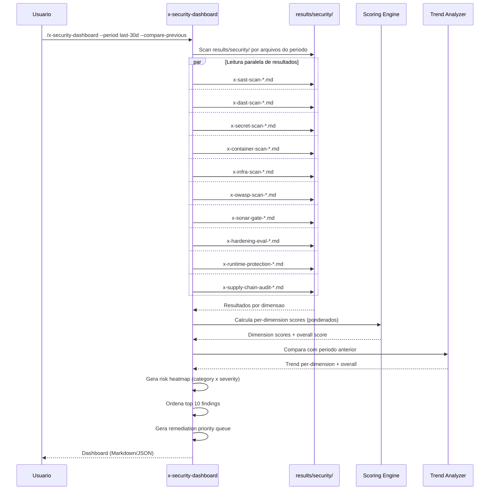
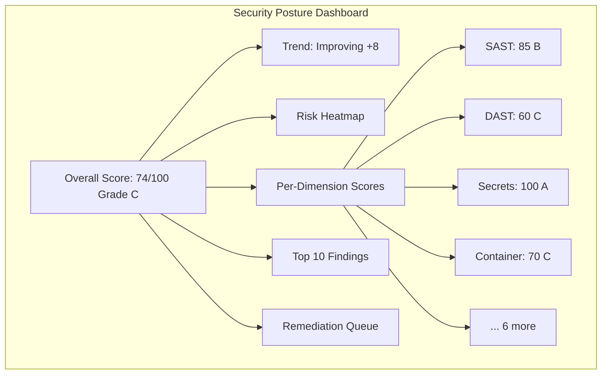

# Historia: Security Posture Dashboard (x-security-dashboard)

**ID:** story-0022-0019
**Chave Jira:** ---
**Status:** Pendente

## 1. Dependencias

| Blocked By | Blocks |
| :--- | :--- |
| story-0022-0005, story-0022-0006, story-0022-0007, story-0022-0008, story-0022-0009, story-0022-0010, story-0022-0011, story-0022-0012, story-0022-0013, story-0022-0014, story-0022-0016, story-0022-0017 | story-0022-0022 |

## 2. Regras Transversais Aplicaveis

| ID | Titulo |
| :--- | :--- |
| RULE-001 | Skill Idempotency |
| RULE-005 | Qualidade de Relatorio |
| RULE-011 | Skill Composability |

## 3. Descricao

Como **Tech Lead de seguranca**, eu quero um dashboard consolidado de postura de seguranca que agregue resultados de todas as skills de scanning em uma visao unificada, garantindo que o status geral de seguranca do projeto seja visivel em um unico report com score, trends e risk heatmap.

O x-security-dashboard e o ponto central de visibilidade de seguranca do projeto. Ele le resultados salvos em `results/security/` de todas as skills executadas: SAST (x-sast-scan), DAST (x-dast-scan), secrets (x-secret-scan), containers (x-container-scan), infra (x-infra-scan), OWASP (x-owasp-scan), SonarQube (x-sonar-gate), hardening (x-hardening-eval), runtime protection (x-runtime-protection), supply chain (x-supply-chain-audit), e dependency audit (x-dependency-audit). NAO executa scans — apenas agrega resultados existentes (RULE-011).

O dashboard computa: overall score (0-100) como media ponderada das dimensoes, per-dimension scores, risk heatmap (categoria x severidade), trend analysis (improving/stable/degrading comparando com periodo anterior), top 10 findings por risco, e remediation priority queue ordenada por impacto e effort. Suporta periodos de analise (7d, 30d, 90d, all) e comparacao com periodo anterior.

### 3.1 Dimensoes Agregadas

| Dimensao | Fonte | Peso |
| :--- | :--- | :--- |
| Static Analysis | x-sast-scan | 20% |
| Dynamic Analysis | x-dast-scan | 15% |
| Secrets | x-secret-scan | 15% |
| Container Security | x-container-scan | 10% |
| Infrastructure | x-infra-scan | 10% |
| OWASP Compliance | x-owasp-scan | 10% |
| Code Quality (Security) | x-sonar-gate | 5% |
| Hardening | x-hardening-eval | 5% |
| Runtime Protection | x-runtime-protection | 5% |
| Supply Chain | x-supply-chain-audit + x-dependency-audit | 5% |

### 3.2 Parametros CLI

- `--period`: last-7d | last-30d | last-90d | all (default: all)
- `--format`: markdown | json (default: markdown)
- `--compare-previous`: flag para incluir comparacao com periodo anterior

### 3.3 Trend Analysis

- **improving**: score atual > score periodo anterior em pelo menos 5 pontos
- **stable**: diferenca < 5 pontos
- **degrading**: score atual < score periodo anterior em pelo menos 5 pontos
- Trend calculado por dimensao e overall

### 3.4 Risk Heatmap

Matriz de categoria (OWASP Top 10 categories) x severidade (CRITICAL, HIGH, MEDIUM, LOW) com contagem de findings por celula. Renderizado em formato Markdown table com cores via emoji indicators.

## 3.5 Entrega de Valor

- **Valor Principal:** Visao consolidada de postura de seguranca com score, trend e risk heatmap
- **Metrica de Sucesso:** Dashboard gerado em < 5s agregando resultados de 10+ skills
- **Impacto no Negocio:** Visibilidade executiva de seguranca, facilitando decisoes de priorizacao e comunicacao com stakeholders

## 4. Definicoes de Qualidade Locais

### DoR Local

- [ ] Todas as 10 skills de scanning implementadas (stories 0005-0014)
- [ ] AppSec Engineer Agent (story-0022-0016) implementado
- [ ] DevSecOps Engineer Agent (story-0022-0017) implementado
- [ ] Formato de resultados em results/security/ padronizado
- [ ] SARIF como formato intermediario disponivel

### DoD Local

- [ ] SKILL.md criado seguindo security-skill-template
- [ ] Agregacao de resultados de 10+ dimensoes implementada
- [ ] Score ponderado overall + per-dimension calculado
- [ ] Risk heatmap (categoria x severidade) implementado
- [ ] Trend analysis (improving/stable/degrading) implementado
- [ ] Top 10 findings com remediation priority queue
- [ ] Comparacao com periodo anterior (--compare-previous)
- [ ] Graceful handling de dimensoes sem resultados
- [ ] Output Markdown e JSON

### Global DoD

- **Cobertura:** >= 95% Line, >= 90% Branch
- **Testes Automatizados:** Unitarios + integracao golden file parity
- **Relatorio de Cobertura:** JaCoCo
- **Documentacao:** SKILL.md documentado
- **Persistencia:** N/A
- **Performance:** Geracao < 10s

## 5. Contratos de Dados

### 5.1 Parametros CLI

| Parametro | Tipo | M/O | Default | Validacoes | Exemplo |
| :--- | :--- | :--- | :--- | :--- | :--- |
| --period | String | O | all | enum: last-7d, last-30d, last-90d, all | `--period last-30d` |
| --format | String | O | markdown | enum: markdown, json | `--format json` |
| --compare-previous | boolean | O | false | — | `--compare-previous` |

### 5.2 Dimension Score

| Campo | Tipo | M/O | Validacoes | Exemplo |
| :--- | :--- | :--- | :--- | :--- |
| dimension | String | M | Non-empty | `"Static Analysis"` |
| source | String | M | Skill name | `"x-sast-scan"` |
| weight | float | M | 0.0-1.0 | `0.20` |
| score | int | M | 0-100 | `85` |
| grade | String | M | enum: A, B, C, D, F | `"B"` |
| findingsCount | int | M | >= 0 | `12` |
| criticalCount | int | M | >= 0 | `1` |
| highCount | int | M | >= 0 | `3` |
| trend | String | O | enum: improving, stable, degrading | `"improving"` |
| lastScanDate | String | M | ISO-8601 | `"2026-04-05"` |
| available | boolean | M | — | `true` |

### 5.3 Dashboard Summary

| Campo | Tipo | M/O | Validacoes | Exemplo |
| :--- | :--- | :--- | :--- | :--- |
| overallScore | int | M | 0-100 | `74` |
| overallGrade | String | M | enum: A, B, C, D, F | `"C"` |
| overallTrend | String | O | enum: improving, stable, degrading | `"improving"` |
| period | String | M | enum values | `"last-30d"` |
| dimensions | List<DimensionScore> | M | 1-10 items | `[...]` |
| totalFindings | int | M | >= 0 | `87` |
| top10Findings | List<Finding> | M | Max 10 | `[...]` |
| remediationQueue | List<Finding> | M | Ordered by priority | `[...]` |
| riskHeatmap | Map<String, Map<String, int>> | M | category x severity | `{"A01": {"CRITICAL": 1}}` |
| dimensionsAvailable | int | M | 0-10 | `8` |
| dimensionsMissing | List<String> | O | Dimensoes sem resultado | `["x-container-scan"]` |

### 5.4 Risk Heatmap Structure

| Campo | Tipo | Descricao | Exemplo |
| :--- | :--- | :--- | :--- |
| rows | List<String> | Categorias (OWASP A01-A10 + CUSTOM) | `["A01", "A02", ...]` |
| columns | List<String> | Severidades | `["CRITICAL", "HIGH", "MEDIUM", "LOW"]` |
| cells | Map<String, Map<String, int>> | Contagem por celula | `{"A01": {"CRITICAL": 2, "HIGH": 5}}` |
| totals | Map<String, int> | Total por severidade | `{"CRITICAL": 3, "HIGH": 12}` |

## 6. Diagramas

### 6.1 Fluxo de agregacao do Security Dashboard



### 6.2 Estrutura do Dashboard



## 7. Criterios de Aceite (Gherkin)

```gherkin
Cenario: Nenhum resultado disponivel gera dashboard vazio com score N/A
  DADO que o diretorio results/security/ esta vazio
  QUANDO /x-security-dashboard e executado
  ENTAO o dashboard e gerado com dimensionsAvailable = 0
  E overallScore = 0
  E dimensionsMissing lista todas as 10 dimensoes
  E o report indica "No scan results available"

Cenario: Dashboard com todas as 10 dimensoes disponiveis
  DADO que results/security/ contem resultados de todas as 10 skills
  E todos os resultados sao do periodo last-30d
  QUANDO /x-security-dashboard --period last-30d e executado
  ENTAO dimensionsAvailable = 10
  E dimensionsMissing esta vazio
  E overallScore e media ponderada das 10 dimensoes
  E risk heatmap tem entries para categorias com findings
  E top10Findings contem os 10 findings de maior risco

Cenario: Dimensao sem resultado nao afeta score das demais
  DADO que results/security/ contem resultados de 8 das 10 skills
  E x-container-scan e x-infra-scan nao tem resultados
  QUANDO /x-security-dashboard e executado
  ENTAO dimensionsAvailable = 8
  E dimensionsMissing contem ["x-container-scan", "x-infra-scan"]
  E overallScore e calculado apenas com as 8 dimensoes disponiveis
  E os pesos sao redistribuidos proporcionalmente

Cenario: Trend comparison com periodo anterior
  DADO que results/security/ contem resultados de dois periodos
  E --compare-previous e selecionado
  QUANDO /x-security-dashboard --period last-30d --compare-previous e executado
  ENTAO overallTrend indica improving, stable ou degrading
  E cada dimension tem trend individual
  E o report inclui delta de score por dimensao

Cenario: Output JSON segue schema definido
  DADO que --format=json e selecionado
  QUANDO /x-security-dashboard e executado
  ENTAO o output e JSON valido
  E contem campos: overallScore, overallGrade, dimensions, riskHeatmap, top10Findings
  E cada dimension tem: dimension, source, weight, score, grade, findingsCount
```

## 8. Sub-tarefas

- [ ] [Dev] Criar SKILL.md para x-security-dashboard seguindo security-skill-template
- [ ] [Dev] Implementar leitura e parsing de resultados de results/security/
- [ ] [Dev] Implementar agregacao de 10 dimensoes com pesos ponderados
- [ ] [Dev] Implementar calculo de overall score e per-dimension scores
- [ ] [Dev] Implementar risk heatmap (categoria x severidade)
- [ ] [Dev] Implementar trend analysis (improving/stable/degrading)
- [ ] [Dev] Implementar comparacao com periodo anterior (--compare-previous)
- [ ] [Dev] Implementar top 10 findings e remediation priority queue
- [ ] [Dev] Implementar graceful handling de dimensoes sem resultados
- [ ] [Dev] Gerar output Markdown e JSON
- [ ] [Test] Teste unitario: nenhum resultado gera dashboard vazio
- [ ] [Test] Teste unitario: 10 dimensoes geram score ponderado correto
- [ ] [Test] Teste unitario: dimensoes ausentes redistribuem pesos
- [ ] [Test] Teste unitario: trend comparison calcula corretamente
- [ ] [Test] Teste unitario: output JSON segue schema
- [ ] [Test] Smoke/E2E: Executar x-security-dashboard com resultados de exemplo e validar report completo
- [ ] [Doc] Documentar dimensoes, pesos, periodos e exemplos no SKILL.md
