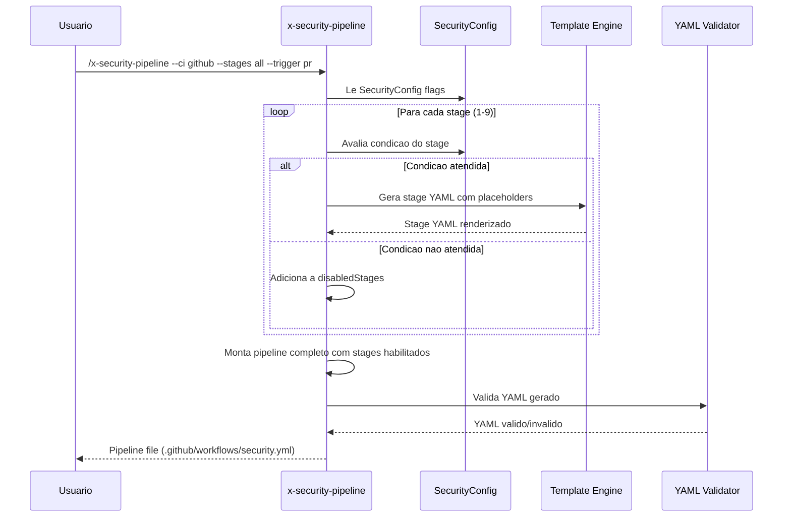
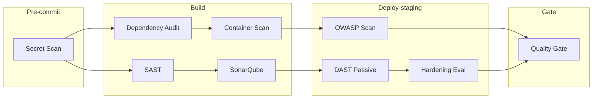

# Historia: Security CI Pipeline Generator (x-security-pipeline)

**ID:** story-0022-0020
**Chave Jira:** ---
**Status:** Pendente

## 1. Dependencias

| Blocked By | Blocks |
| :--- | :--- |
| story-0022-0005, story-0022-0006, story-0022-0007, story-0022-0008, story-0022-0009, story-0022-0010, story-0022-0011 | story-0022-0022 |

## 2. Regras Transversais Aplicaveis

| ID | Titulo |
| :--- | :--- |
| RULE-009 | CI Pipeline Integration |
| RULE-010 | Geracao Condicional por Feature Flag |
| RULE-011 | Skill Composability |
| RULE-015 | Template Engine Compatibility |

## 3. Descricao

Como **engenheiro de DevSecOps**, eu quero uma skill que gere configuracoes de pipeline CI/CD com stages de seguranca automaticamente, garantindo que scans de seguranca sejam integrados no pipeline de forma condicional baseada nos flags de SecurityConfig.

O x-security-pipeline gera arquivos de configuracao de pipeline CI/CD com stages de seguranca integrados. A geracao e condicional: cada stage so e incluido se o flag correspondente do SecurityConfig estiver habilitado. Tres plataformas de CI sao suportadas: GitHub Actions, GitLab CI e Azure DevOps. Cada stage inclui o comando de execucao, configuracao de cache, artifacts, e tratamento de falhas.

A pipeline gerada segue uma ordem especifica de stages: 1-Pre-commit (secret scan), 2-Build (SAST + dependency audit), 3-Build (SonarQube - condicional), 4-Build (container scan - condicional se Dockerfile existe), 5-Deploy-staging (DAST passivo), 6-Deploy-staging (OWASP scan), 7-Deploy-staging (hardening eval), 8-Quality Gate (SonarQube). Stages podem ser gerados no modo "all" (todos os stages condicionais) ou "minimal" (apenas SAST + secret scan).

### 3.1 Stages de Seguranca

| Ordem | Stage | Condicao | Fase CI |
| :--- | :--- | :--- | :--- |
| 1 | Secret Scan (x-secret-scan) | security.scanning.secrets = true | Pre-commit |
| 2 | SAST (x-sast-scan) | security.scanning.sast = true | Build |
| 3 | Dependency Audit (x-dependency-audit) | Sempre (baseline) | Build |
| 4 | SonarQube (x-sonar-gate) | security.scanning.sonar = true | Build |
| 5 | Container Scan (x-container-scan) | infrastructure.container != "none" | Build |
| 6 | DAST Passive (x-dast-scan) | security.scanning.dast = true | Deploy-staging |
| 7 | OWASP Scan (x-owasp-scan) | security.frameworks contains "owasp" | Deploy-staging |
| 8 | Hardening Eval (x-hardening-eval) | security.scanning.hardening = true | Deploy-staging |
| 9 | Quality Gate | security.scanning.sonar = true | Gate |

### 3.2 Parametros CLI

- `--ci`: github | gitlab | azure (default: github)
- `--stages`: all | minimal (default: all)
- `--trigger`: push | pr | schedule (default: pr)
- `--fail-on-findings`: boolean para falhar pipeline em findings (default: true)
- `--severity-threshold`: CRITICAL | HIGH | MEDIUM (default: HIGH)

### 3.3 Minimal vs All Stages

- **minimal**: Stages 1 (secret scan) + 2 (SAST) + 3 (dependency audit). Para times iniciando com security.
- **all**: Todos os 9 stages condicionais. Para times com security program maduro.

### 3.4 Plataformas de CI

- **GitHub Actions**: Gera `.github/workflows/security.yml`
- **GitLab CI**: Gera `.gitlab-ci-security.yml` (include no .gitlab-ci.yml principal)
- **Azure DevOps**: Gera `azure-pipelines-security.yml`

### 3.5 Template Engine

Templates usam placeholders {{LANGUAGE}}, {{BUILD_TOOL}}, {{FRAMEWORK}} para customizacao por stack (RULE-015).

## 3.5 Entrega de Valor

- **Valor Principal:** Geracao automatica de pipeline CI/CD com stages de seguranca condicionais
- **Metrica de Sucesso:** Pipeline gerada valida para 3 plataformas CI (GitHub/GitLab/Azure) com 100% dos stages condicionais corretos
- **Impacto no Negocio:** Reducao de time-to-security de dias para minutos, com pipeline copy-paste ready

## 4. Definicoes de Qualidade Locais

### DoR Local

- [ ] SAST Scanner (story-0022-0005) implementado com CI Integration section
- [ ] Secret Scanner (story-0022-0006) implementado com CI Integration section
- [ ] Container Scanner (story-0022-0007) implementado com CI Integration section
- [ ] Infra Scanner (story-0022-0008) implementado com CI Integration section
- [ ] DAST Scanner (story-0022-0009) implementado com CI Integration section
- [ ] OWASP Scan (story-0022-0010) implementado com CI Integration section
- [ ] SonarQube (story-0022-0011) implementado com CI Integration section
- [ ] SecurityConfig flags definidos para cada stage

### DoD Local

- [ ] SKILL.md criado seguindo security-skill-template
- [ ] 9 stages de seguranca implementados com condicionalidade
- [ ] 3 plataformas de CI suportadas (GitHub, GitLab, Azure)
- [ ] Minimal vs all modes implementados
- [ ] 3 triggers suportados (push, pr, schedule)
- [ ] Templates com placeholders {{LANGUAGE}}, {{BUILD_TOOL}} funcionais
- [ ] Pipeline gerada valida (YAML lint)
- [ ] Stages condicionais baseados em SecurityConfig flags
- [ ] fail-on-findings com severity-threshold configuravel

### Global DoD

- **Cobertura:** >= 95% Line, >= 90% Branch
- **Testes Automatizados:** Unitarios + integracao golden file parity
- **Relatorio de Cobertura:** JaCoCo
- **Documentacao:** SKILL.md documentado
- **Persistencia:** N/A
- **Performance:** Geracao < 10s

## 5. Contratos de Dados

### 5.1 Parametros CLI

| Parametro | Tipo | M/O | Default | Validacoes | Exemplo |
| :--- | :--- | :--- | :--- | :--- | :--- |
| --ci | String | O | github | enum: github, gitlab, azure | `--ci gitlab` |
| --stages | String | O | all | enum: all, minimal | `--stages minimal` |
| --trigger | String | O | pr | enum: push, pr, schedule | `--trigger schedule` |
| --fail-on-findings | boolean | O | true | — | `--fail-on-findings false` |
| --severity-threshold | String | O | HIGH | enum: CRITICAL, HIGH, MEDIUM | `--severity-threshold CRITICAL` |

### 5.2 Pipeline Stage

| Campo | Tipo | M/O | Validacoes | Exemplo |
| :--- | :--- | :--- | :--- | :--- |
| order | int | M | 1-9 | `1` |
| name | String | M | Non-empty | `"Secret Scan"` |
| skill | String | M | Skill name | `"x-secret-scan"` |
| phase | String | M | enum: pre-commit, build, deploy-staging, gate | `"pre-commit"` |
| condition | String | M | SecurityConfig flag expression | `"security.scanning.secrets = true"` |
| enabled | boolean | M | Avaliado contra SecurityConfig | `true` |
| failOnError | boolean | M | — | `true` |
| severityThreshold | String | O | enum: CRITICAL, HIGH, MEDIUM | `"HIGH"` |

### 5.3 Generated Pipeline

| Campo | Tipo | M/O | Validacoes | Exemplo |
| :--- | :--- | :--- | :--- | :--- |
| ciPlatform | String | M | enum: github, gitlab, azure | `"github"` |
| filePath | String | M | Valid file path | `".github/workflows/security.yml"` |
| stagesMode | String | M | enum: all, minimal | `"all"` |
| trigger | String | M | enum: push, pr, schedule | `"pr"` |
| enabledStages | List<PipelineStage> | M | >= 1 | `[...]` |
| disabledStages | List<PipelineStage> | O | Stages excluidos | `[...]` |
| totalStages | int | M | >= 1 | `7` |

### 5.4 Stage Condition Mapping

| Stage | SecurityConfig Flag | Condicao |
| :--- | :--- | :--- |
| Secret Scan | security.scanning.secrets | = true |
| SAST | security.scanning.sast | = true |
| Dependency Audit | — | Sempre habilitado |
| SonarQube | security.scanning.sonar | = true |
| Container Scan | infrastructure.container | != "none" |
| DAST Passive | security.scanning.dast | = true |
| OWASP Scan | security.frameworks | contains "owasp" |
| Hardening Eval | security.scanning.hardening | = true |
| Quality Gate | security.scanning.sonar | = true |

## 6. Diagramas

### 6.1 Fluxo de geracao do Security Pipeline



### 6.2 Pipeline gerada (GitHub Actions)



## 7. Criterios de Aceite (Gherkin)

```gherkin
Cenario: Projeto sem flags de seguranca gera pipeline minimal
  DADO que SecurityConfig tem todos os flags de scanning = false
  E --stages=all e selecionado
  QUANDO /x-security-pipeline e executado
  ENTAO apenas o stage "Dependency Audit" e incluido (sempre habilitado)
  E totalStages = 1
  E disabledStages lista os 8 stages condicionais

Cenario: GitHub Actions pipeline com todos os stages habilitados
  DADO que SecurityConfig tem scanning.sast=true, scanning.secrets=true, scanning.sonar=true, scanning.dast=true
  E infrastructure.container = "docker"
  E security.frameworks = ["owasp"]
  E --ci=github e selecionado
  QUANDO /x-security-pipeline --ci github --stages all e executado
  ENTAO o arquivo .github/workflows/security.yml e gerado
  E contem 9 stages na ordem correta
  E o YAML e valido
  E cada stage tem nome, comando e configuracao de artifacts

Cenario: Minimal mode gera apenas SAST + secret scan + dependency
  DADO que SecurityConfig tem scanning.sast=true e scanning.secrets=true
  E --stages=minimal e selecionado
  QUANDO /x-security-pipeline --stages minimal e executado
  ENTAO apenas 3 stages sao incluidos: Secret Scan, SAST, Dependency Audit
  E stages de deploy-staging e gate NAO sao incluidos
  E totalStages = 3

Cenario: GitLab CI pipeline gera formato correto
  DADO que --ci=gitlab e selecionado
  QUANDO /x-security-pipeline --ci gitlab e executado
  ENTAO o arquivo .gitlab-ci-security.yml e gerado
  E usa sintaxe GitLab CI (stages, script, artifacts, rules)
  E NAO usa sintaxe GitHub Actions (jobs, steps, uses)
  E o YAML e valido para GitLab CI

Cenario: Container scan stage excluido quando container = "none"
  DADO que infrastructure.container = "none"
  E scanning.sast=true e scanning.secrets=true
  QUANDO /x-security-pipeline --stages all e executado
  ENTAO o stage "Container Scan" NAO e incluido
  E disabledStages contem stage com name="Container Scan"
  E disabledStages contem condition="infrastructure.container != none"
```

## 8. Sub-tarefas

- [ ] [Dev] Criar SKILL.md para x-security-pipeline seguindo security-skill-template
- [ ] [Dev] Implementar leitura de SecurityConfig flags para condicionalidade
- [ ] [Dev] Implementar template de pipeline para GitHub Actions
- [ ] [Dev] Implementar template de pipeline para GitLab CI
- [ ] [Dev] Implementar template de pipeline para Azure DevOps
- [ ] [Dev] Implementar 9 stages com ordem e condicoes
- [ ] [Dev] Implementar minimal vs all modes
- [ ] [Dev] Implementar triggers (push, pr, schedule)
- [ ] [Dev] Implementar template placeholders ({{LANGUAGE}}, {{BUILD_TOOL}})
- [ ] [Dev] Implementar YAML validation do pipeline gerado
- [ ] [Dev] Implementar fail-on-findings com severity-threshold
- [ ] [Test] Teste unitario: projeto sem flags gera apenas dependency audit
- [ ] [Test] Teste unitario: GitHub Actions com todos os stages
- [ ] [Test] Teste unitario: minimal mode gera 3 stages
- [ ] [Test] Teste unitario: GitLab CI formato correto
- [ ] [Test] Teste unitario: container scan excluido quando container = "none"
- [ ] [Test] Smoke/E2E: Gerar pipeline para cada plataforma CI e validar YAML
- [ ] [Doc] Documentar stages, condicoes, plataformas e exemplos no SKILL.md
