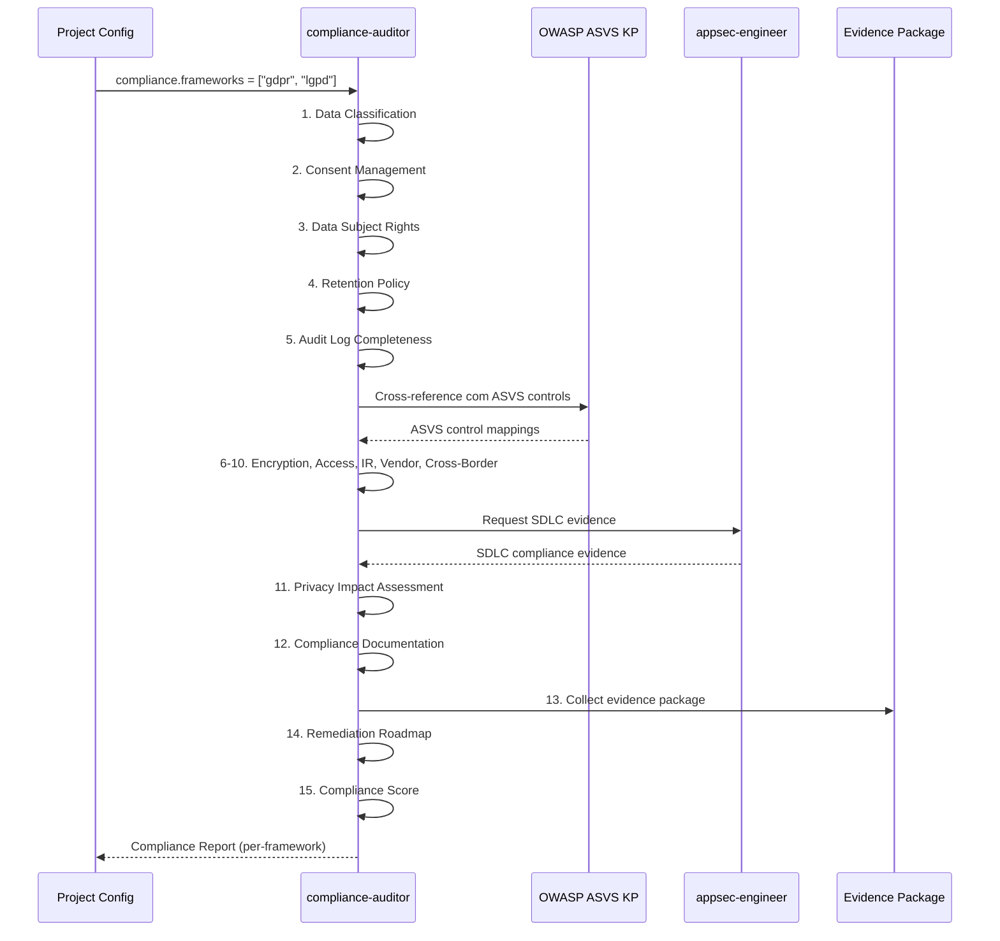

# Historia: Compliance Auditor Agent

**ID:** story-0022-0021
**Chave Jira:** ---
**Status:** Pendente

## 1. Dependencias

| Blocked By | Blocks |
| :--- | :--- |
| story-0022-0004, story-0022-0016 | story-0022-0022 |

## 2. Regras Transversais Aplicaveis

| ID | Titulo |
| :--- | :--- |
| RULE-006 | Persona Non-Interference |
| RULE-012 | Agent Checklist Format |

## 3. Descricao

Como **Tech Lead de seguranca**, eu quero um agente especializado em compliance regulatorio que realize gap analysis contra frameworks regulatorios e colete evidencias para auditorias, garantindo que o projeto esteja em conformidade com GDPR, LGPD, HIPAA, PCI-DSS e SOX conforme configurado.

O compliance-auditor e uma persona dedicada a compliance regulatorio. Diferente dos demais agentes de seguranca que focam em aspectos tecnicos (code review, exploitation, SDLC, pipeline), o compliance-auditor foca em requisitos regulatorios: classificacao de dados, gestao de consentimento, direitos do titular, politicas de retencao, completude de audit logs, compliance de criptografia, controle de acesso, procedimentos de incident response, compliance de terceiros, controles de transferencia internacional, privacy impact assessment, documentacao de compliance, pacote de evidencias, roadmap de remediacao, e compliance score.

O escopo do compliance-auditor e estritamente regulatory evidence e gap analysis. Ele NAO faz code review (security-engineer), NAO define processos SDLC (appsec-engineer), NAO configura pipelines (devsecops-engineer), e NAO faz exploitation (pentest-engineer), conforme RULE-006. O agente e ativado quando compliance frameworks sao configurados no projeto (ex: GDPR, LGPD, HIPAA).

### 3.1 Checklist de 15 Pontos

| # | Item | Descricao |
| :--- | :--- | :--- |
| 1 | Data Classification | Classificar dados processados (publico, interno, confidencial, restrito) |
| 2 | Consent Management | Verificar mecanismos de coleta e gestao de consentimento |
| 3 | Data Subject Rights | Verificar implementacao de direitos do titular (acesso, retificacao, exclusao, portabilidade) |
| 4 | Retention Policy | Verificar politicas de retencao e exclusao automatica |
| 5 | Audit Log Completeness | Verificar completude de logs de auditoria (quem, o que, quando) |
| 6 | Encryption Compliance | Verificar criptografia em repouso e em transito conforme regulamento |
| 7 | Access Control Compliance | Verificar controles de acesso baseados em minimo privilegio |
| 8 | Incident Response Procedures | Verificar procedimentos de resposta a incidentes e notificacao |
| 9 | Vendor/Third-Party Compliance | Verificar compliance de terceiros e processadores de dados |
| 10 | Cross-Border Transfer Controls | Verificar controles de transferencia internacional de dados |
| 11 | Privacy Impact Assessment | Verificar existencia e adequacao de DPIA/PIA |
| 12 | Compliance Documentation | Verificar documentacao de compliance (politicas, procedimentos) |
| 13 | Evidence Package | Coletar pacote de evidencias para auditoria |
| 14 | Remediation Roadmap | Gerar roadmap de remediacao para gaps identificados |
| 15 | Compliance Score | Calcular score de compliance por framework |

### 3.2 Escopo e Exclusoes (RULE-006)

- **Incluido:** Regulatory evidence, gap analysis, data classification, consent management, data subject rights, retention, audit logs, encryption compliance, access control, incident response, vendor compliance, cross-border transfers, PIA, documentation, evidence package
- **Excluido:** Code review (security-engineer), SDLC processes (appsec-engineer), pipeline/SLSA (devsecops-engineer), exploitation/PoC (pentest-engineer)

### 3.3 Ativacao Condicional

- Ativado quando compliance frameworks sao configurados (ex: compliance.frameworks = ["gdpr", "lgpd"])
- Referencia o appsec-engineer (story-0022-0016) para SDLC evidence
- Referencia o OWASP ASVS KP (story-0022-0004) para cross-referencing de controles
- Output alimenta x-security-dashboard para compliance dimension

### 3.4 Frameworks Suportados

| Framework | Foco | Requisitos Chave |
| :--- | :--- | :--- |
| GDPR | Protecao de dados EU | Consentimento, DPIA, DPO, direitos do titular, 72h breach notification |
| LGPD | Protecao de dados Brasil | Bases legais, encarregado, RIPD, direitos do titular |
| HIPAA | Dados de saude US | PHI protection, BAA, security rule, privacy rule |
| PCI-DSS | Dados de cartao | 12 requisitos, SAQ, ASV scans, segmentacao |
| SOX | Controles financeiros | IT controls, audit trail, access controls, change management |

### 3.5 Output Format

- Markdown report seguindo formato padrao de agentes
- Secoes por framework: Gap Analysis, Evidence Inventory, Compliance Score, Remediation Roadmap
- Evidence package com referencias a artefatos do projeto
- Cross-reference entre frameworks (controle compartilhado = evidencia unica)

## 3.5 Entrega de Valor

- **Valor Principal:** Persona dedicada a compliance regulatorio com coleta de evidencias para auditorias
- **Metrica de Sucesso:** Gap analysis completo com evidencias coletadas para 100% dos controles aplicaveis
- **Impacto no Negocio:** Preparacao proativa para auditorias regulatorias, reduzindo tempo e custo de compliance

## 4. Definicoes de Qualidade Locais

### DoR Local

- [ ] OWASP ASVS Knowledge Pack (story-0022-0004) disponivel
- [ ] AppSec Engineer Agent (story-0022-0016) implementado
- [ ] security-engineer.md existente como referencia de formato de agente
- [ ] RULE-006 (Persona Non-Interference) documentado e compreendido
- [ ] Frameworks regulatorios (GDPR, LGPD, HIPAA, PCI-DSS, SOX) documentados

### DoD Local

- [ ] Agent file compliance-auditor.md criado no formato padrao
- [ ] 15-point checklist documentado com descricao detalhada
- [ ] Escopo e exclusoes (RULE-006) explicitamente declarados
- [ ] Condicao de ativacao (compliance frameworks configured) documentada
- [ ] 5 frameworks regulatorios suportados com requisitos chave
- [ ] Cross-reference entre frameworks para controles compartilhados
- [ ] Evidence package template definido
- [ ] Compliance score por framework
- [ ] Sem sobreposicao com security-engineer, pentest-engineer, appsec-engineer, devsecops-engineer
- [ ] Recommended model definido

### Global DoD

- **Cobertura:** >= 95% Line, >= 90% Branch
- **Testes Automatizados:** Unitarios + integracao golden file parity
- **Relatorio de Cobertura:** JaCoCo
- **Documentacao:** SKILL.md documentado
- **Persistencia:** N/A
- **Performance:** Geracao < 10s

## 5. Contratos de Dados

N/A — artefato gerado e arquivo markdown (agent definition)

## 6. Diagramas

### 6.1 Fluxo de auditoria do Compliance Auditor



## 7. Criterios de Aceite (Gherkin)

```gherkin
Cenario: Agent file nao gerado quando compliance frameworks vazio
  DADO que compliance.frameworks = [] na configuracao
  QUANDO o gerador processa a configuracao
  ENTAO o arquivo compliance-auditor.md NAO e gerado
  E nenhum erro e reportado

Cenario: Agent file gerado com 15-point checklist completo
  DADO que compliance.frameworks = ["gdpr"] na configuracao
  QUANDO o gerador processa a configuracao
  ENTAO o arquivo compliance-auditor.md e gerado
  E contem exatamente 15 items no checklist numerado
  E cada item tem descricao detalhada
  E o formato segue o padrao de security-engineer.md

Cenario: Escopo regulatory declarado sem sobreposicao
  DADO que o compliance-auditor.md foi gerado
  QUANDO a secao "Scope" e analisada
  ENTAO inclui: regulatory evidence, gap analysis
  E exclui explicitamente: code review, SDLC, pipeline, exploitation
  E nao ha sobreposicao com security-engineer, pentest-engineer, appsec-engineer, devsecops-engineer

Cenario: Frameworks suportados com requisitos chave documentados
  DADO que o compliance-auditor.md foi gerado
  QUANDO a secao de frameworks e analisada
  ENTAO lista GDPR, LGPD, HIPAA, PCI-DSS e SOX
  E cada framework tem requisitos chave documentados
  E cross-references entre frameworks estao indicadas (ex: GDPR Art.32 <-> LGPD Art.46)

Cenario: Evidence package template definido com artefatos esperados
  DADO que o compliance-auditor.md foi gerado
  QUANDO a secao "Evidence Package" e analisada
  ENTAO define template de pacote de evidencias
  E inclui categorias: politicas, procedimentos, configuracoes, logs, testes
  E cada evidencia tem tipo, fonte e periodicidade de coleta
```

## 8. Sub-tarefas

- [ ] [Dev] Criar compliance-auditor.md no formato padrao de agente
- [ ] [Dev] Documentar 15-point checklist com descricao detalhada
- [ ] [Dev] Definir escopo e exclusoes (RULE-006) na secao Scope
- [ ] [Dev] Documentar 5 frameworks regulatorios com requisitos chave
- [ ] [Dev] Definir cross-references entre frameworks
- [ ] [Dev] Definir evidence package template
- [ ] [Dev] Definir compliance score por framework
- [ ] [Dev] Definir condicao de ativacao (compliance frameworks configured)
- [ ] [Dev] Implementar geracao condicional no AgentSelection
- [ ] [Test] Teste unitario: agent nao gerado quando compliance frameworks vazio
- [ ] [Test] Teste unitario: agent gerado com 15 items no checklist
- [ ] [Test] Teste unitario: escopo nao sobrepoe com outros agentes
- [ ] [Test] Teste unitario: frameworks documentados com requisitos chave
- [ ] [Test] Smoke/E2E: Gerar ambiente com compliance.frameworks=["gdpr"] e validar presenca do agent file
- [ ] [Doc] Documentar persona, frameworks, checklist e exemplos de uso
