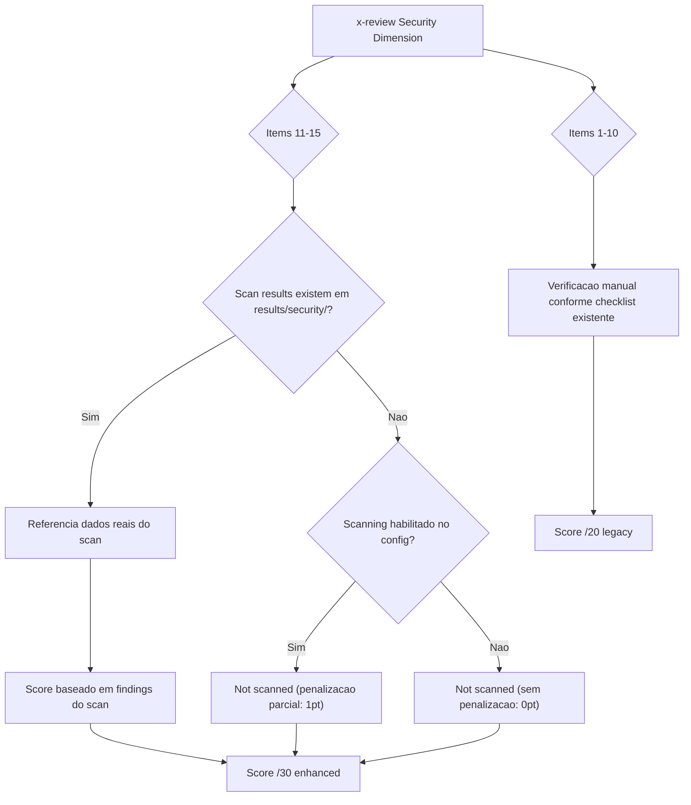

# Historia: Security Review Integration Enhancement

**ID:** story-0022-0022
**Chave Jira:** ---
**Status:** Pendente

## 1. Dependencias

| Blocked By | Blocks |
| :--- | :--- |
| story-0022-0018, story-0022-0019, story-0022-0020, story-0022-0021 | story-0022-0028 |

## 2. Regras Transversais Aplicaveis

| ID | Titulo |
| :--- | :--- |
| RULE-007 | Rastreabilidade de Compliance |
| RULE-011 | Delegacao para Skills Especializadas |
| RULE-014 | Backward Compatibility |

## 3. Descricao

Como **tech lead de seguranca**, eu quero que a dimensao de seguranca do x-review seja expandida de 10 para 15 items de checklist, garantindo que os novos aspectos de seguranca introduzidos pelo epic-0022 sejam validados durante code review.

Atualmente o x-review possui uma dimensao "Security" com 10 items de verificacao. Com a introducao de novas skills de scanning (SAST, secrets, container, supply chain) e hardening, o checklist de seguranca precisa cobrir esses novos aspectos. Os 5 novos items sao: 11-Secret detection compliance (verifica se x-secret-scan foi executado e nao ha findings CRITICAL/HIGH), 12-Container security posture (verifica se x-container-scan avaliou a imagem Docker), 13-Supply chain risk (verifica se x-supply-chain-audit nao encontrou riscos criticos), 14-Hardening compliance (verifica se x-hardening-eval atingiu score minimo), 15-OWASP Top 10 coverage (verifica se x-owasp-scan cobriu L1 no minimo).

O mecanismo de referencia e adaptativo: se resultados de scan existem em `results/security/`, o reviewer referencia os dados reais do scan. Se nao existem, o item e marcado como "Not scanned — manual verification required". Isso garante backward compatibility (RULE-014) — o x-review funciona perfeitamente sem que nenhum scan tenha sido executado, mas enriquece a revisao quando scan results estao disponiveis.

### 3.1 Novos Items de Checklist (11-15)

| # | Item | Fonte de Dados | Fallback |
| :--- | :--- | :--- | :--- |
| 11 | Secret detection compliance | `results/security/x-secret-scan-*.md` | "Not scanned" |
| 12 | Container security posture | `results/security/x-container-scan-*.md` | "Not scanned" |
| 13 | Supply chain risk | `results/security/x-supply-chain-audit-*.md` | "Not scanned" |
| 14 | Hardening compliance | `results/security/x-hardening-eval-*.md` | "Not scanned" |
| 15 | OWASP Top 10 coverage | `results/security/x-owasp-scan-*.md` | "Not scanned" |

### 3.2 Score Adjustment

- Score anterior: 10 items x 2 pontos = /20
- Score novo: 15 items x 2 pontos = /30
- Items "Not scanned" recebem 0 pontos (nao penalizam grade geral se scanning nao esta habilitado)
- Quando scanning esta habilitado mas nao foi executado: penalizacao parcial (1 ponto por item ao inves de 0)

### 3.3 Backward Compatibility

- Sem scan results: x-review funciona identicamente ao comportamento atual para items 1-10
- Items 11-15 aparecem como "Not scanned" sem impacto no score dos primeiros 10 items
- Score normalizado: reporta tanto score /20 (legacy) quanto /30 (enhanced) para comparabilidade

## 3.5 Entrega de Valor

- **Valor Principal:** Enriquecimento do x-review de 10 para 15 items de seguranca, referenciando scan results quando disponiveis
- **Metrica de Sucesso:** 100% dos scan results em `results/security/` sao referenciados nos items 11-15 quando presentes
- **Impacto no Negocio:** Review de seguranca mais abrangente com cobertura de scanning automatizado, container, supply chain e hardening

## 4. Definicoes de Qualidade Locais

### DoR Local

- [ ] x-pentest (story-0022-0018) implementado
- [ ] x-security-dashboard (story-0022-0019) implementado
- [ ] x-security-pipeline (story-0022-0020) implementado
- [ ] Compliance Auditor Agent (story-0022-0021) implementado
- [ ] Formato de scan results em `results/security/` documentado

### DoD Local

- [ ] Items 11-15 adicionados ao checklist de seguranca do x-review
- [ ] Referencia adaptativa a scan results implementada (presente vs "Not scanned")
- [ ] Score ajustado de /20 para /30 com normalizacao para backward compatibility
- [ ] Items "Not scanned" nao penalizam score quando scanning nao habilitado
- [ ] x-review funciona identicamente sem scan results (backward compatible)
- [ ] Testes para cada novo item com e sem scan results

### Global DoD

- **Cobertura:** >= 95% Line, >= 90% Branch
- **Testes Automatizados:** Unitarios + integracao golden file parity
- **Relatorio de Cobertura:** JaCoCo
- **Documentacao:** SKILL.md documentado
- **Persistencia:** N/A
- **Performance:** Geracao < 10s

## 5. Contratos de Dados

### 5.1 Security Review Item (Enhanced)

| Campo | Tipo | M/O | Validacoes | Exemplo |
| :--- | :--- | :--- | :--- | :--- |
| itemNumber | int | M | 1-15 | `11` |
| itemName | String | M | Non-empty | `"Secret detection compliance"` |
| status | String | M | enum: PASS, FAIL, NOT_SCANNED, N/A | `"PASS"` |
| scanResultRef | String | O | Path relativo a results/security/ | `"results/security/x-secret-scan-2026-04-05.md"` |
| score | int | M | 0 ou 2 | `2` |
| notes | String | O | Non-empty quando preenchido | `"0 CRITICAL findings"` |

### 5.2 Security Score Summary

| Campo | Tipo | M/O | Validacoes | Exemplo |
| :--- | :--- | :--- | :--- | :--- |
| legacyScore | int | M | 0-20 | `18` |
| enhancedScore | int | M | 0-30 | `26` |
| totalItems | int | M | 15 | `15` |
| scannedItems | int | M | 0-5 (items 11-15) | `3` |
| notScannedItems | int | M | 0-5 | `2` |
| scanningEnabled | boolean | M | true/false | `true` |

## 6. Diagramas

### 6.1 Fluxo de verificacao adaptativa



## 7. Criterios de Aceite (Gherkin)

```gherkin
Cenario: Review sem scan results mantem comportamento original
  DADO que nenhum arquivo existe em results/security/
  E scanning NAO esta habilitado no SecurityConfig
  QUANDO x-review e executado na dimensao Security
  ENTAO items 1-10 sao avaliados normalmente
  E items 11-15 aparecem com status "NOT_SCANNED"
  E legacyScore e calculado normalmente (/20)
  E enhancedScore NAO penaliza items 11-15

Cenario: Review com scan results referencia dados reais
  DADO que x-secret-scan-2026-04-05.md existe em results/security/
  E o scan reportou 0 findings CRITICAL e 0 HIGH
  QUANDO x-review e executado na dimensao Security
  ENTAO item 11 (Secret detection compliance) tem status PASS
  E scanResultRef aponta para o arquivo do scan
  E score do item 11 e 2

Cenario: Item com scan habilitado mas nao executado recebe penalizacao parcial
  DADO que SecurityConfig.scanning.sast = true
  MAS nenhum arquivo x-sast-scan-*.md existe em results/security/
  QUANDO x-review e executado
  ENTAO o item correspondente tem status "NOT_SCANNED"
  E recebe 1 ponto ao inves de 0 (penalizacao parcial)
  E notes contem "Scanning enabled but not executed"

Cenario: Score enhanced inclui todos os 15 items
  DADO que items 1-10 totalizam 18/20
  E items 11-13 tem status PASS (6 pontos)
  E items 14-15 tem status NOT_SCANNED (0 pontos)
  QUANDO o score e calculado
  ENTAO legacyScore = 18
  E enhancedScore = 24
  E totalItems = 15
  E scannedItems = 3
  E notScannedItems = 2

Cenario: Scan result com findings CRITICAL causa FAIL no item
  DADO que x-container-scan-2026-04-05.md existe em results/security/
  E o scan reportou 2 findings CRITICAL
  QUANDO x-review e executado na dimensao Security
  ENTAO item 12 (Container security posture) tem status FAIL
  E score do item 12 e 0
  E notes contem "2 CRITICAL findings detected"
```

## 8. Sub-tarefas

- [ ] [Dev] Adicionar items 11-15 ao checklist de seguranca do x-review SKILL.md
- [ ] [Dev] Implementar deteccao adaptativa de scan results em results/security/
- [ ] [Dev] Implementar logica de score /30 com normalizacao para /20 legacy
- [ ] [Dev] Implementar logica de penalizacao parcial (scanning habilitado vs nao)
- [ ] [Dev] Implementar parsing de scan results para extrair status PASS/FAIL
- [ ] [Test] Teste unitario: review sem scan results mantem score /20 original
- [ ] [Test] Teste unitario: review com scan results referencia dados reais
- [ ] [Test] Teste unitario: penalizacao parcial quando scanning habilitado mas nao executado
- [ ] [Test] Teste unitario: score enhanced calcula /30 corretamente
- [ ] [Test] Smoke/E2E: Executar x-review com e sem scan results e validar output completo
- [ ] [Doc] Documentar items 11-15 e logica de score no SKILL.md do x-review
