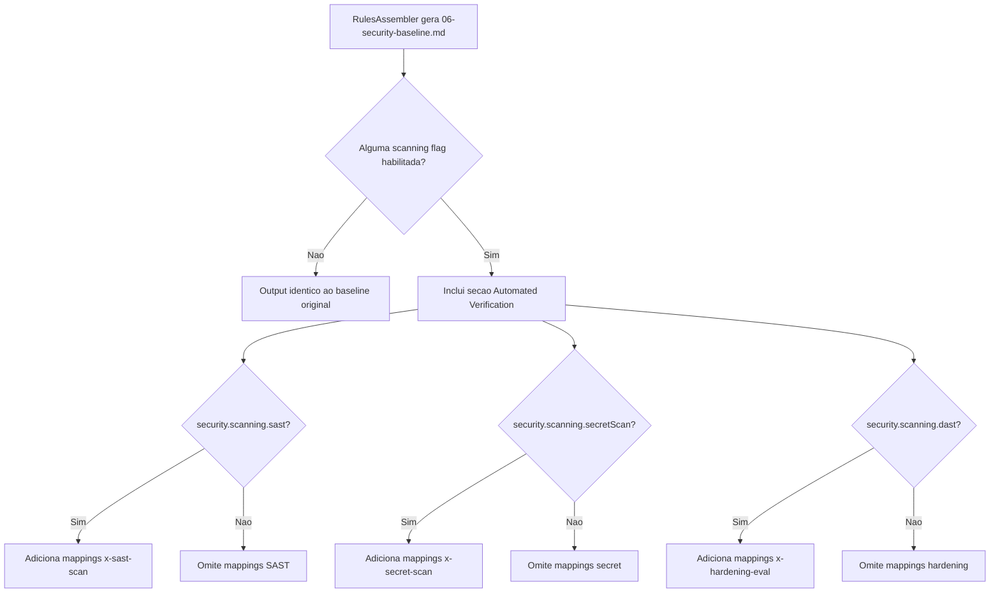

# Historia: Security Baseline Rule Enhancement

**ID:** story-0022-0023
**Chave Jira:** ---
**Status:** Pendente

## 1. Dependencias

| Blocked By | Blocks |
| :--- | :--- |
| story-0022-0005, story-0022-0006 | story-0022-0028 |

## 2. Regras Transversais Aplicaveis

| ID | Titulo |
| :--- | :--- |
| RULE-007 | Rastreabilidade de Compliance |
| RULE-010 | Geracao Condicional por Feature Flag |
| RULE-014 | Backward Compatibility |

## 3. Descricao

Como **engenheiro de plataforma**, eu quero que o template 06-security-baseline.md inclua uma secao "Automated Verification" mapeando cada requisito de baseline a skill que o verifica automaticamente, garantindo que desenvolvedores saibam como validar cada requisito de seguranca de forma automatizada.

A rule 06-security-baseline.md atualmente define requisitos de seguranca (input deserialization, string escaping, path operations, hardcoded secrets, etc.) mas nao indica como verifica-los automaticamente. Com a introducao das skills de scanning do epic-0022, e possivel mapear cada requisito a uma ou mais skills que o verificam. Isso cria um link direto entre "o que deve ser feito" (baseline) e "como verificar" (skills), fechando o loop de compliance.

A secao "Automated Verification" e condicional (RULE-010): so e incluida quando pelo menos uma skill de scanning esta habilitada no SecurityConfig. Quando nenhuma skill de scanning esta habilitada, a secao nao aparece no output gerado, mantendo backward compatibility (RULE-014).

### 3.1 Mapping Requisito -> Skill

| Requisito do Baseline | Skill Verificadora | Tipo de Verificacao |
| :--- | :--- | :--- |
| Input deserialization (safe/strict mode) | x-sast-scan | Pattern matching para unsafe deserialization |
| String escaping (RFC 8259, OWASP) | x-sast-scan | Pattern matching para XSS, injection |
| Temp files/directories (permissions) | x-sast-scan | Pattern matching para insecure file creation |
| Path operations (traversal prevention) | x-sast-scan | Pattern matching para path traversal |
| Error messages (no internal exposure) | x-sast-scan | Pattern matching para information disclosure |
| Hardcoded secrets/tokens/credentials | x-secret-scan | Regex + entropy analysis |
| Crypto RNG (no Math.random for security) | x-sast-scan | Pattern matching para insecure random |
| HTTP security headers | x-hardening-eval | Header presence/value verification |
| TLS configuration | x-hardening-eval | TLS version and cipher verification |
| Symlink following (explicit opt-in) | x-sast-scan | Pattern matching para symlink usage |

### 3.2 Formato da Secao

A secao segue o padrao:

```markdown
## Automated Verification

> This section is generated when security scanning skills are enabled.

| Requirement | Verified By | How to Run |
| :--- | :--- | :--- |
| Input deserialization | x-sast-scan | `/x-sast-scan --scope owasp` |
| ... | ... | ... |
```

### 3.3 Condicionalidade

- `security.scanning.sast = true` -> inclui mappings para x-sast-scan
- `security.scanning.secretScan = true` -> inclui mappings para x-secret-scan
- `security.scanning.dast = true` -> inclui mappings para x-hardening-eval
- Nenhuma flag habilitada -> secao omitida inteiramente

## 3.5 Entrega de Valor

- **Valor Principal:** Secao "Automated Verification" no baseline, mapeando requisitos a skills de verificacao
- **Metrica de Sucesso:** 100% dos requisitos do baseline mapeados a pelo menos uma skill verificadora
- **Impacto no Negocio:** Desenvolvedores sabem exatamente como validar cada requisito, reduzindo gap entre politica e verificacao

## 4. Definicoes de Qualidade Locais

### DoR Local

- [ ] x-sast-scan (story-0022-0005) implementado
- [ ] x-secret-scan (story-0022-0006) implementado
- [ ] Template 06-security-baseline.md existente analisado
- [ ] Mapping requisito -> skill validado com security engineer

### DoD Local

- [ ] Secao "Automated Verification" adicionada ao template 06-security-baseline.md
- [ ] Mapping completo para todos os requisitos do baseline
- [ ] Secao condicional: so aparece quando pelo menos 1 scanning skill habilitada
- [ ] Cada linha do mapping inclui comando de execucao (copy-paste ready)
- [ ] Backward compatible: output sem scanning flags e identico ao anterior
- [ ] Testes para cada combinacao de flags (sast, secret, hardening)

### Global DoD

- **Cobertura:** >= 95% Line, >= 90% Branch
- **Testes Automatizados:** Unitarios + integracao golden file parity
- **Relatorio de Cobertura:** JaCoCo
- **Documentacao:** SKILL.md documentado
- **Persistencia:** N/A
- **Performance:** Geracao < 10s

## 5. Contratos de Dados

### 5.1 Verification Mapping Entry

| Campo | Tipo | M/O | Validacoes | Exemplo |
| :--- | :--- | :--- | :--- | :--- |
| requirement | String | M | Non-empty, matches baseline requirement | `"Input deserialization"` |
| verifiedBy | String | M | Skill name valido | `"x-sast-scan"` |
| howToRun | String | M | Comando CLI completo | `"/x-sast-scan --scope owasp"` |
| requiredFlag | String | M | SecurityConfig flag path | `"security.scanning.sast"` |

### 5.2 Condicionalidade Flags

| Flag | Skills Habilitadas | Requisitos Cobertos |
| :--- | :--- | :--- |
| security.scanning.sast | x-sast-scan | Input deser, string escaping, temp files, path ops, error messages, crypto RNG, symlinks |
| security.scanning.secretScan | x-secret-scan | Hardcoded secrets/tokens/credentials |
| security.scanning.dast | x-hardening-eval | HTTP security headers, TLS configuration |

## 6. Diagramas

### 6.1 Logica de inclusao condicional



## 7. Criterios de Aceite (Gherkin)

```gherkin
Cenario: Baseline sem scanning flags omite secao Automated Verification
  DADO que SecurityConfig NAO tem nenhuma flag de scanning habilitada
  QUANDO 06-security-baseline.md e gerado
  ENTAO a secao "## Automated Verification" NAO esta presente
  E o output e identico ao baseline anterior (backward compatible)

Cenario: Baseline com SAST habilitado inclui mappings x-sast-scan
  DADO que SecurityConfig.scanning.sast = true
  E SecurityConfig.scanning.secretScan = false
  QUANDO 06-security-baseline.md e gerado
  ENTAO a secao "## Automated Verification" esta presente
  E contem linhas para: input deserialization, string escaping, path operations, crypto RNG
  E cada linha referencia x-sast-scan como skill verificadora
  E cada linha inclui comando de execucao
  E NAO contem linhas para hardcoded secrets (x-secret-scan desabilitado)

Cenario: Baseline com todas as scanning flags inclui mapping completo
  DADO que SecurityConfig.scanning.sast = true
  E SecurityConfig.scanning.secretScan = true
  E SecurityConfig.scanning.dast = true
  QUANDO 06-security-baseline.md e gerado
  ENTAO a secao "## Automated Verification" contem todas as 10 linhas de mapping
  E x-sast-scan cobre 7 requisitos
  E x-secret-scan cobre 1 requisito
  E x-hardening-eval cobre 2 requisitos

Cenario: Comando de execucao e copy-paste ready
  DADO que SecurityConfig.scanning.sast = true
  QUANDO 06-security-baseline.md e gerado
  ENTAO cada linha da secao Automated Verification inclui campo "How to Run"
  E o campo contem um comando CLI valido (ex: `/x-sast-scan --scope owasp`)
  E o comando pode ser copiado e executado diretamente

Cenario: Backward compatibility com golden files existentes
  DADO que um profile existente (ex: java-spring) NAO tem scanning flags
  QUANDO o ambiente e gerado para esse profile
  ENTAO o output de 06-security-baseline.md e identico ao golden file existente
  E nenhuma secao nova foi adicionada
```

## 8. Sub-tarefas

- [ ] [Dev] Adicionar secao "Automated Verification" ao template 06-security-baseline.md
- [ ] [Dev] Implementar mapping completo de requisitos para skills verificadoras
- [ ] [Dev] Implementar logica condicional baseada em scanning flags do SecurityConfig
- [ ] [Dev] Implementar geracao granular por flag (sast, secret, dast independentes)
- [ ] [Test] Teste unitario: baseline sem flags omite secao
- [ ] [Test] Teste unitario: baseline com sast=true inclui apenas mappings SAST
- [ ] [Test] Teste unitario: baseline com todas flags inclui mapping completo
- [ ] [Test] Teste unitario: comandos de execucao sao validos e copy-paste ready
- [ ] [Test] Smoke/E2E: Gerar baseline para java-spring com e sem scanning flags e comparar com golden files
- [ ] [Doc] Documentar formato da secao Automated Verification e condicionalidade
