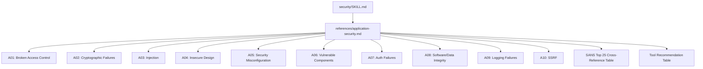

# Historia: Security KP -- Application Security Reference

**ID:** story-0022-0024
**Chave Jira:** ---
**Status:** Pendente

## 1. Dependencias

| Blocked By | Blocks |
| :--- | :--- |
| story-0022-0004 | story-0022-0028 |

## 2. Regras Transversais Aplicaveis

| ID | Titulo |
| :--- | :--- |
| RULE-007 | Rastreabilidade de Compliance |
| RULE-013 | ASVS Level Mapping |
| RULE-015 | Template Engine Compatibility |

## 3. Descricao

Como **engenheiro de seguranca**, eu quero um knowledge pack de referencia para Application Security cobrindo OWASP Top 10 e SANS Top 25 com exemplos de codigo por linguagem, garantindo que a equipe tenha um guia pratico para identificar e remediar as vulnerabilidades mais comuns.

O arquivo `security/references/application-security.md` sera o guia central de seguranca de aplicacoes no security KP. Para cada entrada do OWASP Top 10 (2021) — A01 (Broken Access Control) ate A10 (SSRF) — o guia inclui: descricao da vulnerabilidade, impacto potencial (confidencialidade, integridade, disponibilidade), padroes de deteccao (regex, AST patterns), e remediacao com exemplos de codigo usando `{{LANGUAGE}}` placeholder (RULE-015), permitindo geracao por linguagem.

Alem do OWASP Top 10, o guia inclui cross-references para o SANS Top 25 Most Dangerous Software Weaknesses (CWE-based), permitindo que equipes com requisitos de compliance SANS encontrem a orientacao correspondente. Uma tabela de recomendacao de ferramentas por tipo de vulnerabilidade complementa o guia, indicando quais ferramentas (SAST, DAST, SCA) sao mais eficazes para cada tipo de problema.

### 3.1 Estrutura por Categoria OWASP

Cada categoria (A01-A10) segue a estrutura:

1. **Descricao**: O que e a vulnerabilidade e por que e perigosa
2. **Impacto**: CIA triad (Confidentiality, Integrity, Availability)
3. **CWEs Associadas**: Lista de CWEs mais comuns na categoria
4. **Detection Patterns**: Padroes para deteccao estatica e dinamica
5. **Codigo Vulneravel**: Exemplo com `{{LANGUAGE}}` mostrando o anti-pattern
6. **Codigo Corrigido**: Exemplo com `{{LANGUAGE}}` mostrando a remediacao
7. **SANS Top 25 Cross-ref**: CWEs correspondentes no SANS Top 25

### 3.2 Tabela de Ferramentas por Vulnerabilidade

| Tipo de Vulnerabilidade | Ferramenta Recomendada | Tipo | Eficacia |
| :--- | :--- | :--- | :--- |
| Injection (SQLi, XSS, CMD) | SAST + DAST | Preventivo + Detectivo | Alta |
| Auth/Access Control | DAST + Manual Review | Detectivo | Media-Alta |
| Cryptographic Failures | SAST | Preventivo | Alta |
| Insecure Design | Threat Model + Manual Review | Preventivo | Media |
| Misconfiguration | SAST + Hardening Eval | Detectivo | Alta |
| Vulnerable Components | SCA (x-dependency-audit) | Detectivo | Alta |
| Data Integrity | SAST + DAST | Preventivo + Detectivo | Media |
| Logging Failures | Manual Review + SAST | Detectivo | Media |
| SSRF | DAST + SAST | Detectivo | Media-Alta |

### 3.3 Registro no Security KP

O arquivo sera registrado em `security/SKILL.md` na secao de references, seguindo o padrao existente de knowledge packs internos.

## 3.5 Entrega de Valor

- **Valor Principal:** Guia OWASP Top 10 com codigo por linguagem e cross-refs SANS Top 25
- **Metrica de Sucesso:** 100% das categorias A01-A10 documentadas com codigo vulneravel e corrigido
- **Impacto no Negocio:** Equipe tem referencia unica e pratica para remediar as 10 vulnerabilidades mais criticas, com exemplos na linguagem do projeto

## 4. Definicoes de Qualidade Locais

### DoR Local

- [ ] OWASP ASVS Reference KP (story-0022-0004) disponivel
- [ ] OWASP Top 10 (2021) lista oficial consultada
- [ ] SANS Top 25 (2023) lista oficial consultada
- [ ] Exemplos de codigo para pelo menos 3 linguagens validados

### DoD Local

- [ ] Arquivo security/references/application-security.md criado
- [ ] 10 categorias OWASP (A01-A10) documentadas com estrutura completa
- [ ] Exemplos de codigo usando {{LANGUAGE}} placeholder para cada categoria
- [ ] Cross-references SANS Top 25 para cada categoria OWASP
- [ ] Tabela de ferramentas por tipo de vulnerabilidade
- [ ] Registrado em security/SKILL.md
- [ ] Nenhum codigo hardcoded para linguagem especifica (apenas {{LANGUAGE}} placeholders)

### Global DoD

- **Cobertura:** >= 95% Line, >= 90% Branch
- **Testes Automatizados:** Unitarios + integracao golden file parity
- **Relatorio de Cobertura:** JaCoCo
- **Documentacao:** SKILL.md documentado
- **Persistencia:** N/A
- **Performance:** Geracao < 10s

## 5. Contratos de Dados

N/A -- artefato e knowledge pack reference

## 6. Diagramas

### 6.1 Estrutura do Knowledge Pack



## 7. Criterios de Aceite (Gherkin)

```gherkin
Cenario: Arquivo application-security.md existe e esta registrado
  DADO que o security KP esta sendo gerado
  QUANDO o gerador processa security/references/
  ENTAO application-security.md existe em security/references/
  E security/SKILL.md referencia application-security.md na secao de references

Cenario: Todas as 10 categorias OWASP estao documentadas
  DADO que application-security.md foi gerado
  QUANDO o conteudo e analisado
  ENTAO existem secoes para A01, A02, A03, A04, A05, A06, A07, A08, A09, A10
  E cada secao contem: descricao, impacto, CWEs, detection patterns, codigo vulneravel, codigo corrigido
  E cada secao contem pelo menos 1 cross-reference para SANS Top 25

Cenario: Exemplos de codigo usam placeholder {{LANGUAGE}}
  DADO que application-security.md foi gerado
  QUANDO os blocos de codigo sao analisados
  ENTAO todos os exemplos de codigo usam {{LANGUAGE}} como placeholder
  E nenhum exemplo contem linguagem hardcoded (java, python, go, etc.)
  E cada categoria tem pelo menos 1 exemplo vulneravel e 1 corrigido

Cenario: Tabela de ferramentas cobre todos os tipos de vulnerabilidade
  DADO que application-security.md foi gerado
  QUANDO a tabela de ferramentas e analisada
  ENTAO cada tipo principal de vulnerabilidade tem pelo menos 1 ferramenta recomendada
  E cada entrada indica o tipo de ferramenta (SAST, DAST, SCA, Manual)
  E cada entrada indica a eficacia estimada (Alta, Media-Alta, Media)

Cenario: Cross-references SANS Top 25 sao validas
  DADO que application-security.md foi gerado
  QUANDO as cross-references SANS sao analisadas
  ENTAO cada CWE referenciada existe no SANS Top 25 oficial
  E pelo menos 15 dos 25 CWEs do SANS estao mapeados para categorias OWASP
```

## 8. Sub-tarefas

- [ ] [Dev] Criar arquivo security/references/application-security.md
- [ ] [Dev] Documentar categorias A01-A05 com estrutura completa (descricao, impacto, CWEs, deteccao, codigo)
- [ ] [Dev] Documentar categorias A06-A10 com estrutura completa
- [ ] [Dev] Adicionar cross-references SANS Top 25 para cada categoria
- [ ] [Dev] Criar tabela de ferramentas por tipo de vulnerabilidade
- [ ] [Dev] Registrar referencia em security/SKILL.md
- [ ] [Test] Teste unitario: arquivo gerado contem todas as 10 secoes OWASP
- [ ] [Test] Teste unitario: exemplos de codigo usam {{LANGUAGE}} placeholder
- [ ] [Test] Teste unitario: cross-references SANS sao CWEs validos
- [ ] [Test] Smoke/E2E: Gerar security KP completo e validar presenca e estrutura de application-security.md
- [ ] [Doc] Documentar referencia no SKILL.md do security KP
