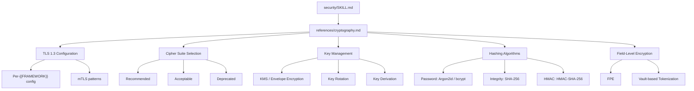

# Historia: Security KP -- Cryptography Reference

**ID:** story-0022-0025
**Chave Jira:** ---
**Status:** Pendente

## 1. Dependencias

| Blocked By | Blocks |
| :--- | :--- |
| --- | story-0022-0028 |

## 2. Regras Transversais Aplicaveis

| ID | Titulo |
| :--- | :--- |
| RULE-007 | Rastreabilidade de Compliance |
| RULE-015 | Template Engine Compatibility |

## 3. Descricao

Como **engenheiro de seguranca**, eu quero um knowledge pack de referencia para Criptografia cobrindo TLS 1.3, key management, hashing e tokenization por framework, garantindo que a equipe siga as melhores praticas criptograficas e evite erros comuns que comprometam a seguranca dos dados.

O arquivo `security/references/cryptography.md` sera o guia central de criptografia no security KP. A criptografia e um dos pilares de seguranca mais criticos e tambem um dos mais propensos a erros de implementacao. Erros comuns incluem: uso de algoritmos deprecados (MD5, SHA-1 para passwords), configuracao incorreta de TLS, gerenciamento inseguro de chaves, e falta de rotacao.

O guia e organizado em secoes independentes que cobrem todos os aspectos de criptografia moderna relevantes para aplicacoes: TLS configuration, cipher suite selection, key management, hashing algorithms, HMAC, field-level encryption, e tokenization. Cada secao usa `{{FRAMEWORK}}` e `{{LANGUAGE}}` placeholders (RULE-015) para geracao por stack tecnologica.

### 3.1 TLS 1.3 Configuration Guide

- Configuracao por `{{FRAMEWORK}}` (Spring Boot, Quarkus, NestJS, FastAPI, Gin, Axum, Ktor)
- Minimum TLS version enforcement
- Certificate management (self-signed para dev, CA-signed para prod)
- Mutual TLS (mTLS) patterns para service-to-service

### 3.2 Cipher Suite Selection

| Categoria | Recomendado | Aceitavel | Deprecado |
| :--- | :--- | :--- | :--- |
| Key Exchange | ECDHE, X25519 | DHE (2048+) | RSA key exchange, DH < 2048 |
| Symmetric | AES-256-GCM, ChaCha20-Poly1305 | AES-128-GCM | 3DES, RC4, DES |
| Hash | SHA-256, SHA-384, SHA-512 | SHA-3 | MD5, SHA-1 |
| Signature | ECDSA P-256+, Ed25519, RSA-PSS 2048+ | RSA PKCS#1 v1.5 2048+ | RSA < 2048, DSA |

### 3.3 Key Management Patterns

- KMS integration (envelope encryption)
- Key rotation strategies (automated, grace period)
- Key derivation (HKDF, PBKDF2)
- Secrets management (Vault, AWS KMS, Azure Key Vault, GCP KMS)

### 3.4 Hashing Algorithm Selection

| Caso de Uso | Algoritmo | NUNCA Usar |
| :--- | :--- | :--- |
| Password hashing | Argon2id (preferido), bcrypt (fallback) | MD5, SHA-1, SHA-256 sem salt |
| Data integrity | SHA-256, SHA-3 | MD5, CRC32 |
| HMAC | HMAC-SHA-256, HMAC-SHA-512 | HMAC-MD5 |
| Token generation | CSPRNG + Base64 | Math.random, UUID v4 |

### 3.5 Field-Level Encryption e Tokenization

- Envelope encryption para campos sensiveis
- Format-preserving encryption (FPE) para dados que precisam manter formato
- Vault-based tokenization para PCI-DSS compliance
- Deterministic vs randomized encryption trade-offs

## 3.5 Entrega de Valor

- **Valor Principal:** Guia de TLS 1.3, key management, hashing e tokenization por framework
- **Metrica de Sucesso:** 100% dos topicos de criptografia documentados com exemplos por {{FRAMEWORK}}
- **Impacto no Negocio:** Eliminacao de erros criptograficos comuns (algoritmos deprecados, chaves hardcoded, TLS misconfiguration)

## 4. Definicoes de Qualidade Locais

### DoR Local

- [ ] Security KP existente analisado para evitar duplicacao
- [ ] Lista de frameworks suportados confirmada (8 profiles)
- [ ] Standards de referencia consultados (NIST SP 800-57, OWASP Crypto Cheat Sheet)

### DoD Local

- [ ] Arquivo security/references/cryptography.md criado
- [ ] Secao TLS 1.3 com configuracao por {{FRAMEWORK}}
- [ ] Tabela de cipher suites (recomendado/aceitavel/deprecado)
- [ ] Key management patterns documentados (KMS, rotation, derivation)
- [ ] Hashing algorithm selection table completa
- [ ] Field-level encryption e tokenization patterns
- [ ] Todos os exemplos usam {{LANGUAGE}} e {{FRAMEWORK}} placeholders
- [ ] Registrado em security/SKILL.md
- [ ] Nenhum algoritmo deprecado recomendado como "aceitavel"

### Global DoD

- **Cobertura:** >= 95% Line, >= 90% Branch
- **Testes Automatizados:** Unitarios + integracao golden file parity
- **Relatorio de Cobertura:** JaCoCo
- **Documentacao:** SKILL.md documentado
- **Persistencia:** N/A
- **Performance:** Geracao < 10s

## 5. Contratos de Dados

N/A -- artefato e knowledge pack reference

## 6. Diagramas

### 6.1 Estrutura do Cryptography Reference



## 7. Criterios de Aceite (Gherkin)

```gherkin
Cenario: Arquivo cryptography.md existe e esta registrado
  DADO que o security KP esta sendo gerado
  QUANDO o gerador processa security/references/
  ENTAO cryptography.md existe em security/references/
  E security/SKILL.md referencia cryptography.md na secao de references

Cenario: TLS 1.3 configuration cobre todos os frameworks suportados
  DADO que cryptography.md foi gerado
  QUANDO a secao TLS 1.3 Configuration e analisada
  ENTAO existe configuracao usando {{FRAMEWORK}} placeholder
  E a configuracao inclui minimum TLS version enforcement
  E a configuracao inclui certificate management (dev vs prod)
  E a configuracao inclui mTLS patterns

Cenario: Nenhum algoritmo deprecado e recomendado
  DADO que cryptography.md foi gerado
  QUANDO as tabelas de cipher suites e hashing sao analisadas
  ENTAO MD5 NAO aparece como "Recomendado" ou "Aceitavel"
  E SHA-1 NAO aparece como "Recomendado" ou "Aceitavel" para hashing
  E 3DES e RC4 NAO aparecem como "Recomendado" ou "Aceitavel"
  E RSA < 2048 NAO aparece como "Recomendado" ou "Aceitavel"

Cenario: Hashing algorithm selection cobre todos os casos de uso
  DADO que cryptography.md foi gerado
  QUANDO a tabela de hashing e analisada
  ENTAO password hashing recomenda Argon2id com bcrypt como fallback
  E data integrity recomenda SHA-256
  E HMAC recomenda HMAC-SHA-256
  E token generation recomenda CSPRNG
  E cada caso de uso lista explicitamente o que NUNCA usar

Cenario: Exemplos de codigo usam placeholders de template engine
  DADO que cryptography.md foi gerado
  QUANDO os blocos de codigo sao analisados
  ENTAO todos os exemplos usam {{LANGUAGE}} e/ou {{FRAMEWORK}} placeholders
  E nenhum exemplo contem framework hardcoded (spring, quarkus, nestjs, etc.)
```

## 8. Sub-tarefas

- [ ] [Dev] Criar arquivo security/references/cryptography.md
- [ ] [Dev] Documentar secao TLS 1.3 Configuration com {{FRAMEWORK}} examples
- [ ] [Dev] Documentar tabela de cipher suite selection (recomendado/aceitavel/deprecado)
- [ ] [Dev] Documentar key management patterns (KMS, rotation, derivation, secrets managers)
- [ ] [Dev] Documentar hashing algorithm selection table com NUNCA usar
- [ ] [Dev] Documentar field-level encryption e tokenization patterns
- [ ] [Dev] Registrar referencia em security/SKILL.md
- [ ] [Test] Teste unitario: arquivo gerado contem todas as secoes esperadas
- [ ] [Test] Teste unitario: nenhum algoritmo deprecado aparece como recomendado
- [ ] [Test] Teste unitario: exemplos usam {{LANGUAGE}} e {{FRAMEWORK}} placeholders
- [ ] [Test] Smoke/E2E: Gerar security KP completo e validar presenca e estrutura de cryptography.md
- [ ] [Doc] Documentar referencia no SKILL.md do security KP
