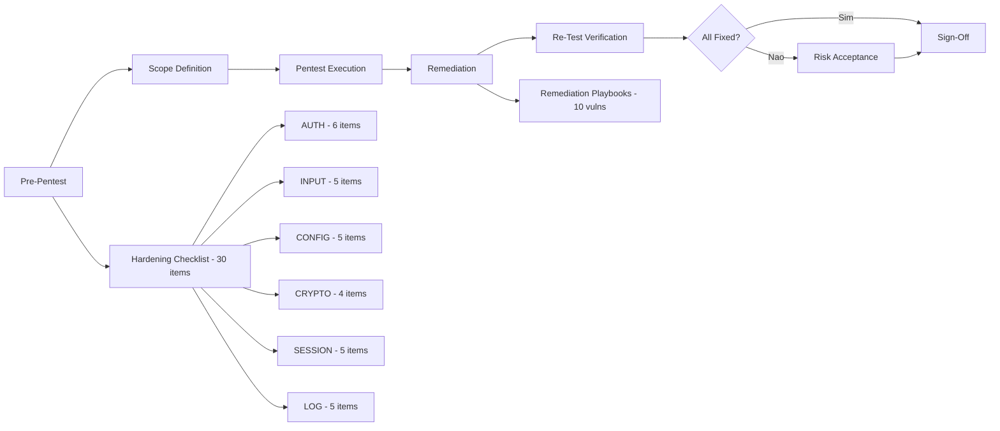

# Historia: Security KP -- Pentest Readiness Reference

**ID:** story-0022-0026
**Chave Jira:** ---
**Status:** Pendente

## 1. Dependencias

| Blocked By | Blocks |
| :--- | :--- |
| story-0022-0015 | story-0022-0028 |

## 2. Regras Transversais Aplicaveis

| ID | Titulo |
| :--- | :--- |
| RULE-007 | Rastreabilidade de Compliance |

## 3. Descricao

Como **engenheiro de seguranca (pentest)**, eu quero um knowledge pack de referencia para Pentest Readiness com checklist pre-pentest, remediation playbooks e templates de escopo, garantindo que a equipe esteja preparada antes, durante e apos testes de penetracao.

O arquivo `security/references/pentest-readiness.md` cobre o ciclo completo de pentest: preparacao (hardening pre-teste), escopo (definicao de alvos e regras de engajamento), execucao (referencia para findings comuns), remediacao (playbooks por vulnerabilidade), e verificacao (re-test checklist). O pentest-engineer agent (story-0022-0015) utiliza este KP como referencia primaria.

A preparacao e o aspecto mais negligenciado do pentest. Equipes frequentemente iniciam pentests sem hardening basico, resultando em findings triviais que consomem tempo e budget. O checklist pre-pentest de 30 items organizado por categoria (auth, input, config, crypto, session, logging) garante que problemas conhecidos sejam resolvidos antes do pentest, maximizando o ROI do teste.

### 3.1 Pre-Pentest Hardening Checklist (30 items)

| Categoria | # Items | Exemplos |
| :--- | :--- | :--- |
| Authentication (AUTH) | 6 | MFA habilitado, brute-force protection, password policy, session timeout, account lockout, JWT validation |
| Input Validation (INPUT) | 5 | SQL injection, XSS, path traversal, deserialization, file upload |
| Configuration (CONFIG) | 5 | TLS 1.2+, security headers, CORS policy, debug mode off, default credentials removed |
| Cryptography (CRYPTO) | 4 | Strong algorithms only, key rotation, no hardcoded secrets, proper certificate validation |
| Session Management (SESSION) | 5 | Secure cookie flags, CSRF protection, session regeneration, logout invalidation, concurrent session control |
| Logging & Monitoring (LOG) | 5 | Auth events logged, failed access logged, no PII in logs, log integrity, alerting configured |

### 3.2 Remediation Playbooks

Para cada tipo de vulnerabilidade, o playbook inclui:
1. **Descricao**: O que e e como e explorada
2. **Severidade Tipica**: CVSS range e categoria OWASP
3. **Deteccao**: Como encontrar (manual + automatizado)
4. **Remediacao**: Passos concretos com codigo usando `{{FRAMEWORK}}`
5. **Verificacao**: Como confirmar que a correcao funciona
6. **Prevencao**: Como evitar reincidencia

Vulnerabilidades cobertas:
- SQL Injection (SQLi)
- Cross-Site Scripting (XSS)
- Cross-Site Request Forgery (CSRF)
- Authentication Bypass
- Server-Side Request Forgery (SSRF)
- Insecure Deserialization
- Insecure Direct Object Reference (IDOR)
- Path Traversal
- Information Disclosure
- Broken Access Control

### 3.3 Pentest Scope Definition Template

Template para definicao de escopo incluindo:
- Target systems (URLs, IPs, APIs)
- Exclusions (producao, third-party, out-of-scope)
- Test window (datas, horarios, timezone)
- Contacts (equipe, escalation, emergencia)
- Rules of engagement (limites, notificacao, cleanup)

### 3.4 Post-Pentest

- Remediation tracking template (finding -> assignee -> status -> deadline)
- Re-test verification checklist (por finding resolvido)
- Risk acceptance template (para findings nao remediados com justificativa)

## 3.5 Entrega de Valor

- **Valor Principal:** Checklist pre-pentest (30 items) e remediation playbooks por vulnerabilidade
- **Metrica de Sucesso:** 30 items de checklist cobrindo 6 categorias + 10 remediation playbooks completos
- **Impacto no Negocio:** Preparacao sistematica para pentests, reducao de findings triviais e maximizacao de ROI do pentest

## 4. Definicoes de Qualidade Locais

### DoR Local

- [ ] Pentest Engineer Agent (story-0022-0015) implementado
- [ ] OWASP Testing Guide consultado
- [ ] PTES (Penetration Testing Execution Standard) consultado
- [ ] Playbooks para pelo menos 5 vulnerabilidades validados com security engineer

### DoD Local

- [ ] Arquivo security/references/pentest-readiness.md criado
- [ ] Checklist pre-pentest com 30 items em 6 categorias
- [ ] 10 remediation playbooks completos (descricao, deteccao, remediacao, verificacao)
- [ ] Template de scope definition com todas as secoes
- [ ] Template de remediation tracking e re-test checklist
- [ ] Exemplos de remediacao usam {{FRAMEWORK}} placeholder
- [ ] Registrado em security/SKILL.md

### Global DoD

- **Cobertura:** >= 95% Line, >= 90% Branch
- **Testes Automatizados:** Unitarios + integracao golden file parity
- **Relatorio de Cobertura:** JaCoCo
- **Documentacao:** SKILL.md documentado
- **Persistencia:** N/A
- **Performance:** Geracao < 10s

## 5. Contratos de Dados

N/A -- artefato e knowledge pack reference

## 6. Diagramas

### 6.1 Ciclo de Pentest Readiness



## 7. Criterios de Aceite (Gherkin)

```gherkin
Cenario: Arquivo pentest-readiness.md existe e esta registrado
  DADO que o security KP esta sendo gerado
  QUANDO o gerador processa security/references/
  ENTAO pentest-readiness.md existe em security/references/
  E security/SKILL.md referencia pentest-readiness.md na secao de references

Cenario: Checklist pre-pentest contem 30 items em 6 categorias
  DADO que pentest-readiness.md foi gerado
  QUANDO a secao de checklist pre-pentest e analisada
  ENTAO existem exatamente 6 categorias (AUTH, INPUT, CONFIG, CRYPTO, SESSION, LOG)
  E AUTH contem 6 items
  E INPUT contem 5 items
  E CONFIG contem 5 items
  E CRYPTO contem 4 items
  E SESSION contem 5 items
  E LOG contem 5 items
  E o total e 30 items

Cenario: Remediation playbooks cobrem 10 tipos de vulnerabilidade
  DADO que pentest-readiness.md foi gerado
  QUANDO a secao de remediation playbooks e analisada
  ENTAO existem playbooks para: SQLi, XSS, CSRF, Auth Bypass, SSRF, Insecure Deserialization, IDOR, Path Traversal, Information Disclosure, Broken Access Control
  E cada playbook contem: descricao, severidade, deteccao, remediacao, verificacao, prevencao
  E exemplos de remediacao usam {{FRAMEWORK}} placeholder

Cenario: Scope definition template contem todas as secoes obrigatorias
  DADO que pentest-readiness.md foi gerado
  QUANDO o template de scope definition e analisado
  ENTAO contem secoes para: target systems, exclusions, test window, contacts, rules of engagement
  E cada secao tem campos preenchidos como exemplo

Cenario: Post-pentest templates estao completos
  DADO que pentest-readiness.md foi gerado
  QUANDO a secao post-pentest e analisada
  ENTAO contem remediation tracking template com campos: finding, assignee, status, deadline
  E contem re-test verification checklist
  E contem risk acceptance template com campo de justificativa
```

## 8. Sub-tarefas

- [ ] [Dev] Criar arquivo security/references/pentest-readiness.md
- [ ] [Dev] Documentar checklist pre-pentest (30 items em 6 categorias)
- [ ] [Dev] Documentar remediation playbooks para 10 tipos de vulnerabilidade
- [ ] [Dev] Criar scope definition template com todas as secoes
- [ ] [Dev] Criar post-pentest templates (tracking, re-test, risk acceptance)
- [ ] [Dev] Registrar referencia em security/SKILL.md
- [ ] [Test] Teste unitario: checklist contem exatamente 30 items em 6 categorias
- [ ] [Test] Teste unitario: 10 playbooks presentes com estrutura completa
- [ ] [Test] Teste unitario: templates usam {{FRAMEWORK}} placeholder
- [ ] [Test] Smoke/E2E: Gerar security KP completo e validar presenca e estrutura de pentest-readiness.md
- [ ] [Doc] Documentar referencia no SKILL.md do security KP
