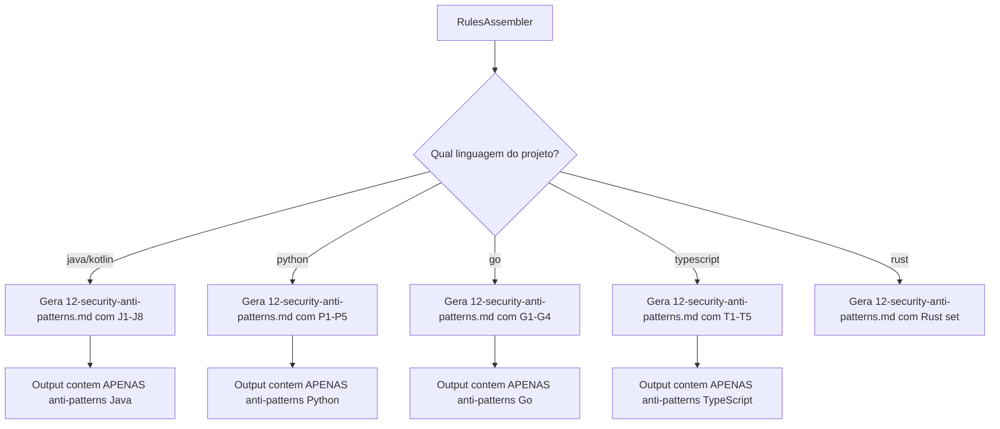

# Historia: Security Anti-Patterns Rule (per language)

**ID:** story-0022-0027
**Chave Jira:** ---
**Status:** Pendente

## 1. Dependencias

| Blocked By | Blocks |
| :--- | :--- |
| --- | story-0022-0028 |

## 2. Regras Transversais Aplicaveis

| ID | Titulo |
| :--- | :--- |
| RULE-010 | Geracao Condicional por Feature Flag |
| RULE-014 | Backward Compatibility |
| RULE-015 | Template Engine Compatibility |

## 3. Descricao

Como **engenheiro de plataforma**, eu quero uma rule condicional de anti-patterns de seguranca por linguagem/framework, garantindo que desenvolvedores tenham exemplos concretos de codigo inseguro e sua correcao na linguagem do projeto.

A rule `12-security-anti-patterns.md` e gerada condicionalmente pelo RulesAssembler baseada na linguagem e framework do projeto (RULE-010). Cada anti-pattern documenta: codigo vulneravel com explicacao da vulnerabilidade, codigo corrigido com explicacao da correcao, e referencia CWE. O isolamento por linguagem e fundamental: anti-patterns de Java NUNCA aparecem no output de um projeto Python, e vice-versa.

A rule complementa o security KP (que e referencia geral) com exemplos especificos e acionaveis na linguagem exata do projeto. Enquanto o KP usa `{{LANGUAGE}}` placeholders, a rule gerada contem codigo real na linguagem do projeto, pronto para comparacao durante code review.

### 3.1 Anti-Patterns Java (8 patterns)

| # | Anti-Pattern | CWE | Vulnerabilidade |
| :--- | :--- | :--- | :--- |
| J1 | SQL concatenation com String | CWE-89 | SQL Injection |
| J2 | Math.random() para seguranca | CWE-330 | Weak Random |
| J3 | ObjectInputStream sem whitelist | CWE-502 | Insecure Deserialization |
| J4 | Password hardcoded em String | CWE-798 | Hardcoded Credentials |
| J5 | X509TrustManager vazio (trust all) | CWE-295 | Improper Certificate Validation |
| J6 | new File(userInput) sem normalizacao | CWE-22 | Path Traversal |
| J7 | Exception message em HTTP response | CWE-209 | Information Exposure |
| J8 | CORS allowedOrigins("*") | CWE-942 | Permissive CORS Policy |

### 3.2 Anti-Patterns Python (5 patterns)

| # | Anti-Pattern | CWE | Vulnerabilidade |
| :--- | :--- | :--- | :--- |
| P1 | pickle.loads(user_input) | CWE-502 | Insecure Deserialization |
| P2 | eval()/exec() com input do usuario | CWE-95 | Code Injection |
| P3 | cursor.execute(f"SELECT ... {var}") | CWE-89 | SQL Injection |
| P4 | jwt.decode() sem verify=True | CWE-347 | Improper JWT Verification |
| P5 | subprocess(shell=True) com user input | CWE-78 | OS Command Injection |

### 3.3 Anti-Patterns Go (4 patterns)

| # | Anti-Pattern | CWE | Vulnerabilidade |
| :--- | :--- | :--- | :--- |
| G1 | http.ListenAndServe sem TLS | CWE-319 | Cleartext Transmission |
| G2 | Erros de crypto ignorados (_, _ = ...) | CWE-390 | Error Condition Without Action |
| G3 | template.HTML(userInput) | CWE-79 | Cross-Site Scripting |
| G4 | SQL query por concatenacao de string | CWE-89 | SQL Injection |

### 3.4 Anti-Patterns TypeScript (5 patterns)

| # | Anti-Pattern | CWE | Vulnerabilidade |
| :--- | :--- | :--- | :--- |
| T1 | eval(req.body.expression) | CWE-95 | Code Injection |
| T2 | Object.assign sem prototype check | CWE-1321 | Prototype Pollution |
| T3 | Regex sem ReDoS protection | CWE-1333 | ReDoS |
| T4 | element.innerHTML = userInput | CWE-79 | Cross-Site Scripting |
| T5 | jwt.verify sem algorithms restriction | CWE-327 | Broken Crypto Algorithm |

### 3.5 Geracao Condicional

| Linguagem | Framework(s) | Anti-Patterns Gerados | Condição |
| :--- | :--- | :--- | :--- |
| java | spring, quarkus | J1-J8 | language = java |
| kotlin | ktor | J1-J8 (adaptados para Kotlin) | language = kotlin |
| python | fastapi, click-cli | P1-P5 | language = python |
| go | gin | G1-G4 | language = go |
| typescript | nestjs | T1-T5 | language = typescript |
| rust | axum | (Rust-specific set) | language = rust |

### 3.6 Formato de Cada Anti-Pattern

```markdown
### [ID]: [Nome]
**CWE:** CWE-NNN — [Nome CWE]
**Severidade:** CRITICAL | HIGH | MEDIUM

#### Codigo Vulneravel
```[language]
// Explicacao do problema inline
[codigo inseguro]
```

#### Codigo Corrigido
```[language]
// Explicacao da correcao inline
[codigo seguro]
```

#### Por que e perigoso
[Explicacao do impacto]
```

## 3.5 Entrega de Valor

- **Valor Principal:** Rule condicional com anti-patterns de seguranca e codigo errado/correto por linguagem
- **Metrica de Sucesso:** 100% dos anti-patterns com codigo vulneravel, corrigido e CWE reference
- **Impacto no Negocio:** Desenvolvedores identificam e corrigem vulnerabilidades na linguagem do projeto, reducao de findings em code review

## 4. Definicoes de Qualidade Locais

### DoR Local

- [ ] Lista de anti-patterns por linguagem validada com security engineer
- [ ] CWE references verificadas contra MITRE CWE database
- [ ] Exemplos de codigo testados para compilacao/execucao

### DoD Local

- [ ] Template 12-security-anti-patterns.md criado com secoes por linguagem
- [ ] Java: 8 anti-patterns com codigo vulneravel e corrigido
- [ ] Python: 5 anti-patterns com codigo vulneravel e corrigido
- [ ] Go: 4 anti-patterns com codigo vulneravel e corrigido
- [ ] TypeScript: 5 anti-patterns com codigo vulneravel e corrigido
- [ ] Cada anti-pattern tem CWE reference valida
- [ ] Geracao condicional por linguagem implementada no RulesAssembler
- [ ] Isolamento de linguagem: anti-patterns de Java NAO aparecem em output Python
- [ ] Backward compatible: projetos existentes sem mudanca no output

### Global DoD

- **Cobertura:** >= 95% Line, >= 90% Branch
- **Testes Automatizados:** Unitarios + integracao golden file parity
- **Relatorio de Cobertura:** JaCoCo
- **Documentacao:** SKILL.md documentado
- **Persistencia:** N/A
- **Performance:** Geracao < 10s

## 5. Contratos de Dados

### 5.1 Anti-Pattern Entry

| Campo | Tipo | M/O | Validacoes | Exemplo |
| :--- | :--- | :--- | :--- | :--- |
| id | String | M | Pattern: [A-Z][0-9]+ | `"J1"` |
| name | String | M | Non-empty | `"SQL concatenation"` |
| cweId | String | M | Pattern: CWE-[0-9]+ | `"CWE-89"` |
| cweName | String | M | Non-empty | `"SQL Injection"` |
| severity | String | M | enum: CRITICAL, HIGH, MEDIUM | `"CRITICAL"` |
| language | String | M | enum: java, python, go, typescript, kotlin, rust | `"java"` |
| vulnerableCode | String | M | Codigo compilavel/executavel | `"stmt.execute(\"SELECT * FROM users WHERE id=\" + id)"` |
| fixedCode | String | M | Codigo compilavel/executavel | `"stmt.prepareStatement(\"SELECT * FROM users WHERE id=?\")"` |
| explanation | String | M | Non-empty | `"Concatenacao permite injecao de SQL"` |

### 5.2 Language -> Anti-Patterns Mapping

| Language | IDs | Count |
| :--- | :--- | :--- |
| java | J1-J8 | 8 |
| kotlin | J1-J8 (adapted) | 8 |
| python | P1-P5 | 5 |
| go | G1-G4 | 4 |
| typescript | T1-T5 | 5 |

## 6. Diagramas

### 6.1 Fluxo de geracao condicional



## 7. Criterios de Aceite (Gherkin)

```gherkin
Cenario: Projeto Java gera anti-patterns Java apenas
  DADO que o projeto tem language = "java"
  QUANDO 12-security-anti-patterns.md e gerado
  ENTAO o arquivo contem 8 anti-patterns (J1-J8)
  E cada anti-pattern tem codigo Java vulneravel e corrigido
  E nenhum anti-pattern Python, Go ou TypeScript esta presente

Cenario: Projeto Python gera anti-patterns Python apenas
  DADO que o projeto tem language = "python"
  QUANDO 12-security-anti-patterns.md e gerado
  ENTAO o arquivo contem 5 anti-patterns (P1-P5)
  E cada anti-pattern tem codigo Python vulneravel e corrigido
  E nenhum anti-pattern Java, Go ou TypeScript esta presente

Cenario: Cada anti-pattern tem CWE reference valida
  DADO que 12-security-anti-patterns.md foi gerado para qualquer linguagem
  QUANDO os anti-patterns sao analisados
  ENTAO cada anti-pattern tem um campo CWE no formato CWE-NNN
  E cada CWE e um identificador valido do MITRE CWE database
  E cada anti-pattern tem severidade (CRITICAL, HIGH ou MEDIUM)

Cenario: Codigo vulneravel e corrigido sao sintaticamente validos
  DADO que 12-security-anti-patterns.md foi gerado para language = "java"
  QUANDO os blocos de codigo sao analisados
  ENTAO o codigo vulneravel e Java sintaticamente valido
  E o codigo corrigido e Java sintaticamente valido
  E o codigo corrigido resolve a vulnerabilidade descrita no CWE

Cenario: Backward compatibility -- projetos sem a rule nao sao afetados
  DADO que um profile existente (ex: java-spring) gera rules
  E 12-security-anti-patterns.md NAO existia antes
  QUANDO o ambiente e gerado sem security flags adicionais
  ENTAO o output NAO inclui 12-security-anti-patterns.md
  E todas as rules existentes (01-07) sao identicas ao golden file
```

## 8. Sub-tarefas

- [ ] [Dev] Criar template 12-security-anti-patterns.md com estrutura base
- [ ] [Dev] Implementar 8 anti-patterns Java (J1-J8) com codigo vulneravel e corrigido
- [ ] [Dev] Implementar 5 anti-patterns Python (P1-P5) com codigo vulneravel e corrigido
- [ ] [Dev] Implementar 4 anti-patterns Go (G1-G4) com codigo vulneravel e corrigido
- [ ] [Dev] Implementar 5 anti-patterns TypeScript (T1-T5) com codigo vulneravel e corrigido
- [ ] [Dev] Implementar geracao condicional por linguagem no RulesAssembler
- [ ] [Dev] Implementar isolamento de linguagem (Java-only, Python-only, etc.)
- [ ] [Test] Teste unitario: Java project gera apenas J1-J8
- [ ] [Test] Teste unitario: Python project gera apenas P1-P5
- [ ] [Test] Teste unitario: Go project gera apenas G1-G4
- [ ] [Test] Teste unitario: TypeScript project gera apenas T1-T5
- [ ] [Test] Teste unitario: cada anti-pattern tem CWE valido
- [ ] [Test] Smoke/E2E: Gerar ambiente para cada linguagem e validar isolamento de anti-patterns
- [ ] [Doc] Documentar anti-patterns e logica de geracao condicional
