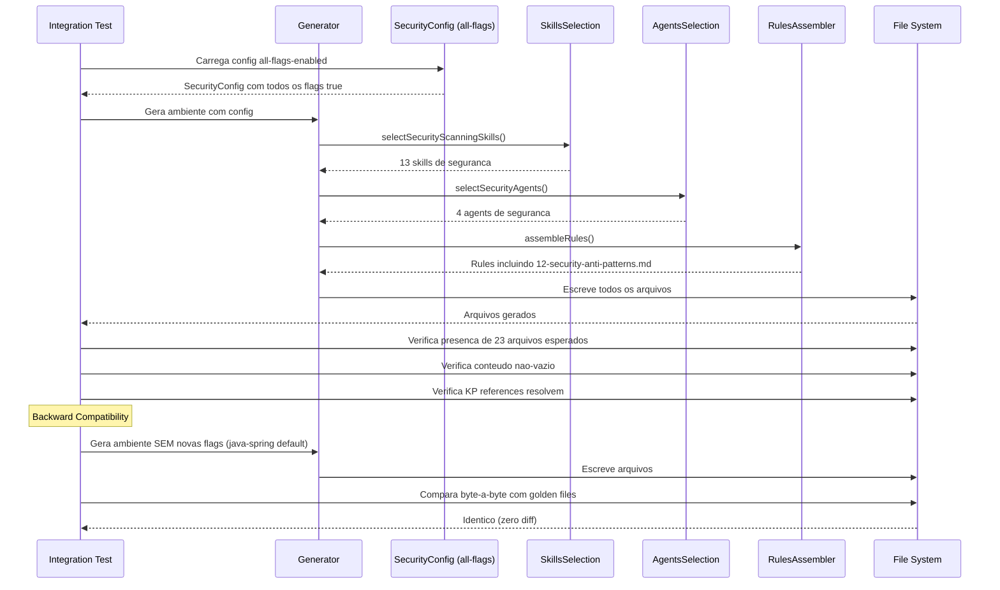

# Historia: Integration Verification + Smoke Test

**ID:** story-0022-0028
**Chave Jira:** ---
**Status:** Pendente

## 1. Dependencias

| Blocked By | Blocks |
| :--- | :--- |
| story-0022-0022, story-0022-0023, story-0022-0024, story-0022-0025, story-0022-0026, story-0022-0027 | --- |

## 2. Regras Transversais Aplicaveis

| ID | Titulo |
| :--- | :--- |
| RULE-010 | Geracao Condicional por Feature Flag |
| RULE-014 | Backward Compatibility |

## 3. Descricao

Como **engenheiro de plataforma**, eu quero uma verificacao completa de integracao e smoke test do epic-0022, garantindo que todos os novos componentes estao corretamente wired, backward compatible, e funcionando em conjunto.

Esta e a historia terminal do epic-0022. Sua funcao e validar que todas as 27 historias anteriores se integram corretamente: skills registradas em SkillsSelection, agents registrados em AgentsSelection, knowledge pack references resolvem, SecurityConfig.fromMap() parseia todos os novos campos, settings.json merge funciona, e geracao condicional ativa/desativa componentes conforme flags.

O smoke test principal gera um ambiente completo para um projeto Java Spring com TODAS as security flags habilitadas e verifica que todos os novos arquivos estao presentes. O teste de backward compatibility gera o mesmo projeto sem as novas flags e verifica que o output e identico ao golden file anterior. Ambos os testes garantem que o epic nao introduz regressoes.

### 3.1 Wiring Verification

| Componente | Verificacao |
| :--- | :--- |
| SkillsSelection | Todas as novas skills condicionais registradas e ativadas por flag |
| AgentsSelection | Todos os novos agents registrados e ativados por flag |
| KP References | Todas as references em security/SKILL.md resolvem para arquivos existentes |
| SecurityConfig.fromMap() | Parseia todos os novos campos sem erro |
| Settings.json merge | Novas permissions/hooks mergeiam corretamente |
| RulesAssembler | 12-security-anti-patterns.md gerada condicionalmente |
| SecurityBaselineAssembler | Secao "Automated Verification" gerada condicionalmente |
| x-review Enhancement | Items 11-15 presentes no checklist de seguranca |

### 3.2 All-Flags-Enabled Smoke Test

Configuracao do projeto de teste:

```yaml
language: java
version: "21"
framework: spring
buildTool: maven
security:
  scanning:
    sast: true
    dast: true
    secretScan: true
    containerScan: true
    infraScan: true
  qualityGate:
    provider: sonarqube
  pentest: true
  compliance:
    - pci-dss
    - lgpd
infrastructure:
  container: docker
  orchestrator: kubernetes
```

### 3.3 Arquivos Esperados no Smoke Test

| Categoria | Arquivos | Fonte |
| :--- | :--- | :--- |
| Skills de Scanning | x-sast-scan, x-secret-scan, x-container-scan, x-infra-scan, x-dast-scan | stories 0005-0009 |
| Skills de Verificacao | x-owasp-scan, x-sonar-gate, x-hardening-eval, x-runtime-protection | stories 0010-0013 |
| Skills de Supply Chain | x-supply-chain-audit | story 0014 |
| Skills Orquestradoras | x-pentest, x-security-dashboard, x-security-pipeline | stories 0018-0020 |
| Agents | pentest-engineer, appsec-engineer, devsecops-engineer, compliance-auditor | stories 0015-0017, 0021 |
| Knowledge Packs | owasp-asvs, application-security, cryptography, pentest-readiness | stories 0004, 0024-0026 |
| Rules | 12-security-anti-patterns.md (Java) | story 0027 |
| Enhanced | 06-security-baseline.md com Automated Verification | story 0023 |
| Enhanced | x-review com items 11-15 | story 0022 |

### 3.4 Backward Compatibility Test

Gerar ambiente para cada profile existente SEM novas flags e comparar byte-a-byte com golden files. Profiles: java-spring, java-quarkus, kotlin-ktor, python-fastapi, python-click-cli, go-gin, typescript-nestjs, rust-axum.

## 3.5 Entrega de Valor

- **Valor Principal:** Validacao completa de wiring e backward compatibility com smoke test all-flags-enabled
- **Metrica de Sucesso:** 100% dos arquivos esperados presentes no smoke test + 100% backward compatible com golden files
- **Impacto no Negocio:** Garantia de que o epic-0022 nao introduz regressoes e todos os componentes funcionam em conjunto

## 4. Definicoes de Qualidade Locais

### DoR Local

- [ ] Todas as 27 historias anteriores (story-0022-0001 a story-0022-0027) implementadas
- [ ] Golden files existentes para todos os 8 profiles
- [ ] Configuracao all-flags-enabled documentada e validada

### DoD Local

- [ ] Wiring verification: todas as novas skills em SkillsSelection
- [ ] Wiring verification: todos os novos agents em AgentsSelection
- [ ] Wiring verification: todas as KP references resolvem
- [ ] Wiring verification: SecurityConfig.fromMap() parseia todos os novos campos
- [ ] Wiring verification: settings.json merge funciona
- [ ] Smoke test all-flags-enabled: todos os arquivos esperados presentes
- [ ] Backward compatibility: output identico para cada profile sem novas flags
- [ ] Golden files atualizados para incluir novo profile all-security-flags
- [ ] Zero regressoes em testes existentes

### Global DoD

- **Cobertura:** >= 95% Line, >= 90% Branch
- **Testes Automatizados:** Unitarios + integracao golden file parity
- **Relatorio de Cobertura:** JaCoCo
- **Documentacao:** SKILL.md documentado
- **Persistencia:** N/A
- **Performance:** Geracao < 10s

## 5. Contratos de Dados

### 5.1 Smoke Test Configuration

| Campo | Tipo | Valor | Descricao |
| :--- | :--- | :--- | :--- |
| language | String | java | Linguagem do projeto |
| version | String | 21 | Versao da linguagem |
| framework | String | spring | Framework |
| buildTool | String | maven | Build tool |
| security.scanning.sast | boolean | true | SAST habilitado |
| security.scanning.dast | boolean | true | DAST habilitado |
| security.scanning.secretScan | boolean | true | Secret scan habilitado |
| security.scanning.containerScan | boolean | true | Container scan habilitado |
| security.scanning.infraScan | boolean | true | Infra scan habilitado |
| security.qualityGate.provider | String | sonarqube | Quality gate provider |
| security.pentest | boolean | true | Pentest habilitado |
| security.compliance | List | [pci-dss, lgpd] | Compliance frameworks |
| infrastructure.container | String | docker | Container runtime |
| infrastructure.orchestrator | String | kubernetes | Orchestrator |

### 5.2 Expected Files Checklist

| # | Arquivo | Tipo | Condicao |
| :--- | :--- | :--- | :--- |
| 1 | x-sast-scan/SKILL.md | Skill | scanning.sast=true |
| 2 | x-secret-scan/SKILL.md | Skill | scanning.secretScan=true |
| 3 | x-container-scan/SKILL.md | Skill | scanning.containerScan=true |
| 4 | x-infra-scan/SKILL.md | Skill | scanning.infraScan=true |
| 5 | x-dast-scan/SKILL.md | Skill | scanning.dast=true |
| 6 | x-owasp-scan/SKILL.md | Skill | scanning.sast OR scanning.dast |
| 7 | x-sonar-gate/SKILL.md | Skill | qualityGate.provider=sonarqube |
| 8 | x-hardening-eval/SKILL.md | Skill | scanning.dast=true |
| 9 | x-runtime-protection/SKILL.md | Skill | scanning.dast=true |
| 10 | x-supply-chain-audit/SKILL.md | Skill | scanning.sast=true |
| 11 | x-pentest/SKILL.md | Skill | pentest=true |
| 12 | x-security-dashboard/SKILL.md | Skill | any scanning=true |
| 13 | x-security-pipeline/SKILL.md | Skill | any scanning=true |
| 14 | pentest-engineer.md | Agent | pentest=true |
| 15 | appsec-engineer.md | Agent | any scanning=true |
| 16 | devsecops-engineer.md | Agent | any scanning=true |
| 17 | compliance-auditor.md | Agent | compliance non-empty |
| 18 | owasp-asvs/ | KP | any scanning=true |
| 19 | security/references/application-security.md | KP Ref | always |
| 20 | security/references/cryptography.md | KP Ref | always |
| 21 | security/references/pentest-readiness.md | KP Ref | pentest=true |
| 22 | 12-security-anti-patterns.md | Rule | always (language-conditional) |
| 23 | 06-security-baseline.md (with Automated Verification) | Rule | any scanning=true |

## 6. Diagramas

### 6.1 Fluxo de verificacao de integracao



## 7. Criterios de Aceite (Gherkin)

```gherkin
Cenario: SkillsSelection registra todas as novas skills
  DADO que SecurityConfig tem todas as scanning flags habilitadas
  QUANDO selectSecurityScanningSkills() e invocado
  ENTAO as 13 skills de seguranca sao retornadas
  E cada skill corresponde a uma flag de configuracao

Cenario: AgentsSelection registra todos os novos agents
  DADO que SecurityConfig tem pentest=true e compliance=[pci-dss]
  QUANDO selectSecurityAgents() e invocado
  ENTAO pentest-engineer, appsec-engineer, devsecops-engineer e compliance-auditor sao retornados
  E cada agent corresponde a uma flag de configuracao

Cenario: SecurityConfig.fromMap() parseia todos os novos campos
  DADO que um Map com todos os campos de seguranca e fornecido
  E inclui scanning.sast, scanning.dast, scanning.secretScan, scanning.containerScan, scanning.infraScan
  E inclui qualityGate.provider, pentest, compliance
  QUANDO SecurityConfig.fromMap() e invocado
  ENTAO todos os campos sao parseados sem erro
  E cada campo tem o valor correto

Cenario: KP references resolvem para arquivos existentes
  DADO que security/SKILL.md referencia application-security.md, cryptography.md e pentest-readiness.md
  QUANDO as references sao verificadas
  ENTAO cada referencia aponta para um arquivo que existe no output gerado
  E nenhuma referencia esta quebrada

Cenario: Smoke test all-flags gera todos os 23 arquivos esperados
  DADO que a configuracao all-flags-enabled e utilizada (YAML da secao 3.2)
  QUANDO o gerador e executado
  ENTAO todos os 23 arquivos listados na secao 5.2 estao presentes
  E cada arquivo tem conteudo nao-vazio
  E 12-security-anti-patterns.md contem anti-patterns Java (J1-J8)
  E 06-security-baseline.md contem secao "Automated Verification"

Cenario: Backward compatibility -- profiles existentes identicos
  DADO que os 8 profiles existentes (java-spring, java-quarkus, kotlin-ktor, python-fastapi, python-click-cli, go-gin, typescript-nestjs, rust-axum) sao gerados
  E nenhuma flag de seguranca nova esta habilitada
  QUANDO o output e comparado com os golden files existentes
  ENTAO cada arquivo gerado e identico ao golden file correspondente
  E nenhum arquivo novo foi adicionado ao output
  E nenhum arquivo existente foi modificado

Cenario: Geracao com flags parciais ativa apenas componentes correspondentes
  DADO que SecurityConfig tem scanning.sast=true e scanning.secretScan=true
  MAS scanning.dast=false, scanning.containerScan=false, scanning.infraScan=false
  E pentest=false e compliance=[]
  QUANDO o gerador e executado
  ENTAO x-sast-scan/SKILL.md e x-secret-scan/SKILL.md estao presentes
  E x-dast-scan/SKILL.md e x-container-scan/SKILL.md NAO estao presentes
  E pentest-engineer.md e compliance-auditor.md NAO estao presentes
  E appsec-engineer.md ESTA presente (ativado por qualquer scanning flag)

Cenario: Golden files atualizados para profile all-security-flags
  DADO que o smoke test all-flags-enabled passou
  QUANDO os golden files sao atualizados
  ENTAO um novo golden file directory existe para o profile all-security-flags
  E contem todos os 23 arquivos esperados
  E os testes de golden file parity passam para o novo profile
```

## 8. Sub-tarefas

- [ ] [Dev] Implementar wiring verification para SkillsSelection (13 novas skills)
- [ ] [Dev] Implementar wiring verification para AgentsSelection (4 novos agents)
- [ ] [Dev] Implementar verificacao de KP references (todas resolvem)
- [ ] [Dev] Implementar verificacao de SecurityConfig.fromMap() (todos os novos campos)
- [ ] [Dev] Implementar verificacao de settings.json merge
- [ ] [Test] Teste unitario: SkillsSelection retorna todas as skills por flag
- [ ] [Test] Teste unitario: AgentsSelection retorna todos os agents por flag
- [ ] [Test] Teste unitario: SecurityConfig.fromMap() parseia todos os novos campos
- [ ] [Test] Teste unitario: KP references resolvem para arquivos existentes
- [ ] [Test] Teste integracao: smoke test all-flags-enabled (23 arquivos presentes)
- [ ] [Test] Teste integracao: backward compatibility (8 profiles identicos a golden files)
- [ ] [Test] Teste integracao: flags parciais ativam apenas componentes correspondentes
- [ ] [Test] Smoke/E2E: Execucao completa do gerador com all-flags e comparacao com golden files
- [ ] [Doc] Atualizar golden files para incluir profile all-security-flags
- [ ] [Doc] Documentar configuracao all-flags-enabled e arquivos esperados
