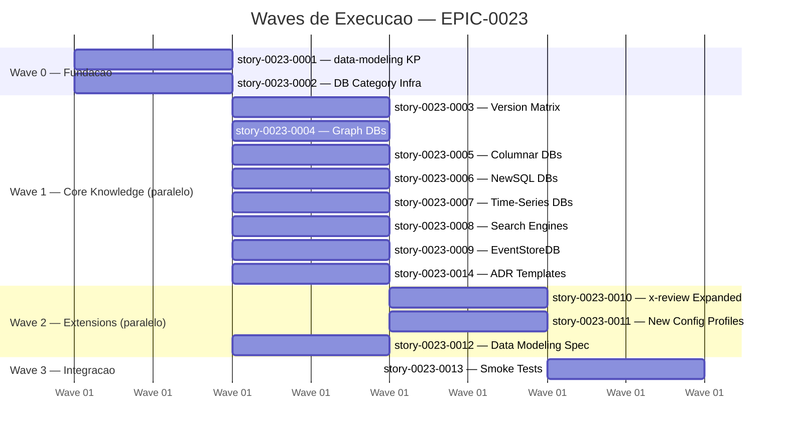

# Mapa de Implementacao — EPIC-0023 (Expansao da arquitetura de dados)

**Autor:** Claude (AI Assistant)
**Data:** 2026-04-05
**Gerado a partir das dependencias BlockedBy/Blocks de cada historia do EPIC-0023.**

---

## 1. Dependency Matrix

| ID | Titulo | Blocked By | Blocks | Wave |
| :--- | :--- | :--- | :--- | :--- |
| story-0023-0001 | Knowledge pack data-modeling com padroes cross-cutting | -- | story-0023-0003, story-0023-0012, story-0023-0014 | 0 |
| story-0023-0002 | Infraestrutura de categorias de banco no Java | -- | story-0023-0004, story-0023-0005, story-0023-0006, story-0023-0007, story-0023-0008, story-0023-0009 | 0 |
| story-0023-0003 | Atualizacao do version matrix e database-patterns KP | story-0023-0001 | story-0023-0010 | 1 |
| story-0023-0004 | Knowledge de Graph Databases (Neo4j + Neptune) | story-0023-0002 | story-0023-0010, story-0023-0011 | 1 |
| story-0023-0005 | Knowledge de Columnar/OLAP (ClickHouse + Druid) | story-0023-0002 | story-0023-0010, story-0023-0011 | 1 |
| story-0023-0006 | Knowledge de NewSQL/Distributed (YugaByteDB + CockroachDB + TiDB) | story-0023-0002 | story-0023-0010, story-0023-0011 | 1 |
| story-0023-0007 | Knowledge de Time-Series (InfluxDB + TimescaleDB) | story-0023-0002 | story-0023-0010, story-0023-0011 | 1 |
| story-0023-0008 | Knowledge de Search Engines (Elasticsearch + OpenSearch) | story-0023-0002 | story-0023-0010, story-0023-0011 | 1 |
| story-0023-0009 | Knowledge de EventStoreDB | story-0023-0002 | story-0023-0010, story-0023-0011 | 1 |
| story-0023-0014 | Templates de ADR para decisoes de banco de dados | story-0023-0001 | story-0023-0013 | 1 |
| story-0023-0010 | Expansao do checklist Database Engineer no x-review | story-0023-0003, story-0023-0004..0009 | story-0023-0013 | 2 |
| story-0023-0011 | Novos config profiles para categorias de banco | story-0023-0004..0008 | story-0023-0013 | 2 |
| story-0023-0012 | Especialista Data Modeling no x-review | story-0023-0001 | story-0023-0013 | 2 |
| story-0023-0013 | Verificacao de integracao e smoke tests | story-0023-0010, story-0023-0011, story-0023-0012, story-0023-0014 | -- | 3 |

---

## 2. Wave Diagram



---

## 3. Fases de Implementacao

> As historias sao agrupadas em fases (waves). Dentro de cada fase, as historias podem ser implementadas **em paralelo**. Uma fase so pode iniciar quando todas as dependencias das fases anteriores estiverem concluidas.

```
+========================================================================+
|          FASE 0 -- Fundacao (2 stories paralelas)                      |
|                                                                        |
|  +---------------------------+  +---------------------------+          |
|  | story-0023-0001           |  | story-0023-0002           |          |
|  | data-modeling KP          |  | DB Category Infra         |          |
|  | (KP + references)         |  | (Java: RulesConditionals, |          |
|  |                           |  |  StackMapping, res-config) |          |
|  +-------------+-------------+  +-------------+-------------+          |
+================|============================|=========================+
                 |                            |
                 v                            v
+========================================================================+
|          FASE 1 -- Core Knowledge (8 stories paralelas)                |
|                                                                        |
|  +----------+ +--------+ +--------+ +--------+ +--------+ +--------+  |
|  | 0023-0003| |0023-0004| |0023-0005| |0023-0006| |0023-0007| |0023-0008|
|  | VerMatrix| | Graph  | |Columnar| | NewSQL | |TimeSer | | Search |  |
|  | (<=0001) | |(<=0002)| |(<=0002)| |(<=0002)| |(<=0002)| |(<=0002)|  |
|  +----+-----+ +---+----+ +---+----+ +---+----+ +---+----+ +---+----+  |
|       |            |          |          |          |          |        |
|  +----------+ +--------+                                               |
|  | 0023-0009| |0023-0014|                                              |
|  |EventStore| |ADR Tmpl|                                               |
|  | (<=0002) | |(<=0001)|                                               |
|  +----+-----+ +---+----+                                               |
+========|===========|==================================================+
         |           |
         v           v
+========================================================================+
|          FASE 2 -- Extensions (3 stories paralelas)                    |
|                                                                        |
|  +---------------------------+  +----------------+  +----------------+ |
|  | story-0023-0010           |  | story-0023-0011|  | story-0023-0012| |
|  | x-review DB Checklist     |  | New Config     |  | Data Modeling  | |
|  | Expanded (8->20 items)    |  | Profiles (4)   |  | Specialist     | |
|  | (<= 0003, 0004..0009)     |  | (<= 0004..0008)|  | (<= 0001)      | |
|  +-------------+-------------+  +--------+-------+  +--------+------+ |
+================|===================|===================|==============+
                 |                   |                   |
                 +--------+----------+--------+----------+
                          |                   |
                          v                   v
+========================================================================+
|          FASE 3 -- Integracao (1 story terminal)                       |
|                                                                        |
|  +------------------------------------------------------------------+ |
|  | story-0023-0013                                                   | |
|  | Verificacao de integracao e smoke tests                           | |
|  | (<= 0010, 0011, 0012, 0014)                                      | |
|  +------------------------------------------------------------------+ |
+========================================================================+
```

---

## 4. Caminho Critico

> O caminho critico (a sequencia mais longa de dependencias) determina o tempo minimo de implementacao do epico.

```
story-0023-0002 --> story-0023-0004 --> story-0023-0010 --> story-0023-0013
   Wave 0             Wave 1              Wave 2              Wave 3
```

**4 fases no caminho critico, 4 historias na cadeia mais longa.**

Caminho alternativo de mesmo comprimento:
```
story-0023-0001 --> story-0023-0003 --> story-0023-0010 --> story-0023-0013
   Wave 0             Wave 1              Wave 2              Wave 3
```

Ambos os caminhos convergem em story-0023-0010 (x-review expansion), que depende de TODAS as stories de Wave 1. Qualquer atraso em qualquer story de Wave 1 propaga para Wave 2.

---

## 5. Grafo de Dependencias (Mermaid)

```mermaid
graph TD
    S0023_0001["story-0023-0001<br/>data-modeling KP"]
    S0023_0002["story-0023-0002<br/>DB Category Infra"]
    S0023_0003["story-0023-0003<br/>Version Matrix"]
    S0023_0004["story-0023-0004<br/>Graph (Neo4j+Neptune)"]
    S0023_0005["story-0023-0005<br/>Columnar (ClickHouse+Druid)"]
    S0023_0006["story-0023-0006<br/>NewSQL (Yugabyte+Cockroach+TiDB)"]
    S0023_0007["story-0023-0007<br/>TimeSeries (InfluxDB+Timescale)"]
    S0023_0008["story-0023-0008<br/>Search (ES+OpenSearch)"]
    S0023_0009["story-0023-0009<br/>EventStoreDB"]
    S0023_0010["story-0023-0010<br/>x-review DB Expanded"]
    S0023_0011["story-0023-0011<br/>New Config Profiles"]
    S0023_0012["story-0023-0012<br/>Data Modeling Specialist"]
    S0023_0013["story-0023-0013<br/>Integration + Smoke"]
    S0023_0014["story-0023-0014<br/>ADR Templates"]

    %% Wave 0 -> Wave 1
    S0023_0001 --> S0023_0003
    S0023_0001 --> S0023_0012
    S0023_0001 --> S0023_0014
    S0023_0002 --> S0023_0004
    S0023_0002 --> S0023_0005
    S0023_0002 --> S0023_0006
    S0023_0002 --> S0023_0007
    S0023_0002 --> S0023_0008
    S0023_0002 --> S0023_0009

    %% Wave 1 -> Wave 2
    S0023_0003 --> S0023_0010
    S0023_0004 --> S0023_0010
    S0023_0004 --> S0023_0011
    S0023_0005 --> S0023_0010
    S0023_0005 --> S0023_0011
    S0023_0006 --> S0023_0010
    S0023_0006 --> S0023_0011
    S0023_0007 --> S0023_0010
    S0023_0007 --> S0023_0011
    S0023_0008 --> S0023_0010
    S0023_0008 --> S0023_0011
    S0023_0009 --> S0023_0010
    S0023_0009 --> S0023_0011

    %% Wave 2 -> Wave 3
    S0023_0010 --> S0023_0013
    S0023_0011 --> S0023_0013
    S0023_0012 --> S0023_0013
    S0023_0014 --> S0023_0013

    %% Estilos por fase
    classDef fase0 fill:#1a1a2e,stroke:#e94560,color:#fff
    classDef fase1 fill:#16213e,stroke:#0f3460,color:#fff
    classDef fase2 fill:#533483,stroke:#e94560,color:#fff
    classDef fase3 fill:#e94560,stroke:#fff,color:#fff

    class S0023_0001,S0023_0002 fase0
    class S0023_0003,S0023_0004,S0023_0005,S0023_0006,S0023_0007,S0023_0008,S0023_0009,S0023_0014 fase1
    class S0023_0010,S0023_0011,S0023_0012 fase2
    class S0023_0013 fase3
```



---

## 6. Resumo por Fase

| Fase | Historias | Camada | Paralelismo | Pre-requisito |
| :--- | :--- | :--- | :--- | :--- |
| 0 | story-0023-0001, story-0023-0002 | Fundacao (KP + infraestrutura Java) | 2 paralelas | -- |
| 1 | story-0023-0003, story-0023-0004, story-0023-0005, story-0023-0006, story-0023-0007, story-0023-0008, story-0023-0009, story-0023-0014 | Core Knowledge (6 categorias + version matrix + ADR) | 8 paralelas | Fase 0 concluida |
| 2 | story-0023-0010, story-0023-0011, story-0023-0012 | Extensions (review + profiles + specialist) | 3 paralelas | Fase 1 concluida |
| 3 | story-0023-0013 | Integracao e validacao | 1 sequencial | Fase 2 concluida |

**Total: 14 historias em 4 fases.**

> A Fase 1 oferece maximo paralelismo (8 stories independentes). Pode ser distribuida entre multiplos subagents.

---

## 7. Detalhamento por Fase

### Fase 0 — Fundacao

| Story | Escopo Principal | Artefatos Chave |
| :--- | :--- | :--- |
| story-0023-0001 | Knowledge pack data-modeling | `data-modeling/SKILL.md`, 3 references/ files, `KnowledgePackSelection.java` |
| story-0023-0002 | Infraestrutura de categorias | `RulesConditionals.java`, `StackMapping.java`, `resource-config.json`, 16 empty dirs |

**Entregas da Fase 0:**

- KP `data-modeling` com schema design, concurrency e test data patterns
- RulesConditionals com 7 category sets (SQL, NoSQL, Graph, Columnar, NewSQL, TimeSeries, Search)
- StackMapping com 17 entradas em DATABASE_SETTINGS_MAP
- Estrutura de diretorios pronta para knowledge files

### Fase 1 — Core Knowledge

| Story | Escopo Principal | Artefatos Chave |
| :--- | :--- | :--- |
| story-0023-0003 | Version matrix + KP routing | `version-matrix.md`, `database-patterns/SKILL.md` |
| story-0023-0004 | Graph: Neo4j + Neptune | 7 knowledge files + 2 settings files |
| story-0023-0005 | Columnar: ClickHouse + Druid | 7 knowledge files + 2 settings files |
| story-0023-0006 | NewSQL: YugaByteDB + CockroachDB + TiDB | 10 knowledge files + 3 settings files |
| story-0023-0007 | TimeSeries: InfluxDB + TimescaleDB | 7 knowledge files + 2 settings files |
| story-0023-0008 | Search: Elasticsearch + OpenSearch | 7 knowledge files + 2 settings files |
| story-0023-0009 | EventStoreDB | 3 knowledge files + 1 settings file + Java change |
| story-0023-0014 | ADR templates | 1 reference file in data-modeling KP |

**Entregas da Fase 1:**

- 41 knowledge files cobrindo 12 novos bancos em 6 categorias
- 12 settings files com permissoes CLI
- Version matrix atualizado com 5 novas secoes
- database-patterns KP com routing para 7 categorias
- ADR templates para 6 decisoes comuns de banco

### Fase 2 — Extensions

| Story | Escopo Principal | Artefatos Chave |
| :--- | :--- | :--- |
| story-0023-0010 | x-review DB checklist 8->20 | `x-review/SKILL.md` |
| story-0023-0011 | 4 novos config profiles | 4 YAML files em `shared/config-templates/` |
| story-0023-0012 | Data Modeling specialist | `x-review/SKILL.md` (nova secao) |

**Entregas da Fase 2:**

- Database Engineer review com 20 items category-aware
- Data Modeling specialist com 10 items para projetos DDD/hex/CQRS
- 4 config profiles exercitando graph, columnar, timeseries, search

### Fase 3 — Integracao

| Story | Escopo Principal | Artefatos Chave |
| :--- | :--- | :--- |
| story-0023-0013 | Smoke tests end-to-end | Golden files para 4 novos profiles, testes de regressao |

**Entregas da Fase 3:**

- Golden files para 4 novos profiles validados
- Regressao: 8 profiles existentes identicos
- Roteamento correto para todos os 17 bancos verificado
- Suite completa passando com cobertura >= 95% line, >= 90% branch

---

## 8. Observacoes Estrategicas

### Gargalo Principal

A **story-0023-0006** (NewSQL, 3 bancos, 10 knowledge files) e a mais volumosa da Fase 1. Ela cria o maior numero de arquivos e requer conhecimento especializado de 3 bancos distribuidos diferentes. Investir tempo extra nesta story evita atrasos na Fase 2.

### Historias Folha (sem dependentes)

- **story-0023-0013** (Integration + Smoke) — nao bloqueia nenhuma outra story. E a validacao final e pode absorver atrasos sem impacto em outras entregas.

### Otimizacao de Tempo

- **Maximo paralelismo:** 8 stories na Fase 1 — ideal para distribuicao entre 8 subagents
- **Quick wins:** story-0023-0009 (EventStoreDB, 1 banco, 3 files) e story-0023-0014 (ADR templates, 1 file) sao as mais rapidas
- **Acoplamento:** story-0023-0010 e story-0023-0012 ambas modificam `x-review/SKILL.md`. Se executadas em paralelo, requer merge cuidadoso. Recomendacao: executar 0010 primeiro, depois 0012.

### Historias Independentes na Fase 0

As duas stories de Wave 0 (0001 e 0002) sao **completamente independentes** — tocam arquivos diferentes, diretorios diferentes, e logica Java diferente. Podem ser executadas em paralelo por diferentes desenvolvedores ou subagents sem risco de conflito.

### Marco de Validacao Arquitetural

A **story-0023-0004** (Graph Databases) serve como checkpoint arquitetural. E a primeira categoria nova a ser implementada e valida:
- O roteamento `copyDbTypeFiles()` funciona para categorias alem de SQL/NoSQL
- A estrutura `common/ + {database}/` funciona corretamente
- Settings files sao carregados pelo pipeline

Se esta story funcionar sem problemas, as demais categorias (0005-0009) seguem o mesmo padrao com menor risco.

### Dependencias Cruzadas

Ponto de convergencia principal: **story-0023-0010** (x-review expanded) recebe TODAS as 7 stories de conhecimento (0003-0009). E o maior fan-in do epico. Se executada incrementalmente (adicionando items a medida que categorias sao concluidas), pode identificar problemas mais cedo.

---

## Execution Order

1. **Wave 0** (paralelo): story-0023-0001, story-0023-0002
2. **Wave 1** (paralelo, 8 stories): story-0023-0003, story-0023-0004, story-0023-0005, story-0023-0006, story-0023-0007, story-0023-0008, story-0023-0009, story-0023-0014
   > Recomendacao: story-0023-0004 (Graph) como primeira para validar padrao
3. **Wave 2** (paralelo, com ressalva): story-0023-0010, story-0023-0011, story-0023-0012
   > Recomendacao: story-0023-0010 antes de story-0023-0012 (acoplamento no x-review SKILL.md)
4. **Wave 3** (sequencial): story-0023-0013
