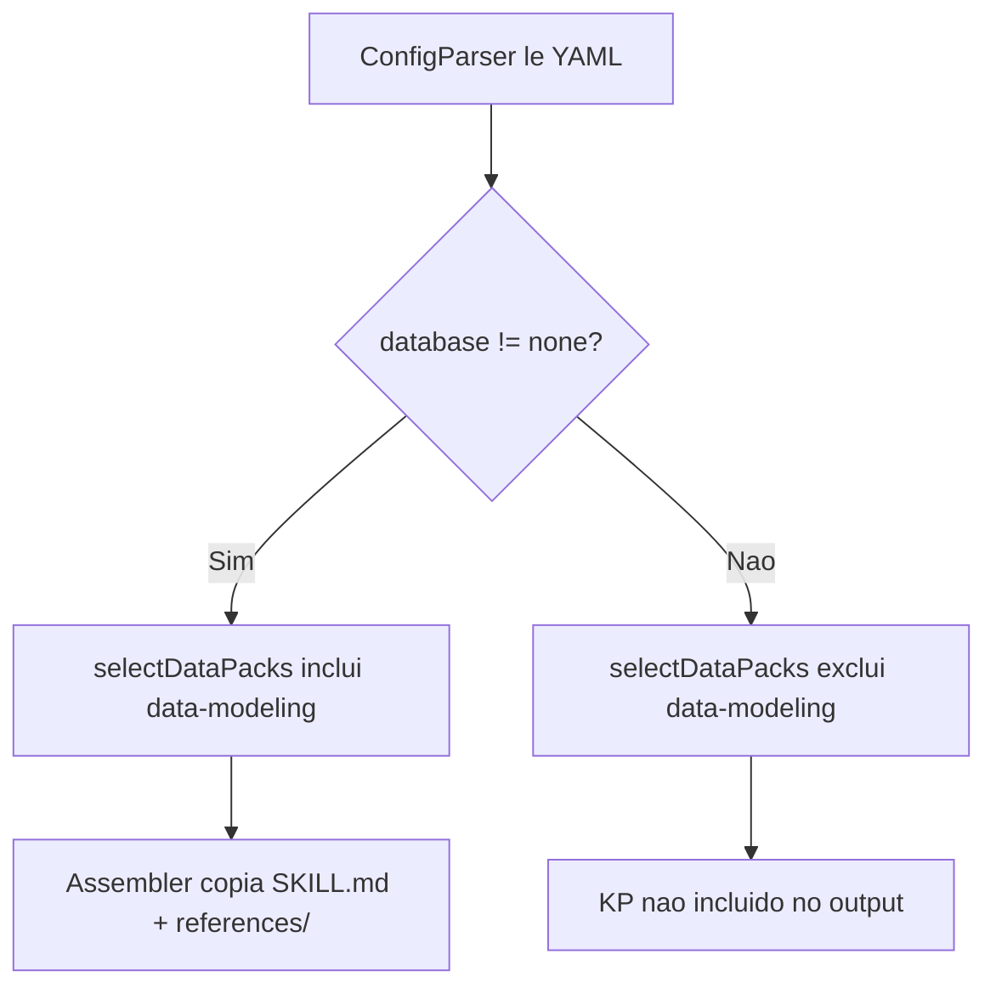

# Historia: Knowledge pack data-modeling com padroes cross-cutting

**ID:** story-0023-0001
**Chave Jira:** ---
**Status:** Pendente

## 1. Dependencias

| Blocked By | Blocks |
| :--- | :--- |
| --- | story-0023-0003, story-0023-0012, story-0023-0014 |

## 2. Regras Transversais Aplicaveis

| ID | Titulo |
| :--- | :--- |
| RULE-001 | Identidade e Convencoes do Projeto |
| RULE-010 | Geracao Condicional por Feature Flag |
| RULE-011 | Padrao de Knowledge Packs |

## 3. Descricao

Como **desenvolvedor do ia-dev-environment**, eu quero um knowledge pack `data-modeling` que forneca padroes cross-cutting de modelagem de dados, para que projetos com banco de dados recebam orientacao sobre schema design, concurrency e test data sem duplicar conteudo existente.

O projeto ja possui o `database-patterns` KP para conteudo especifico de banco e `knowledge/core/11-database-principles.md` para principios genericos. O novo `data-modeling` KP preenche a lacuna entre ambos: padroes avancados de schema design (soft delete, temporal tables, audit trails, multi-tenant, SCD Types 1/2/3), padroes de concurrency (optimistic/pessimistic locking, Saga) e gestao de dados de teste (factories, fixtures, anonimizacao).

### 3.1 Arquivos a Criar

- `targets/claude/skills/knowledge-packs/data-modeling/SKILL.md` -- Arquivo principal do KP com indice de referencias e instrucoes de uso
- `targets/claude/skills/knowledge-packs/data-modeling/references/schema-design-patterns.md` -- Padroes de schema design: soft delete, temporal tables, audit trails, multi-tenant, SCD Types 1/2/3
- `targets/claude/skills/knowledge-packs/data-modeling/references/concurrency-patterns.md` -- Padroes de concurrency: optimistic locking, pessimistic locking, Saga pattern, distributed locks
- `targets/claude/skills/knowledge-packs/data-modeling/references/test-data-patterns.md` -- Gestao de test data: factories, fixtures, anonimizacao, data builders, database seeding

### 3.2 Alteracao Java

- `KnowledgePackSelection.java:64-72` -- Adicionar "data-modeling" a lista retornada por selectDataPacks() quando o projeto possui banco de dados configurado (database != "none")

### 3.3 Nao-Duplicacao

O conteudo do `data-modeling` KP nao deve sobrepor o que ja existe em:
- `knowledge/core/11-database-principles.md` (principios fundamentais como ACID, CAP, normalizacao)
- `database-patterns` KP (convencoes especificas por tipo de banco)

## 3.5 Entrega de Valor

- **Valor Principal:** Padroes de modelagem reutilizaveis disponiveis para todos os projetos com banco de dados
- **Metrica de Sucesso:** Projetos com database != "none" incluem automaticamente o data-modeling KP no output gerado
- **Impacto no Negocio:** Reduz erros de schema design e concurrency em projetos novos, acelerando onboarding de desenvolvedores

## 4. Definicoes de Qualidade Locais

### DoR Local

- [ ] Estrutura do `database-patterns` KP analisada e compreendida
- [ ] Conteudo de `knowledge/core/11-database-principles.md` mapeado para evitar duplicacao
- [ ] KnowledgePackSelection.java lido e selectDataPacks() compreendido
- [ ] Formato SKILL.md de KPs existentes analisado como referencia

### DoD Local

- [ ] SKILL.md criado com frontmatter correto (user-invocable: false)
- [ ] 3 arquivos de references criados com conteudo tecnico completo
- [ ] Cada arquivo de references tem no maximo 300 linhas
- [ ] selectDataPacks() retorna "data-modeling" quando database != "none"
- [ ] Conteudo nao duplica knowledge/core/11-database-principles.md
- [ ] Conteudo nao duplica database-patterns KP
- [ ] Testes unitarios cobrindo inclusao/exclusao condicional do KP

### Global DoD

- **Cobertura:** >= 95% Line, >= 90% Branch
- **Testes Automatizados:** Unitarios + integracao golden file parity
- **Relatorio de Cobertura:** JaCoCo
- **Documentacao:** SKILL.md documentado
- **Persistencia:** N/A
- **Performance:** Geracao < 10s

## 5. Contratos de Dados

### 5.1 SKILL.md Frontmatter

| Campo | Tipo | M/O | Validacoes | Exemplo |
| :--- | :--- | :--- | :--- | :--- |
| name | String | M | kebab-case | `"data-modeling"` |
| description | String | M | max 200 chars | `"Cross-cutting data modeling patterns..."` |
| user-invocable | boolean | M | sempre false para KPs | `false` |

### 5.2 KnowledgePackSelection Output

| Campo | Tipo | M/O | Validacoes | Exemplo |
| :--- | :--- | :--- | :--- | :--- |
| pack ID | String | M | deve estar na lista de KPs validos | `"data-modeling"` |
| condicao | boolean | M | database != "none" | `true` |

## 6. Diagramas

### 6.1 Fluxo de selecao condicional do KP



## 7. Criterios de Aceite (Gherkin)

```gherkin
@GK-1
Cenario: Projeto sem banco configurado nao inclui data-modeling KP
  DADO que o arquivo de configuracao YAML possui database = "none"
  QUANDO o KnowledgePackSelection.selectDataPacks() e invocado
  ENTAO a lista retornada nao contem "data-modeling"
  E o diretorio de output nao contem data-modeling/

@GK-2
Cenario: Projeto com PostgreSQL inclui data-modeling KP junto com database-patterns
  DADO que o arquivo de configuracao YAML possui database = "postgresql"
  QUANDO o KnowledgePackSelection.selectDataPacks() e invocado
  ENTAO a lista retornada contem "data-modeling"
  E a lista retornada tambem contem "database-patterns"
  E ambos os KPs sao copiados para o diretorio de output

@GK-3
Cenario: SKILL.md do data-modeling contem secoes de schema design, concurrency e test data
  DADO que o knowledge pack data-modeling foi criado
  QUANDO o conteudo do SKILL.md e analisado
  ENTAO o arquivo contem secao sobre "Schema Design Patterns"
  E o arquivo contem secao sobre "Concurrency Patterns"
  E o arquivo contem secao sobre "Test Data Patterns"
  E o frontmatter possui user-invocable = false

@GK-4
Cenario: Cada arquivo de references tem no maximo 300 linhas
  DADO que os arquivos de references foram criados
  QUANDO o numero de linhas de cada arquivo e contado
  ENTAO schema-design-patterns.md tem no maximo 300 linhas
  E concurrency-patterns.md tem no maximo 300 linhas
  E test-data-patterns.md tem no maximo 300 linhas

@GK-5
Cenario: Conteudo do data-modeling nao duplica knowledge core 11-database-principles
  DADO que o knowledge pack data-modeling foi criado
  E o arquivo knowledge/core/11-database-principles.md existe
  QUANDO o conteudo de ambos e comparado
  ENTAO data-modeling nao contem definicoes de ACID, CAP theorem ou normalizacao basica
  E data-modeling referencia 11-database-principles.md para fundamentos
```

## 8. Sub-tarefas

- [ ] [Dev] Criar SKILL.md com frontmatter e indice de referencias
- [ ] [Dev] Criar references/schema-design-patterns.md com padroes de soft delete, temporal tables, audit trails, multi-tenant, SCD
- [ ] [Dev] Criar references/concurrency-patterns.md com optimistic/pessimistic locking e Saga
- [ ] [Dev] Criar references/test-data-patterns.md com factories, fixtures e anonimizacao
- [ ] [Dev] Adicionar "data-modeling" ao selectDataPacks() em KnowledgePackSelection.java
- [ ] [Test] Sub-tarefas TDD serao populadas apos geracao do test plan via `/x-test-plan`.
- [ ] [Doc] Atualizar CLAUDE.md com referencia ao novo KP na tabela de Knowledge Packs
