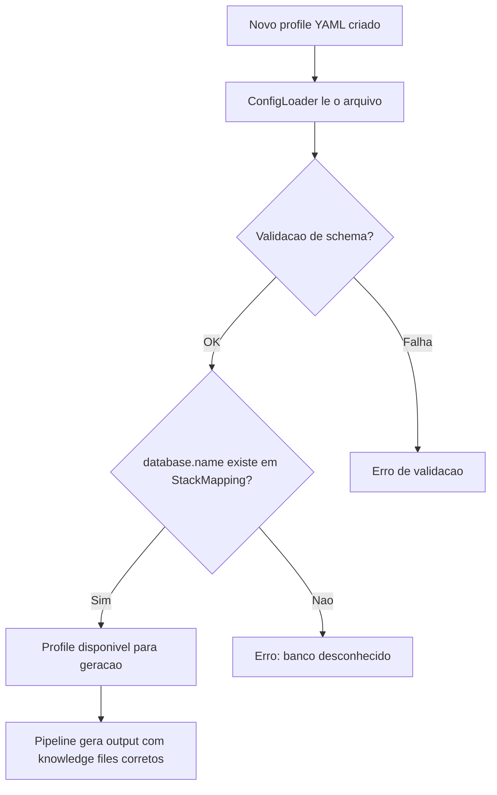

# Historia: Novos config profiles para categorias de banco

**ID:** story-0023-0011
**Chave Jira:** ---
**Status:** Pendente

## 1. Dependencias

| Blocked By | Blocks |
| :--- | :--- |
| story-0023-0004, story-0023-0005, story-0023-0006, story-0023-0007, story-0023-0008 | story-0023-0013 |

## 2. Regras Transversais Aplicaveis

| ID | Titulo |
| :--- | :--- |
| RULE-005 | Backward Compatibility |
| RULE-008 | StackMapping como Single Source of Truth |

## 3. Descricao

Como **desenvolvedor do ia-dev-environment**, eu quero 4 novos config profiles YAML que exercitem as novas categorias de banco no pipeline de geracao, para que possamos validar end-to-end que graph, columnar, timeseries e search databases funcionam corretamente.

### 3.1 Contexto

Config profiles sao arquivos YAML em `shared/config-templates/` que definem project stacks. Os 13 profiles existentes cobrem bancos SQL e NoSQL. Os 4 novos profiles cobrem um representante de cada nova categoria:

- **Graph:** Java + Spring Data Neo4j
- **Columnar/OLAP:** Java + Spring + ClickHouse JDBC
- **Time-Series:** Python + FastAPI + TimescaleDB
- **Search:** Java + Spring Data Elasticsearch

### 3.2 Arquivos a Criar

| Arquivo | Stack | Categoria |
| :--- | :--- | :--- |
| `shared/config-templates/setup-config.java-spring-neo4j.yaml` | Java + Spring Data Neo4j | graph |
| `shared/config-templates/setup-config.java-spring-clickhouse.yaml` | Java + Spring + ClickHouse JDBC | columnar |
| `shared/config-templates/setup-config.python-fastapi-timescale.yaml` | Python + FastAPI + TimescaleDB | timeseries |
| `shared/config-templates/setup-config.java-spring-elasticsearch.yaml` | Java + Spring Data Elasticsearch | search |

### 3.3 Estrutura YAML

Cada profile deve seguir a mesma estrutura dos profiles existentes, configurando corretamente:

- `database.name` com o banco correspondente
- `database.migration` com a ferramenta de migracao apropriada (ou `"none"` quando N/A)
- `cache` conforme necessidade do stack
- Demais campos de configuracao consistentes com o framework escolhido

### 3.4 Restricoes

- Profiles existentes (java-spring, python-fastapi, etc.) DEVEM permanecer inalterados (RULE-005)
- Valores de `database.name` DEVEM corresponder a entradas no `StackMapping.DATABASE_SETTINGS_MAP` (RULE-008)
- Cada novo profile DEVE ser carregavel pelo `ConfigLoader` sem erros de validacao

## 3.5 Entrega de Valor

- **Valor Principal:** 4 novos profiles exercitam o pipeline end-to-end para novas categorias de banco
- **Metrica de Sucesso:** Todos os 4 novos profiles passam pelo ConfigLoader e geram output valido
- **Impacto no Negocio:** Possibilita testes de integracao e golden file parity para graph, columnar, timeseries e search databases

## 4. Definicoes de Qualidade Locais

### DoR Local

- [ ] Stories de knowledge files das categorias dependentes (0004-0008) concluidas
- [ ] Estrutura de config profiles existentes analisada e compreendida
- [ ] ConfigLoader e validacao de YAML compreendidos
- [ ] StackMapping.DATABASE_SETTINGS_MAP contem os 17 bancos esperados

### DoD Local

- [ ] 4 arquivos YAML criados em shared/config-templates/
- [ ] Cada profile segue a mesma estrutura dos profiles existentes
- [ ] ConfigLoader carrega todos os 4 novos profiles sem erros
- [ ] database.name de cada profile corresponde a StackMapping
- [ ] Profiles existentes permanecem inalterados (RULE-005)
- [ ] Testes de integracao validam carregamento de cada profile

### Global DoD

- **Cobertura:** >= 95% Line, >= 90% Branch
- **Testes Automatizados:** Unitarios + integracao golden file parity
- **Relatorio de Cobertura:** JaCoCo
- **Documentacao:** Profiles documentados no README de config-templates se existente
- **Persistencia:** N/A
- **Performance:** Geracao < 10s

## 5. Contratos de Dados

### 5.1 Config Profile YAML (campos relevantes)

| Campo | Tipo | M/O | Validacoes | Exemplo |
| :--- | :--- | :--- | :--- | :--- |
| database.name | String | M | deve existir em StackMapping | `"neo4j"` |
| database.migration | String | M | ferramenta valida ou "none" | `"flyway"` |
| cache | String | M | cache valido ou "none" | `"redis"` |
| language | String | M | linguagem suportada | `"java"` |
| framework | String | M | framework suportado | `"spring"` |

## 6. Diagramas

### 6.1 Fluxo de validacao de config profiles



## 7. Criterios de Aceite (Gherkin)

```gherkin
@GK-1
Cenario: Profiles existentes permanecem inalterados apos adicao dos novos profiles
  DADO que os 13 config profiles existentes estao presentes em shared/config-templates/
  QUANDO os 4 novos profiles sao adicionados ao diretorio
  ENTAO cada profile existente possui hash SHA-256 identico ao valor antes da alteracao
  E nenhum campo de nenhum profile existente foi modificado

@GK-2
Cenario: Profile java-spring-neo4j carrega com database.name=neo4j
  DADO que o arquivo setup-config.java-spring-neo4j.yaml existe em shared/config-templates/
  QUANDO o ConfigLoader carrega o profile
  ENTAO o campo database.name e igual a "neo4j"
  E o campo language e igual a "java"
  E o campo framework e igual a "spring"

@GK-3
Cenario: Profile java-spring-clickhouse carrega com database.name=clickhouse
  DADO que o arquivo setup-config.java-spring-clickhouse.yaml existe em shared/config-templates/
  QUANDO o ConfigLoader carrega o profile
  ENTAO o campo database.name e igual a "clickhouse"
  E o campo language e igual a "java"
  E o campo framework e igual a "spring"

@GK-4
Cenario: Profile python-fastapi-timescale carrega com database.name=timescaledb
  DADO que o arquivo setup-config.python-fastapi-timescale.yaml existe em shared/config-templates/
  QUANDO o ConfigLoader carrega o profile
  ENTAO o campo database.name e igual a "timescaledb"
  E o campo language e igual a "python"
  E o campo framework e igual a "fastapi"

@GK-5
Cenario: Profile java-spring-elasticsearch carrega com database.name=elasticsearch
  DADO que o arquivo setup-config.java-spring-elasticsearch.yaml existe em shared/config-templates/
  QUANDO o ConfigLoader carrega o profile
  ENTAO o campo database.name e igual a "elasticsearch"
  E o campo language e igual a "java"
  E o campo framework e igual a "spring"

@GK-6
Cenario: Todos os 4 novos profiles passam pela validacao do ConfigLoader sem erros
  DADO que os 4 novos config profiles foram criados
  QUANDO cada profile e submetido a validacao do ConfigLoader
  ENTAO nenhum profile gera excecao de validacao
  E cada profile retorna um objeto de configuracao valido
  E todos os campos obrigatorios estao preenchidos
```

## 8. Sub-tarefas

- [ ] [Dev] Criar setup-config.java-spring-neo4j.yaml com stack Java/Spring/Neo4j (graph)
- [ ] [Dev] Criar setup-config.java-spring-clickhouse.yaml com stack Java/Spring/ClickHouse (columnar)
- [ ] [Dev] Criar setup-config.python-fastapi-timescale.yaml com stack Python/FastAPI/TimescaleDB (timeseries)
- [ ] [Dev] Criar setup-config.java-spring-elasticsearch.yaml com stack Java/Spring/Elasticsearch (search)
- [ ] [Dev] Validar que ConfigLoader carrega os 4 novos profiles sem erros
- [ ] [Test] Sub-tarefas TDD serao populadas apos geracao do test plan via `/x-test-plan`.
- [ ] [Doc] Atualizar documentacao de config-templates se aplicavel
