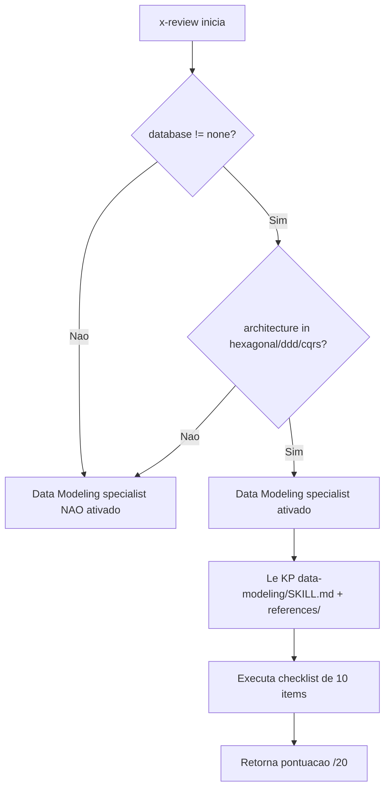

# Historia: Especialista Data Modeling no x-review

**ID:** story-0023-0012
**Chave Jira:** ---
**Status:** Pendente

## 1. Dependencias

| Blocked By | Blocks |
| :--- | :--- |
| story-0023-0001 | story-0023-0013 |

## 2. Regras Transversais Aplicaveis

| ID | Titulo |
| :--- | :--- |
| RULE-001 | Budget de Tamanho de Arquivo |
| RULE-010 | Padroes Genericos no KP data-modeling |

## 3. Descricao

Como **desenvolvedor do ia-dev-environment**, eu quero um novo especialista "Data Modeling Engineer" no x-review que avalie a modelagem de dados em projetos DDD/hexagonal/CQRS, para que o review identifique problemas de aggregate boundaries, entity lifecycle e domain-data alignment.

### 3.1 Contexto

O skill x-review em `targets/claude/skills/core/x-review/SKILL.md` ja possui especialistas (Security, QA, Performance, Database, Observability, DevOps, API, Event). Esta historia adiciona um novo especialista condicional.

### 3.2 Condicao de Ativacao

O Data Modeling specialist e ativado quando **ambas** as condicoes sao verdadeiras:

- `database != "none"`
- architecture style e `hexagonal` OU `ddd` OU `cqrs`

### 3.3 KP de Referencia

O especialista utiliza o knowledge pack criado na story-0023-0001:

- `skills/data-modeling/SKILL.md` + seus `references/`

### 3.4 Checklist (10 items, /20 pontos)

| # | Item de Avaliacao | Pontuacao |
| :--- | :--- | :--- |
| 1 | Aggregate boundary alignment com domain model | /2 |
| 2 | Entity lifecycle correctness (creation, state transitions, deletion) | /2 |
| 3 | Value object immutability na data layer (sem campos mutaveis em embeddables) | /2 |
| 4 | Repository pattern adherence (DDD repository, nao data-access repository) | /2 |
| 5 | Sem anemic domain model em entities (behavior junto com state) | /2 |
| 6 | Uso correto de embeddable types para value objects | /2 |
| 7 | Event-entity consistency (para event-sourced systems) | /2 |
| 8 | Bounded context data isolation (sem cross-context direct queries) | /2 |
| 9 | Anti-corruption layer para cross-context data access | /2 |
| 10 | Domain event to DB transaction alignment | /2 |

### 3.5 Arquivo a Alterar

- `targets/claude/skills/core/x-review/SKILL.md` -- Adicionar secao do Data Modeling Engineer com condicao de ativacao e checklist

## 3.5 Entrega de Valor

- **Valor Principal:** Projetos DDD/hexagonal/CQRS recebem review especializado de modelagem de dados
- **Metrica de Sucesso:** Data Modeling specialist ativado automaticamente quando condicoes sao atendidas e checklist completo com 10 items
- **Impacto no Negocio:** Identifica problemas de aggregate boundaries e domain-data alignment antes do merge, reduzindo defeitos em producao

## 4. Definicoes de Qualidade Locais

### DoR Local

- [ ] Knowledge pack data-modeling (story-0023-0001) concluido e disponivel
- [ ] x-review SKILL.md analisado e estrutura de especialistas compreendida
- [ ] Padroes de ativacao condicional de especialistas existentes compreendidos
- [ ] Checklist de 10 items revisado e validado

### DoD Local

- [ ] Secao Data Modeling Engineer adicionada ao x-review SKILL.md
- [ ] Condicao de ativacao implementada (database != "none" AND architecture in [hexagonal, ddd, cqrs])
- [ ] Checklist contem exatamente 10 items com pontuacao maxima de /20
- [ ] KP reference aponta para skills/data-modeling/SKILL.md
- [ ] Especialista nao e ativado quando condicoes nao sao atendidas
- [ ] Testes unitarios cobrindo ativacao/desativacao condicional

### Global DoD

- **Cobertura:** >= 95% Line, >= 90% Branch
- **Testes Automatizados:** Unitarios + integracao
- **Relatorio de Cobertura:** JaCoCo
- **Documentacao:** x-review SKILL.md atualizado
- **Persistencia:** N/A
- **Performance:** Geracao < 10s

## 5. Contratos de Dados

### 5.1 Condicao de Ativacao

| Campo | Tipo | M/O | Validacoes | Exemplo |
| :--- | :--- | :--- | :--- | :--- |
| database | String | M | != "none" | `"postgresql"` |
| architecture | String | M | in [hexagonal, ddd, cqrs] | `"hexagonal"` |

### 5.2 Checklist Output

| Campo | Tipo | M/O | Validacoes | Exemplo |
| :--- | :--- | :--- | :--- | :--- |
| specialist_name | String | M | "Data Modeling Engineer" | `"Data Modeling Engineer"` |
| checklist_items | int | M | exatamente 10 | `10` |
| max_score | int | M | exatamente 20 | `20` |
| kp_reference | String | M | path valido para SKILL.md | `"skills/data-modeling/SKILL.md"` |

## 6. Diagramas

### 6.1 Fluxo de ativacao condicional do especialista



## 7. Criterios de Aceite (Gherkin)

```gherkin
@GK-1
Cenario: Projeto com architecture microservice nao ativa Data Modeling specialist
  DADO que o projeto possui architecture = "microservice"
  E o projeto possui database = "postgresql"
  QUANDO o x-review e executado
  ENTAO a lista de especialistas ativados nao contem "Data Modeling Engineer"
  E o checklist de Data Modeling nao e executado

@GK-2
Cenario: Projeto com database none nao ativa Data Modeling specialist mesmo com architecture hexagonal
  DADO que o projeto possui database = "none"
  E o projeto possui architecture = "hexagonal"
  QUANDO o x-review e executado
  ENTAO a lista de especialistas ativados nao contem "Data Modeling Engineer"
  E o checklist de Data Modeling nao e executado

@GK-3
Cenario: Projeto com database postgresql e architecture hexagonal ativa Data Modeling specialist
  DADO que o projeto possui database = "postgresql"
  E o projeto possui architecture = "hexagonal"
  QUANDO o x-review e executado
  ENTAO a lista de especialistas ativados contem "Data Modeling Engineer"
  E o checklist de Data Modeling contem exatamente 10 items
  E a pontuacao maxima do especialista e 20 pontos

@GK-4
Cenario: Checklist do Data Modeling contem item sobre aggregate boundary alignment
  DADO que o Data Modeling specialist esta ativado
  QUANDO o checklist e analisado
  ENTAO existe um item com texto contendo "Aggregate boundary alignment"
  E o item tem pontuacao maxima de 2 pontos

@GK-5
Cenario: KP reference do Data Modeling aponta para skills/data-modeling/SKILL.md
  DADO que o Data Modeling specialist esta configurado no x-review SKILL.md
  QUANDO a secao de referencia do especialista e analisada
  ENTAO o campo de KP reference contem "skills/data-modeling/SKILL.md"
  E o path aponta para um arquivo existente no repositorio

@GK-6
Cenario: Pontuacao maxima do Data Modeling specialist e 20 pontos
  DADO que o Data Modeling specialist esta ativado
  QUANDO todos os 10 items do checklist sao avaliados com pontuacao maxima
  ENTAO a pontuacao total e exatamente 20 pontos
  E cada item contribui com exatamente 2 pontos
```

## 8. Sub-tarefas

- [ ] [Dev] Adicionar secao Data Modeling Engineer ao x-review SKILL.md com condicao de ativacao
- [ ] [Dev] Implementar checklist de 10 items com pontuacao /2 cada
- [ ] [Dev] Configurar KP reference para skills/data-modeling/SKILL.md
- [ ] [Dev] Implementar logica condicional de ativacao (database != "none" AND architecture in [hexagonal, ddd, cqrs])
- [ ] [Test] Sub-tarefas TDD serao populadas apos geracao do test plan via `/x-test-plan`.
- [ ] [Doc] Atualizar CLAUDE.md com referencia ao novo especialista na tabela de specialists do x-review
