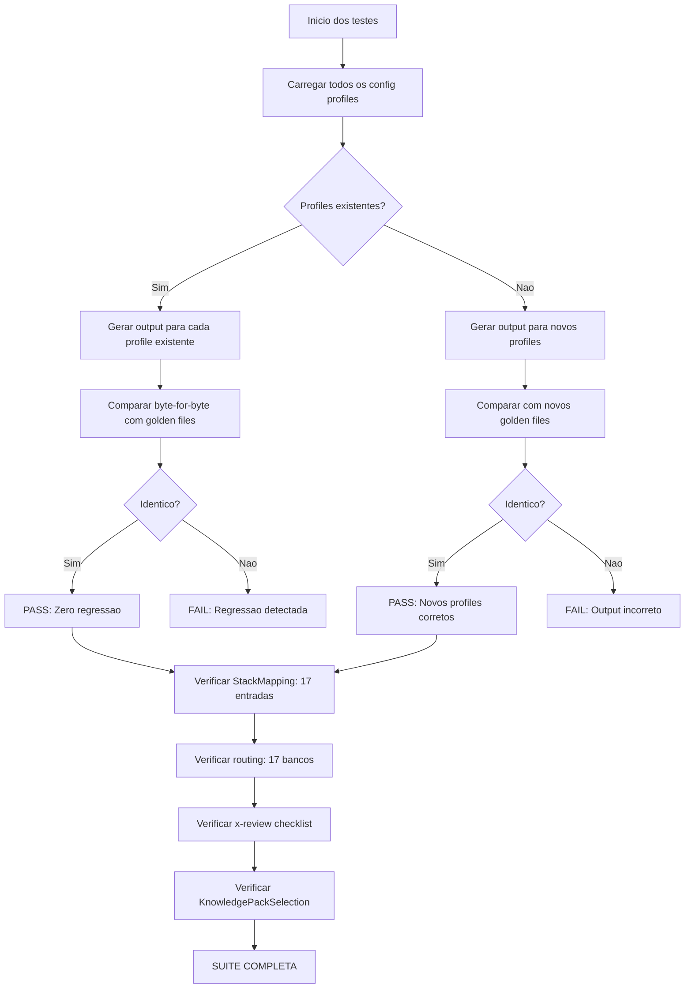

# Historia: Verificacao de integracao e smoke tests

**ID:** story-0023-0013
**Chave Jira:** ---
**Status:** Pendente

## 1. Dependencias

| Blocked By | Blocks |
| :--- | :--- |
| story-0023-0010, story-0023-0011, story-0023-0012, story-0023-0014 | --- |

## 2. Regras Transversais Aplicaveis

| ID | Titulo |
| :--- | :--- |
| RULE-005 | Backward Compatibility |
| RULE-008 | StackMapping como Single Source of Truth |
| RULE-009 | RulesConditionals Category Sets |

## 3. Descricao

Como **desenvolvedor do ia-dev-environment**, eu quero testes de integracao e smoke tests que validem end-to-end todas as novas funcionalidades, para que tenhamos garantia de zero regressao e funcionamento correto dos 17 bancos e 12+ profiles.

### 3.1 Contexto

Esta e a historia terminal do epico que valida que tudo funciona junto. Todas as stories anteriores devem estar concluidas antes de iniciar esta.

### 3.2 Escopo de Testes

| # | Categoria de Teste | Descricao | Stories Dependentes |
| :--- | :--- | :--- | :--- |
| 1 | Golden file parity | Paridade de golden files para os 4 novos config profiles | story-0023-0011 |
| 2 | Routing verification | Todos os 17 tipos de banco (5 existentes + 12 novos) roteiam corretamente via copyDbTypeFiles() | story-0023-0004 a 0008 |
| 3 | StackMapping completude | StackMapping.DATABASE_SETTINGS_MAP retorna chaves corretas para todos os 17 bancos | story-0023-0002 |
| 4 | x-review checklist rendering | Checklist expandido renderiza corretamente com substituicao de template variables | story-0023-0010 |
| 5 | Regressao de profiles existentes | Todos os 8 profiles de teste existentes produzem output IDENTICO (zero changes) | RULE-005 |
| 6 | KnowledgePackSelection | Inclui "data-modeling" quando database != "none" | story-0023-0001 |

### 3.3 Golden Files

- Gerar golden files para os 4 novos profiles em `tests/golden/`
- Cada golden file contem o output completo esperado para o profile correspondente
- Testes de byte-for-byte parity comparam output gerado com golden files

### 3.4 Regressao

- Os 8 profiles de teste existentes DEVEM produzir output identico ao pre-implementacao
- Qualquer diferenca, por menor que seja, e uma falha de regressao

## 3.5 Entrega de Valor

- **Valor Principal:** Garantia de zero regressao e validacao end-to-end de todas as novas funcionalidades do epico
- **Metrica de Sucesso:** 100% dos testes de integracao e smoke tests passam, incluindo golden file parity para todos os 12+ profiles
- **Impacto no Negocio:** Confianca para release com garantia de backward compatibility e funcionamento correto das novas categorias de banco

## 4. Definicoes de Qualidade Locais

### DoR Local

- [ ] Todas as stories dependentes (0010, 0011, 0012, 0014) concluidas e com testes passando
- [ ] Golden files dos 8 profiles existentes verificados como baseline
- [ ] StackMapping contem 17 entradas
- [ ] RulesConditionals contem os 7 category sets completos

### DoD Local

- [ ] Golden files gerados para os 4 novos profiles
- [ ] Testes de golden file parity passam para todos os 12+ profiles (8 existentes + 4 novos)
- [ ] Teste de routing verifica que copyDbTypeFiles() roteia corretamente para todos os 17 bancos
- [ ] Teste de StackMapping verifica exatamente 17 entradas
- [ ] Teste de x-review verifica rendering do checklist expandido
- [ ] Teste de KnowledgePackSelection verifica inclusao de "data-modeling"
- [ ] Zero regressao: profiles existentes produzem output identico
- [ ] Todos os testes executam em menos de 60 segundos

### Global DoD

- **Cobertura:** >= 95% Line, >= 90% Branch
- **Testes Automatizados:** Unitarios + integracao + golden file parity + smoke tests
- **Relatorio de Cobertura:** JaCoCo
- **Documentacao:** Testes documentados com @DisplayName descritivo
- **Persistencia:** N/A
- **Performance:** Suite completa < 60s

## 5. Contratos de Dados

### 5.1 StackMapping.DATABASE_SETTINGS_MAP

| Campo | Tipo | M/O | Validacoes | Exemplo |
| :--- | :--- | :--- | :--- | :--- |
| map size | int | M | exatamente 17 | `17` |
| key | String | M | nome de banco valido | `"neo4j"` |
| value | DatabaseSettings | M | configuracoes validas | `DatabaseSettings(...)` |

### 5.2 Golden File Output

| Campo | Tipo | M/O | Validacoes | Exemplo |
| :--- | :--- | :--- | :--- | :--- |
| profile_name | String | M | nome do profile | `"java-spring-neo4j"` |
| output_dir | Path | M | diretorio gerado | `tests/golden/java-spring-neo4j/` |
| byte_parity | boolean | M | identico ao golden file | `true` |

## 6. Diagramas

### 6.1 Fluxo de validacao end-to-end



## 7. Criterios de Aceite (Gherkin)

```gherkin
@GK-1
Cenario: Profile sem banco gera output sem knowledge files de banco
  DADO que o config profile possui database = "none"
  QUANDO o pipeline de geracao e executado para este profile
  ENTAO o diretorio de output nao contem subdiretorio knowledge/databases/
  E o diretorio de output nao contem data-modeling/

@GK-2
Cenario: Profile java-spring-neo4j gera output com graph knowledge files em references
  DADO que o config profile java-spring-neo4j esta carregado
  QUANDO o pipeline de geracao e executado
  ENTAO o diretorio de output contem knowledge files de graph database
  E o diretorio references/ contem arquivos especificos de Neo4j
  E o output inclui graph-principles.md na secao de common/

@GK-3
Cenario: Profile java-spring-clickhouse gera output com columnar knowledge files em references
  DADO que o config profile java-spring-clickhouse esta carregado
  QUANDO o pipeline de geracao e executado
  ENTAO o diretorio de output contem knowledge files de columnar database
  E o diretorio references/ contem arquivos especificos de ClickHouse
  E o output inclui columnar-principles.md na secao de common/

@GK-4
Cenario: Profile python-fastapi-timescale gera output com timeseries knowledge files em references
  DADO que o config profile python-fastapi-timescale esta carregado
  QUANDO o pipeline de geracao e executado
  ENTAO o diretorio de output contem knowledge files de timeseries database
  E o diretorio references/ contem arquivos especificos de TimescaleDB
  E o output inclui timeseries-principles.md na secao de common/

@GK-5
Cenario: Profile java-spring-elasticsearch gera output com search knowledge files em references
  DADO que o config profile java-spring-elasticsearch esta carregado
  QUANDO o pipeline de geracao e executado
  ENTAO o diretorio de output contem knowledge files de search database
  E o diretorio references/ contem arquivos especificos de Elasticsearch
  E o output inclui search-principles.md na secao de common/

@GK-6
Cenario: Profile java-spring existente gera output byte-for-byte identico ao golden file
  DADO que o golden file para java-spring existe em tests/golden/java-spring/
  QUANDO o pipeline de geracao e executado para o profile java-spring
  ENTAO cada arquivo gerado e byte-for-byte identico ao golden file correspondente
  E nenhum arquivo foi adicionado ou removido em relacao ao golden file

@GK-7
Cenario: Profile python-fastapi existente gera output byte-for-byte identico ao golden file
  DADO que o golden file para python-fastapi existe em tests/golden/python-fastapi/
  QUANDO o pipeline de geracao e executado para o profile python-fastapi
  ENTAO cada arquivo gerado e byte-for-byte identico ao golden file correspondente
  E nenhum arquivo foi adicionado ou removido em relacao ao golden file

@GK-8
Cenario: StackMapping DATABASE_SETTINGS_MAP contem exatamente 17 entradas
  DADO que o StackMapping.DATABASE_SETTINGS_MAP foi carregado
  QUANDO o tamanho do mapa e verificado
  ENTAO o mapa contem exatamente 17 entradas
  E todas as chaves correspondem a bancos validos: postgresql, mysql, oracle, mongodb, cassandra, neo4j, neptune, clickhouse, druid, yugabytedb, cockroachdb, tidb, influxdb, timescaledb, elasticsearch, opensearch, eventstoredb
```

## 8. Sub-tarefas

- [ ] [Dev] Gerar golden files para os 4 novos config profiles (neo4j, clickhouse, timescale, elasticsearch)
- [ ] [Dev] Criar testes de golden file parity para os 4 novos profiles
- [ ] [Dev] Criar teste de routing que valida copyDbTypeFiles() para todos os 17 bancos
- [ ] [Dev] Criar teste que verifica StackMapping.DATABASE_SETTINGS_MAP com exatamente 17 entradas
- [ ] [Dev] Criar teste que verifica rendering do checklist expandido no x-review
- [ ] [Dev] Criar teste que verifica KnowledgePackSelection inclui "data-modeling" quando database != "none"
- [ ] [Dev] Verificar que todos os 8 profiles existentes produzem output byte-for-byte identico
- [ ] [Test] Sub-tarefas TDD serao populadas apos geracao do test plan via `/x-test-plan`.
- [ ] [Doc] Documentar cobertura de testes e resultados no relatorio do epico
