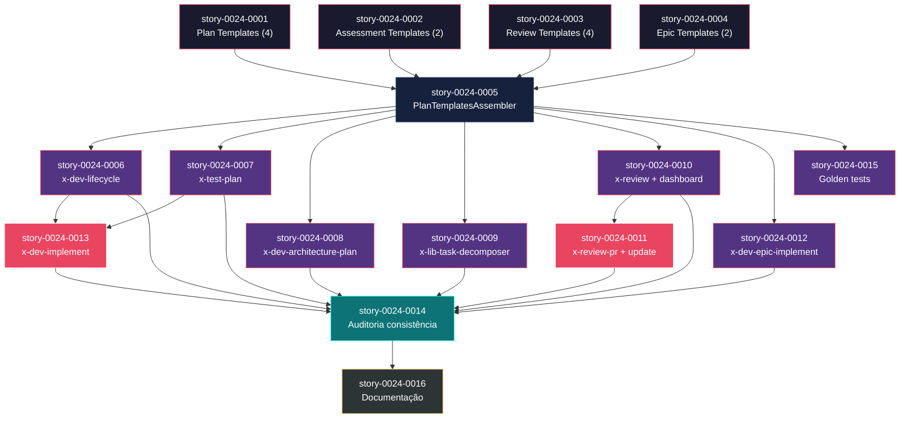

# Mapa de Implementação — Persistência e Padronização de Artefatos (EPIC-0024)

**Gerado a partir das dependências BlockedBy/Blocks de cada história do epic-0024.**

---

## 1. Matriz de Dependências

| Story | Título | Chave Jira | Blocked By | Blocks | Status |
| :--- | :--- | :--- | :--- | :--- | :--- |
| story-0024-0001 | Templates de artefatos de planejamento | — | — | story-0024-0005 | Pendente |
| story-0024-0002 | Templates de avaliação de segurança e compliance | — | — | story-0024-0005 | Pendente |
| story-0024-0003 | Templates de review | — | — | story-0024-0005 | Pendente |
| story-0024-0004 | Templates de orquestração de épico | — | — | story-0024-0005 | Pendente |
| story-0024-0005 | PlanTemplatesAssembler | — | story-0024-0001, story-0024-0002, story-0024-0003, story-0024-0004 | story-0024-0006, story-0024-0007, story-0024-0008, story-0024-0009, story-0024-0010, story-0024-0011, story-0024-0012, story-0024-0015 | Pendente |
| story-0024-0006 | Pre-checks no x-dev-lifecycle | — | story-0024-0005 | story-0024-0013, story-0024-0014 | Pendente |
| story-0024-0007 | Pre-check no x-test-plan | — | story-0024-0005 | story-0024-0013, story-0024-0014 | Pendente |
| story-0024-0008 | Pre-check no x-dev-architecture-plan | — | story-0024-0005 | story-0024-0014 | Pendente |
| story-0024-0009 | Pre-check no x-lib-task-decomposer | — | story-0024-0005 | story-0024-0014 | Pendente |
| story-0024-0010 | Templates e dashboard no x-review | — | story-0024-0005 | story-0024-0011, story-0024-0014 | Pendente |
| story-0024-0011 | Template e dashboard update no x-review-pr | — | story-0024-0005, story-0024-0010 | story-0024-0014 | Pendente |
| story-0024-0012 | Epic execution plan no x-dev-epic-implement | — | story-0024-0005 | story-0024-0014 | Pendente |
| story-0024-0013 | Pre-check no x-dev-implement | — | story-0024-0006, story-0024-0007 | story-0024-0014 | Pendente |
| story-0024-0014 | Auditoria de consistência | — | story-0024-0006, story-0024-0007, story-0024-0008, story-0024-0009, story-0024-0010, story-0024-0011, story-0024-0012, story-0024-0013 | story-0024-0016 | Pendente |
| story-0024-0015 | Golden tests | — | story-0024-0005 | — | Pendente |
| story-0024-0016 | Documentação e CHANGELOG | — | story-0024-0014 | — | Pendente |

> **Nota:** story-0024-0011 depende de story-0024-0010 porque o dashboard consolidado é criado pelo x-review (0010) e atualizado pelo x-review-pr (0011). story-0024-0013 depende de story-0024-0006 e story-0024-0007 porque o x-dev-implement reutiliza padrões de pre-check estabelecidos por essas stories.

---

## 2. Fases de Implementação

> As histórias são agrupadas em fases. Dentro de cada fase, as histórias podem ser implementadas **em paralelo**. Uma fase só pode iniciar quando todas as dependências das fases anteriores estiverem concluídas.

```
╔══════════════════════════════════════════════════════════════════════════════════════╗
║                    FASE 0 — Fundação: Templates (4 paralelas)                      ║
║                                                                                    ║
║   ┌──────────────┐  ┌──────────────┐  ┌──────────────┐  ┌──────────────┐          ║
║   │ story-0024   │  │ story-0024   │  │ story-0024   │  │ story-0024   │          ║
║   │    -0001     │  │    -0002     │  │    -0003     │  │    -0004     │          ║
║   │  Plan Tmpl   │  │  Assess Tmpl │  │  Review Tmpl │  │  Epic Tmpl   │          ║
║   │  (4 files)   │  │  (2 files)   │  │  (4 files)   │  │  (2 files)   │          ║
║   └──────┬───────┘  └──────┬───────┘  └──────┬───────┘  └──────┬───────┘          ║
╚══════════╪═════════════════╪═════════════════╪═════════════════╪════════════════════╝
           │                 │                 │                 │
           └────────┬────────┴────────┬────────┘                 │
                    │                 │                           │
                    ▼                 ▼                           ▼
╔══════════════════════════════════════════════════════════════════════════════════════╗
║                    FASE 1 — Core: Assembler (1 story, bottleneck)                  ║
║                                                                                    ║
║   ┌──────────────────────────────────────────────────────────────────────────┐     ║
║   │  story-0024-0005  PlanTemplatesAssembler                                 │     ║
║   │  (← story-0024-0001, 0002, 0003, 0004)                                  │     ║
║   │  Assembler Java + registro no factory + validação de seções              │     ║
║   └────────┬──────────┬──────────┬──────────┬──────────┬──────────┬──────────┘     ║
╚════════════╪══════════╪══════════╪══════════╪══════════╪══════════╪═════════════════╝
             │          │          │          │          │          │
             ▼          ▼          ▼          ▼          ▼          ▼
╔══════════════════════════════════════════════════════════════════════════════════════╗
║          FASE 2 — Extensions: Modificação de Skills (7 paralelas)                  ║
║                                                                                    ║
║   ┌──────────┐ ┌──────────┐ ┌──────────┐ ┌──────────┐ ┌──────────┐               ║
║   │  -0006   │ │  -0007   │ │  -0008   │ │  -0009   │ │  -0010   │               ║
║   │lifecycle │ │test-plan │ │arch-plan │ │task-dec  │ │ x-review │               ║
║   └────┬─────┘ └────┬─────┘ └──────────┘ └──────────┘ └────┬─────┘               ║
║        │             │                                      │                      ║
║   ┌──────────┐                                         ┌──────────┐               ║
║   │  -0012   │                                         │  -0015   │               ║
║   │epic-impl │                                         │  golden  │               ║
║   └──────────┘                                         └──────────┘               ║
╚════════╪═════════════╪══════════════════════════════════════╪═══════════════════════╝
         │             │                                      │
         ▼             ▼                                      │
╔══════════════════════════════════════════════════════════════════════════════════════╗
║          FASE 3 — Compositions: Dependências cruzadas (2 stories)                  ║
║                                                                                    ║
║   ┌──────────────────────────┐  ┌──────────────────────────┐                      ║
║   │  story-0024-0011         │  │  story-0024-0013         │                      ║
║   │  x-review-pr update      │  │  x-dev-implement check   │                      ║
║   │  (← 0005, 0010)         │  │  (← 0006, 0007)          │                      ║
║   └──────────────────────────┘  └──────────────────────────┘                      ║
╚══════════════════════╪══════════════════════╪══════════════════════════════════════╝
                       │                      │
                       ▼                      ▼
╔══════════════════════════════════════════════════════════════════════════════════════╗
║          FASE 4 — Cross-Cutting: Auditoria (1 story, convergência)                 ║
║                                                                                    ║
║   ┌──────────────────────────────────────────────────────────────────────────┐     ║
║   │  story-0024-0014  Auditoria de Consistência                              │     ║
║   │  (← 0006, 0007, 0008, 0009, 0010, 0011, 0012, 0013)                     │     ║
║   │  Auditar 8 skills para convenções uniformes                              │     ║
║   └─────────────────────────────────┬────────────────────────────────────────┘     ║
╚═════════════════════════════════════╪══════════════════════════════════════════════╝
                                      │
                                      ▼
╔══════════════════════════════════════════════════════════════════════════════════════╗
║          FASE 5 — Encerramento: Documentação (1 story)                             ║
║                                                                                    ║
║   ┌──────────────────────────────────────────────────────────────────────────┐     ║
║   │  story-0024-0016  Documentação e CHANGELOG                               │     ║
║   │  (← 0014)                                                                │     ║
║   │  Catálogo de artefatos, README, CHANGELOG                                │     ║
║   └──────────────────────────────────────────────────────────────────────────┘     ║
╚══════════════════════════════════════════════════════════════════════════════════════╝
```

---

## 3. Caminho Crítico

> O caminho crítico (a sequência mais longa de dependências) determina o tempo mínimo de implementação do projeto.

```
story-0024-0001 ─┐
story-0024-0002 ─┤
story-0024-0003 ─┼──→ story-0024-0005 ──→ story-0024-0010 ──→ story-0024-0011 ──→ story-0024-0014 ──→ story-0024-0016
story-0024-0004 ─┘
   Fase 0              Fase 1              Fase 2              Fase 3              Fase 4              Fase 5
```

**6 fases no caminho crítico, 6 histórias na cadeia mais longa (0001 → 0005 → 0010 → 0011 → 0014 → 0016).**

O caminho crítico passa pela criação de templates (0001), assembler (0005), modificação do x-review para criar o dashboard (0010), atualização do dashboard pelo x-review-pr (0011), auditoria de consistência (0014), e documentação final (0016). Qualquer atraso nesta cadeia impacta diretamente a data de conclusão do épico.

Um caminho crítico alternativo de igual comprimento existe: 0001 → 0005 → 0006 → 0013 → 0014 → 0016, passando pelo x-dev-lifecycle e x-dev-implement.

---

## 4. Grafo de Dependências (Mermaid)



---

## 5. Resumo por Fase

| Fase | Histórias | Camada | Paralelismo | Pré-requisito |
| :--- | :--- | :--- | :--- | :--- |
| 0 | story-0024-0001, 0002, 0003, 0004 | Foundation (Templates) | 4 paralelas | — |
| 1 | story-0024-0005 | Core (Assembler) | 1 | Fase 0 concluída |
| 2 | story-0024-0006, 0007, 0008, 0009, 0010, 0012, 0015 | Extensions (Skills) | 7 paralelas | Fase 1 concluída |
| 3 | story-0024-0011, 0013 | Compositions (Cross-Skill) | 2 paralelas | story-0024-0010 e 0006/0007 |
| 4 | story-0024-0014 | Cross-Cutting (Auditoria) | 1 | Fases 2 e 3 concluídas |
| 5 | story-0024-0016 | Cross-Cutting (Documentação) | 1 | Fase 4 concluída |

**Total: 16 histórias em 6 fases.**

> **Nota:** Fase 2 é a de maior paralelismo com 7 stories simultâneas. story-0024-0015 (golden tests) é uma leaf story na Fase 2 que pode ser executada em paralelo com as modificações de skills sem impacto no caminho crítico.

---

## 6. Detalhamento por Fase

### Fase 0 — Fundação: Templates

| Story | Escopo Principal | Artefatos Chave |
| :--- | :--- | :--- |
| story-0024-0001 | 4 templates de planejamento | `_TEMPLATE-IMPLEMENTATION-PLAN.md` (17 seções), `_TEMPLATE-TEST-PLAN.md` (8), `_TEMPLATE-ARCHITECTURE-PLAN.md` (13), `_TEMPLATE-TASK-BREAKDOWN.md` (5) |
| story-0024-0002 | 2 templates de assessment | `_TEMPLATE-SECURITY-ASSESSMENT.md` (10 seções), `_TEMPLATE-COMPLIANCE-ASSESSMENT.md` (8) |
| story-0024-0003 | 4 templates de review | `_TEMPLATE-SPECIALIST-REVIEW.md` (8), `_TEMPLATE-TECH-LEAD-REVIEW.md` (10), `_TEMPLATE-CONSOLIDATED-REVIEW-DASHBOARD.md` (9), `_TEMPLATE-REVIEW-REMEDIATION.md` (5) |
| story-0024-0004 | 2 templates de orquestração | `_TEMPLATE-EPIC-EXECUTION-PLAN.md` (8 seções), `_TEMPLATE-PHASE-COMPLETION-REPORT.md` (8) |

**Entregas da Fase 0:**

- 12 arquivos de template em `java/src/main/resources/shared/templates/`
- Cada template com seções obrigatórias definidas, headers padronizados, e seções condicionais marcadas
- Placeholders `{{LANGUAGE}}`, `{{FRAMEWORK}}` preservados para preenchimento runtime

### Fase 1 — Core: Assembler

| Story | Escopo Principal | Artefatos Chave |
| :--- | :--- | :--- |
| story-0024-0005 | Assembler Java para distribuir 12 templates | `PlanTemplatesAssembler.java`, registro em `AssemblerFactory.java` |

**Entregas da Fase 1:**

- `PlanTemplatesAssembler.java` seguindo padrão de `EpicReportAssembler.java`
- Validação de seções obrigatórias por template
- Cópia para `.claude/templates/` e `.github/templates/`
- Registro no pipeline na posição após `EpicReportAssembler`

### Fase 2 — Extensions: Modificação de Skills

| Story | Escopo Principal | Artefatos Chave |
| :--- | :--- | :--- |
| story-0024-0006 | x-dev-lifecycle: pre-checks + templates em 6 phases | `x-dev-lifecycle/SKILL.md` modificado |
| story-0024-0007 | x-test-plan: idempotência + template | `x-test-plan/SKILL.md` modificado |
| story-0024-0008 | x-dev-architecture-plan: idempotência + template | `x-dev-architecture-plan/SKILL.md` modificado |
| story-0024-0009 | x-lib-task-decomposer: idempotência + template | `x-lib-task-decomposer/SKILL.md` modificado |
| story-0024-0010 | x-review: templates + dashboard + remediation | `x-review/SKILL.md` modificado |
| story-0024-0012 | x-dev-epic-implement: execution plan + phase reports | `x-dev-epic-implement/SKILL.md` modificado |
| story-0024-0015 | Golden tests para todos os profiles | `PlanTemplatesAssemblerTest.java`, golden files atualizados |

**Entregas da Fase 2:**

- 6 SKILL.md modificados com pre-checks de idempotência e referência a templates
- Dashboard consolidado de reviews e remediation tracking no x-review
- Execution plan e phase reports no x-dev-epic-implement
- Golden tests cobrindo 12 templates em 8+ profiles

### Fase 3 — Compositions: Dependências Cruzadas

| Story | Escopo Principal | Artefatos Chave |
| :--- | :--- | :--- |
| story-0024-0011 | x-review-pr: template + dashboard update | `x-review-pr/SKILL.md` modificado |
| story-0024-0013 | x-dev-implement: pre-checks para planos existentes | `x-dev-implement/SKILL.md` modificado |

**Entregas da Fase 3:**

- Tech Lead review atualiza dashboard consolidado (criado por x-review na Fase 2)
- x-dev-implement reutiliza padrões de pre-check (estabelecidos na Fase 2)

### Fase 4 — Cross-Cutting: Auditoria

| Story | Escopo Principal | Artefatos Chave |
| :--- | :--- | :--- |
| story-0024-0014 | Auditoria de 8 skills para consistência | Correções em SKILL.md de skills inconsistentes |

**Entregas da Fase 4:**

- 8 skills com convenções uniformes de diretório, naming, pre-check e fallback
- Diretórios padronizados: `plans/`, `reviews/`, `reports/`
- Naming padronizado: `{type}-story-XXXX-YYYY.md` e `{type}-epic-XXXX.md`

### Fase 5 — Encerramento: Documentação

| Story | Escopo Principal | Artefatos Chave |
| :--- | :--- | :--- |
| story-0024-0016 | CLAUDE.md, README.md, CHANGELOG.md | Catálogo de artefatos, contagens atualizadas |

**Entregas da Fase 5:**

- Catálogo completo de artefatos no CLAUDE.md (12 templates: qual skill produz, onde salva, se tem pre-check)
- README.md com contagem atualizada de artefatos gerados
- CHANGELOG.md com entrada do EPIC-0024

---

## 7. Observações Estratégicas

### Gargalo Principal

**story-0024-0005 (PlanTemplatesAssembler)** é o maior gargalo — bloqueia 8 stories diretamente (0006-0012, 0015). Investir tempo adicional na qualidade do assembler e na validação de seções compensa: um assembler robusto garante que templates estejam disponíveis em runtime para todas as skills. Recomenda-se executar esta story com atenção especial aos golden tests para evitar retrabalho na Fase 2.

### Histórias Folha (sem dependentes)

- **story-0024-0015** (Golden tests) — Não bloqueia nenhuma outra story. Pode absorver atrasos sem impacto no caminho crítico. Candidata ideal para execução paralela durante a Fase 2.
- **story-0024-0016** (Documentação) — Leaf final do épico. Encerramento.

### Otimização de Tempo

- **Fase 0** oferece paralelismo máximo (4 stories) com escopo simples (criação de arquivos markdown). Pode ser completada rapidamente.
- **Fase 2** oferece o maior paralelismo (7 stories). Com worktrees paralelos, 7 stories podem ser executadas simultaneamente. Cada story modifica um SKILL.md diferente — sem conflito de arquivo.
- **story-0024-0015** pode iniciar assim que story-0024-0005 está pronta, sem esperar pelas modificações de skills. Isso permite detecção antecipada de regressões nos golden tests.

### Dependências Cruzadas

- **story-0024-0011** depende de dois ramos: story-0024-0005 (assembler) e story-0024-0010 (x-review dashboard). Esta é a principal convergência — o x-review-pr precisa que o dashboard exista antes de poder atualizá-lo.
- **story-0024-0013** depende de story-0024-0006 e story-0024-0007 — dois ramos de modificação de skills que devem estar prontos para o x-dev-implement reutilizar seus padrões.
- **story-0024-0014** é o maior ponto de convergência: depende de 8 stories (0006-0013). Todas as modificações de skills devem estar completas antes da auditoria de consistência.

### Marco de Validação Arquitetural

**story-0024-0005 (PlanTemplatesAssembler)** serve como checkpoint de validação:
- Valida que os 12 templates são copiáveis e contêm seções obrigatórias
- Valida que o pipeline de geração acomoda o novo assembler sem regressão
- Valida que templates são copiados verbatim (sem renderização de placeholders)
- Após a conclusão desta story, o padrão está estabelecido e as modificações de skills podem prosseguir com confiança
