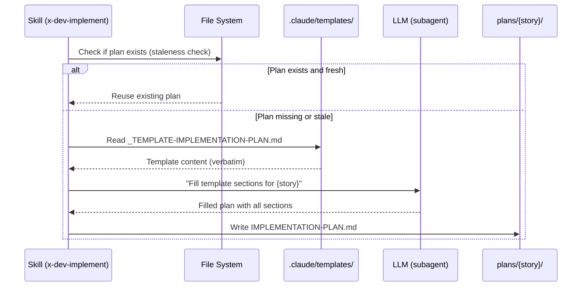

# Historia: Templates de Artefatos de Planejamento (Implementation Plan, Test Plan, Architecture Plan, Task Breakdown)

**ID:** story-0024-0001
**Chave Jira:** ---
**Status:** Pendente

## 1. Dependencias

| Blocked By | Blocks |
| :--- | :--- |
| --- | story-0024-0005 |

## 2. Regras Transversais Aplicaveis

| ID | Titulo |
| :--- | :--- |
| RULE-001 | Template obrigatorio para artefatos |
| RULE-003 | Templates language-agnostic |
| RULE-008 | Implementation plan completo |
| RULE-011 | Header padronizado |

## 3. Descricao

Como **Tech Lead**, eu quero templates padronizados para os 4 tipos de artefatos de planejamento, garantindo que toda execucao de planejamento produz documentos com estrutura consistente e completa.

O gerador possui 19 templates em `java/src/main/resources/shared/templates/` mas nenhum para artefatos de planejamento. Esses artefatos (implementation plan, test plan, architecture plan, task breakdown) sao produzidos inline pelas skills `x-dev-implement`, `x-test-plan`, `x-dev-architecture-plan` e `x-lib-task-decomposer`. A ausencia de templates padronizados resulta em outputs com formato variavel entre sessoes — secoes obrigatorias omitidas, class diagrams ausentes, e mapeamento TDD incompleto.

Esta story cria 4 novos arquivos de template em `java/src/main/resources/shared/templates/`, seguindo o padrao de naming com prefixo `_TEMPLATE-` e extensao `.md`. Templates sao copiados verbatim pelo assembler (RULE-003), contendo marcadores `{{LANGUAGE}}`, `{{FRAMEWORK}}`, `{{DATABASE}}`, `{{ARCHITECTURE}}` para preenchimento pela LLM em runtime.

### 3.1 Templates a Criar

1. **`_TEMPLATE-IMPLEMENTATION-PLAN.md`** — 17 secoes obrigatorias:
   - Header (Story ID, Epic ID, Plan Level, Date, Author, Template Version)
   - Executive Summary
   - Affected Layers and Components (tabela)
   - New Classes/Interfaces (tabela)
   - Existing Classes to Modify (tabela)
   - Class Diagram (Mermaid)
   - Method Signatures
   - Dependency Direction Validation
   - DB Schema Changes (`<!-- CONDITIONAL: database != none -->`)
   - API Changes (`<!-- CONDITIONAL: interfaces contains rest|grpc|graphql -->`)
   - Event Changes (`<!-- CONDITIONAL: event-driven == true -->`)
   - Configuration Changes
   - TDD Strategy (mapeamento UT-N/AT-N)
   - Architecture Decisions (mini-ADRs)
   - Integration Points
   - Risk Assessment
   - Language-Specific Considerations

2. **`_TEMPLATE-TEST-PLAN.md`** — 8 secoes obrigatorias:
   - Header (Story ID, Epic ID, Date, Author, Template Version)
   - Summary
   - Acceptance Tests (Outer Loop)
   - Unit Tests (Inner Loop - TPP Order)
   - Integration Tests
   - Coverage Estimation Table
   - Risks and Gaps
   - Language-Specific Notes

3. **`_TEMPLATE-ARCHITECTURE-PLAN.md`** — 13 secoes obrigatorias:
   - Header (Story ID, Epic ID, Date, Author, Template Version)
   - Executive Summary
   - Component Diagram
   - Sequence Diagrams
   - Deployment Diagram (`<!-- CONDITIONAL: orchestrator != none -->`)
   - External Connections
   - Architecture Decisions
   - Technology Stack
   - NFRs (Non-Functional Requirements)
   - Data Model (`<!-- CONDITIONAL: database != none -->`)
   - Observability Strategy
   - Resilience Strategy
   - Impact Analysis

4. **`_TEMPLATE-TASK-BREAKDOWN.md`** — 5 secoes obrigatorias:
   - Header (Story ID, Epic ID, Date, Author, Template Version)
   - Summary
   - Dependency Graph
   - Tasks Table (TASK-N com TPP level, RED/GREEN/REFACTOR phase)
   - Escalation Notes

### 3.2 Secoes Condicionais

Secoes condicionais sao marcadas com comentarios HTML `<!-- CONDITIONAL: {condition} -->` no template. A LLM inclui ou omite a secao com base nas capabilities do projeto. O template mantem a secao como placeholder para garantir que a LLM avalie a condicao explicitamente.

## 3.5 Entrega de Valor

- **Valor Principal:** Formato padronizado para planos de implementacao, teste, arquitetura e task breakdown — reduz variacao de output entre sessoes em 100% (de formato livre para estrutura fixa) e habilita revisao humana sistematica
- **Metrica de Sucesso:** Cada template contem exatamente o numero de secoes obrigatorias especificado (17, 8, 13, 5 respectivamente) e todas as secoes condicionais estao marcadas com `<!-- CONDITIONAL: -->`
- **Impacto no Negocio:** Desbloqueia story-0024-0005 (PlanTemplatesAssembler) e, por consequencia, todas as stories de integracao com skills. Elimina retrabalho de revisao causado por planos incompletos

## 4. Definicoes de Qualidade Locais

### DoR Local

- [ ] Estrutura de `java/src/main/resources/shared/templates/` analisada
- [ ] Naming convention de templates existentes compreendida (prefixo `_TEMPLATE-`)
- [ ] RULE-008 lida integralmente (secoes obrigatorias do implementation plan)
- [ ] Skills `x-dev-implement`, `x-test-plan`, `x-dev-architecture-plan` analisadas para extrair formato de output atual

### DoD Local

- [ ] `_TEMPLATE-IMPLEMENTATION-PLAN.md` criado com 17 secoes obrigatorias
- [ ] `_TEMPLATE-TEST-PLAN.md` criado com 8 secoes obrigatorias
- [ ] `_TEMPLATE-ARCHITECTURE-PLAN.md` criado com 13 secoes obrigatorias
- [ ] `_TEMPLATE-TASK-BREAKDOWN.md` criado com 5 secoes obrigatorias
- [ ] Todos os templates contem header padronizado (RULE-011)
- [ ] Marcadores `{{LANGUAGE}}`, `{{FRAMEWORK}}`, `{{DATABASE}}`, `{{ARCHITECTURE}}` presentes onde aplicavel (RULE-003)
- [ ] Secoes condicionais marcadas com `<!-- CONDITIONAL: -->` comments
- [ ] Testes unitarios validando contagem de secoes obrigatorias por template

### Global DoD

- **Cobertura:** >= 95% Line, >= 90% Branch para codigo Java novo
- **Testes Automatizados:** Golden tests para todos os profiles incluindo novos templates. Testes unitarios para validacao de secoes obrigatorias. Cada historia DEVE ter pelo menos 1 teste automatizado validando o criterio de aceite principal.
- **Smoke Tests:** Obrigatorio. Cada historia deve passar no smoke gate.
- **Relatorio de Cobertura:** JaCoCo integrado ao `mvn verify`
- **Documentacao:** CLAUDE.md atualizado com catalogo de artefatos ao final do epico
- **Persistencia:** Templates copiados verbatim sem renderizacao de placeholders
- **Performance:** Geracao nao deve aumentar tempo de build em mais de 5%
- **TDD Compliance:** Commits show test-first pattern. Explicit refactoring after green. Tests are incremental (from simple to complex via TPP).
- **Double-Loop TDD:** Acceptance tests derived from Gherkin scenarios (outer loop). Unit tests guided by TPP (inner loop).

## 5. Contratos de Dados

### 5.1 Estrutura dos Templates (Markdown Files)

Templates sao arquivos Markdown copiados verbatim (RULE-003). Nao possuem data contract de API. A estrutura e definida pelas secoes obrigatorias de cada template.

| Template | Secoes Obrigatorias | Secoes Condicionais | Marcadores |
| :--- | :--- | :--- | :--- |
| `_TEMPLATE-IMPLEMENTATION-PLAN.md` | 14 | 3 (DB Schema, API Changes, Event Changes) | `{{LANGUAGE}}`, `{{FRAMEWORK}}`, `{{DATABASE}}`, `{{ARCHITECTURE}}` |
| `_TEMPLATE-TEST-PLAN.md` | 8 | 0 | `{{LANGUAGE}}`, `{{FRAMEWORK}}` |
| `_TEMPLATE-ARCHITECTURE-PLAN.md` | 11 | 2 (Deployment Diagram, Data Model) | `{{LANGUAGE}}`, `{{FRAMEWORK}}`, `{{DATABASE}}`, `{{ARCHITECTURE}}` |
| `_TEMPLATE-TASK-BREAKDOWN.md` | 5 | 0 | Nenhum |

### 5.2 Header Padronizado (RULE-011)

| Campo | Formato | M/O | Exemplo |
| :--- | :--- | :--- | :--- |
| Story ID | String | M | `story-0024-0001` |
| Epic ID | String | M | `EPIC-0024` |
| Plan Level | String | M | `implementation` / `test` / `architecture` / `task-breakdown` |
| Date | ISO-8601 | M | `2026-04-05` |
| Author | String (role) | M | `architect` / `qa-engineer` / `tech-lead` |
| Template Version | SemVer | M | `1.0.0` |

## 6. Diagramas

### 6.1 Fluxo de uso dos templates por skills



## 7. Criterios de Aceite (Gherkin)

```gherkin
@GK-1
Cenario: Template com conteudo vazio falha na validacao
  DADO que o arquivo _TEMPLATE-IMPLEMENTATION-PLAN.md existe
  E o conteudo do arquivo esta vazio (0 bytes)
  QUANDO o validador de secoes obrigatorias e executado
  ENTAO a validacao falha com mensagem "Template has no sections: _TEMPLATE-IMPLEMENTATION-PLAN.md"
  E o template nao e copiado para o diretorio de output

@GK-2
Cenario: Template de implementation plan contem todas as 17 secoes obrigatorias
  DADO que o arquivo _TEMPLATE-IMPLEMENTATION-PLAN.md foi criado
  QUANDO o conteudo do template e analisado
  ENTAO o template contem exatamente 17 secoes de nivel H2 (##)
  E o header contem campos Story ID, Epic ID, Plan Level, Date, Author, Template Version
  E a secao "Class Diagram" contem bloco Mermaid placeholder
  E a secao "TDD Strategy" contem tabela com colunas UT-N e AT-N
  E a secao "Architecture Decisions" contem formato mini-ADR

@GK-3
Cenario: Template de test plan contem coluna TPP Level na secao Unit Tests
  DADO que o arquivo _TEMPLATE-TEST-PLAN.md foi criado
  QUANDO a secao "Unit Tests (Inner Loop - TPP Order)" e analisada
  ENTAO a tabela de testes unitarios contem coluna "TPP Level"
  E os niveis TPP seguem a ordem: nil, constant, constant+, scalar, collection
  E a secao "Acceptance Tests" contem referencia ao outer loop do Double-Loop TDD

@GK-4
Cenario: Template com secao obrigatoria ausente dispara warning de validacao
  DADO que o arquivo _TEMPLATE-ARCHITECTURE-PLAN.md foi modificado
  E a secao "## Resilience Strategy" foi removida
  QUANDO o validador de secoes obrigatorias e executado
  ENTAO a validacao falha com warning "Missing mandatory section: Resilience Strategy"
  E o log contem o nome do template e a secao ausente

@GK-5
Cenario: Secoes condicionais marcadas com comentarios CONDITIONAL
  DADO que o arquivo _TEMPLATE-IMPLEMENTATION-PLAN.md foi criado
  QUANDO as secoes condicionais sao analisadas
  ENTAO a secao "DB Schema Changes" contem marcador "<!-- CONDITIONAL: database != none -->"
  E a secao "API Changes" contem marcador "<!-- CONDITIONAL: interfaces contains rest|grpc|graphql -->"
  E a secao "Event Changes" contem marcador "<!-- CONDITIONAL: event-driven == true -->"
  E secoes nao condicionais nao contem marcador CONDITIONAL
```

### 7.1 Scenario Ordering (TPP)

> TPP: degenerate (empty template) -> happy path (all 17 sections present) -> happy path (TPP column in test plan) -> error (missing mandatory section) -> boundary (conditional sections marked correctly).

### 7.2 Mandatory Scenario Categories

- [x] Degenerate cases (GK-1: empty template)
- [x] Happy path (GK-2: all 17 sections, GK-3: TPP column)
- [x] Error paths (GK-4: missing section triggers warning)
- [x] Boundary values (GK-5: conditional sections with CONDITIONAL markers)

### 7.3 TDD Implementation Notes

- **Outer Loop (Acceptance Tests):** Derivar de GK-2 e GK-3 — verificar que templates gerados pelo assembler contem todas as secoes obrigatorias
- **Inner Loop (Unit Tests):** Iniciar com validacao de template vazio (GK-1), progredir para contagem de secoes, depois validacao de secoes individuais
- **TPP Progression:** `{} -> nil -> constant -> constant+ -> scalar -> collection` — comecar com template vazio, depois 1 secao, depois todas as secoes, depois secoes condicionais

## 8. Sub-tarefas

- [ ] [Dev] Criar `_TEMPLATE-IMPLEMENTATION-PLAN.md` com 17 secoes obrigatorias (14 fixas + 3 condicionais)
- [ ] [Dev] Criar `_TEMPLATE-TEST-PLAN.md` com 8 secoes obrigatorias incluindo tabela TPP
- [ ] [Dev] Criar `_TEMPLATE-ARCHITECTURE-PLAN.md` com 13 secoes obrigatorias (11 fixas + 2 condicionais)
- [ ] [Dev] Criar `_TEMPLATE-TASK-BREAKDOWN.md` com 5 secoes obrigatorias incluindo tabela TASK-N
- [ ] [Test] Unitario: Validar contagem de secoes obrigatorias em cada template (17, 8, 13, 5)
- [ ] [Test] Unitario: Validar presenca de marcadores `<!-- CONDITIONAL: -->` nas secoes condicionais
- [ ] [Test] Unitario: Validar header padronizado com campos obrigatorios (RULE-011)
- [ ] [Test] Smoke/E2E: Gerar com assembler e verificar que templates aparecem em `.claude/templates/`
- [ ] [Doc] Atualizar inventario de templates no README com os 4 novos templates
