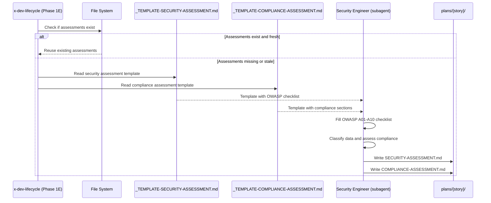

# Historia: Templates de Avaliacao de Seguranca e Compliance

**ID:** story-0024-0002
**Chave Jira:** ---
**Status:** Pendente

## 1. Dependencias

| Blocked By | Blocks |
| :--- | :--- |
| --- | story-0024-0005 |

## 2. Regras Transversais Aplicaveis

| ID | Titulo |
| :--- | :--- |
| RULE-001 | Template obrigatorio para artefatos |
| RULE-003 | Templates language-agnostic |
| RULE-011 | Header padronizado |

## 3. Descricao

Como **Security Engineer**, eu quero templates padronizados para assessments de seguranca e compliance, garantindo que toda avaliacao cobre todas as categorias obrigatorias (OWASP Top 10, classificacao de dados, requisitos regulatorios).

A Phase 1E do `x-dev-lifecycle` produz assessments de seguranca e compliance em um unico passo sem template. O output varia entre sessoes e frequentemente omite categorias OWASP, classificacao de dados ou requisitos regulatorios. Dividir em 2 templates distintos (security assessment e compliance assessment) melhora completude e permite revisao independente.

### 3.1 Templates a Criar

1. **`_TEMPLATE-SECURITY-ASSESSMENT.md`** — 10 secoes obrigatorias:
   - Header (Story ID, Epic ID, Date, Author, Template Version)
   - Data Classification
   - Encryption Requirements
   - Authentication & Authorization
   - Input Validation
   - Audit Logging Requirements
   - OWASP Top 10 Assessment (checklist com A01-A10)
   - Dependency Security
   - Regulatory Considerations
   - Risk Matrix (Likelihood x Impact)

2. **`_TEMPLATE-COMPLIANCE-ASSESSMENT.md`** — 8 secoes obrigatorias:
   - Header (Story ID, Epic ID, Date, Author, Template Version)
   - Data Classification Impact
   - Framework-Specific Assessment (`<!-- CONDITIONAL: compliance-frameworks configured -->`)
   - Personal Data Processing
   - Audit Trail Requirements
   - Cross-Border Considerations
   - Remediation Actions
   - Sign-off

### 3.2 OWASP Top 10 Checklist

A secao "OWASP Top 10 Assessment" no template de security assessment contem uma tabela com as 10 categorias OWASP (A01:2021 a A10:2021), cada uma com colunas: Category, Applicable (Yes/No), Risk Level (Critical/High/Medium/Low/N/A), Mitigation, Status (Open/Mitigated/Accepted).

### 3.3 Ativacao Condicional

O template de compliance assessment contem secoes que sao ativadas por config flags. A secao "Framework-Specific Assessment" e marcada com `<!-- CONDITIONAL: compliance-frameworks configured -->` e inclui sub-secoes para GDPR, LGPD, HIPAA, PCI-DSS e SOX. A LLM inclui apenas as sub-secoes relevantes ao framework configurado.

## 3.5 Entrega de Valor

- **Valor Principal:** Assessments com formato completo (OWASP, classificacao de dados, compliance) — garante que nenhuma categoria de avaliacao seja omitida pela LLM
- **Metrica de Sucesso:** Template de security assessment contem checklist OWASP A01-A10 completo; template de compliance contem secoes para todos os 5 frameworks suportados (GDPR, LGPD, HIPAA, PCI-DSS, SOX)
- **Impacto no Negocio:** Reduz risco de omissao de categorias de seguranca em avaliacoes automatizadas. Desbloqueia story-0024-0005 (PlanTemplatesAssembler)

## 4. Definicoes de Qualidade Locais

### DoR Local

- [ ] OWASP Top 10 (2021 edition) categorias A01-A10 listadas e compreendidas
- [ ] Frameworks de compliance suportados pelo ia-dev-env identificados (GDPR, LGPD, HIPAA, PCI-DSS, SOX)
- [ ] Output atual da Phase 1E do x-dev-lifecycle analisado para identificar gaps
- [ ] Skill `security` KP e `compliance` KP lidos como referencia de conteudo

### DoD Local

- [ ] `_TEMPLATE-SECURITY-ASSESSMENT.md` criado com 10 secoes obrigatorias
- [ ] `_TEMPLATE-COMPLIANCE-ASSESSMENT.md` criado com 8 secoes obrigatorias
- [ ] Checklist OWASP A01-A10 presente como tabela parseavel
- [ ] Risk Matrix com eixos Likelihood x Impact presente
- [ ] Secoes condicionais de compliance marcadas com `<!-- CONDITIONAL: -->`
- [ ] Header padronizado conforme RULE-011
- [ ] Marcadores `{{LANGUAGE}}`, `{{FRAMEWORK}}` presentes onde aplicavel

### Global DoD

- **Cobertura:** >= 95% Line, >= 90% Branch para codigo Java novo
- **Testes Automatizados:** Golden tests para todos os profiles incluindo novos templates. Testes unitarios para validacao de secoes obrigatorias. Cada historia DEVE ter pelo menos 1 teste automatizado validando o criterio de aceite principal.
- **Smoke Tests:** Obrigatorio. Cada historia deve passar no smoke gate.
- **Relatorio de Cobertura:** JaCoCo integrado ao `mvn verify`
- **Documentacao:** CLAUDE.md atualizado com catalogo de artefatos ao final do epico
- **Persistencia:** Templates copiados verbatim sem renderizacao de placeholders
- **Performance:** Geracao nao deve aumentar tempo de build em mais de 5%
- **TDD Compliance:** Commits show test-first pattern. Explicit refactoring after green. Tests are incremental (from simple to complex via TPP).
- **Double-Loop TDD:** Acceptance tests derived from Gherkin scenarios (outer loop). Unit tests guided by TPP (inner loop).

## 5. Contratos de Dados

### 5.1 Estrutura dos Templates (Markdown Files)

| Template | Secoes Obrigatorias | Secoes Condicionais | Marcadores |
| :--- | :--- | :--- | :--- |
| `_TEMPLATE-SECURITY-ASSESSMENT.md` | 10 | 0 | `{{LANGUAGE}}`, `{{FRAMEWORK}}` |
| `_TEMPLATE-COMPLIANCE-ASSESSMENT.md` | 7 | 1 (Framework-Specific Assessment) | `{{LANGUAGE}}`, `{{FRAMEWORK}}` |

### 5.2 OWASP Top 10 Table Schema

| Coluna | Tipo | M/O | Descricao |
| :--- | :--- | :--- | :--- |
| Category | String | M | OWASP ID e nome (ex: `A01:2021 - Broken Access Control`) |
| Applicable | Enum | M | `Yes` / `No` |
| Risk Level | Enum | M | `Critical` / `High` / `Medium` / `Low` / `N/A` |
| Mitigation | String | M | Descricao da mitigacao aplicada ou planejada |
| Status | Enum | M | `Open` / `Mitigated` / `Accepted` |

### 5.3 Risk Matrix Schema

| Coluna | Tipo | M/O | Descricao |
| :--- | :--- | :--- | :--- |
| Risk ID | String | M | Identificador unico (ex: `RISK-001`) |
| Description | String | M | Descricao do risco |
| Likelihood | Enum | M | `Rare` / `Unlikely` / `Possible` / `Likely` / `Almost Certain` |
| Impact | Enum | M | `Negligible` / `Minor` / `Moderate` / `Major` / `Catastrophic` |
| Risk Level | Enum | M | Calculado: `Critical` / `High` / `Medium` / `Low` |
| Owner | String | M | Responsavel pela mitigacao |

## 6. Diagramas

### 6.1 Fluxo de avaliacao de seguranca e compliance



## 7. Criterios de Aceite (Gherkin)

```gherkin
@GK-1
Cenario: Template de security assessment vazio falha na validacao
  DADO que o arquivo _TEMPLATE-SECURITY-ASSESSMENT.md existe
  E o conteudo do arquivo esta vazio (0 bytes)
  QUANDO o validador de secoes obrigatorias e executado
  ENTAO a validacao falha com mensagem "Template has no sections: _TEMPLATE-SECURITY-ASSESSMENT.md"
  E o template nao e copiado para o diretorio de output

@GK-2
Cenario: Template de security assessment inclui checklist OWASP Top 10 completo
  DADO que o arquivo _TEMPLATE-SECURITY-ASSESSMENT.md foi criado
  QUANDO a secao "OWASP Top 10 Assessment" e analisada
  ENTAO a tabela contem exatamente 10 linhas correspondendo a A01:2021 ate A10:2021
  E cada linha contem colunas Category, Applicable, Risk Level, Mitigation, Status
  E o template contem secao "Risk Matrix" com eixos Likelihood x Impact

@GK-3
Cenario: Template de compliance assessment contem secoes framework-specific
  DADO que o arquivo _TEMPLATE-COMPLIANCE-ASSESSMENT.md foi criado
  QUANDO a secao "Framework-Specific Assessment" e analisada
  ENTAO a secao contem sub-secoes para GDPR, LGPD, HIPAA, PCI-DSS e SOX
  E a secao esta marcada com "<!-- CONDITIONAL: compliance-frameworks configured -->"
  E o header contem campos Story ID, Epic ID, Date, Author, Template Version

@GK-4
Cenario: Secao Risk Matrix ausente dispara falha de validacao
  DADO que o arquivo _TEMPLATE-SECURITY-ASSESSMENT.md foi modificado
  E a secao "## Risk Matrix" foi removida
  QUANDO o validador de secoes obrigatorias e executado
  ENTAO a validacao falha com warning "Missing mandatory section: Risk Matrix"
  E o log contem o nome do template e a secao ausente

@GK-5
Cenario: Template de compliance indica ativacao condicional por config flags
  DADO que o arquivo _TEMPLATE-COMPLIANCE-ASSESSMENT.md foi criado
  QUANDO as secoes condicionais sao analisadas
  ENTAO a secao "Framework-Specific Assessment" contem marcador "<!-- CONDITIONAL: compliance-frameworks configured -->"
  E as secoes nao condicionais (Data Classification Impact, Personal Data Processing, Audit Trail Requirements) nao contem marcadores CONDITIONAL
  E o template e valido mesmo sem nenhum framework de compliance ativo
```

### 7.1 Scenario Ordering (TPP)

> TPP: degenerate (empty template) -> happy path (OWASP checklist completo) -> happy path (compliance framework-specific) -> error (missing Risk Matrix) -> boundary (conditional activation by config flags).

### 7.2 Mandatory Scenario Categories

- [x] Degenerate cases (GK-1: empty template)
- [x] Happy path (GK-2: OWASP A01-A10 checklist, GK-3: compliance framework sections)
- [x] Error paths (GK-4: missing Risk Matrix section)
- [x] Boundary values (GK-5: conditional activation by config flags)

### 7.3 TDD Implementation Notes

- **Outer Loop (Acceptance Tests):** Derivar de GK-2 — verificar que template gerado contem checklist OWASP com 10 categorias parseavel
- **Inner Loop (Unit Tests):** Iniciar com validacao de template vazio (GK-1), progredir para contagem de secoes, depois validacao de OWASP table schema
- **TPP Progression:** `{} -> nil -> constant -> constant+ -> scalar -> collection` — comecar com template vazio, depois 1 secao, depois checklist OWASP completo, depois framework-specific sections

## 8. Sub-tarefas

- [ ] [Dev] Criar `_TEMPLATE-SECURITY-ASSESSMENT.md` com 10 secoes obrigatorias incluindo checklist OWASP A01-A10
- [ ] [Dev] Criar `_TEMPLATE-COMPLIANCE-ASSESSMENT.md` com 8 secoes obrigatorias incluindo sub-secoes para 5 frameworks
- [ ] [Dev] Implementar tabela Risk Matrix com schema Likelihood x Impact no template de security
- [ ] [Test] Unitario: Validar presenca de checklist OWASP com 10 categorias A01-A10
- [ ] [Test] Unitario: Validar secao Risk Matrix com colunas obrigatorias
- [ ] [Test] Unitario: Validar header padronizado (RULE-011) em ambos os templates
- [ ] [Test] Smoke/E2E: Templates aparecem no output gerado em `.claude/templates/`
- [ ] [Doc] Documentar proposito dos templates de security e compliance no README
