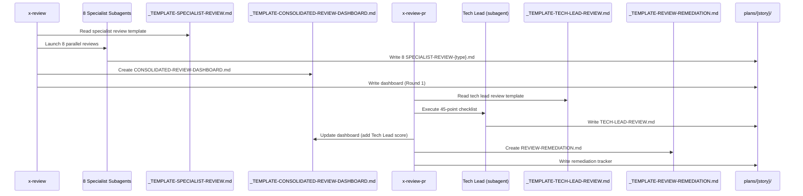

# Historia: Templates de Review (Specialist, Tech Lead, Dashboard, Remediation)

**ID:** story-0024-0003
**Chave Jira:** ---
**Status:** Pendente

## 1. Dependencias

| Blocked By | Blocks |
| :--- | :--- |
| --- | story-0024-0005 |

## 2. Regras Transversais Aplicaveis

| ID | Titulo |
| :--- | :--- |
| RULE-001 | Template obrigatorio para artefatos |
| RULE-003 | Templates language-agnostic |
| RULE-005 | Score numerico parseable |
| RULE-006 | Dashboard cumulativo |
| RULE-011 | Header padronizado |

## 3. Descricao

Como **Tech Lead**, eu quero templates padronizados para reviews de especialistas, review do Tech Lead, dashboard consolidado e tracking de remediacao, garantindo que scores sao parseaveis e findings sao rastreaveis.

Atualmente, `x-review` lanca 8 subagentes especialistas em paralelo com formato de output inline — cada especialista produz output com estrutura diferente, scores em formatos variados (percentual, nota, texto livre), e sem campo padronizado para severidade de findings. `x-review-pr` executa checklist de 45 pontos sem template, dificultando comparacao entre reviews. Nao existe dashboard consolidado nem tracking de remediacao.

Esta story cria 4 templates que padronizam o ciclo completo de review: output de cada especialista, decisao do Tech Lead, visao consolidada, e tracking de correcoes.

### 3.1 Templates a Criar

1. **`_TEMPLATE-SPECIALIST-REVIEW.md`** — 8 secoes obrigatorias:
   - Header (Engineer Type, Story ID, Date, Reviewer, Template Version)
   - Review Scope
   - Score Summary (formato `XX/YY | Status: Approved/Rejected/Partial`)
   - Passed Items
   - Failed Items (com File:Line, Severity: Critical/High/Medium/Low)
   - Partial Items
   - Severity Summary (tabela agregada por severidade)
   - Recommendations

2. **`_TEMPLATE-TECH-LEAD-REVIEW.md`** — 10 secoes obrigatorias:
   - Header (Story ID, PR, Date, Score `XX/MAX`)
   - Decision (`GO` / `NO-GO`)
   - Section Scores (tabela A-K: Clean Code, SOLID, Architecture, Framework, Tests, TDD, Security, Cross-File, API, Events, Documentation)
   - Cross-File Consistency
   - Critical Issues
   - Medium Issues
   - Low Issues
   - TDD Compliance Assessment
   - Specialist Review Validation
   - Verdict

3. **`_TEMPLATE-CONSOLIDATED-REVIEW-DASHBOARD.md`** — 9 secoes obrigatorias:
   - Header (Story ID, Epic ID, Date, Template Version)
   - Overall Score
   - Engineer Scores Table (8 especialistas com score individual)
   - Tech Lead Score
   - Critical Issues Summary
   - Severity Distribution (tabela: Critical/High/Medium/Low counts)
   - Remediation Status (Open/Fixed/Deferred/Accepted counts)
   - Review History (cumulativo — preserva rounds anteriores)
   - Correction Story (link para story de correcao quando aplicavel)

4. **`_TEMPLATE-REVIEW-REMEDIATION.md`** — 5 secoes obrigatorias:
   - Header (Story ID, Epic ID, Date, Template Version)
   - Findings Tracker (tabela: Finding ID, Engineer, Severity, Description, Status, Fix Commit SHA, Notes)
   - Remediation Summary (totais por status)
   - Deferred Justifications (justificativa obrigatoria para cada finding deferido)
   - Re-review Results (resultados de re-review apos correcoes)

### 3.2 Score Format (RULE-005)

Todos os templates de review usam formato de score parseable: `XX/YY | Status: {Approved|Rejected|Partial}`. Isso permite que skills de consolidacao (`x-review`, `x-review-pr`) extraiam scores automaticamente via regex `(\d+)/(\d+)\s*\|\s*Status:\s*(Approved|Rejected|Partial)`.

### 3.3 Dashboard Cumulativo (RULE-006)

O dashboard consolidado e cumulativo: criado pela skill `x-review` com scores dos 8 especialistas, atualizado pela skill `x-review-pr` com score do Tech Lead. A secao "Review History" preserva rounds anteriores, permitindo rastrear evolucao de qualidade ao longo de multiplas iteracoes de review.

## 3.5 Entrega de Valor

- **Valor Principal:** Reviews com score parseable e dashboard consolidado — permite visao agregada de qualidade (8 especialistas + Tech Lead) e rastreamento de remediacao para compliance audit
- **Metrica de Sucesso:** Score de cada review extraivel por regex; dashboard consolida scores de 8 especialistas + Tech Lead em um unico arquivo; remediation tracker suporta 4 status (Open/Fixed/Deferred/Accepted)
- **Impacto no Negocio:** Habilita decisoes de merge baseadas em dados quantitativos. Rastreamento de remediacao garante que nenhum finding critico seja ignorado. Desbloqueia story-0024-0005

## 4. Definicoes de Qualidade Locais

### DoR Local

- [ ] Output atual de `x-review` (8 especialistas) analisado para identificar formatos de score
- [ ] Output atual de `x-review-pr` (45-point checklist) analisado para estrutura de secoes A-K
- [ ] RULE-005 e RULE-006 lidas integralmente
- [ ] Regex de parsing de score definida e testada manualmente

### DoD Local

- [ ] `_TEMPLATE-SPECIALIST-REVIEW.md` criado com 8 secoes e formato de score `XX/YY | Status:`
- [ ] `_TEMPLATE-TECH-LEAD-REVIEW.md` criado com 10 secoes e tabela A-K
- [ ] `_TEMPLATE-CONSOLIDATED-REVIEW-DASHBOARD.md` criado com 9 secoes e suporte cumulativo
- [ ] `_TEMPLATE-REVIEW-REMEDIATION.md` criado com 5 secoes e tabela de findings
- [ ] Score parseable via regex `(\d+)/(\d+)\s*\|\s*Status:\s*(Approved|Rejected|Partial)`
- [ ] Header padronizado conforme RULE-011 em todos os 4 templates
- [ ] Testes unitarios validando formato de score parseable

### Global DoD

- **Cobertura:** >= 95% Line, >= 90% Branch para codigo Java novo
- **Testes Automatizados:** Golden tests para todos os profiles incluindo novos templates. Testes unitarios para validacao de secoes obrigatorias. Cada historia DEVE ter pelo menos 1 teste automatizado validando o criterio de aceite principal.
- **Smoke Tests:** Obrigatorio. Cada historia deve passar no smoke gate.
- **Relatorio de Cobertura:** JaCoCo integrado ao `mvn verify`
- **Documentacao:** CLAUDE.md atualizado com catalogo de artefatos ao final do epico
- **Persistencia:** Templates copiados verbatim sem renderizacao de placeholders
- **Performance:** Geracao nao deve aumentar tempo de build em mais de 5%
- **TDD Compliance:** Commits show test-first pattern. Explicit refactoring after green. Tests are incremental (from simple to complex via TPP).
- **Double-Loop TDD:** Acceptance tests derived from Gherkin scenarios (outer loop). Unit tests guided by TPP (inner loop).

## 5. Contratos de Dados

### 5.1 Estrutura dos Templates (Markdown Files)

| Template | Secoes Obrigatorias | Secoes Condicionais | Marcadores |
| :--- | :--- | :--- | :--- |
| `_TEMPLATE-SPECIALIST-REVIEW.md` | 8 | 0 | Nenhum |
| `_TEMPLATE-TECH-LEAD-REVIEW.md` | 10 | 0 | Nenhum |
| `_TEMPLATE-CONSOLIDATED-REVIEW-DASHBOARD.md` | 9 | 0 | Nenhum |
| `_TEMPLATE-REVIEW-REMEDIATION.md` | 5 | 0 | Nenhum |

### 5.2 Score Summary Format

| Campo | Formato | M/O | Exemplo |
| :--- | :--- | :--- | :--- |
| Score | `XX/YY` | M | `42/50` |
| Status | Enum | M | `Approved` / `Rejected` / `Partial` |
| Full format | `XX/YY \| Status: {Enum}` | M | `42/50 \| Status: Approved` |

### 5.3 Findings Tracker Table Schema

| Coluna | Tipo | M/O | Descricao |
| :--- | :--- | :--- | :--- |
| Finding ID | String | M | Identificador unico (ex: `FIND-001`) |
| Engineer | String | M | Tipo do especialista (ex: `Security`, `QA`) |
| Severity | Enum | M | `Critical` / `High` / `Medium` / `Low` |
| Description | String | M | Descricao do finding |
| Status | Enum | M | `Open` / `Fixed` / `Deferred` / `Accepted` |
| Fix Commit SHA | String | O | SHA do commit que corrige (vazio quando Open/Deferred) |
| Notes | String | O | Observacoes adicionais |

### 5.4 Section Scores Table (Tech Lead A-K)

| Secao | ID | Max Score |
| :--- | :--- | :--- |
| Clean Code | A | 5 |
| SOLID | B | 5 |
| Architecture | C | 5 |
| Framework Conventions | D | 5 |
| Tests | E | 5 |
| TDD Process | F | 5 |
| Security | G | 5 |
| Cross-File Consistency | H | 5 |
| API Design | I | 5 |
| Events/Messaging | J | 5 |
| Documentation | K | 5 |

## 6. Diagramas

### 6.1 Fluxo de review com templates e dashboard cumulativo



## 7. Criterios de Aceite (Gherkin)

```gherkin
@GK-1
Cenario: Template de specialist review vazio falha na validacao
  DADO que o arquivo _TEMPLATE-SPECIALIST-REVIEW.md existe
  E o conteudo do arquivo esta vazio (0 bytes)
  QUANDO o validador de secoes obrigatorias e executado
  ENTAO a validacao falha com mensagem "Template has no sections: _TEMPLATE-SPECIALIST-REVIEW.md"
  E o template nao e copiado para o diretorio de output

@GK-2
Cenario: Specialist review contem score parseable no formato XX/YY
  DADO que o arquivo _TEMPLATE-SPECIALIST-REVIEW.md foi criado
  QUANDO a secao "Score Summary" e analisada
  ENTAO o formato do score segue o padrao "XX/YY | Status: Approved"
  E o score e extraivel pela regex "(\d+)/(\d+)\s*\|\s*Status:\s*(Approved|Rejected|Partial)"
  E a secao "Failed Items" contem colunas File, Line, Severity, Description

@GK-3
Cenario: Dashboard consolidado suporta multiplos rounds de review
  DADO que o arquivo _TEMPLATE-CONSOLIDATED-REVIEW-DASHBOARD.md foi criado
  QUANDO a secao "Review History" e analisada
  ENTAO a secao contem estrutura para multiplos rounds (Round 1, Round 2, ...)
  E cada round preserva data, scores e status
  E a secao "Engineer Scores Table" contem linhas para os 8 tipos de especialista

@GK-4
Cenario: Remediation tracker suporta todos os valores de status
  DADO que o arquivo _TEMPLATE-REVIEW-REMEDIATION.md foi criado
  QUANDO a secao "Findings Tracker" e analisada
  ENTAO a tabela contem coluna Status com valores possiveis Open, Fixed, Deferred, Accepted
  E a secao "Deferred Justifications" exige justificativa obrigatoria para cada finding Deferred
  E a secao "Remediation Summary" contem totais por status

@GK-5
Cenario: Secao Score Summary ausente falha na validacao
  DADO que o arquivo _TEMPLATE-SPECIALIST-REVIEW.md foi modificado
  E a secao "## Score Summary" foi removida
  QUANDO o validador de secoes obrigatorias e executado
  ENTAO a validacao falha com warning "Missing mandatory section: Score Summary"
  E o log contem o nome do template e a secao ausente

@GK-6
Cenario: Template do Tech Lead contem exatamente secoes A ate K
  DADO que o arquivo _TEMPLATE-TECH-LEAD-REVIEW.md foi criado
  QUANDO a secao "Section Scores" e analisada
  ENTAO a tabela contem exatamente 11 linhas (A: Clean Code ate K: Documentation)
  E cada linha contem colunas Section, ID, Score, Max Score
  E a secao "Decision" contem campo com valores possiveis "GO" ou "NO-GO"
```

### 7.1 Scenario Ordering (TPP)

> TPP: degenerate (empty template) -> happy path (parseable score XX/YY) -> happy path (dashboard multiple rounds) -> happy path (remediation tracker status values) -> error (missing Score Summary) -> boundary (Tech Lead sections A-K exactly).

### 7.2 Mandatory Scenario Categories

- [x] Degenerate cases (GK-1: empty template)
- [x] Happy path (GK-2: parseable score, GK-3: dashboard rounds, GK-4: remediation statuses)
- [x] Error paths (GK-5: missing Score Summary section)
- [x] Boundary values (GK-6: exactly sections A through K)

### 7.3 TDD Implementation Notes

- **Outer Loop (Acceptance Tests):** Derivar de GK-2 — verificar que score e extraivel por regex em template gerado pelo assembler
- **Inner Loop (Unit Tests):** Iniciar com template vazio (GK-1), progredir para 1 secao com score, depois todas as 8 secoes, depois validacao de regex
- **TPP Progression:** `{} -> nil -> constant -> constant+ -> scalar -> collection` — comecar com template vazio, depois score hardcoded, depois tabela de findings com 1 item, depois multiplos findings com diferentes severidades

## 8. Sub-tarefas

- [ ] [Dev] Criar `_TEMPLATE-SPECIALIST-REVIEW.md` com 8 secoes incluindo score format `XX/YY | Status:`
- [ ] [Dev] Criar `_TEMPLATE-TECH-LEAD-REVIEW.md` com 10 secoes incluindo tabela A-K e campo GO/NO-GO
- [ ] [Dev] Criar `_TEMPLATE-CONSOLIDATED-REVIEW-DASHBOARD.md` com 9 secoes incluindo Review History cumulativo
- [ ] [Dev] Criar `_TEMPLATE-REVIEW-REMEDIATION.md` com 5 secoes incluindo Findings Tracker table
- [ ] [Test] Unitario: Validar formato de score parseable via regex `(\d+)/(\d+)\s*\|\s*Status:\s*(Approved|Rejected|Partial)`
- [ ] [Test] Unitario: Validar tabela de Section Scores com exatamente 11 linhas (A-K)
- [ ] [Test] Unitario: Validar Findings Tracker com 4 status possiveis (Open/Fixed/Deferred/Accepted)
- [ ] [Test] Smoke/E2E: Templates aparecem no output gerado em `.claude/templates/`
- [ ] [Doc] Documentar workflow de review com novos templates no README
