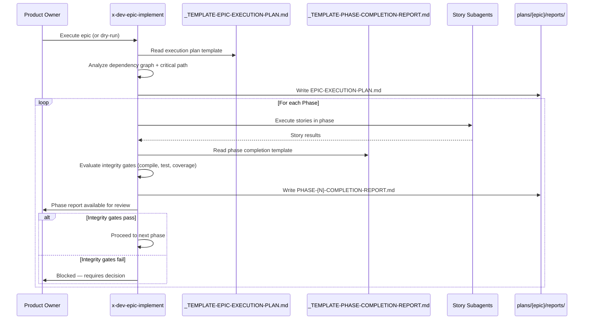

# Historia: Templates de Orquestracao de Epico (Execution Plan, Phase Completion Report)

**ID:** story-0024-0004
**Chave Jira:** ---
**Status:** Pendente

## 1. Dependencias

| Blocked By | Blocks |
| :--- | :--- |
| --- | story-0024-0005 |

## 2. Regras Transversais Aplicaveis

| ID | Titulo |
| :--- | :--- |
| RULE-001 | Template obrigatorio para artefatos |
| RULE-003 | Templates language-agnostic |
| RULE-011 | Header padronizado |

## 3. Descricao

Como **Product Owner**, eu quero um plano de execucao legivel por humanos antes de cada epico iniciar, e relatorios intermediarios ao final de cada fase, garantindo que posso auditar progresso e tomar decisoes informadas sobre continuacao.

Atualmente, `x-dev-epic-implement` salva `execution-state.json` para checkpointing mas nao produz plano legivel por humanos antes do inicio e nao gera relatorios intermediarios nos limites de fase. Em modo dry-run, a analise e exibida no console mas nao e salva. Isso impede auditoria de progresso, revisao humana do plano de execucao, e decisao informada sobre continuacao de epicos longos.

Esta story cria 2 templates que cobrem o ciclo de vida de execucao de um epico: plano pre-execucao e relatorios por fase.

### 3.1 Templates a Criar

1. **`_TEMPLATE-EPIC-EXECUTION-PLAN.md`** — 8 secoes obrigatorias:
   - Header (Epic ID, Title, Date, Total Stories, Total Phases, Template Version)
   - Execution Strategy (sequential, parallel, hybrid)
   - Phase Timeline (tabela: Phase N, Stories, Estimated Duration, Dependencies)
   - Story Execution Order (tabela com coluna Critical Path: Yes/No)
   - Pre-flight Analysis Summary (resultado da analise pre-execucao)
   - Resource Requirements (estimativa de recursos: tokens, tempo, paralelismo)
   - Risk Assessment (riscos de execucao: dependencias externas, complexidade)
   - Checkpoint Strategy (frequencia de checkpoints, criterios de salvamento)

2. **`_TEMPLATE-PHASE-COMPLETION-REPORT.md`** — 8 secoes obrigatorias:
   - Header (Epic ID, Phase Number, Phase Name, Start Timestamp, End Timestamp, Template Version)
   - Stories Completed (tabela: Story ID, Title, Status, Duration)
   - Integrity Gate Results (tabela: Gate, Result, Details — Compilation, Tests, Coverage)
   - Findings Summary (findings acumulados da fase)
   - TDD Compliance (avaliacao de compliance TDD por story)
   - Coverage Delta (cobertura antes e depois da fase)
   - Blockers Encountered (bloqueios encontrados e resolucao)
   - Next Phase Readiness (checklist de prontidao para proxima fase)

### 3.2 Critical Path Column

A tabela "Story Execution Order" inclui coluna "Critical Path" (Yes/No) que identifica quais stories estao no caminho critico — stories cuja atraso impacta diretamente o prazo do epico. Esta informacao e extraida do dependency graph calculado pelo `x-story-map`.

### 3.3 Phase Report Reutilizavel

O template de phase completion report e reutilizavel para fases intermediarias e fase final. A fase final inclui todas as secoes mais um resumo agregado do epico inteiro. O header distingue fases pelo campo "Phase Number" e "Phase Name".

## 3.5 Entrega de Valor

- **Valor Principal:** Plano de execucao legivel por humanos e relatorios de fase — permite auditoria de progresso e decisao informada sobre continuacao de epicos longos
- **Metrica de Sucesso:** Execution plan contem tabela com coluna Critical Path; phase report contem Integrity Gate Results com compile/test/coverage; ambos os templates usaveis em modo dry-run
- **Impacto no Negocio:** Product Owners podem revisar e aprovar planos de execucao antes do inicio. Relatorios de fase permitem decisao de go/no-go entre fases. Desbloqueia story-0024-0005

## 4. Definicoes de Qualidade Locais

### DoR Local

- [ ] Skill `x-dev-epic-implement` analisada para entender fluxo de execucao atual
- [ ] Skill `x-story-map` analisada para entender calculo de critical path
- [ ] Schema do `execution-state.json` compreendido
- [ ] Modo dry-run do `x-dev-epic-implement` testado manualmente

### DoD Local

- [ ] `_TEMPLATE-EPIC-EXECUTION-PLAN.md` criado com 8 secoes obrigatorias
- [ ] `_TEMPLATE-PHASE-COMPLETION-REPORT.md` criado com 8 secoes obrigatorias
- [ ] Tabela Story Execution Order contem coluna "Critical Path"
- [ ] Tabela Integrity Gate Results contem linhas para Compilation, Tests, Coverage
- [ ] Header padronizado conforme RULE-011 em ambos os templates
- [ ] Phase report reutilizavel para fases intermediarias e fase final
- [ ] Testes unitarios validando presenca de secoes obrigatorias

### Global DoD

- **Cobertura:** >= 95% Line, >= 90% Branch para codigo Java novo
- **Testes Automatizados:** Golden tests para todos os profiles incluindo novos templates. Testes unitarios para validacao de secoes obrigatorias. Cada historia DEVE ter pelo menos 1 teste automatizado validando o criterio de aceite principal.
- **Smoke Tests:** Obrigatorio. Cada historia deve passar no smoke gate.
- **Relatorio de Cobertura:** JaCoCo integrado ao `mvn verify`
- **Documentacao:** CLAUDE.md atualizado com catalogo de artefatos ao final do epico
- **Persistencia:** Templates copiados verbatim sem renderizacao de placeholders
- **Performance:** Geracao nao deve aumentar tempo de build em mais de 5%
- **TDD Compliance:** Commits show test-first pattern. Explicit refactoring after green. Tests are incremental (from simple to complex via TPP).
- **Double-Loop TDD:** Acceptance tests derived from Gherkin scenarios (outer loop). Unit tests guided by TPP (inner loop).

## 5. Contratos de Dados

### 5.1 Estrutura dos Templates (Markdown Files)

| Template | Secoes Obrigatorias | Secoes Condicionais | Marcadores |
| :--- | :--- | :--- | :--- |
| `_TEMPLATE-EPIC-EXECUTION-PLAN.md` | 8 | 0 | Nenhum |
| `_TEMPLATE-PHASE-COMPLETION-REPORT.md` | 8 | 0 | Nenhum |

### 5.2 Story Execution Order Table Schema

| Coluna | Tipo | M/O | Descricao |
| :--- | :--- | :--- | :--- |
| Order | Integer | M | Ordem de execucao (1, 2, 3...) |
| Story ID | String | M | Identificador da story (ex: `story-0024-0001`) |
| Title | String | M | Titulo da story |
| Phase | Integer | M | Fase de execucao (1, 2, 3...) |
| Dependencies | String | M | IDs das dependencias (ou `---` se nenhuma) |
| Critical Path | Enum | M | `Yes` / `No` |
| Estimated Effort | String | M | Estimativa de esforco (ex: `S`, `M`, `L`, `XL`) |

### 5.3 Integrity Gate Results Table Schema

| Coluna | Tipo | M/O | Descricao |
| :--- | :--- | :--- | :--- |
| Gate | String | M | Nome do gate (Compilation, Tests, Coverage) |
| Result | Enum | M | `Pass` / `Fail` / `Skip` |
| Details | String | M | Detalhes do resultado (ex: `95.2% line, 91.0% branch`) |
| Duration | String | O | Tempo de execucao do gate |

### 5.4 Phase Timeline Table Schema

| Coluna | Tipo | M/O | Descricao |
| :--- | :--- | :--- | :--- |
| Phase | Integer | M | Numero da fase (1, 2, 3...) |
| Name | String | M | Nome da fase (ex: `Foundation`, `Core Domain`) |
| Stories | String | M | Lista de story IDs na fase |
| Parallelism | String | M | `Sequential` / `Parallel` / `Hybrid` |
| Estimated Duration | String | M | Estimativa de duracao |
| Dependencies | String | M | Fases prerequisito |

## 6. Diagramas

### 6.1 Fluxo de execucao de epico com plano e relatorios



## 7. Criterios de Aceite (Gherkin)

```gherkin
@GK-1
Cenario: Template de execution plan vazio falha na validacao
  DADO que o arquivo _TEMPLATE-EPIC-EXECUTION-PLAN.md existe
  E o conteudo do arquivo esta vazio (0 bytes)
  QUANDO o validador de secoes obrigatorias e executado
  ENTAO a validacao falha com mensagem "Template has no sections: _TEMPLATE-EPIC-EXECUTION-PLAN.md"
  E o template nao e copiado para o diretorio de output

@GK-2
Cenario: Execution plan contem Story Execution Order com coluna Critical Path
  DADO que o arquivo _TEMPLATE-EPIC-EXECUTION-PLAN.md foi criado
  QUANDO a secao "Story Execution Order" e analisada
  ENTAO a tabela contem colunas Order, Story ID, Title, Phase, Dependencies, Critical Path, Estimated Effort
  E a coluna Critical Path aceita valores "Yes" ou "No"
  E a secao "Phase Timeline" contem tabela com colunas Phase, Name, Stories, Parallelism, Estimated Duration, Dependencies

@GK-3
Cenario: Phase report contem Integrity Gate Results com compile/test/coverage
  DADO que o arquivo _TEMPLATE-PHASE-COMPLETION-REPORT.md foi criado
  QUANDO a secao "Integrity Gate Results" e analisada
  ENTAO a tabela contem linhas para Compilation, Tests e Coverage
  E cada linha contem colunas Gate, Result, Details
  E a coluna Result aceita valores "Pass", "Fail" ou "Skip"

@GK-4
Cenario: Secao Phase Timeline ausente falha na validacao
  DADO que o arquivo _TEMPLATE-EPIC-EXECUTION-PLAN.md foi modificado
  E a secao "## Phase Timeline" foi removida
  QUANDO o validador de secoes obrigatorias e executado
  ENTAO a validacao falha com warning "Missing mandatory section: Phase Timeline"
  E o log contem o nome do template e a secao ausente

@GK-5
Cenario: Phase report reutilizavel para fases intermediarias e fase final
  DADO que o arquivo _TEMPLATE-PHASE-COMPLETION-REPORT.md foi criado
  QUANDO o template e analisado para reutilizabilidade
  ENTAO o header contem campo "Phase Number" preenchivel (1, 2, 3...)
  E o header contem campo "Phase Name" preenchivel
  E a secao "Next Phase Readiness" e aplicavel tanto para fases intermediarias quanto para fase final
  E o template nao contem logica condicional que impeca uso em qualquer fase
```

### 7.1 Scenario Ordering (TPP)

> TPP: degenerate (empty template) -> happy path (Critical Path column in execution plan) -> happy path (Integrity Gate Results in phase report) -> error (missing Phase Timeline) -> boundary (phase report reusable for intermediate and final phases).

### 7.2 Mandatory Scenario Categories

- [x] Degenerate cases (GK-1: empty template)
- [x] Happy path (GK-2: execution plan with Critical Path, GK-3: phase report with gates)
- [x] Error paths (GK-4: missing Phase Timeline section)
- [x] Boundary values (GK-5: phase report reusable for all phases)

### 7.3 TDD Implementation Notes

- **Outer Loop (Acceptance Tests):** Derivar de GK-2 — verificar que execution plan gerado contem tabela Story Execution Order com coluna Critical Path
- **Inner Loop (Unit Tests):** Iniciar com template vazio (GK-1), progredir para 1 secao, depois tabela com 1 story, depois tabela com multiplas stories e critical path
- **TPP Progression:** `{} -> nil -> constant -> constant+ -> scalar -> collection` — comecar com template vazio, depois header sozinho, depois 1 secao de tabela, depois todas as 8 secoes com tabelas preenchidas

## 8. Sub-tarefas

- [ ] [Dev] Criar `_TEMPLATE-EPIC-EXECUTION-PLAN.md` com 8 secoes incluindo Story Execution Order com coluna Critical Path
- [ ] [Dev] Criar `_TEMPLATE-PHASE-COMPLETION-REPORT.md` com 8 secoes incluindo Integrity Gate Results
- [ ] [Dev] Definir schema de tabelas (Story Execution Order, Phase Timeline, Integrity Gate Results)
- [ ] [Test] Unitario: Validar presenca de coluna Critical Path na tabela Story Execution Order
- [ ] [Test] Unitario: Validar Integrity Gate Results com linhas Compilation, Tests, Coverage
- [ ] [Test] Unitario: Validar header padronizado (RULE-011) em ambos os templates
- [ ] [Test] Smoke/E2E: Templates aparecem no output gerado em `.claude/templates/`
- [ ] [Doc] Documentar workflow de execution plan no README
