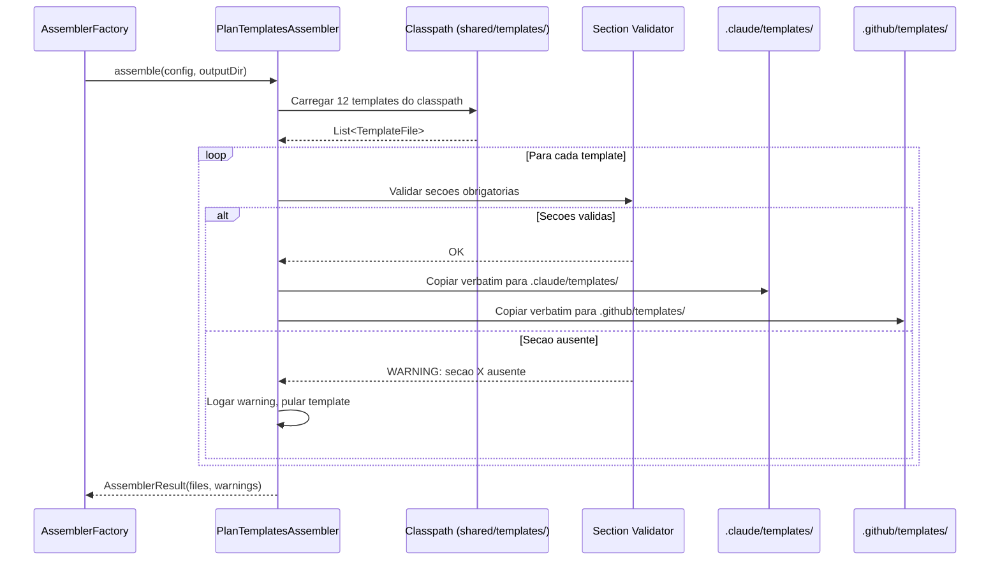

# Historia: PlanTemplatesAssembler -- Distribuicao de Templates na Geracao

**ID:** story-0024-0005
**Chave Jira:** ---
**Status:** Pendente

## 1. Dependencias

| Blocked By | Blocks |
| :--- | :--- |
| story-0024-0001, story-0024-0002, story-0024-0003, story-0024-0004 | story-0024-0006, story-0024-0007, story-0024-0008, story-0024-0009, story-0024-0010, story-0024-0011, story-0024-0012, story-0024-0015 |

## 2. Regras Transversais Aplicaveis

| ID | Titulo |
| :--- | :--- |
| RULE-004 | Dual-target copy |
| RULE-010 | Validacao de secoes obrigatorias |
| RULE-003 | Templates language-agnostic |

## 3. Descricao

Como **desenvolvedor do gerador**, eu quero um assembler que copie os 12 templates de planejamento e review para o output da geracao, garantindo que projetos gerados tenham acesso aos templates padronizados.

Os 12 templates criados nas stories 0024-0001 a 0024-0004 existem em `java/src/main/resources/shared/templates/` mas nao sao distribuidos para os projetos gerados. Sem distribuicao, as 8 skills que referenciam templates (x-dev-lifecycle, x-test-plan, x-dev-architecture-plan, x-lib-task-decomposer, x-review, x-review-pr, x-dev-implement, x-dev-epic-implement) nao encontrariam os templates em runtime. Esta story e o principal bottleneck do epico -- desbloqueia 8 stories dependentes.

O assembler deve seguir exatamente o padrao do `EpicReportAssembler.java`: implementar a interface `Assembler`, carregar templates do classpath, validar secoes obrigatorias antes de copiar, e copiar verbatim para ambos os targets (`.claude/templates/` e `.github/templates/`). Templates contem marcadores `{{LANGUAGE}}`, `{{FRAMEWORK}}`, etc. que NAO devem ser renderizados pelo engine -- sao preservados literalmente para preenchimento pela LLM em runtime.

### 3.1 Templates a Distribuir (12)

- `_TEMPLATE-IMPLEMENTATION-PLAN.md` -- Plano de implementacao com class diagram, method signatures, TDD strategy
- `_TEMPLATE-TEST-PLAN.md` -- Plano de testes TDD com Double-Loop e TPP
- `_TEMPLATE-ARCHITECTURE-PLAN.md` -- Plano arquitetural com 13 secoes
- `_TEMPLATE-TASK-BREAKDOWN.md` -- Decomposicao de tarefas por camada
- `_TEMPLATE-SECURITY-ASSESSMENT.md` -- Avaliacao de seguranca OWASP
- `_TEMPLATE-COMPLIANCE-ASSESSMENT.md` -- Avaliacao de compliance regulatorio
- `_TEMPLATE-SPECIALIST-REVIEW.md` -- Review por engenheiro especialista
- `_TEMPLATE-TECH-LEAD-REVIEW.md` -- Review holistico do Tech Lead
- `_TEMPLATE-CONSOLIDATED-REVIEW-DASHBOARD.md` -- Dashboard consolidado de reviews
- `_TEMPLATE-REVIEW-REMEDIATION.md` -- Tracking de remediacao de findings
- `_TEMPLATE-EPIC-EXECUTION-PLAN.md` -- Plano de execucao de epico
- `_TEMPLATE-PHASE-COMPLETION-REPORT.md` -- Relatorio de conclusao de fase

### 3.2 Interface Assembler

- Implementar `Assembler` interface (mesmo contrato que `EpicReportAssembler`)
- Metodo principal: `assemble(SetupConfig config, Path outputDir)`
- Retorno: `AssemblerResult` com lista de arquivos copiados e warnings
- Registrar em `AssemblerFactory` na posicao imediatamente apos `EpicReportAssembler`

### 3.3 Validacao de Secoes Obrigatorias

- Cada template tem secoes obrigatorias definidas (ex: `## 1.`, `## 2.`, etc.)
- Antes de copiar, verificar presenca das secoes obrigatorias
- Se secao obrigatoria ausente: logar warning com nome do template e secao faltante, pular template
- Templates com todas as secoes presentes: copiar verbatim para ambos os targets

### 3.4 Dual-Target Copy

- Target 1: `{outputDir}/.claude/templates/{template-name}`
- Target 2: `{outputDir}/.github/templates/{template-name}`
- Copiar byte-a-byte sem transformacao (preservar `{{LANGUAGE}}`, `{{FRAMEWORK}}`, etc.)
- Criar diretorios-alvo se nao existirem

## 3.5 Entrega de Valor

- **Valor Principal:** Templates disponíveis em projetos gerados -- habilita as 8 skills de modificacao a referenciar templates padronizados em runtime. Principal bottleneck do epico -- desbloqueia 8 stories.
- **Metrica de Sucesso:** `mvn verify` gera output com 12 templates em `.claude/templates/` e `.github/templates/` para todos os 8 profiles
- **Impacto no Negocio:** Sem este assembler, nenhuma das skills modificadas (stories 0006-0012) pode funcionar com templates -- bloqueia 50% do epico

## 4. Definicoes de Qualidade Locais

### DoR Local

- [ ] 12 templates criados e disponiveis em `shared/templates/` (stories 0001-0004 concluidas)
- [ ] Padrao do `EpicReportAssembler.java` estudado e compreendido
- [ ] Interface `Assembler` e `AssemblerFactory` analisados
- [ ] Lista de secoes obrigatorias por template definida

### DoD Local

- [ ] `PlanTemplatesAssembler.java` criado implementando interface `Assembler`
- [ ] 12 templates copiados para `.claude/templates/` e `.github/templates/`
- [ ] Validacao de secoes obrigatorias implementada
- [ ] Registro em `AssemblerFactory` apos `EpicReportAssembler`
- [ ] Placeholders `{{LANGUAGE}}`, `{{FRAMEWORK}}` preservados (nao renderizados)
- [ ] Warnings logados para templates com secoes ausentes
- [ ] Pelo menos 1 teste automatizado validando o criterio de aceite principal
- [ ] Smoke test passando (mvn verify)

### Global Definition of Done (DoD)

- **Cobertura:** >= 95% Line, >= 90% Branch
- **Testes Automatizados:** Golden tests para todos os profiles incluindo novos templates. Testes unitarios para validacao de secoes obrigatorias.
- **Relatorio de Cobertura:** JaCoCo integrado ao `mvn verify`
- **Documentacao:** Javadoc no assembler e pipeline documentation atualizada
- **Persistencia:** Templates copiados verbatim sem renderizacao de placeholders
- **Performance:** Geracao nao deve aumentar tempo de build em mais de 5%

## 5. Contratos de Dados

### 5.1 Interface Assembler (contrato existente)

```java
public interface Assembler {
    AssemblerResult assemble(SetupConfig config, Path outputDir);
    String name();
    int order();
}
```

### 5.2 PlanTemplatesAssembler -- Configuracao

| Campo | Tipo | M/O | Descricao | Exemplo |
| :--- | :--- | :--- | :--- | :--- |
| `SOURCE_DIR` | `String` | M | Diretorio source no classpath | `"shared/templates/"` |
| `CLAUDE_TARGET` | `String` | M | Target para .claude | `".claude/templates/"` |
| `GITHUB_TARGET` | `String` | M | Target para .github | `".github/templates/"` |
| `TEMPLATE_COUNT` | `int` | M | Numero esperado de templates | `12` |

### 5.3 Resultado da Validacao

| Campo | Tipo | Sempre presente | Descricao |
| :--- | :--- | :--- | :--- |
| `files` | `List<String>` | Sim | Caminhos dos templates copiados (ambos targets) |
| `warnings` | `List<String>` | Sim | Warnings de validacao (secoes ausentes, templates pulados) |

## 6. Diagramas

### 6.1 Fluxo de Distribuicao de Templates



## 7. Criterios de Aceite (Gherkin)

```gherkin
Cenario: Nenhum template no source produz lista vazia
  DADO que o diretorio source shared/templates/ esta vazio
  QUANDO PlanTemplatesAssembler.assemble() e invocado
  ENTAO o resultado contem 0 arquivos copiados
  E o resultado contem 0 warnings

Cenario: 12 templates copiados para ambos os targets
  DADO que shared/templates/ contem os 12 templates de planejamento e review
  E todos os templates possuem secoes obrigatorias validas
  QUANDO PlanTemplatesAssembler.assemble() e invocado
  ENTAO 12 templates sao copiados para .claude/templates/
  E 12 templates sao copiados para .github/templates/
  E o resultado contem 24 caminhos de arquivos (12 x 2 targets)
  E 0 warnings sao gerados

Cenario: Placeholders preservados no output sem renderizacao
  DADO que _TEMPLATE-IMPLEMENTATION-PLAN.md contem marcadores {{LANGUAGE}} e {{FRAMEWORK}}
  QUANDO PlanTemplatesAssembler.assemble() e invocado
  ENTAO o arquivo copiado em .claude/templates/_TEMPLATE-IMPLEMENTATION-PLAN.md contem {{LANGUAGE}} literalmente
  E o arquivo copiado contem {{FRAMEWORK}} literalmente
  E nenhum marcador foi substituido por valor concreto

Cenario: Template com secao obrigatoria ausente gera warning e e pulado
  DADO que _TEMPLATE-TEST-PLAN.md esta ausente da secao obrigatoria "## 3."
  QUANDO PlanTemplatesAssembler.assemble() e invocado
  ENTAO o template _TEMPLATE-TEST-PLAN.md NAO e copiado para nenhum target
  E um warning e registrado contendo "Missing mandatory section ## 3. in _TEMPLATE-TEST-PLAN.md"
  E os demais 11 templates validos sao copiados normalmente

Cenario: Template nao encontrado no classpath gera warning e continua
  DADO que _TEMPLATE-ARCHITECTURE-PLAN.md nao existe no classpath
  QUANDO PlanTemplatesAssembler.assemble() e invocado
  ENTAO um warning e registrado contendo "Template not found: _TEMPLATE-ARCHITECTURE-PLAN.md"
  E os demais templates encontrados sao processados normalmente
  E o assembler NAO lanca excecao

Cenario: Posicao no pipeline apos EpicReportAssembler
  DADO que AssemblerFactory registra assemblers em ordem
  QUANDO a lista de assemblers e consultada
  ENTAO PlanTemplatesAssembler aparece imediatamente apos EpicReportAssembler
  E o order() de PlanTemplatesAssembler e maior que o de EpicReportAssembler
```

### 7.1 Scenario Ordering (TPP)

> TPP: degenerate (source vazio -> lista vazia) -> happy path (12 templates copiados, placeholders preservados) -> error (secao ausente, template nao encontrado) -> boundary (posicao no pipeline).

### 7.2 Mandatory Scenario Categories

- [x] Degenerate cases (source vazio produz lista vazia)
- [x] Happy path (12 templates copiados, placeholders preservados)
- [x] Error paths (secao obrigatoria ausente, template nao encontrado no classpath)
- [x] Boundary values (posicao no pipeline apos EpicReportAssembler)

### 7.3 TDD Implementation Notes

- **Double-Loop TDD**: O primeiro cenario (source vazio) e o acceptance test do outer loop. Cenarios subsequentes guiam unit tests do inner loop.
- O primeiro cenario define o walking skeleton -- assembler funcional que retorna lista vazia.
- Unit tests seguem TPP: vazio -> constante (1 template) -> colecao (12 templates) -> condicional (validacao) -> error handling.

## 8. Sub-tarefas

- [ ] [Dev] Criar `PlanTemplatesAssembler.java` implementando interface `Assembler`
- [ ] [Dev] Implementar carregamento de 12 templates do classpath
- [ ] [Dev] Implementar validacao de secoes obrigatorias por tipo de template
- [ ] [Dev] Implementar dual-target copy (.claude/templates/ e .github/templates/)
- [ ] [Dev] Registrar em `AssemblerFactory` apos `EpicReportAssembler`
- [ ] [Test] Unitario: Validar 12 templates copiados para ambos os targets
- [ ] [Test] Unitario: Validar secao obrigatoria ausente gera warning e pula template
- [ ] [Test] Unitario: Validar placeholders preservados (nao renderizados)
- [ ] [Test] Unitario: Validar template nao encontrado gera warning sem excecao
- [ ] [Test] Unitario: Validar posicao no pipeline (order apos EpicReportAssembler)
- [ ] [Test] Smoke/E2E: `mvn verify` passa com novo assembler no pipeline e templates presentes no output
- [ ] [Doc] Atualizar documentacao do assembler pipeline com PlanTemplatesAssembler
