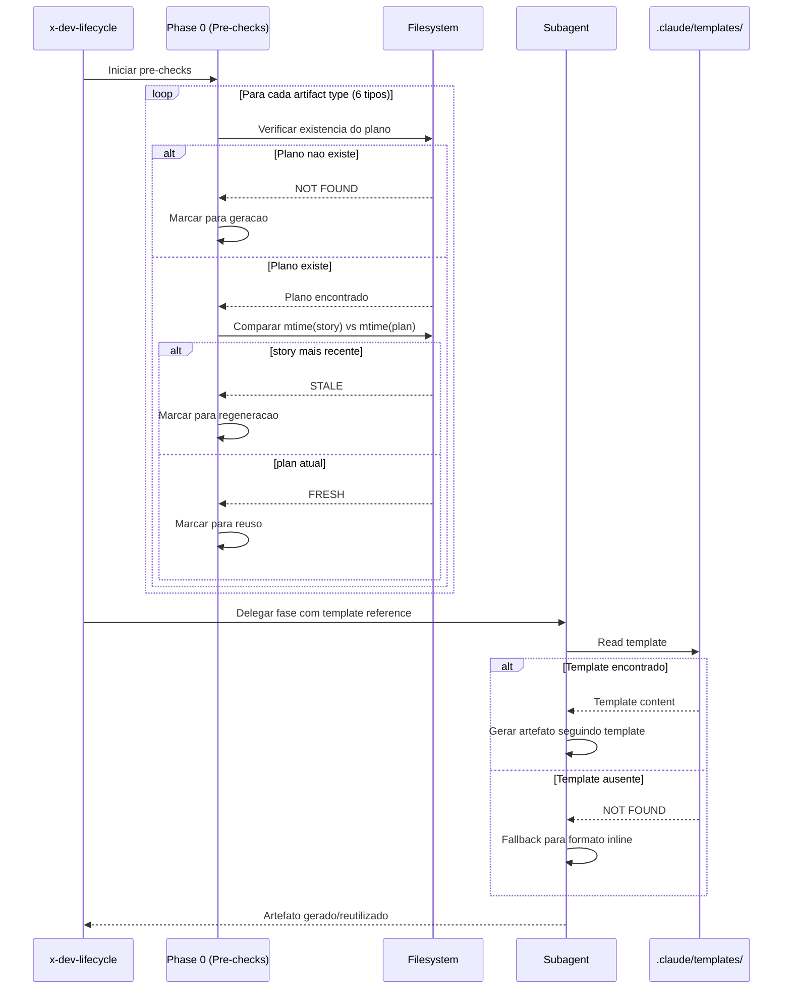

# Historia: Pre-Checks e Template References no x-dev-lifecycle

**ID:** story-0024-0006
**Chave Jira:** ---
**Status:** Pendente

## 1. Dependencias

| Blocked By | Blocks |
| :--- | :--- |
| story-0024-0005 | story-0024-0013, story-0024-0014 |

## 2. Regras Transversais Aplicaveis

| ID | Titulo |
| :--- | :--- |
| RULE-001 | Template obrigatorio para artefatos |
| RULE-002 | Idempotencia via staleness check |
| RULE-007 | Instrucao explicita de template |
| RULE-008 | Implementation plan completo |
| RULE-009 | Modelo profundo para planejamento |
| RULE-012 | Fallback graceful |

## 3. Descricao

Como **desenvolvedor**, eu quero que o x-dev-lifecycle verifique planos existentes antes de regenerar e use templates padronizados em todas as fases de planejamento, garantindo que sessoes retomadas reutilizem trabalho anterior.

O x-dev-lifecycle e o orquestrador principal com 9 fases que coordena o ciclo completo de desenvolvimento. Atualmente, Phase 0 ja verifica existencia de test plan e architecture plan, mas NAO verifica implementation plan, task breakdown, security assessment, nem compliance assessment. Alem disso, as fases 1B, 1E, 4, 5 e 7 produzem artefatos sem referenciar templates padronizados, resultando em outputs com formato variavel entre sessoes.

As mudancas necessarias afetam `java/src/main/resources/targets/claude/skills/core/x-dev-lifecycle/SKILL.md`. O padrao de pre-check e baseado em comparacao de mtime: se `mtime(story) <= mtime(plan)`, o plano existente e reutilizado; caso contrario, e regenerado. Para cada fase que produz artefatos, a instrucao deve referenciar explicitamente o template correspondente em `.claude/templates/`.

### 3.1 Phase 0 -- Pre-checks Expandidos

- Adicionar verificacao de existencia para 4 novos tipos de artefato:
  - `plans/epic-XXXX/plans/plan-story-XXXX-YYYY.md` (implementation plan)
  - `plans/epic-XXXX/plans/tasks-story-XXXX-YYYY.md` (task breakdown)
  - `plans/epic-XXXX/plans/security-story-XXXX-YYYY.md` (security assessment)
  - `plans/epic-XXXX/plans/compliance-story-XXXX-YYYY.md` (compliance assessment)
- Logica de staleness: comparar mtime do arquivo de story com mtime do plano
- Se `mtime(story) <= mtime(plan)`: logar `Reusing existing {artifact} from {date}` e pular geracao
- Se `mtime(story) > mtime(plan)`: marcar para regeneracao

### 3.2 Phase 1B -- Template Reference para Implementation Plan

- Instrucao ao subagente: "Read template at `.claude/templates/_TEMPLATE-IMPLEMENTATION-PLAN.md` for required output format"
- Adicionar `model: opus` na delegacao de planejamento
- Output deve incluir: class diagram Mermaid, method signatures, affected layers table, TDD strategy com mapeamento UT-N/AT-N, mini-ADRs

### 3.3 Phase 1E/1F -- Split Security e Compliance

- Phase 1E: Security assessment referenciando `_TEMPLATE-SECURITY-ASSESSMENT.md`
- Phase 1F (nova, condicional): Compliance assessment referenciando `_TEMPLATE-COMPLIANCE-ASSESSMENT.md`
- Phase 1F so executa quando o projeto possui compliance habilitado no setup config
- Ambas as fases devem persistir em `plans/epic-XXXX/plans/`

### 3.4 Phase 4 -- Review com Template e Dashboard

- Instrucao aos 8 subagentes especialistas: "Read template at `.claude/templates/_TEMPLATE-SPECIALIST-REVIEW.md`"
- Apos consolidacao, gerar dashboard usando `_TEMPLATE-CONSOLIDATED-REVIEW-DASHBOARD.md`
- Dashboard salvo em `plans/epic-XXXX/plans/review-dashboard-story-XXXX-YYYY.md`

### 3.5 Phase 5 -- Remediation Tracking

- Gerar tracking de remediacao usando `_TEMPLATE-REVIEW-REMEDIATION.md`
- Mapear findings abertos do dashboard para itens de remediacao
- Salvar em `plans/epic-XXXX/plans/remediation-story-XXXX-YYYY.md`

### 3.6 Phase 7 -- Tech Lead Review com Template

- Instrucao ao subagente Tech Lead: "Read template at `.claude/templates/_TEMPLATE-TECH-LEAD-REVIEW.md`"
- Apos review, atualizar o dashboard consolidado com round do Tech Lead
- Dashboard atualizado preserva historico de rounds anteriores

## 3.5 Entrega de Valor

- **Valor Principal:** Sessoes retomadas reutilizam planos existentes -- economia de tokens e continuidade de execucao no orquestrador principal (skill mais utilizada do projeto)
- **Metrica de Sucesso:** Retomada de sessao com 6 planos existentes executa em < 30s (skip de 6 fases), vs. 10-15 min sem pre-checks
- **Impacto no Negocio:** Desbloqueia story-0024-0013 (x-dev-implement) e story-0024-0014 (auditoria de consistencia). Economia estimada de 50-80% de tokens em retomadas de sessao.

## 4. Definicoes de Qualidade Locais

### DoR Local

- [ ] `PlanTemplatesAssembler` funcional e templates disponiveis em `.claude/templates/` (story-0024-0005)
- [ ] SKILL.md atual do x-dev-lifecycle analisado (todas as 9 fases mapeadas)
- [ ] Padrao de pre-check existente (test plan, architecture plan) compreendido
- [ ] Formato de mtime comparison documentado

### DoD Local

- [ ] Phase 0 verifica 6 tipos de artefato (test plan, architecture plan + 4 novos)
- [ ] Phase 1B referencia template com model: opus
- [ ] Phase 1E/1F separadas (security obrigatoria, compliance condicional)
- [ ] Phase 4 referencia template de specialist review e gera dashboard
- [ ] Phase 5 gera remediation tracking
- [ ] Phase 7 referencia template de Tech Lead review e atualiza dashboard
- [ ] Fallback funcional quando templates nao disponíveis
- [ ] Pelo menos 1 teste automatizado validando o criterio de aceite principal
- [ ] Smoke test passando

### Global Definition of Done (DoD)

- **Cobertura:** >= 95% Line, >= 90% Branch
- **Testes Automatizados:** Golden tests validando SKILL.md gerado. Testes unitarios para logica de mtime.
- **Relatorio de Cobertura:** JaCoCo integrado ao `mvn verify`
- **Documentacao:** Phase documentation atualizada no SKILL.md
- **Persistencia:** Templates copiados verbatim sem renderizacao de placeholders
- **Performance:** Geracao nao deve aumentar tempo de build em mais de 5%

## 5. Contratos de Dados

### 5.1 Pre-check Artifacts Table

| Artifact Type | File Pattern | Phase que Gera | Template Reference |
| :--- | :--- | :--- | :--- |
| Test Plan | `plans/epic-XXXX/plans/tests-story-XXXX-YYYY.md` | 1C | `_TEMPLATE-TEST-PLAN.md` |
| Architecture Plan | `plans/epic-XXXX/plans/arch-story-XXXX-YYYY.md` | 1A | `_TEMPLATE-ARCHITECTURE-PLAN.md` |
| Implementation Plan | `plans/epic-XXXX/plans/plan-story-XXXX-YYYY.md` | 1B | `_TEMPLATE-IMPLEMENTATION-PLAN.md` |
| Task Breakdown | `plans/epic-XXXX/plans/tasks-story-XXXX-YYYY.md` | 1D | `_TEMPLATE-TASK-BREAKDOWN.md` |
| Security Assessment | `plans/epic-XXXX/plans/security-story-XXXX-YYYY.md` | 1E | `_TEMPLATE-SECURITY-ASSESSMENT.md` |
| Compliance Assessment | `plans/epic-XXXX/plans/compliance-story-XXXX-YYYY.md` | 1F | `_TEMPLATE-COMPLIANCE-ASSESSMENT.md` |

### 5.2 Staleness Check Logic

| Condicao | Acao | Log |
| :--- | :--- | :--- |
| `plan nao existe` | Gerar novo | `"Generating {type} for {story}"` |
| `mtime(story) > mtime(plan)` | Regenerar | `"Regenerating stale {type} for {story}"` |
| `mtime(story) <= mtime(plan)` | Reutilizar | `"Reusing existing {type} from {date}"` |
| `mtime(story) == mtime(plan)` | Reutilizar | `"Reusing existing {type} from {date}"` |

## 6. Diagramas

### 6.1 Fluxo de Pre-check e Geracao com Templates



## 7. Criterios de Aceite (Gherkin)

```gherkin
Cenario: Nenhum plano existente resulta em execucao normal de todas as fases
  DADO que o diretorio plans/epic-XXXX/plans/ esta vazio
  E os templates estao disponiveis em .claude/templates/
  QUANDO x-dev-lifecycle e executado para story-XXXX-YYYY
  ENTAO Phase 0 nao encontra nenhum plano para reutilizar
  E todas as fases de geracao (1A a 1F, 4, 5, 7) sao executadas
  E cada fase referencia o template correspondente

Cenario: Plano existente reutilizado quando story nao foi modificada
  DADO que plans/epic-XXXX/plans/plan-story-XXXX-YYYY.md existe
  E mtime(story-XXXX-YYYY.md) e anterior a mtime(plan-story-XXXX-YYYY.md)
  QUANDO x-dev-lifecycle executa Phase 0
  ENTAO o log contem "Reusing existing implementation plan from {date}"
  E Phase 1B (implementation plan) e pulada
  E as demais fases executam normalmente

Cenario: Plano stale regenerado quando story foi modificada apos o plano
  DADO que plans/epic-XXXX/plans/plan-story-XXXX-YYYY.md existe
  E mtime(story-XXXX-YYYY.md) e posterior a mtime(plan-story-XXXX-YYYY.md)
  QUANDO x-dev-lifecycle executa Phase 0
  ENTAO o log contem "Regenerating stale implementation plan for story-XXXX-YYYY"
  E Phase 1B e executada com referencia ao template _TEMPLATE-IMPLEMENTATION-PLAN.md

Cenario: Security e compliance sao fases separadas
  DADO que o projeto possui compliance habilitado no setup config
  QUANDO x-dev-lifecycle executa as fases de planejamento
  ENTAO Phase 1E gera security assessment usando _TEMPLATE-SECURITY-ASSESSMENT.md
  E Phase 1F gera compliance assessment usando _TEMPLATE-COMPLIANCE-ASSESSMENT.md
  E ambos os artefatos sao salvos em plans/epic-XXXX/plans/

Cenario: Template nao encontrado aciona fallback para formato inline
  DADO que .claude/templates/_TEMPLATE-IMPLEMENTATION-PLAN.md nao existe
  QUANDO x-dev-lifecycle executa Phase 1B
  ENTAO um warning e logado "Template not found, using inline format"
  E o artefato e gerado no formato inline (sem template)
  E a execucao continua normalmente sem interrupcao

Cenario: Igualdade de mtime tratada como "not stale" com reuso
  DADO que plans/epic-XXXX/plans/tests-story-XXXX-YYYY.md existe
  E mtime(story-XXXX-YYYY.md) e exatamente igual a mtime(tests-story-XXXX-YYYY.md)
  QUANDO x-dev-lifecycle executa Phase 0
  ENTAO o test plan e reutilizado (nao regenerado)
  E o log contem "Reusing existing test plan from {date}"
```

### 7.1 Scenario Ordering (TPP)

> TPP: degenerate (nenhum plano existente) -> happy path (plano reutilizado, plano stale regenerado, security/compliance separados) -> error (template nao encontrado -> fallback) -> boundary (mtime igualdade tratada como reuso).

### 7.2 Mandatory Scenario Categories

- [x] Degenerate cases (nenhum plano existente, execucao normal)
- [x] Happy path (plano reutilizado, stale regenerado, fases separadas)
- [x] Error paths (template nao encontrado, fallback inline)
- [x] Boundary values (mtime igualdade como "not stale")

### 7.3 TDD Implementation Notes

- **Double-Loop TDD**: O primeiro cenario (nenhum plano) e o acceptance test do outer loop. Define o walking skeleton onde todas as fases executam sem interferencia de pre-checks.
- Unit tests guiam logica de mtime comparison: inexistente -> stale -> fresh -> equal.
- Fases com template reference sao testadas via golden file parity (output gerado vs. expected).

## 8. Sub-tarefas

- [ ] [Dev] Adicionar pre-checks para 4 novos tipos de artefato em Phase 0 (implementation plan, task breakdown, security, compliance)
- [ ] [Dev] Adicionar referencia a template em Phase 1B com `model: opus`
- [ ] [Dev] Separar Phase 1E (security) e criar Phase 1F (compliance, condicional)
- [ ] [Dev] Adicionar geracao de dashboard consolidado em Phase 4
- [ ] [Dev] Adicionar geracao de remediation tracking em Phase 5
- [ ] [Dev] Adicionar referencia a template de Tech Lead review em Phase 7 e atualizacao do dashboard
- [ ] [Dev] Implementar fallback para formato inline quando template ausente
- [ ] [Test] Unitario: Verificar logica de mtime comparison (inexistente, stale, fresh, equal)
- [ ] [Test] Unitario: Verificar Phase 1F condicional (compliance habilitado vs. desabilitado)
- [ ] [Test] Unitario: Verificar fallback funcional sem templates
- [ ] [Test] Smoke/E2E: Executar x-dev-lifecycle e verificar todos os artefatos salvos com formato de template
- [ ] [Doc] Atualizar documentacao de fases no SKILL.md do x-dev-lifecycle
