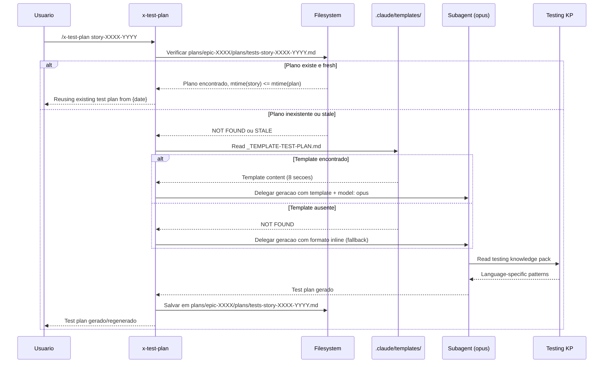

# Historia: Pre-Check e Template Reference no x-test-plan

**ID:** story-0024-0007
**Chave Jira:** ---
**Status:** Pendente

## 1. Dependencias

| Blocked By | Blocks |
| :--- | :--- |
| story-0024-0005 | story-0024-0013, story-0024-0014 |

## 2. Regras Transversais Aplicaveis

| ID | Titulo |
| :--- | :--- |
| RULE-001 | Template obrigatorio para artefatos |
| RULE-002 | Idempotencia via staleness check |
| RULE-007 | Instrucao explicita de template |
| RULE-009 | Modelo profundo para planejamento |
| RULE-012 | Fallback graceful |

## 3. Descricao

Como **desenvolvedor**, eu quero que o x-test-plan verifique se um test plan ja existe antes de regenerar e use template padronizado quando disponivel, garantindo que test plans sao reutilizaveis entre sessoes.

Atualmente o x-test-plan sempre regenera o test plan do zero, independente de existir um plano anterior valido. Isso resulta em desperdicio de tokens quando sessoes sao retomadas (o plano anterior e perdido) e variacao de formato entre geracoes (cada sessao produz estrutura diferente). Alem disso, a skill nao referencia knowledge packs especificos de teste por linguagem.

As mudancas afetam `java/src/main/resources/targets/claude/skills/core/x-test-plan/SKILL.md`. O padrao de idempotencia segue a mesma logica de mtime comparison definida em RULE-002: verificar existencia do artefato, comparar mtime com a story, reutilizar se fresh ou regenerar se stale. A referencia ao template `_TEMPLATE-TEST-PLAN.md` garante que todos os test plans tenham as mesmas 8 secoes padronizadas.

### 3.1 Pre-check de Idempotencia

- Verificar existencia de `plans/epic-XXXX/plans/tests-story-XXXX-YYYY.md`
- Comparar mtime: `mtime(story) <= mtime(test-plan)` -> reutilizar
- Comparar mtime: `mtime(story) > mtime(test-plan)` -> regenerar
- Logar acao tomada: "Reusing existing test plan from {date}" ou "Regenerating stale test plan"

### 3.2 Template Reference

- Instrucao ao subagente: "Read template at `.claude/templates/_TEMPLATE-TEST-PLAN.md` for required output format"
- Adicionar `model: opus` na delegacao de planejamento de testes
- Template define 8 secoes obrigatorias que a LLM deve preencher
- Secoes incluem: Double-Loop TDD strategy, TPP-ordered scenarios, acceptance tests, unit test plan, integration test plan, coverage strategy, test data strategy, test execution order

### 3.3 Fallback para Formato Inline

- Se `.claude/templates/_TEMPLATE-TEST-PLAN.md` nao existir (projetos pre-EPIC-0024)
- Logar warning: "Template not found, using inline format"
- Continuar com formato inline (comportamento atual preservado)
- Nenhuma interrupcao na execucao da skill

### 3.4 Referencia a Knowledge Packs de Teste

- Instrucao ao subagente inclui: "Read testing knowledge pack for {{LANGUAGE}}-specific patterns"
- Garante que test plans referenciem frameworks e padroes corretos por linguagem
- Ex: JUnit 5 + Mockito para Java, pytest para Python, vitest para TypeScript

## 3.5 Entrega de Valor

- **Valor Principal:** Test plans persistidos com formato TDD padronizado -- reutilizaveis entre sessoes sem regeneracao. Formato uniforme com 8 secoes garante completude de estrategia de teste.
- **Metrica de Sucesso:** Segunda execucao de x-test-plan para a mesma story (nao modificada) completa em < 5s (reuso) vs. 3-5 min (regeneracao)
- **Impacto no Negocio:** Desbloqueia story-0024-0013 (x-dev-implement) e story-0024-0014 (auditoria de consistencia). Economia de tokens em retomadas de sessao do x-dev-lifecycle (Phase 1C).

## 4. Definicoes de Qualidade Locais

### DoR Local

- [ ] `PlanTemplatesAssembler` funcional e `_TEMPLATE-TEST-PLAN.md` disponivel em `.claude/templates/` (story-0024-0005)
- [ ] SKILL.md atual do x-test-plan analisado (fluxo completo mapeado)
- [ ] Padrao de mtime comparison de RULE-002 compreendido
- [ ] As 8 secoes obrigatorias do template de test plan identificadas

### DoD Local

- [ ] Pre-check com mtime comparison implementado no SKILL.md
- [ ] Referencia ao template `_TEMPLATE-TEST-PLAN.md` incluida
- [ ] `model: opus` configurado na delegacao de planejamento
- [ ] Fallback para formato inline funcional quando template ausente
- [ ] Referencia a knowledge packs de teste por linguagem incluida
- [ ] Pelo menos 1 teste automatizado validando o criterio de aceite principal
- [ ] Smoke test passando

### Global Definition of Done (DoD)

- **Cobertura:** >= 95% Line, >= 90% Branch
- **Testes Automatizados:** Golden tests validando SKILL.md gerado. Testes unitarios para logica de idempotencia.
- **Relatorio de Cobertura:** JaCoCo integrado ao `mvn verify`
- **Documentacao:** SKILL.md do x-test-plan atualizado com pre-check e template reference
- **Persistencia:** Templates copiados verbatim sem renderizacao de placeholders
- **Performance:** Geracao nao deve aumentar tempo de build em mais de 5%

## 5. Contratos de Dados

### 5.1 Artefato de Test Plan

| Campo | Tipo | M/O | Descricao | Exemplo |
| :--- | :--- | :--- | :--- | :--- |
| `path` | `String` | M | Caminho do artefato salvo | `plans/epic-0024/plans/tests-story-0024-0007.md` |
| `story_id` | `String` | M | ID da story associada | `story-0024-0007` |
| `template` | `String` | O | Template utilizado (se disponivel) | `_TEMPLATE-TEST-PLAN.md` |
| `model` | `String` | M | Modelo LLM utilizado | `opus` |
| `sections` | `int` | M | Numero de secoes geradas | `8` |

### 5.2 Staleness Check Input/Output

| Condicao | Input | Output | Log |
| :--- | :--- | :--- | :--- |
| Plano inexistente | `tests-story-XXXX-YYYY.md` not found | Gerar novo | `"Generating test plan for {story}"` |
| Plano stale | `mtime(story) > mtime(plan)` | Regenerar | `"Regenerating stale test plan for {story}"` |
| Plano fresh | `mtime(story) <= mtime(plan)` | Reutilizar | `"Reusing existing test plan from {date}"` |

### 5.3 Template Sections (8 obrigatorias)

| Secao | Titulo | Descricao |
| :--- | :--- | :--- |
| 1 | Test Strategy Overview | Resumo da estrategia de teste (Double-Loop TDD) |
| 2 | Acceptance Tests (Outer Loop) | Testes de aceitacao derivados do Gherkin |
| 3 | Unit Test Plan (Inner Loop) | Testes unitarios por camada seguindo TPP |
| 4 | Integration Test Plan | Testes de integracao (DB, HTTP, messaging) |
| 5 | Contract Tests | Testes de contrato parametrizados |
| 6 | Coverage Strategy | Metricas de cobertura e thresholds |
| 7 | Test Data Strategy | Estrategia de dados de teste (fixtures, factories) |
| 8 | Test Execution Order | Ordem de execucao por fase e dependencia |

## 6. Diagramas

### 6.1 Fluxo de Pre-check e Geracao do Test Plan



## 7. Criterios de Aceite (Gherkin)

```gherkin
Cenario: Nenhum test plan existente gera um novo do zero
  DADO que plans/epic-XXXX/plans/tests-story-XXXX-YYYY.md nao existe
  E .claude/templates/_TEMPLATE-TEST-PLAN.md esta disponivel
  QUANDO /x-test-plan story-XXXX-YYYY e executado
  ENTAO um novo test plan e gerado seguindo o template
  E o artefato e salvo em plans/epic-XXXX/plans/tests-story-XXXX-YYYY.md
  E o log contem "Generating test plan for story-XXXX-YYYY"

Cenario: Test plan existente reutilizado quando story nao foi modificada
  DADO que plans/epic-XXXX/plans/tests-story-XXXX-YYYY.md existe
  E mtime(story-XXXX-YYYY.md) e anterior a mtime(tests-story-XXXX-YYYY.md)
  QUANDO /x-test-plan story-XXXX-YYYY e executado
  ENTAO o test plan existente e reutilizado sem regeneracao
  E o log contem "Reusing existing test plan from {date}"
  E nenhum subagente e invocado

Cenario: Novo test plan segue estrutura do template com 8 secoes
  DADO que .claude/templates/_TEMPLATE-TEST-PLAN.md esta disponivel
  E define 8 secoes obrigatorias
  QUANDO um novo test plan e gerado
  ENTAO o artefato resultante contem todas as 8 secoes do template
  E inclui Double-Loop TDD strategy
  E inclui TPP-ordered scenarios
  E o modelo utilizado e opus

Cenario: Template nao encontrado aciona fallback para formato inline
  DADO que .claude/templates/_TEMPLATE-TEST-PLAN.md NAO existe
  QUANDO /x-test-plan story-XXXX-YYYY e executado
  ENTAO um warning e logado "Template not found, using inline format"
  E o test plan e gerado no formato inline (sem template)
  E a execucao continua normalmente sem interrupcao

Cenario: Igualdade de mtime tratada como "not stale" com reuso
  DADO que plans/epic-XXXX/plans/tests-story-XXXX-YYYY.md existe
  E mtime(story-XXXX-YYYY.md) e exatamente igual a mtime(tests-story-XXXX-YYYY.md)
  QUANDO /x-test-plan story-XXXX-YYYY e executado
  ENTAO o test plan existente e reutilizado
  E o log contem "Reusing existing test plan from {date}"
  E nenhum token de LLM e consumido
```

### 7.1 Scenario Ordering (TPP)

> TPP: degenerate (plano inexistente -> gerar novo) -> happy path (plano reutilizado, 8 secoes presentes) -> error (template ausente -> fallback) -> boundary (mtime igualdade como reuso).

### 7.2 Mandatory Scenario Categories

- [x] Degenerate cases (nenhum test plan existente, gerar do zero)
- [x] Happy path (test plan reutilizado, novo plan com 8 secoes)
- [x] Error paths (template ausente, fallback inline)
- [x] Boundary values (mtime igualdade tratada como "not stale")

### 7.3 TDD Implementation Notes

- **Double-Loop TDD**: O primeiro cenario (plano inexistente) e o acceptance test do outer loop. Define o walking skeleton com geracao basica.
- Unit tests guiam logica de idempotencia: inexistente -> fresh -> stale -> mtime equal.
- Template reference testada via golden file parity (output com template vs. sem template).

## 8. Sub-tarefas

- [ ] [Dev] Adicionar pre-check com mtime comparison no SKILL.md do x-test-plan
- [ ] [Dev] Adicionar referencia a `_TEMPLATE-TEST-PLAN.md` com `model: opus`
- [ ] [Dev] Implementar fallback para formato inline quando template ausente
- [ ] [Dev] Adicionar referencia a knowledge packs de teste por linguagem
- [ ] [Test] Unitario: Verificar logica de idempotencia (inexistente, fresh, stale, mtime equal)
- [ ] [Test] Unitario: Verificar que 8 secoes do template sao referenciadas
- [ ] [Test] Unitario: Verificar fallback funcional sem template
- [ ] [Test] Smoke/E2E: Executar x-test-plan duas vezes e verificar que segunda execucao reutiliza plano
- [ ] [Doc] Atualizar SKILL.md do x-test-plan com documentacao de pre-check e template
